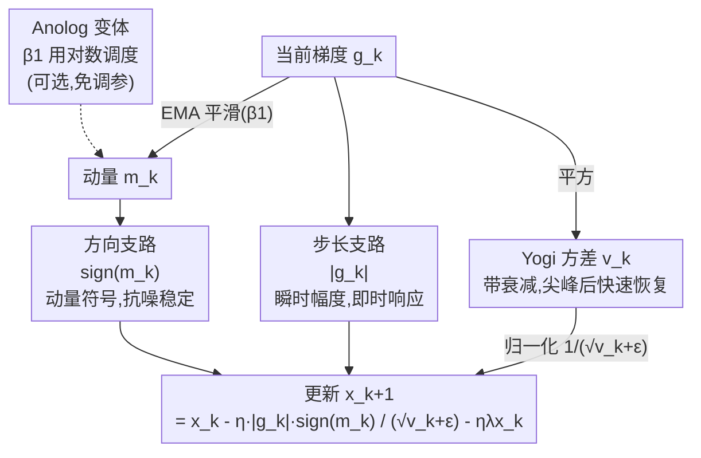

# ANO: Faster is Better in Noisy Landscapes

**会议**: ICLR 2026  
**arXiv**: [2508.18258](https://arxiv.org/abs/2508.18258)  
**代码**: 有  
**领域**: 其他  
**关键词**: optimizer, sign-based, noise robustness, reinforcement-learning, direction-magnitude decoupling

## 一句话总结
提出 Ano 优化器，将更新方向和幅度解耦——方向用动量的符号（sign）确保噪声鲁棒，幅度用瞬时梯度绝对值（而非动量幅度）确保响应速度，配合改进的 Yogi 式方差估计，在噪声和非平稳环境（如 RL）中显著优于 Adam/Lion/Adan，同时在标准任务上保持竞争力。

## 研究背景与动机
**领域现状**：Adam 及其变体是深度学习的默认优化器，但在噪声或非平稳环境中（梯度噪声大、标签模糊、RL 目标变化）表现退化。

**现有痛点**：Adam 将方向和幅度都从动量 $m_k$ 中获取——当大噪声尖峰出现时，相反方向的影响部分抵消，减小了有效动量，导致更新过于保守。二阶矩的指数移动平均让噪声尖峰影响持续很多步。

**核心矛盾**：动量平滑方向信号很好（减少噪声方向的震荡），但动量的*幅度*太滞后——大梯度变化时响应太慢。需要"方向稳定+幅度敏捷"的组合。

**本文目标** 设计在噪声优化环境中更鲁棒的优化器，同时保持一阶方法的简洁和效率。

**切入角度**：显式解耦方向和幅度——方向 = sign(momentum)，幅度 = |gradient|，二阶矩用改进的 Yogi 更新（带衰减因子控制记忆）。

**核心 idea**：用动量的符号定方向、用当前梯度的绝对值定步长——解耦带来噪声鲁棒性和响应速度的最佳平衡。

## 方法详解

### 整体框架
Ano 要解决的是：Adam 在噪声/非平稳环境里更新太保守，根子在于它把"往哪走"和"走多大步"都交给同一个动量 $m_k$ 去算。Ano 的做法是把这两件事拆开——方向只看动量的符号 $\text{sign}(m_k)$，步长只看当前梯度的绝对值 $|g_k|$，再除以一个改进版的方差估计做归一化。完整更新规则为：

$$x_{k+1} = x_k - \frac{\eta_k}{\sqrt{\hat{v}_k} + \epsilon} \cdot |g_k| \cdot \text{sign}(m_k) - \eta_k \lambda x_k$$

和 Adam 的唯一结构性差异，就是用 $|g_k| \cdot \text{sign}(m_k)$ 顶替了 $m_k$。其余部分（学习率 $\eta_k$、二阶矩归一化、解耦权重衰减 $\lambda$）都保持 Adam 的框架，所以内存和计算开销不变。从数据流看，每一步的梯度 $g_k$ 同时喂给三条支路——经动量平滑出方向、取绝对值出步长、经 Yogi 方差出归一化系数——三者在更新公式里汇合：

### 关键设计

**1. 符号-幅度解耦：方向交给动量符号、步长交给瞬时梯度**

这一步直接针对前面那个痛点——Adam 写成 $m_k = |m_k| \cdot \text{sign}(m_k)$，方向和幅度都从动量里出。问题是当噪声尖峰让梯度反向震荡时，动量做平均会把正负相消，$|m_k|$ 被拉低，于是该走的大步反而缩成了小步，越是噪声大越保守。Ano 把方向和步长拆成两路信号：方向仍用 $\text{sign}(m_k)$，因为动量平滑过的方向更稳，不会被单个尖峰带偏；步长则换成当前梯度的绝对值 $|g_k|$，它对梯度的真实变化即时响应，不会被历史拖慢。和纯 sign 方法（SignSGD、Lion）相比，那些方法把幅度信息整个丢了，Ano 则保留了幅度，只是把滞后的 $|m_k|$ 换成了更灵敏的 $|g_k|$——于是同时拿到了"方向稳"和"步长快"。

**2. 改进的二阶矩更新：在 Yogi 的快速恢复上再加一层衰减**

二阶矩负责自适应缩放，Ano 用的是带衰减的 Yogi 式更新：

$$v_k = \beta_2 v_{k-1} - (1-\beta_2) \cdot \text{sign}(v_{k-1} - g_k^2) \cdot g_k^2$$

它继承了 Yogi 的非对称性——靠 $\text{sign}(v_{k-1} - g_k^2)$ 让方差在尖峰过后能快速回落，而不像 Adam 的 EMA 那样让一次尖峰拖累后续很多步。但纯 Yogi 缺一个遗忘机制，所以 Ano 额外用 $\beta_2$ 给历史方差加了衰减，控制记忆长度。两者合起来就是"既能快速从尖峰恢复，又能平滑地遗忘旧噪声"，这正是噪声环境里想要的方差估计行为。

**3. Anolog 变体：用对数调度自适应 $\beta_1$，省掉调参**

固定的 $\beta_1$ 在非平稳环境里很难选——大了适应慢、小了又不够稳。Anolog 把它做成随步数变化的调度 $\beta_{1,k} = 1 - 1/\log(k+2)$，让动量窗口随训练逐步增大。对数增长比根号或调和调度都更温和，前期窗口小、对环境变化保持敏感，后期才慢慢加大平滑力度，因而在非平稳目标下仍能保持适应性。它的实用价值在于直接消掉了 $\beta_1$ 这个超参的调优需求，代价只是牺牲一点点峰值性能。

### 损失函数 / 训练策略
与 Adam 同样的内存和计算成本（维护 $m_k, v_k$）。默认 $\beta_1=0.92, \beta_2=0.99$。

## 实验关键数据

### 噪声鲁棒性（CIFAR-10 + 梯度噪声注入）

| 优化器 | σ=0 | σ=0.05 | σ=0.10 | σ=0.20 |
|--------|------|--------|--------|--------|
| **Ano** | **82.10** | **70.88** | **65.93** | **59.54** |
| Adam | 80.67 | 66.86 | 60.83 | 52.46 |
| Lion | 81.04 | 69.62 | 64.02 | 56.82 |

### 关键发现
- Ano vs Adam 的优势随噪声增大而扩大：σ=0 时差 1.4%，σ=0.20 时差 7.1%
- 在 RL 任务（非平稳目标）上 Ano 提升最为显著——因为 RL 的梯度本质上是高方差+非平稳的
- Anolog 牺牲少量峰值性能但消除了 β₁ 调参——实用价值高
- 标准低噪声任务（如标准 ImageNet 训练）上 Ano 与 Adam 竞争力相当

### 理论保证
- 非凸收敛率 $\tilde{O}(K^{-1/4})$，匹配 Lion/Signum 等 sign-based 方法
- 比 SGD/Adam 的 $O(K^{-1/2})$ 慢，但这是 sign 方法的固有限制

## 亮点与洞察
- **"方向用动量，幅度用当前梯度"的解耦思路**：简单直观且有效。对 Adam 的改动最小化但效果显著
- **对 RL 优化的特别意义**：RL 梯度的高方差和非平稳性是 Adam 家族的痛点，Ano 的解耦设计天然更适合
- **与 DRPO 互补**：DRPO 解决 GRPO 的奖励设计问题，Ano 解决优化器本身的噪声问题——两者可以结合

## 局限与展望
- 理论收敛率比 Adam 慢（$K^{-1/4}$ vs $K^{-1/2}$），虽然实际中噪声场景下 Ano 更快收敛
- 在极低噪声环境中没有明显优势——此时 Adam 的平滑更新反而更好
- 仅验证了 CNN 和 RL 任务，LLM 大规模训练上的表现未知
- β₂ 的改进的 Yogi 更新增加了理论分析的复杂性

## 相关工作与启发
- **vs Adam**: Ano 解耦方向和幅度解决了 Adam 在噪声环境中的保守性
- **vs Lion**: Lion 纯 sign 丢失幅度信息，Ano 保留了幅度（用 |g_k|）
- **vs Grams**: Grams 用梯度 sign 定方向 + 动量 norm 定幅度，Ano 反过来——动量 sign 定方向 + 梯度 norm 定幅度

## 评分
- 新颖性: ⭐⭐⭐⭐ 解耦方向/幅度的设计简洁有效
- 实验充分度: ⭐⭐⭐⭐ 噪声注入实验有说服力，RL 实验验证核心场景
- 写作质量: ⭐⭐⭐⭐ 算法描述清晰，理论分析完整
- 价值: ⭐⭐⭐⭐ 为噪声优化环境提供了实用的替代优化器

<!-- RELATED:START -->

## 相关论文

- [\[CVPR 2026\] A Faster Path to Continual Learning](../../CVPR2026/others/a_faster_path_to_continual_learning.md)
- [\[ICLR 2026\] Noisy-Pair Robust Representation Alignment for Positive-Unlabeled Learning](noisy-pair_robust_representation_alignment_for_positive-unlabeled_learning.md)
- [\[ACL 2025\] Towards Better Evaluation for Generated Patent Claims](../../ACL2025/others/patclaimeval_patent_evaluation.md)
- [\[AAAI 2026\] Faster Certified Symmetry Breaking Using Orders With Auxiliary Variables](../../AAAI2026/others/faster_certified_symmetry_breaking_using_orders_with_auxiliary_variables.md)
- [\[ICML 2025\] Generation from Noisy Examples](../../ICML2025/others/generation_from_noisy_examples.md)

<!-- RELATED:END -->
