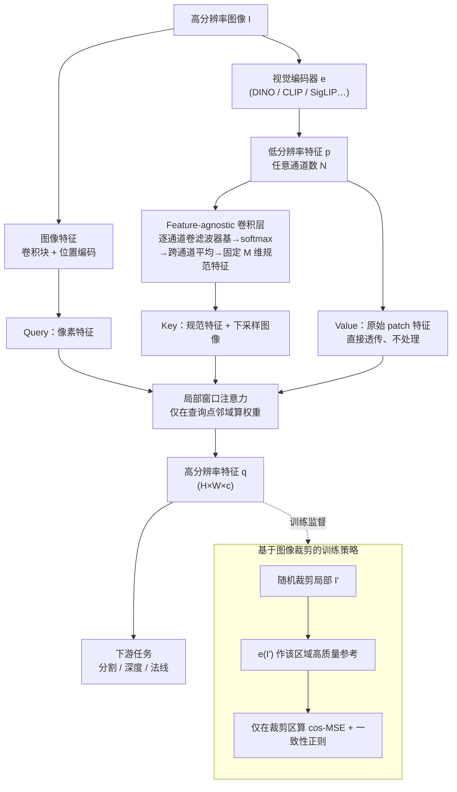

# AnyUp: Universal Feature Upsampling

- **会议**: ICLR2026
- **arXiv**: [2510.12764](https://arxiv.org/abs/2510.12764)
- **代码**: [GitHub](https://github.com/wimmerth/anyup)
- **领域**: 计算机视觉 / 特征上采样
- **关键词**: feature upsampling, encoder-agnostic, DINO, CLIP, attention, universal

## 一句话总结

AnyUp 提出首个**编码器无关**的可学习特征上采样方法，通过 feature-agnostic 卷积层和窗口注意力机制，仅训练一次即可对任意视觉特征在任意分辨率间进行高质量上采样，在语义分割、深度估计等任务上达到 SOTA。

## 研究背景与动机

**领域现状**: 预训练视觉编码器（DINO、CLIP、SigLIP 等）输出的特征图分辨率受限于 Transformer token 数量，通常为 $h \times w \ll H \times W$。近期 FeatUp、LoftUp、JAFAR 等方法提出可学习的特征上采样以获取高分辨率特征。

**痛点**: 现有可学习上采样器对编码器**不具泛化性**——针对 DINOv2 训练的上采样器无法直接用于 CLIP 或 SigLIP，每换一个编码器就需要重新训练。对于大型视觉模型（如 DINOv2-G），重训练计算成本极高甚至不可行。

**核心矛盾**: 上采样网络中处理低分辨率特征的层绑定了具体编码器的维度和分布，无法在推理时迁移到新的特征类型。

**目标**: 设计一个**一次训练、到处可用**的特征上采样器，对任意编码器的任意维度特征、在任意分辨率间进行上采样。

**切入角度**: 现有注意力上采样器的核心瓶颈在于特征处理层的维度耦合。若能设计一个对输入通道数不变量的处理层，就能实现编码器无关。

**核心 idea**: 设计 **feature-agnostic 卷积层**——每个输入通道独立与学习的滤波器基进行卷积，通过 softmax 归一化后对所有通道取均值，输出维度与输入通道数无关。

## 方法详解

### 整体框架

AnyUp 想解决的是"换一个视觉编码器就得重训上采样器"这件事，因此整个网络要做到不依赖具体编码器的特征维度。它沿用注意力上采样的骨架（继承自 JAFAR）：给定高分辨率图像 $I$ 和编码器吐出的低分辨率特征 $p = e(I)$，先用一个 Feature-agnostic 卷积层把任意通道数的 $p$ 压成固定维度的"规范特征"，再把它和图像特征一起送进局部窗口注意力，输出与输入同语义但分辨率拉满的特征 $q \in \mathbb{R}^{H \times W \times c}$。注意力里的查询（query）来自图像像素特征、键（key）由规范特征与下采样图像共同算出，而值（value）直接搬运未经处理的原始 patch 特征——上采样器只负责"算权重"、不负责"造特征值"，这正是它能跨编码器复用的关键。训练阶段则避开昂贵的全图高分辨率特征，改用随机裁剪的局部图像当参考信号。

### 关键设计

**1. Feature-agnostic 卷积层：用一个对通道数不变量的处理层切断编码器耦合**

旧上采样器的瓶颈在于：处理低分辨率特征的那几层把通道维度写死了，DINOv2 的 384 维和 CLIP 的 768 维各需一套权重，换编码器就得重训。AnyUp 的做法是学一组 $M$ 个滤波器基 $\{\psi_j \in \mathbb{R}^{k \times k}\}_{j=1}^M$，让**每个输入通道 $p_i$ 独立**与每个基卷积，经 softmax 在 $M$ 个基上归一化后，再对所有 $N$ 个输入通道取平均：

$$f_j = \frac{1}{N} \sum_{i=1}^{N} \frac{\exp(p_i * \psi_j)}{\sum_{j'=1}^{M} \exp(p_i * \psi_{j'})}$$

输出是 $M$ 维，和输入通道数 $N$ 完全无关，所以同一套权重能直接吃任意编码器的特征。之所以"取平均丢掉通道身份"还管用，是因为注意力上采样真正需要的只是输入特征图的局部结构变化（边界、纹理这类），而具体的特征值由注意力 value 原样搬运——逐通道独立卷积加跨通道平均，正好只保留结构信息、扔掉与编码器绑定的具体取值。

**2. 局部窗口注意力：把上采样还原成它本该有的局部操作**

作者分析 JAFAR 的全局注意力时发现一个异常：某个像素查询会去关注画面里完全不相关的远处区域，这些远距离关注既没用又引入噪声。而特征上采样本质上是局部的——一个像素的高分辨率特征理应主要由它附近 patch 的粗糙特征决定。于是 AnyUp 把注意力限制在查询点附近的窗口内，带来两个好处：高分辨率特征只来自邻近粗糙特征的线性组合，优化目标被显著简化；同时窗口化也省掉了全局注意力的算力开销。

**3. 基于图像裁剪的训练策略：用局部裁剪当参考，省掉全图高分辨率特征**

监督信号怎么来是另一个成本大头。AnyUp 不去算昂贵的全图高分辨率特征，而是取高分辨率图像 $I$、随机裁剪出局部 $I'$，分别过编码器得到 $p = e(I)$ 和 $\hat{q} = e(I')$；把 $p$ 上采样后，只在 $I'$ 对应的那块区域和 $\hat{q}$ 算损失。$\hat{q}$ 是从裁剪小图直接提的特征，天然就是该区域的高质量参考。这比 JAFAR 用低分辨率全图训练更贴近真实高分辨率分布，又比 LoftUp 依赖分割掩码训练更轻量——不需要额外的分割模型。

### 损失函数

主损失为 cosine-MSE 组合损失加一致性正则：

$$L_{\text{cos-mse}}(q', \hat{q}) = 1 - \cos(q', \hat{q}) + L^2(q', \hat{q})$$

加上 self-consistency 正则（增强鲁棒性）和 input-consistency 正则（输入特征与下采样后的输出特征之间的 $L_{\text{cos-mse}}$，保持特征空间不偏移）。

## 实验关键数据

### 主实验：语义分割 Linear Probing（DINOv2 ViT-S, 448×448 → 上采样 14×）

| 方法 | COCO mIoU↑ | COCO Acc↑ | PASCAL mIoU↑ | ADE20k mIoU↑ |
|------|-----------|----------|-------------|-------------|
| Bilinear | 59.48 | 79.32 | 81.43 | 40.54 |
| FeatUp | — | — | 83.37 | — |
| JAFAR | 61.82 | 81.07 | 84.36 | — |
| LoftUp | — | — | — | 42.02 |
| **AnyUp** | **62.16** | **81.37** | **—** | **42.43** |

> AnyUp 在多数数据集上达到 SOTA，且**仅训练一次**即通用于所有编码器——竞品需要**每个编码器单独训练**。

### 消融实验：设计选择的影响（COCO 语义分割 mIoU）

| 配置 | mIoU↑ |
|------|------|
| 全局注意力 (JAFAR 风格) | 61.82 |
| + Feature-agnostic 层 | 61.95 |
| + 窗口注意力 | 62.01 |
| + 裁剪训练 + 一致性正则 | **62.16** |

**深度/法线估计**（NYUv2）:

| 方法 | Normal RMSE↓ | Depth RMSE(abs)↓ | Depth δ₁↑ |
|------|-------------|-----------------|----------|
| Bilinear | 32.70 | 0.4925 | 0.8081 |
| LoftUp | 33.94 | — | 0.9166 |
| **AnyUp** | **31.17** | **0.4755** | **0.8216** |

### 关键发现

1. **编码器泛化性**: AnyUp 在 DINOv2 上训练后，直接用于 CLIP、SigLIP、MAE 输出仍保持高质量上采样，FeatUp/JAFAR/LoftUp 均需重训
2. **特征空间保持**: AnyUp 的 input-consistency 正则有效防止上采样引入特征分布漂移（PCA 可视化显示语义一致性最佳）
3. **局部窗口注意力优于全局**: 消除远距离异常注意力模式，同时提升效率

## 亮点与洞察

- "一次训练通用所有编码器"的理念极具实际价值，降低了特征上采样的使用门槛
- Feature-agnostic 层的设计精妙：逐通道独立卷积+softmax+平均，在简约中实现维度无关
- 图像裁剪训练策略兼顾了质量和效率：无需高分辨率参考特征，也不需要额外分割模型
- 首次在特征上采样领域实现了"any encoder × any resolution × any task"的全组合

## 局限性

- Feature-agnostic 层通过平均操作丢失了通道间相关性信息，对需要精确通道交互的任务可能受限
- 窗口注意力的窗口大小需要调节，过小可能丢失必要的非局部信息
- 目前主要在 ViT 类编码器上验证，对 CNN 编码器的适用性需进一步测试
- 训练仍需 ImageNet 规模数据和多个编码器的特征，非零成本

## 相关工作与启发

- **FeatUp** (Fu et al., 2024): 基于多视图等变性的上采样训练，但编码器绑定且仅支持固定倍率
- **JAFAR** (Couairon et al., 2025): 注意力上采样支持任意分辨率，AnyUp 在此基础上加入编码器无关性
- **LoftUp** (Huang et al., 2025): 堆叠注意力+分割掩码训练，质量好但训练昂贵且需分割模型
- **启发**: Feature-agnostic 层的"通道独立处理+聚合"范式可推广到其他多模态特征对齐场景

## 评分

⭐⭐⭐⭐ (4/5)

- **创新性**: ⭐⭐⭐⭐ — 编码器无关上采样是新方向，feature-agnostic 层设计简洁有效
- **实验**: ⭐⭐⭐⭐ — 覆盖分割/深度/法线/多分辨率/多编码器，消融充分
- **实用性**: ⭐⭐⭐⭐⭐ — 直接解决"换编码器需重训"的工程痛点，开源权重即插即用
- **写作**: ⭐⭐⭐⭐ — 图表清晰，对比方法分类表格一目了然

<!-- RELATED:START -->

## 相关论文

- [\[CVPR 2026\] NAF: Zero-Shot Feature Upsampling via Neighborhood Attention Filtering](../../CVPR2026/others/naf_zero-shot_feature_upsampling_via_neighborhood_attention_filtering.md)
- [\[CVPR 2026\] Upsample Anything: A Simple and Hard to Beat Baseline for Feature Upsampling](../../CVPR2026/others/upsample_anything_a_simple_and_hard_to_beat_baseline_for_feature_upsampling.md)
- [\[CVPR 2026\] UPLiFT: Efficient Pixel-Dense Feature Upsampling with Local Attenders](../../CVPR2026/others/uplift_efficient_pixel-dense_feature_upsampling_with_local_attenders.md)
- [\[CVPR 2026\] UniMERNet: A Universal Network for Real-World Mathematical Expression Recognition](../../CVPR2026/others/unimernet_a_universal_network_for_real-world_mathematical_expression_recognition.md)
- [\[CVPR 2026\] Hyperbolic Defect Feature Synthesis for Few-Shot Defect Classification](../../CVPR2026/others/hyperbolic_defect_feature_synthesis_for_few-shot_defect_classification.md)

<!-- RELATED:END -->
