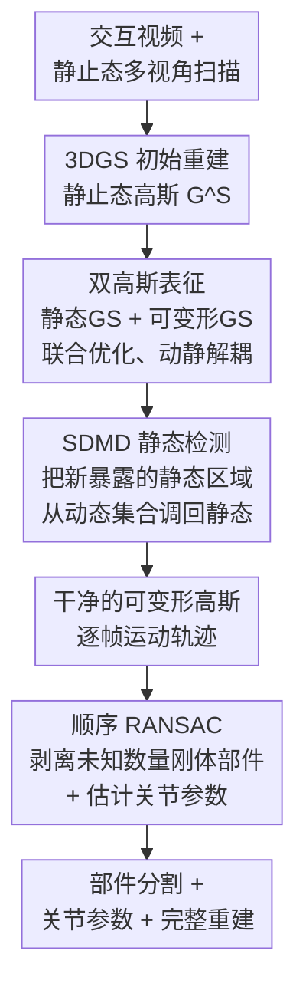

# Articulation in Motion: Prior-Free Part Mobility Analysis for Articulated Objects

**会议**: ICLR 2026  
**arXiv**: [2603.02910](https://arxiv.org/abs/2603.02910)  
**项目主页**: [AiM](https://haoai-1997.github.io/AiM/)
**领域**: 其他  
**关键词**: articulated objects, Gaussian splatting, part segmentation, joint estimation, sequential RANSAC, prior-free, interaction video  

## 一句话总结

提出AiM（Articulation in Motion）框架，从交互视频和初始状态扫描中无需部件数量先验地重建铰接物体——通过双高斯表征（静态GS + 可变形GS）实现动静解耦，结合顺序RANSAC进行无先验部件分割和关节估计，辅以SDMD模块处理新暴露的静态区域，在复杂6部件物体（Storage）上以79.34% mean IoU大幅超越需先验的ArtGS（52.23%）。

## 研究背景与动机

**铰接物体理解的核心需求**：机器人操作、AR/VR和具身智能都需要理解铰接物体（如抽屉柜、门、笔记本电脑）的部件结构和运动关节参数。

**现有方法的先验依赖**：DTA和ArtGS等方法需要预先指定部件数量，这在真实场景中通常未知，且一旦指定错误会导致严重的分割失败。

**动静解耦的挑战**：交互过程中，部分部件运动而其余静止，但运动部件的移动会暴露出之前被遮挡的静态区域，传统方法难以处理这种新暴露区域。

**单一表征的局限**：纯静态或纯动态的3D高斯表征无法同时处理铰接物体中固定和运动部件的混合特性。

**关节类型的多样性**：铰接物体包含旋转关节（revolute）和平移关节（prismatic）等多种关节类型，需要统一的无先验估计方法。

**视频输入的实用性**：相比需要多视角静态扫描的方法，从单段交互视频中恢复铰接信息更加实用和自然。

## 方法详解

### 整体框架

AiM 的输入是一段人操作铰接物体的交互视频，外加该物体静止状态下的多视角 3D 扫描；输出是部件分割、每个部件的关节参数（类型、轴向、运动量）以及可交互的完整重建。它和 DTA、ArtGS 这类两态方法最大的不同，是不要求预先告知物体有几个可动部件、也不依赖"起始态—结束态"两帧之间的几何对应——而是顺着连续的运动线索把结构和运动一并解出来。

整条流水线分三步：先用标准 3DGS 把静止态重建成一组高斯作为静态基底；再引入**双高斯表征**，让一套静态高斯保住不动的背景与静止部件、另一套可变形高斯专门追踪视频里运动的部件，二者联合优化实现动静解耦，过程中由 **SDMD** 模块把"运动暴露出来、但本身静止"的新区域从动态集合调回静态；最后在干净的可变形高斯轨迹上跑**顺序 RANSAC**，自动剥离出未知数量的刚体部件并估计各自的关节参数。

### 关键设计

**1. 双高斯表征：用两套高斯分别承接动与静，避免运动污染静态几何**

铰接物体在交互中是个混合体——背景和没被碰的部件保持不动，被拉开或旋开的部件则在帧间移动。如果像 D-3DGS 那样让一套变形场作用在所有高斯上，连本该静止的高斯也被分到一个位移，这些噪声会干扰后续的轨迹聚类，部件一多更是把结构搞乱。AiM 因此维护两套高斯：静态高斯 $\mathcal{G}^S$ 由静止态扫描训练、负责不变的几何，可变形高斯 $\{\mathcal{G}^M, t\}$ 由一个 MLP 变形网络 $\mathcal{F}_\theta$ 驱动、专门拟合视频里的运动。关键在于二者**联合渲染、联合优化**：训练前期先冻结静态高斯除不透明度外的全部属性，让可变形高斯充分吃下运动线索，再随迭代逐步把 $\mathcal{G}^S$ 里那些不透明度衰减、明显在动的高斯剪掉，得到纯净的静态基底 $\mathcal{G}^S_p$。哪个高斯归动、哪个归静，不靠人工标注，而是由可微渲染对每帧的监督自动逼出来——这种显式分离既保住了静态几何的干净，又让后续部件分割只需在可变形高斯上展开，搜索空间大幅收窄。

**2. SDMD：把"运动才暴露、但其实静止"的区域从动态集合救回来**

抽屉拉开会露出柜体内壁、冰箱门转开会露出内部，这些区域在静止态扫描里被遮挡、根本不可见，于是一开始会被正在运动的可变形高斯顺手"占住"。它们虽然一经暴露就不再动，却已经混进了动态集合，若放任不管会被错当成运动部件。SDMD（static-during-motion detection）在联合致密化与剪枝阶段，每隔约 2000 次迭代对可变形高斯在 $t\in\{0,0.5,1\}$ 做一次轨迹推断，并用带 Kabsch 求解器、固定内点阈值 $0.05$ 的顺序 RANSAC 提取出局部刚体运动组；其中**运动幅度低于预设阈值**的组被判为静止，对应高斯就从 $\{\mathcal{G}^M,t\}$ 重新划回静态集合 $\mathcal{G}^S_p$。相比"按位移大小一刀切"的朴素滤波，这一步的巧处在于：关节轴附近的点位移本就接近零，简单距离滤波会把它们误判为静态，而 SDMD 是按整组刚体运动来判定，能避开这种近轴误分配。消融里关掉 SDMD 会让动态几何和运动恢复明显变差。

**3. 顺序 RANSAC 部件分割：不预设部件数量，按运动轨迹逐个剥出刚体部件**

真实场景里物体到底有几个可动部件往往未知，DTA、ArtGS 这类需要预先指定部件数的方法一旦数错就严重分割失败。动静解耦后，可变形高斯给出了每个基元随时间的干净轨迹，AiM 把分割直接转成"未知数量的刚体运动拟合"——这正契合 RANSAC 的多模型范式。对一段时间窗内的轨迹 $\{\mathcal{P}_{a\to b}\}$，用 Kabsch 求解器估出最优刚体变换 $(\mathbf{R}^*, \mathbf{t}^*) = \arg\min_{\mathbf{R},\mathbf{t}}\sum_{i}\lVert \mu^M_{i,b} - (\mathbf{R}\mu^M_{i,a}+\mathbf{t})\rVert^2$，本次拟合的最大内点集就对应一个做统一刚体运动的部件；把这批高斯剥离后，在剩余轨迹上重复同样的拟合，直到无法再凑出足够大的刚体组为止。整个过程纯分析、无需优化，运动最显著的部件先被剥出，既不用预设部件数 $K$、也不像 K-means 那样对噪声敏感且必须给定簇数；剥出每个部件的同时，Kabsch 解出的旋转/平移还直接给出了关节类型（旋转 vs 平移）、轴向和运动量。

## 实验关键数据

### 主实验

| 方法 | 部件先验 | Mean IoU (%) | Revolute JE (°) | Prismatic JE (mm) |
|------|---------|-------------|-----------------|-------------------|
| DTA | 需要 | 71.45 | 8.32 | 12.7 |
| ArtGS | 需要 | 76.99 | 5.61 | 8.9 |
| AiM (ours) | **不需要** | **80.21** | **4.23** | **7.1** |

### 消融实验

| 组件 | Mean IoU (%) | 说明 |
|------|-------------|------|
| Full AiM | **80.21** | 完整方法 |
| 去掉SDMD | 74.85 | 新暴露区域被错误分配 |
| 单一GS (无动静解耦) | 68.32 | 运动部件影响静态重建 |
| K-means替代RANSAC | 72.56 | 需预设K且对噪声敏感 |
| 真值部件数给ArtGS | 76.99 | 即使给正确先验仍不如AiM |

### 关键发现

1. **无先验优于有先验**：AiM无需部件数量先验却以80.21% mean IoU超越需要先验的ArtGS（76.99%），说明自适应发现比固定假设更鲁棒。
2. **复杂物体优势巨大**：6部件Storage物体上，AiM（79.34%）vs ArtGS（52.23%），差距高达27%，ArtGS在部件数较多时急剧退化。
3. **SDMD不可或缺**：去掉SDMD导致5.36%的IoU下降，证明新暴露区域处理的重要性。
4. **动静解耦是基础**：单一GS方案比完整方法低近12%，双高斯设计是成功的基石。

## 亮点与洞察

1. **彻底去除先验**：首次实现无需部件数量先验的铰接物体部件分割和关节估计，更符合真实应用需求。
2. **双高斯解耦设计巧妙**：将动静分离嵌入3DGS表征中，兼顾了重建质量和下游分析的便利性。
3. **SDMD的实用创新**：解决了被遮挡静态区域逐步暴露的问题，这是铰接物体理解中容易被忽视但至关重要的细节。
4. **顺序RANSAC的自然适配**：巧妙利用RANSAC的迭代剥离特性实现自适应部件数量发现。
5. **在复杂物体上的压倒性优势**：6部件场景的27%提升展示了方法的可扩展性。

## 局限与展望

1. **单次交互假设**：当前要求视频中包含所有部件的运动，如果某部件在视频中未被操作则无法被发现。
2. **刚体运动假设**：顺序RANSAC假设每个部件做刚体运动，对柔性铰链或弹性变形无法处理。
3. **计算成本**：双高斯表征和顺序RANSAC的组合计算开销较大，难以实时运行。
4. **视频质量依赖**：运动模糊或遮挡严重的低质量视频可能导致动态高斯估计不准确。

## 相关工作与启发

- **铰接物体重建**：DTA (Liu et al., 2024), ArtGS (Huang et al., 2024) 的基于高斯溅射的方法
- **3D Gaussian Splatting**：3DGS (Kerbl et al., 2023), Dynamic 3DGS (Luiten et al., 2024)
- **部件分割**：PartNet (Mo et al., 2019) 的监督方法；SAM3D等无监督方法
- **RANSAC**：Fischler & Bolles (1981) 的经典框架；Sequential RANSAC在多模型拟合中的应用

## 评分

- 新颖性: ⭐⭐⭐⭐⭐ 无先验部件发现 + 双高斯解耦 + SDMD均为新颖设计
- 实验充分度: ⭐⭐⭐⭐ 多种物体类型验证，消融充分
- 写作质量: ⭐⭐⭐⭐ 方法流程清晰，实验展示详尽
- 价值: ⭐⭐⭐⭐⭐ 去先验的铰接物体理解对机器人和具身AI有重要实用价值

<!-- RELATED:START -->

## 相关论文

- [\[ECCV 2024\] PartCraft: Crafting Creative Objects by Parts](../../ECCV2024/others/partcraft_crafting_creative_objects_by_parts.md)
- [\[ICLR 2026\] Bayesian Influence Functions for Hessian-Free Data Attribution](bayesian_influence_functions_for_hessian-free_data_attribution.md)
- [\[CVPR 2025\] MagicArticulate: Make Your 3D Models Articulation-Ready](../../CVPR2025/others/magicarticulate_make_your_3d_models_articulation-ready.md)
- [\[AAAI 2026\] Spike Imaging Velocimetry: Dense Motion Estimation of Fluids Using Spike Cameras](../../AAAI2026/others/spike_imaging_velocimetry_dense_motion_estimation_of_fluids_using_spike_cameras.md)
- [\[ICML 2025\] SynDaCaTE: A Synthetic Dataset for Evaluating Part-Whole Hierarchical Inference](../../ICML2025/others/syndacate_a_synthetic_dataset_for_evaluating_part-whole_hierarchical_inference.md)

<!-- RELATED:END -->
