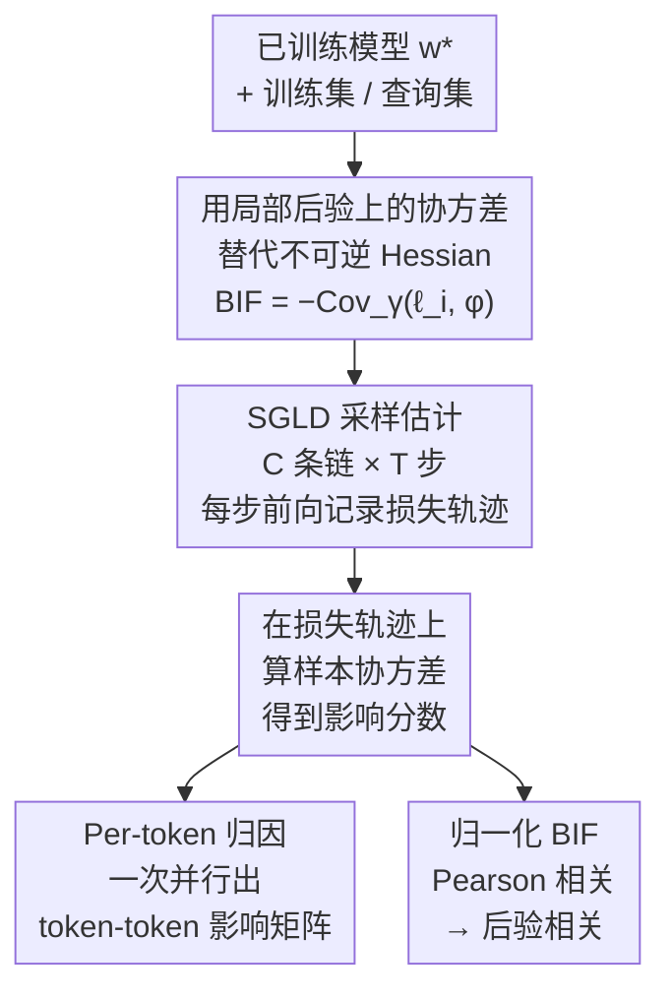

# Bayesian Influence Functions for Hessian-Free Data Attribution

**会议**: ICLR 2026  
**arXiv**: [2509.26544](https://arxiv.org/abs/2509.26544)  
**代码**: 无  
**领域**: 其他  
**关键词**: influence functions, training data attribution, Bayesian inference, SGMCMC, Hessian-free, data valuation  

## 一句话总结
提出 Local Bayesian Influence Function (BIF)，用 SGLD 采样估计的协方差替代经典影响函数中不可行的 Hessian 逆运算，实现了对数十亿参数模型的无架构限制数据归因，在重训练实验中达到 SOTA。

## 研究背景与动机
**领域现状**：训练数据归因（Training Data Attribution, TDA）研究训练数据如何塑造模型行为，是 AI 可解释性和安全性的基础问题。经典影响函数（Influence Functions, IF）通过 Hessian 逆来度量数据点的影响。

**现有痛点**：(a) 深度神经网络的 Hessian 通常是退化的（非可逆），经典 IF 的理论前提不成立；(b) 对大模型直接计算 Hessian 不可行，EK-FAC 等近似方法引入结构性偏差且仅支持 Linear/Conv2D 层；(c) Per-token 级别的细粒度归因在经典方法中需要逐 token 串行计算，不可扩展。

**核心矛盾**：需要一个既理论合理（不依赖 Hessian 可逆性）又计算可行（能扩展到数十亿参数）的数据归因方法。

**本文目标** 能否用贝叶斯推断框架彻底绕开 Hessian，同时保持或超越经典 IF 的归因质量？

**切入角度**：将经典 IF 的 Hessian 逆替换为局部后验分布上的协方差估计，利用 SGLD 采样实现。

**核心 idea**：$\text{BIF}(z_i, \phi) = -\text{Cov}_\gamma(\ell_i(\boldsymbol{w}), \phi(\boldsymbol{w}))$——影响就是训练损失与目标可观测量在局部后验下的负协方差。

## 方法详解

### 整体框架
本文把经典影响函数（Influence Function, IF）从"单点估计"问题改写成"分布"问题：不再在唯一的最优参数 $\boldsymbol{w}^*$ 上计算梯度和 Hessian 逆，而是在以 $\boldsymbol{w}^*$ 为中心的局部后验分布上估计协方差。整条流程是——拿到一个训练好的模型 $\boldsymbol{w}^*$，围绕它构造一个局部后验，跑若干条 SGLD 链在这个后验上采样；每个采样点只做一次前向传播、把训练样本损失 $\ell_i$ 和目标可观测量 $\phi$ 的值记下来；最后在这些损失轨迹上算样本协方差，归因结果就定义为负协方差 $-\text{Cov}_\gamma(\ell_i, \phi)$。整个过程不出现任何 Hessian，也不需要反向传播，这正是它能扩展到数十亿参数的关键。

### 关键设计

**1. 用局部后验上的协方差替代不可逆的 Hessian**

经典影响函数写成 $\text{IF}(z_i, \phi) = -\nabla\phi(\boldsymbol{w}^*)^\top \boldsymbol{H}^{-1} \nabla\ell_i(\boldsymbol{w}^*)$，痛点全卡在 Hessian 逆 $\boldsymbol{H}^{-1}$ 上：它既要求模型非退化（深度网络的损失景观往往是奇异的、$\boldsymbol{H}$ 不可逆），又在大模型上根本算不动。BIF 改用统计物理里的标准结果，把影响重新定义为损失与可观测量在贝叶斯后验下的负协方差 $\text{BIF}(z_i, \phi) = -\text{Cov}(\ell_i(\boldsymbol{w}), \phi(\boldsymbol{w}))$，公式里完全没有 Hessian。这不是把 IF 换了个近似——文中证明在非退化模型上对 BIF 做一阶 Taylor 展开恰好回到经典 IF（Appendix A），所以 BIF 是 IF 的高阶推广，且对退化情形仍然成立。

直接在全局后验上算协方差还有个问题：远离 $\boldsymbol{w}^*$ 的采样点会污染估计，而我们关心的恰恰是这个训练终点附近的局部影响。于是引入一个以 $\boldsymbol{w}^*$ 为中心的各向同性高斯先验，得到局部后验（Local BIF）

$$p_\gamma(\boldsymbol{w}) \propto \exp\!\Big(-\textstyle\sum_i \ell_i(\boldsymbol{w}) - \tfrac{\gamma}{2}\|\boldsymbol{w}-\boldsymbol{w}^*\|^2\Big).$$

精度参数 $\gamma$ 控制采样被约束在 $\boldsymbol{w}^*$ 附近的程度，作用恰好对应经典 IF 里把 $\boldsymbol{H}$ 换成 $(\boldsymbol{H} + \gamma\boldsymbol{I})$ 的阻尼（dampening）——Laplace 近似下 Local BIF 的领头项就是阻尼 IF，所以 $\gamma$ 既是数值正则、也是"在多大尺度上看影响"的分析旋钮。

**2. SGLD 采样估计：把协方差变成只需前向传播的统计量**

定义有了，剩下的问题是局部后验上的协方差怎么算。本文用随机梯度 Langevin 动力学（Stochastic Gradient Langevin Dynamics, SGLD）采样：从 $\boldsymbol{w}^*$ 出发，按训练损失的小批量梯度加上局部化势 $\gamma(\boldsymbol{w}-\boldsymbol{w}^*)$ 的梯度做带噪更新，并行跑 $C$ 条独立的链、每条采 $T$ 步以提升对后验的覆盖，总采样点数 $N_{\text{draws}} = C \times T$（实验里如 $C{=}4,\,T{=}500$）。关键一步是：每个采样点只对训练集和查询集做一次前向传播，把损失值 $\ell_i(\boldsymbol{w})$ 和 $\phi(\boldsymbol{w})$ 记下来，归因就是在这些损失轨迹上算样本协方差——全程不需要反向传播求参数梯度，也不需要存任何 Hessian 因子，这是它相对 EK-FAC 能省下昂贵 fit 阶段、扩展到大模型的根本原因。

**3. Per-token 归因：一次采样并行算出整张 token-token 影响矩阵**

自回归模型的损失天然按 token 分解为 $\ell_i = \sum_s \ell_{i,s}$，而协方差对求和是线性的，于是 token 级影响直接写成 $\text{BIF}(z_{i,s}, z_{j,s'}) = -\text{Cov}_\gamma(\ell_{i,s}, \ell_{j,s'})$。由于所有 token 的逐位置损失在同一次采样里已经记下，整张 $S|\mathcal{D}_{\text{train}}| \times S|\mathcal{D}_{\text{query}}|$ 的 token-token 影响矩阵可以一次性并行算出。这正好戳中经典方法的软肋：用 EK-FAC 这类方法做同等粒度的归因，需要把每个训练 token 的梯度贡献分别反传，显存随序列长度线性膨胀、且要逐 token 串行打分，在 LLM 上不可行。

**4. 归一化 BIF（后验相关）：抑制高方差数据点的主导**

原始协方差的绝对值会被自身损失方差大的数据点放大，让排序失真——一个"敏感"但未必相关的样本可能排到前面。把协方差归一化为 Pearson 相关系数（即除以两者各自的损失标准差），取值落进 $[-1, 1]$，就把"关系强弱"和"单点敏感度"解耦开，不同数据点之间更可比、估计也更稳定。本文所有定性分析和可视化都用这个量，称为后验相关（posterior correlation），用来解读 token 之间的翻译、同义、数字-拼写等语义关联。

## 实验关键数据

### 表1：BIF vs EK-FAC 复杂度对比

| 维度 | Local BIF | EK-FAC |
|------|-----------|--------|
| 时间复杂度 | $O(N_{\text{draws}}(n+q)d)$，无 fit 阶段 | Fit: $O(N_{\text{fit}}d + \sum d_\ell^3)$; Score: $O(nqd)$ |
| 额外存储 | $O(N_{\text{draws}}(n+q))$ 损失轨迹 | $O(\sum(d_{\text{in},l}^2 + d_{\text{out},l}^2))$ 因子 |
| 误差来源 | 有限采样 + SGLD 偏差 | 有限采样 + 结构偏差（Kronecker/Fisher） |
| 架构支持 | 任意可微模型 | 仅 Linear 和 Conv2D 层 |

### 表2：CIFAR-10 重训练实验 LDS 得分

| 数据规模 $\alpha$ | BIF | EK-FAC | TRAK | GradSim |
|-------------------|-----|--------|------|---------|
| 小数据集（高方差） | **略优于 EK-FAC** | SOTA 基线 | 明显低于 BIF/EK-FAC | 最低 |
| 大数据集 | 与 EK-FAC 相当（误差范围内） | SOTA | 低于两者 | 最低 |
| Pythia-14M 微调 | 低于 EK-FAC | 更优 | — | — |

> 在 ResNet-9/CIFAR-10 上，BIF 和 EK-FAC 的 LDS 得分均显著优于 TRAK 和 GradSim。BIF 在小数据高方差 regime 下略优。

### 扩展性分析（Pythia 模型族）
- 在 Pythia-2.8B 上，BIF 评估时间比 EK-FAC 快约 **2 个数量级**
- EK-FAC 有巨大的前期 fit 成本（存储 Kronecker 因子 + 特征分解），BIF 无此开销
- GPU 内存使用两者相当（4×A100 节点）
- BIF 的优势随模型规模增大而更加明显

## 亮点与洞察
- **概念优雅**：将 Hessian 逆问题转化为协方差估计问题，一个公式 $-\text{Cov}(\ell_i, \phi)$ 统一了整个方法——理论简洁、实现直观。
- **Per-token 归因的实用突破**：经典方法逐 token 计算不可行，BIF 的批量协方差天然并行，使 LLM 的 token 级归因成为现实。
- **语义质量**：Figure 2 展示 Pythia-2.8B 上 token 间的后验相关性能捕捉翻译、同义词、数字-拼写等语义关系，定性效果出色。
- **统计物理视角**：BIF 与 susceptibilities、local learning coefficient 等 SLT 量有深层联系，是 developmental interpretability 研究议程的重要组成。
- **通用性强**：不依赖特定层类型，适用于任何可微架构（含 attention、normalization 等 EK-FAC 不支持的层）。

## 局限性
1. **采样质量依赖**：BIF 精度取决于 SGLD 对局部后验的采样质量，DNN 的奇异损失景观使标准 SGLD 收敛保证可能不成立。
2. **超参数敏感性**：步长 $\epsilon$、局部化强度 $\gamma$、逆温度 $\beta$ 的最优选择尚无理论指导，特别是在语言模型设置下。
3. **序列级归因不如 EK-FAC**：在 Pythia-14M 微调场景中，BIF 的 LDS 低于 EK-FAC，反映 LLM 后验采样的困难。
4. **计算成本扩展**：虽然无 fit 阶段，但每个 SGLD draw 需遍历全部训练集和查询集做前向传播，当归因数据量极大时开销仍然可观。
5. **无理论收敛速率**：BIF 的采样误差如何随 $N_{\text{draws}}$ 衰减缺乏严格理论分析。

## 相关工作
- **经典影响函数**：Cook (1977) 提出，Koh & Liang (2020) 引入深度学习，Grosse et al. (2023) 提出 EK-FAC 近似（当前 SOTA）。
- **梯度相似性方法**：TRAK (Park et al., 2023b) 用表示空间相似度近似归因；GradSim 直接用梯度内积。
- **分布性 TDA**：Mlodozeniec et al. (2025) 提出 d-TDA 框架，BIF 可视为其 mean-shift 特例。
- **贝叶斯无穷小 Jackknife**：Giordano & Broderick (2024) 在贝叶斯模型分析中提出类似思想，但未局部化或扩展至大规模 LLM。
- **奇异学习理论**：Lau et al. (2025) 提出 SGMCMC 估计 local learning coefficient 的方法，本文使用相同的局部化机制。

## 评分
- **创新性**: ★★★★★ — 用协方差替代 Hessian 逆的理论洞察优雅深刻，local BIF 的定义自然且具有广泛适用性。
- **实用性**: ★★★★☆ — 对大模型架构无限制，per-token 归因实用价值高，但超参数调优仍需经验。
- **理论深度**: ★★★★☆ — BIF 与经典 IF 的渐近等价性证明严谨，但采样收敛性和超参选择缺少理论保证。
- **实验充分性**: ★★★★☆ — 覆盖视觉（CIFAR-10, ImageNet）和语言（Pythia 系列）模型，含定性和定量评估，但重训练实验规模较小。
- **表达清晰度**: ★★★★★ — 从 IF 到 BIF 的推导层次清晰，Figure 1-2 的可视化直观有力，方法与基线的对比表格（Table 1）信息量大。

<!-- RELATED:START -->

## 相关论文

- [\[ICLR 2026\] Federated ADMM from Bayesian Duality](federated_admm_from_bayesian_duality.md)
- [\[ICLR 2026\] On the Lipschitz Continuity of Set Aggregation Functions and Neural Networks for Sets](on_the_lipschitz_continuity_of_set_aggregation_functions_and_neural_networks_for.md)
- [\[NeurIPS 2025\] Position: There Is No Free Bayesian Uncertainty Quantification](../../NeurIPS2025/others/position_there_is_no_free_bayesian_uncertainty_quantification.md)
- [\[CVPR 2026\] Spectral Conformal Risk Control: Distribution-Free Tail Guarantees via Bayesian Quadrature](../../CVPR2026/others/spectral_conformal_risk_control_distribution-free_tail_guarantees_via_bayesian_q.md)
- [\[ICLR 2026\] On the Impact of the Utility in Semivalue-based Data Valuation](on_the_impact_of_the_utility_in_semivalue-based_data_valuation.md)

<!-- RELATED:END -->
