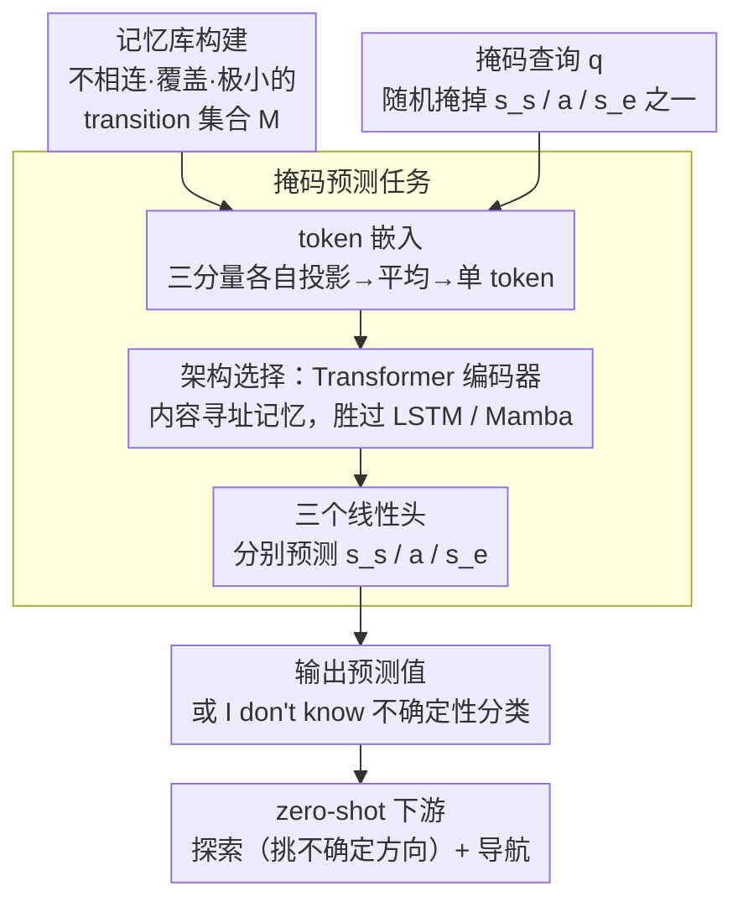

# Building Spatial World Models from Sparse Transitional Episodic Memories

**会议**: ICLR2026  
**arXiv**: [2505.13696](https://arxiv.org/abs/2505.13696)  
**代码**: 待确认  
**领域**: 机器人  
**关键词**: world model, episodic memory, spatial reasoning, cognitive map, navigation

## 一句话总结
提出 Episodic Spatial World Model (ESWM)，从稀疏、不连续的情景记忆（one-step transitions）中构建空间世界模型，其潜空间自发涌现出与环境拓扑对齐的认知地图，并支持零样本探索和导航。

## 研究背景与动机

**领域现状**：现有世界模型（World Models）通常需要长序列连续轨迹进行训练，将环境知识编码到模型权重中。代表性方法如 TEM、GTM-SM 依赖连续观测序列并假设跨环境共享固定结构。

**现有痛点**：(1) 真实场景中智能体的观测往往是碎片化的——不同时间访问环境的不同部分，无法获得连续长轨迹；(2) 环境可能发生结构性变化（如新增障碍物），基于权重编码的模型需要重新训练才能适应；(3) 序列模型处理大环境时计算开销巨大。

**核心矛盾**：现有模型将环境结构知识编码在权重中，导致 (a) 无法从碎片化经验中快速建图，(b) 无法动态适应环境变化。

**本文目标**：能否仅从稀疏、不相连的情景记忆中快速构建出一致的空间世界模型？

**切入角度**：受神经科学启发——内侧颞叶（MTL）同时负责空间表征和情景记忆，通过整合重叠的情景记忆构建关系网络。作者设想模型无需连续轨迹，只需一组独立的 one-step transition 即可推理出完整空间结构。

**核心 idea**：将世界建模从序列学习转化为集合推理——用 Transformer 从不相连的情景记忆集合中推断空间关系。

## 方法详解

### 整体框架
ESWM 要回答的问题是：能不能不靠连续轨迹、只凭一堆碎片化的情景记忆，就推断出环境的完整空间结构。它的输入是一个**记忆库 $M$**（由多个不相连的 one-step transition $(s_s, a, s_e)$ 组成的无序集合）和一个**部分掩码的查询 transition $q$**（随机掩掉起始状态、动作、终止状态之一），目标是补全 $q$ 里被掩掉的那个分量。整条流水线很短：记忆库里每个 transition 的三个分量各自投影后平均成一个 token，所有记忆 token 连同查询 token 一起送进 Transformer 编码器，最后由三个线性头读出预测；当查询落在记忆没覆盖的区域时，模型还会输出一个 "I don't know"。这本质上是把世界建模从序列学习改写成**集合到值的推理**——从碎片记忆里推断未观测的空间关系——训练好的模型可直接零样本用于探索和导航。

训练采用**元学习**策略：每个样本随机采样一个环境、一个记忆库、一个查询和一种掩码方式，使模型无法记忆特定环境，必须学会通用的空间推理能力。

### 关键设计

**1. 记忆库构建：用极小覆盖集逼模型多步推理，而非查表**

为每个环境生成的记忆库不是随便堆一组 transition，而是要同时满足三个性质：**不相连**（这些 transition 不构成一条连续路径，彼此是碎片）、**覆盖性**（把所有 transition 当作边，整张图连通且覆盖环境里的每一个位置）、**极小性**（删掉任意一个 transition，图就会断连）。极小性是这里的关键约束——它保证记忆库里没有冗余边可供"直接查表"，模型想回答任何跨片段的查询，都必须把多个互不相连的记忆片段拼起来、推理出从未被直接观测过的空间关系。换句话说，记忆库的构造方式本身就把"被迫做多步推理"写进了任务里。

**2. 掩码预测任务：一个集合到值的统一接口，覆盖三种空间推理**

模型要解的是 $q^* = f(M, q)$：$f$ 是 Transformer 编码器，输入记忆库 $M$ 和被掩码的查询 transition $q$，输出补全被掩掉的分量。具体编码上，每个 transition 的三个分量 $(s_s, a, s_e)$ 各自投影到共享高维空间、再平均成单个 token；记忆库的所有 token 与查询 token 拼接后一起送进 Transformer，最后用三个线性头分别预测 $s_s$、$a$、$s_e$。掩哪个分量决定了在考哪种能力：掩 $s_e$ 是**前向预测**（已知状态和动作，问下一状态），掩 $a$ 是**动作推理**（已知起终点，问中间动作），掩 $s_s$ 是**反向推理**（已知动作和终点，问起点）。三种掩码共用同一套参数，逼模型学到的是双向、可组合的空间关系，而不是单向的转移函数。

**3. "I don't know" 不确定性分类：把"不知道"显式建模成可探索信号**

光会预测还不够——当记忆库本身缺了某块区域时，有些查询是根本无解的，模型得能说"我不知道"。训练时随机删掉一部分记忆，人为制造未观测区域；凡是涉及这些区域的查询，正确答案就是额外的"I don't know"类别，而不是硬编一个数值。这一步看似只是加了个类别，实际是后续零样本探索的基础：智能体可以盯着模型对各候选动作输出的"I don't know"概率，专挑那些不确定性高、信息增益大的方向去走，把"模型的无知"直接变成探索的指南针。

**4. 架构选择：注意力是从碎片记忆里泛化的必要条件**

作者在同一任务下对比了三种骨干——Transformer（ESWM-T）、LSTM（ESWM-LSTM）、Mamba（ESWM-MAMBA）。结果只有 Transformer 在需要组合泛化的 Open Arena 上成功，LSTM 和 Mamba 都过拟合到训练环境、泛化失败。这指向一个解释：注意力机制本质上是一种内容可寻址记忆，能在一堆无序、不相连的记忆片段里按内容检索、把相关片段关联起来——这正是"从情景记忆集合中推理空间结构"所需要的，而循环/状态空间模型偏序列归纳的结构在这里反而成了包袱。

### 训练策略
使用交叉熵损失，$s_s$、$a$、$s_e$ 三个预测头等权。460K 迭代，batch size 128，cosine 学习率调度。元学习设置确保每个样本的环境、记忆库和查询都随机生成。

## 实验关键数据

### 主实验

| 环境 | 模型 | 状态预测准确率 | 动作预测准确率 | 对比 TEM-T |
|------|------|---------------|---------------|-----------|
| Open Arena | ESWM-T-2L | ~85% ($s_s$), ~85% ($s_e$) | ~95% ($a$) | TEM-T 显著低于 ESWM-T |
| Random Wall | ESWM-T-14L | 高精度 | 高精度 | TEM-T 完全失败（无法处理变化结构） |
| MiniGrid 9×9 | ESWM-T-12L | 成功预测 | 成功预测 | — |
| ProcThor 3D | ESWM-T-12L | 高余弦相似度 | 准确预测 $\Delta xy$, $\Delta\theta$ | — |

### 下游任务表现

| 任务 | 指标 | ESWM | EPN (baseline) | 最优 Oracle |
|------|------|------|---------------|------------|
| 探索（15步） | 唯一状态访问数 | 比 EPN 多 16.8% | — | ESWM 达 Oracle 的 96.48% |
| 导航（成功率） | success rate | 96.8% | 78.8% (+18%) | — |
| 导航（路径最优性） | path optimality | 99.2% | 78.2% (+21%) | — |
| 适应性（加障碍后导航） | success rate | 93% | 72% | baseline 降到 56% |

### 关键发现
- Transformer 的注意力机制是从情景记忆集合中学习空间推理的关键，LSTM 和 Mamba 在需要组合泛化的 Open Arena 中失败
- ESWM 的潜空间自发涌现出与环境拓扑一致的空间地图（ISOMAP 投影显示光滑流形，障碍区域对应局部不连续）
- 路径长度在潜空间和物理空间中高度相关（$R^2 = 0.89$）
- 模型的预测不确定性（输出熵）随查询所需的记忆整合路径长度单调递增，证明模型确实在进行多步推理
- 仅需 EPN 1/4 的记忆量即可实现更优导航，体现极高的样本效率

## 亮点与洞察
- **从集合推理到空间地图**：将世界建模从序列处理转化为集合推理是核心创新。模型不需要连续轨迹，只需要一组独立的 transition 记忆，这大幅降低了数据需求且天然支持动态环境
- **记忆与推理解耦**：环境知识存储在外部记忆库而非模型权重中，实现了真正的"即插即用"适应——修改几条记忆即可适应环境变化，无需重训练。这个设计理念可迁移到任何需要快速适应的场景
- **认知地图的自发涌现**：模型并未被显式要求学习空间结构，但训练后潜空间自然形成了与环境拓扑一致的几何地图。这与神经科学中海马体位置细胞的发现高度一致
- **零样本下游能力**：探索和导航都不需要额外训练，直接利用世界模型的预测和不确定性估计即可实现近最优策略

## 局限与展望
- 实验环境仍以可控的离散/简单连续环境为主，尚未在真实机器人场景中验证
- ProcThor 实验仅展示了可行性，未与强 baseline 对比
- 记忆库的极小性约束在现实中难以满足——真实智能体的记忆往往包含冗余和噪声
- 当前只处理空间结构，未建模语义信息（如物体类别、功能属性）
- 元学习的训练成本较高（460K 迭代），且预训练环境的分布可能影响泛化

## 相关工作与启发
- **vs TEM (Whittington et al.)**: TEM 假设所有环境共享统一结构模板并将其编码到 RNN 权重中；ESWM 不做此假设，从外部记忆动态推理结构，能处理结构多变的环境（如随机迷宫）。TEM 在 Random Wall 上完全失败
- **vs GTM-SM (Fraccaro et al.)**: GTM-SM 同样依赖序列轨迹且假设共享结构；ESWM 操作于不相连的情景记忆，更 sample-efficient
- **vs Ha & Schmidhuber (2018) World Models**: 传统世界模型将知识编码到权重中，无法快速适应环境变化；ESWM 的外部记忆机制实现了即时适应
- 这篇工作为 embodied AI 和机器人导航提供了一个新范式：不需要在目标环境中大量训练，只需少量探索记忆即可建立可用的空间模型

## 评分
- 新颖性: ⭐⭐⭐⭐⭐ 将世界建模从序列学习转化为集合推理，概念突破性强
- 实验充分度: ⭐⭐⭐⭐ 从简单网格到 3D 环境逐步验证，分析充分，但真实场景验证不足
- 写作质量: ⭐⭐⭐⭐⭐ 逻辑清晰，图表精美，神经科学动机与计算方法结合自然
- 价值: ⭐⭐⭐⭐⭐ 提出了一个具有广泛影响力的新范式，在认知科学和 AI 的交叉点上做出了重要贡献

<!-- RELATED:START -->

## 相关论文

- [\[AAAI 2026\] Beyond World Models: Rethinking Understanding in AI Models](../../AAAI2026/others/beyond_world_models_rethinking_understanding_in_ai_models.md)
- [\[ICLR 2026\] LPWM: Latent Particle World Models for Object-Centric Stochastic Dynamics](latent_particle_world_models_self-supervised_object-centric_stochastic_dynamics_.md)
- [\[ICML 2025\] General Agents Contain World Models](../../ICML2025/others/general_agents_contain_world_models.md)
- [\[ICLR 2026\] Characterizing and Optimizing the Spatial Kernel of Multi Resolution Hash Encodings](characterizing_and_optimizing_the_spatial_kernel_of_multi_resolution_hash_encodi.md)
- [\[CVPR 2026\] 4DWorldBench: A Comprehensive Evaluation Framework for 3D/4D World Generation Models](../../CVPR2026/others/4dworldbench_a_comprehensive_evaluation_framework_for_3d4d_world_generation_mode.md)

<!-- RELATED:END -->
