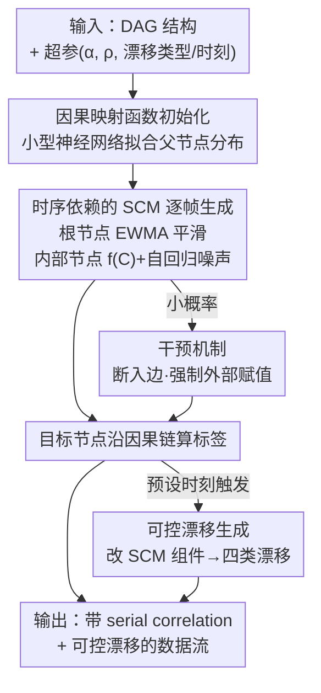

# CaDrift: A Time-dependent Causal Generator of Drifting Data Streams

**会议**: ICLR2026  
**arXiv**: [2602.20329](https://arxiv.org/abs/2602.20329)  
**代码**: [https://github.com/eduardovlb/CaDrift](https://github.com/eduardovlb/CaDrift)  
**领域**: 其他  
**关键词**: concept drift, structural causal model, synthetic data generation, data streams, time dependence

## 一句话总结
提出 CaDrift，一个基于结构因果模型（SCM）的时间依赖合成数据流生成框架，通过 EWMA 平滑和自回归噪声引入时序相关性，并通过修改因果映射函数实现可控的分布漂移、协变量漂移、严重漂移和局部漂移，填补了现有数据流生成器既不因果又不时序依赖的空白。

## 研究背景与动机

**领域现状**：数据流挖掘中概念漂移（concept drift）是核心挑战——数据分布随时间变化，模型需要持续适应。评估自适应学习算法需要有可控漂移事件的合成基准数据。

**现有痛点**：现有合成生成器（如 SEA、Sine、RandomRBF）依赖线性或概率函数，生成的样本本质上是 iid 的——即使有漂移事件，样本间也没有时序相关性。这与真实数据流（如 IoT 传感器、金融数据）的特性严重不符。

**核心矛盾**：真实数据流具有两个关键特性：(a) 变量间存在因果关系而非简单相关，(b) 连续样本间有时序依赖（serial correlation）。现有生成器两者都不满足。

**本文目标**：设计一个同时具备因果结构和时序依赖的合成数据流生成器，支持多种可控漂移类型。

**切入角度**：将 SCM 的因果图结构与 EWMA 平滑 + 自回归噪声结合，在因果传播链上自然引入时序依赖；通过修改 SCM 的映射函数来产生不同类型的漂移。

**核心 idea**：在 SCM 的因果图上叠加时序动态（EWMA + AR噪声），再通过修改映射函数实现可控漂移，首次实现因果 + 时序依赖 + 可控漂移三合一的数据流生成。

## 方法详解

### 整体框架
CaDrift 把一张有向无环图（directed acyclic graph, DAG）当作骨架：节点是特征和目标，边是变量间的因果关系，整张图就是一个结构因果模型（structural causal model, SCM）。它要解决的问题是——让 SCM 既保留因果结构、又能生成样本间有时序相关性、还能在指定时刻按需漂移的数据流。

生成分两步走。开跑前先初始化每个内部节点的映射函数（小型神经网络），让它真正拟合到父节点的分布上、不至于退化；之后数据就一帧帧流出来——根节点用 EWMA 平滑采样、携带上一时刻的记忆，内部节点通过映射函数从父节点算出自己的值并叠上一层自回归噪声，目标节点沿因果链算出标签。生成过程中偶尔会对个别节点做一次"干预"：断开它的入边、强制外部赋值，模拟传感器故障这类异常。漂移则发生在预设的时间点——到点就替换某个映射函数或改写某个分布参数，让数据流的统计特性突然或渐渐变化。整个框架的输入是 DAG 结构加一组超参数（平滑系数 $\alpha$、自回归系数 $\rho$、漂移类型与触发时刻），输出是一条带 serial correlation、带可控概念漂移的合成数据流。

### 关键设计

**1. 因果映射函数初始化：先拟合再生成，避免因果链退化**

映射函数 $f_E$ 决定了父节点如何因果地决定子节点。CaDrift 不像 TabPFN 那样随机初始化 MLP 或决策树，而是先用父节点的实际分布把一个小型神经网络拟合到目标值上，确保映射函数真的覆盖了父节点分布范围内的因果关系。这么做是为了躲开随机树模型的一个坑——随机生成的分裂点可能落在父节点分布之外，结果整条因果链要么几乎不变化、要么只输出单一类别，生成的数据就退化了。先拟合一遍能保证映射在数据实际出现的区间里有意义，也让后面的漂移事件更显式、更可控。

**2. 时序依赖的 SCM：让 iid 的因果图长出时间记忆**

标准 SCM 把每个内部变量写成 $E := f_E(C) + N_E$，父节点 $C$ 经映射函数 $f_E$ 加上独立噪声 $N_E$，逐样本独立采样——这正是现有生成器样本 iid、没有时序相关性的根源。CaDrift 在这条公式上动了两处手脚。其一，根节点不再每步独立采样，而是用 EWMA 做平滑：$Z_t = (1-\alpha)Z_{t-1} + \alpha X_t$，让当前值携带上一时刻的历史记忆，于是根节点的取值是缓慢过渡而非跳变。其二，所有连续节点的噪声从独立改为自回归形式 $N_E^{(t)} = \rho N_E^{(t-1)} + \epsilon^{(t)}$，其中 $\rho \in [0,1]$ 控制平滑程度，让每个节点的随机波动本身也连续起来。这两个时序组件叠在因果图上之后，时序相关性会顺着因果链一路传播到所有下游节点和目标，整条数据流于是自然带上了 serial correlation。

**3. 干预机制：用 do-calculus 模拟现实里的异常扰动**

真实数据流里偶尔会冒出不遵循正常因果规律的事件，比如传感器故障、环境冲击。CaDrift 借因果推断里的干预（intervention）概念来刻画这类扰动：对被干预的节点断开它所有的入边，强制赋予一个来自正态或均匀分布的值，不再让它听父节点的话。这一步用 do-calculus 表达得很干净——$P(y \mid \text{do}(x_3 \sim \mathcal{N}(\mu, \sigma^2)))$，即把 $x_3$ 从因果图里"拔出来"外部赋值后目标的分布。断边加强制赋值，恰好对应现实中某个变量被外力强行改写、与上游脱钩的情形；只在一小部分样本上施加，就成了数据流里偶发的噪声与扰动。

**4. 可控漂移生成：改 SCM 的不同零件，产出四种漂移**

漂移在 CaDrift 里不是另加一套机制，而是直接修改 SCM 的某个组件，改哪一块就得到哪一类漂移。改节点间映射函数 $f_E(C)$ 或目标映射 $f_y(C)$，会改变 $P(y\mid X)$，是**分布漂移（distributional）**；只改根节点的分布参数、改变 $P(X)$ 但不动因果关系，是**协变量漂移（covariate）**；把目标映射的输出类别整个反转，是**严重漂移（severe）**；只改单个特征的分布参数，是**局部漂移（local，协变量漂移的子类）**。漂移有多快则由参数 $\Delta$ 控制：$\Delta=1$ 是一步到位的突变（abrupt），$\Delta>1$ 是逐步过渡的渐变/增量漂移（gradual/incremental）；框架还支持循环漂移（recurrent），即一段时间后恢复回旧概念。

### 训练策略
CaDrift 是生成框架而非可训练模型，没有端到端的训练过程。映射函数只在初始化时拟合一次，之后就按因果图逐节点传播生成数据流；漂移事件在预设时间点触发映射函数或分布参数的替换。

## 实验关键数据

### 主实验
在 8 个 CaDrift 生成的数据集 + 3 个传统基准（SEA、Sine、RandomRBF）上评估 7 个数据流分类器：

| 方法 | CaDrift 8数据集平均准确率 | 传统3数据集平均准确率 | 总平均排名 |
|------|-------------------------|---------------------|-----------|
| ARF | ~73% | ~85.5% | **2.2** |
| TabPFN$^{\text{Stream}}$ | ~69% | ~83.0% | 3.0 |
| IncA-DES | ~73% | ~85.1% | 3.4 |
| LevBag | ~73% | ~79.5% | 3.0 |
| LAST | ~71% | ~77.7% | 4.9 |
| OAUE | ~63% | ~74.6% | 5.3 |
| HT | ~60% | ~65.3% | 6.2 |

### 消融实验（平稳性测试 - Ljung-Box Test）

| 配置 | 特征拒绝 $H_0$ 比例 | 说明 |
|------|-------------------|------|
| iid（无时序机制） | 0/6 | 所有特征和目标均不拒绝，无 serial correlation |
| 仅 EWMA ($\alpha$=0.05) | 4/6 | 大部分特征有 serial correlation，但部分下游节点不显著 |
| 仅 AR ($\rho$=0.1) | 6/6 | 所有特征和目标都有显著 serial correlation |
| EWMA + AR | **6/6** | 所有节点完全通过，serial correlation 沿因果链传播 |

### 关键发现
- **协变量漂移不影响分类性能**：在数据集1和2中，500个样本处的协变量漂移没有导致分类器性能下降，符合预期（因果关系未变）
- **自适应方法（ARF、LevBag）更抗漂移**：比无自适应的 HT 和 TabPFN 恢复更快
- **TabPFN 的上下文窗口问题**：当概念持续时间短于上下文窗口时，TabPFN 会混合两个概念的数据，导致漂移后性能下降严重——这是 stability-plasticity 困境的典型表现
- **自回归噪声是时序依赖的关键**：即使 $\rho$ 很小（0.1），也能在所有节点产生显著的 serial correlation
- **CaDrift 比传统生成器更具挑战性**：SEA 和 Sine 上分类器经常达到接近 100% 的准确率，而 CaDrift 生成的数据集更难

## 亮点与洞察
- **因果+时序+漂移三合一**：首次在 SCM 上引入时序依赖和可控漂移，这是一个自然而优雅的组合——因果图本身定义了变量关系，修改映射函数自然产生漂移，EWMA/AR 自然引入时序性
- **干预机制模拟扰动**：用因果推断中的 do-calculus 概念来模拟环境扰动，概念上非常干净——断开入边、强制赋值，完美对应现实中的传感器故障等场景
- **消融设计巧妙**：用 Ljung-Box 统计检验来定量验证时序依赖性，而不是只用分类准确率等间接指标
- **可迁移到基础模型训练**：CaDrift 生成的数据可以作为时序表格基础模型的预训练数据先验，这是一个有价值的下游应用方向

## 局限与展望
- **仅支持表格数据**：当前框架限于表格型数据流，不适用于图像、文本等非结构化数据流的漂移模拟
- **映射函数种类有限**：主要用小型神经网络作为因果映射，可以扩展到更多函数族（如分段线性、核函数等）以增加多样性
- **缺少与真实数据流的定量对比**：虽然做了 MMD 分析，但没有系统地回答"CaDrift 生成的数据流在统计特性上多大程度匹配真实数据流"
- **漂移检测评估缺失**：生成器的一个重要用途是评估漂移检测算法，但实验中没有测试任何漂移检测方法
- **计算开销未讨论**：生成大规模数据流（100-200节点DAG）的时间和内存开销未报告

## 相关工作与启发
- **vs TabPFN 的 SCM 生成器**：TabPFN 也用 SCM 生成合成数据，但样本是 iid 的且无漂移控制。CaDrift 的优势是时序依赖+可控漂移，可以作为 TabPFN 的时序扩展
- **vs RealDriftGenerator**：RealDriftGenerator 需要源数据集，通过 Clip Swap 引入漂移。CaDrift 完全合成，不需要源数据，且漂移类型更丰富
- **vs OWDSG**：OWDSG 通过改变聚类来引入漂移，但底层仍是 Madelon 生成器，没有因果结构。CaDrift 的因果链使漂移更加自然和可解释

## 评分
- 新颖性: ⭐⭐⭐⭐ 首次将因果模型、时序依赖和可控漂移结合，概念创新清晰
- 实验充分度: ⭐⭐⭐⭐ 8个自生成数据集+3个传统基准，消融实验用统计检验验证，但缺少漂移检测评估
- 写作质量: ⭐⭐⭐⭐ 结构清晰、对比表格完善，数学定义规范
- 价值: ⭐⭐⭐⭐ 对数据流挖掘社区有实际工具价值，代码已开源

<!-- RELATED:START -->

## 相关论文

- [\[NeurIPS 2025\] Test-Time Adaptation by Causal Trimming](../../NeurIPS2025/others/test-time_adaptation_by_causal_trimming.md)
- [\[ACL 2025\] Generating Synthetic Relational Tabular Data via Structural Causal Models](../../ACL2025/others/generating_synthetic_relational_tabular_data_via_structural_causal_models.md)
- [\[ICLR 2026\] CHLU: The Causal Hamiltonian Learning Unit as a Symplectic Primitive for Deep Learning](chlu_the_causal_hamiltonian_learning_unit_as_a_symplectic_primitive_for_deep_lea.md)
- [\[CVPR 2026\] Mitigating Instance Entanglement in Instance-Dependent Partial Label Learning](../../CVPR2026/others/mitigating_instance_entanglement_in_instance-dependent_partial_label_learning.md)
- [\[AAAI 2026\] How to Marginalize in Causal Structure Learning?](../../AAAI2026/others/how_to_marginalize_in_causal_structure_learning.md)

<!-- RELATED:END -->
