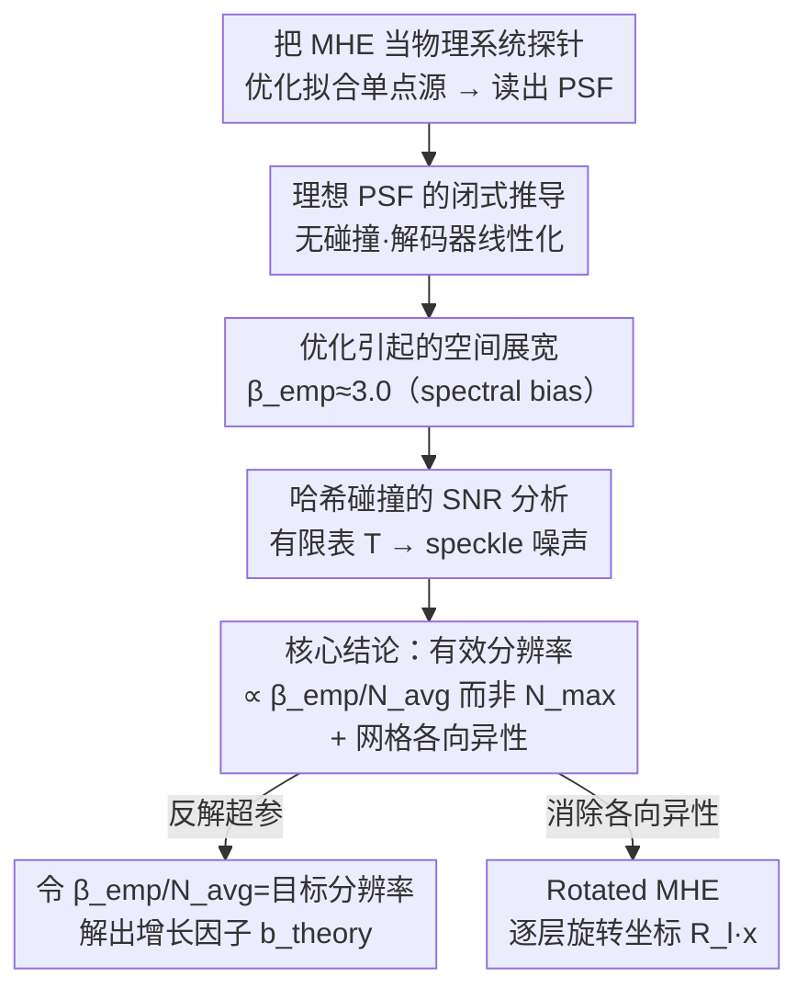

# Characterizing and Optimizing the Spatial Kernel of Multi Resolution Hash Encodings

**会议**: ICLR2026  
**arXiv**: [2602.10495](https://arxiv.org/abs/2602.10495)  
**代码**: 待确认  
**领域**: 其他  
**关键词**: multi-resolution hash encoding, neural radiance field, point spread function, spatial anisotropy, Instant-NGP

## 一句话总结
从物理系统角度分析 Instant-NGP 的多分辨率哈希编码（MHE），推导出其点扩展函数（PSF）的闭式近似，发现有效分辨率由平均分辨率 $N_{\text{avg}}$ 而非最细分辨率 $N_{\max}$ 决定，且存在网格引起的各向异性，并提出零开销的 Rotated MHE（R-MHE）通过逐层旋转输入坐标消除各向异性。

## 研究背景与动机

**领域现状**：Multi-Resolution Hash Encoding（MHE）是 Instant-NGP 的核心创新，为 NeRF 和 SDF 提供了高效的空间参数化。但其行为高度依赖超参数（层数 $L$、增长因子 $b$、分辨率 $N_{\max}/N_{\min}$、哈希表大小 $T$），通常用启发式方法选择。

**现有痛点**：MHE 缺乏从物理系统角度的严格分析。没有人回答过：MHE 的等效空间核是什么形状？其真实分辨率极限是多少？哈希碰撞如何量化影响质量？

**核心矛盾**：直觉上认为 MHE 的分辨率由最细层 $N_{\max}$ 决定，但实际并非如此——优化动态导致严重的空间展宽，真实分辨率远低于 $N_{\max}$。

**本文目标** 用严格的物理分析框架理解 MHE 的空间行为，指导超参数选择和架构改进。

**切入角度**：类比物理系统中的 Green's function，通过测量 MHE 对点源的响应（PSF）来表征其空间特性——分辨率、各向异性、碰撞噪声。

**核心 idea**：MHE 的有效分辨率由 $N_{\text{avg}}$ 和优化展宽因子 $\beta_{\text{emp}}$ 共同决定，而非 $N_{\max}$；网格各向异性可通过逐层旋转消除。

## 方法详解

### 整体框架
这篇论文不提新模型，而是回答一个被长期搁置的问题：Instant-NGP 的多分辨率哈希编码（MHE）等效的空间核到底长什么样、真实分辨率有多高、哈希碰撞如何拖累质量。作者把 MHE 当成一个物理系统来探针——测量它对一个点源约束的响应，也就是点扩展函数（PSF），就像在光学/物理里用 Green's function 表征系统。整条分析分三步层层递进：先在无碰撞的理想设定下推出 PSF 的闭式近似，再实测优化把这个核展宽了多少，最后把有限哈希容量带来的碰撞噪声纳入 SNR 框架。结论汇总成一个反直觉的判断——分辨率由平均分辨率 $N_{\text{avg}}$ 而非最细层 $N_{\max}$ 决定——并据此提出零开销的 Rotated MHE（R-MHE）。

### 关键设计

**1. 理想 PSF 的闭式推导：先搞清没有哈希碰撞时 MHE 的空间响应是什么形状**

要回答"等效空间核长什么样"，得先把问题剥到最干净——假设解码器线性化、哈希表无碰撞。此时 MHE 对一个点源约束优化后的响应，等于 $L$ 层归一化 B-spline 核的平均叠加 $P_{\text{Ideal}}(\mathbf{x}) = \frac{1}{L}\sum_{l} \hat{B}_l(\mathbf{x})$。作者用积分近似替换求和、再对 B-spline 做 Taylor 展开，得到闭式：

$$P \approx \frac{1}{L\ln b}\left[-\ln\|\mathbf{v}\| + C_D - A_D(\mathbf{v})\right]$$

其中 $A_D(\mathbf{v})$ 是 B-spline 自带的各向异性项。这个闭式一次性揭示了两条性质：PSF 是**对数径向衰减**（既不是高斯也不是指数），并且**沿坐标轴比沿对角线更窄**——网格编码的核天生就各向异性。

**2. 优化引起的空间展宽：实际训练出来的 PSF 比理想的宽得多**

理想 PSF 只是下限，真实训练后的核会被明显拉宽，这是全文最反直觉的发现。作者把总展宽因子拆成两段 $\beta_{\text{emp}} = \beta_{\text{ideal}} \cdot \beta_{\text{opt}}$：$\beta_{\text{ideal}} \approx 1.18$ 是 B-spline 固有的，$\beta_{\text{opt}} > 1$ 则来自优化过程。实测 Adam 下 $\beta_{\text{emp}} \approx 3.0$，也就是有效 FWHM 约为理想值的 2.5 倍。根源是 spectral bias——低频优先学习让粗层（低 $N_l$）被过度加权，整个空间核被展宽。直接后果是真正能分辨的双点距离 $d_{\text{crit}} \propto \beta_{\text{emp}}/N_{\text{avg}}$，由平均分辨率 $N_{\text{avg}}$ 控制，而不是最细层 $N_{\max}$。这正解释了为什么实践中一味加大 $N_{\max}$ 收益递减。

**3. 哈希碰撞的 SNR 分析：有限哈希表把空间上远离的顶点搅在一起**

前两步假设哈希表够大、没有碰撞，但真实场景哈希表大小 $T$ 有限。碰撞会让空间上相距很远的网格顶点共享同一特征向量，在 PSF 上叠加出 speckle 噪声，写成 $P_{\text{Collision}} = P_{\text{Ideal}} + n(\mathbf{x})$，其中噪声方差随碰撞率上升。这一框架的实用价值在于把"哈希表该开多大"变成可计算的问题：在固定 $T$ 下，增加层数 $L$ 或增长因子 $b$ 都能提升 SNR，于是可以反过来估算给定场景复杂度下维持目标 SNR 所需的 $T$。

**4. Rotated MHE（R-MHE）：逐层旋转输入坐标，把各向异性抵消掉**

设计 1 暴露出 PSF 沿坐标轴更窄的各向异性，R-MHE 就是针对它的零成本修复。做法是给每一层 $l$ 的输入坐标施加一个不同的旋转 $\mathbf{R}_l$ 再查表：$\mathbf{e}_l(\mathbf{x}) = \text{Interpolate}(\mathbf{F}^l, \mathcal{H}(\lfloor N_l \mathbf{R}_l \mathbf{x}\rceil))$。2D 用渐进旋转 $\theta_l = l \cdot \theta$，3D 则用正多面体顶点方向在 SO(3) 上采样朝向。各层网格朝向不同后，各向异性在多层叠加中相互抵消，合成的 PSF 更接近各向同性。关键是它**不增加任何参数、也不增加计算量**，只是换了坐标变换，因此在移动端渲染这类资源受限场景里尤其划算。

基于这套 PSF 分析，超参数也能直接算而不必手调：令 $\beta_{\text{emp}}/N_{\text{avg}}$ 等于目标空间分辨率（比如单像素大小），反解出理论增长因子 $b_{\text{theory}}$。实验里 $b_{\text{theory}}$ 与经验最优值 $b_{\text{opt}}$ 几乎一致，验证了这条选参路径可用。

## 实验关键数据

### 主实验

| 任务 | 方法 | PSNR (dB) |
|------|------|----------|
| **2D 图像回归** | Standard MHE (M=1) | 23.88 |
| | R-MHE (M=2) | 24.62 |
| | R-MHE (M=4) | 24.69 |
| | **R-MHE (M=8)** | **24.82 (+0.94)** |
| **3D NeRF (Synthetic)** | Standard MHE | 35.346 |
| | R-MHE (Icosa) | **35.479 (+0.13)** |
| **3D SDF** | Standard MHE | 0.9986 IoU |
| | R-MHE (any) | 0.9986 IoU |

### 消融实验（PSF 特性验证）

| 性质 | 理论预测 | 实验验证 |
|------|---------|---------|
| 各向异性比（轴 vs 对角线） | 1.17 | ≈1.17（精确匹配） |
| 总展宽因子 $\beta_{\text{emp}}$（Adam） | - | ≈3.0（跨配置稳定） |
| FWHM 与 $N_{\text{avg}}$ 关系 | 线性 | 线性（精确匹配） |
| 双点可分辨距离 $d_{\text{crit}}$ | $\propto$ FWHM | 线性相关（R²≈1） |

### 关键发现
- **有效分辨率远低于 $N_{\max}$**：$\beta_{\text{emp}} \approx 3.0$ 意味着实际分辨率比 $N_{\max}$ 暗示的低约 3 倍。这解释了为什么增大 $N_{\max}$ 的收益递减
- **$N_{\text{avg}}$ 是真正的控制参数**：改变 $L$ 和 $b$ 后，只要 $N_{\text{avg}}$ 相同，FWHM就相同——这大大简化了超参数选择
- **R-MHE 在 2D 显著，在 3D 边际**：2D 提升 +0.94 dB，3D NeRF 仅 +0.13 dB。作者解释：3D 体渲染的光线积分本身就是一种视角平均，自然减弱了各向异性的影响
- **PSF 指导的超参数选择有效**：理论计算的 $b_{\text{theory}}$ 与经验最优 $b_{\text{opt}}$ 一致，无需手动调参

## 亮点与洞察
- **物理思维解神经场**：用 PSF/Green's function 这种物理学标准工具分析神经场是全新视角。这种方法论可以直接迁移到 TensoRF、K-Planes 等其他网格编码
- **反直觉的核心发现**：$N_{\text{avg}}$ 而非 $N_{\max}$ 决定分辨率——这颠覆了"最细层决定精度"的直觉，对实践中的超参数选择有直接指导意义
- **spectral bias 的空间解读**：将优化中众所周知的 spectral bias 现象翻译为具体的空间展宽，给出了量化的展宽因子 $\beta_{\text{opt}}$
- **R-MHE 零成本改进**：不增参数不增计算的纯坐标变换改进——在资源受限场景（如移动端渲染）中尤其有价值

## 局限与展望
- **3D 改进有限**：R-MHE 在标准 3D benchmark 上改进边际。需要在更挑战的场景（稀疏视角、高频纹理）中验证
- **线性化假设**：PSF 分析基于解码器线性化假设，对深层 MLP 的适用性有待更多验证（虽然作者实验表明对 MLP 深度不敏感）
- **$\beta_{\text{opt}}$ 依赖优化器**：展宽因子对 Adam 约为 3.0，其他优化器不同——缺少对各种优化器的系统分析
- **仅分析了点源响应**：PSF 是对单点约束的响应，真实场景中的多约束交互更复杂

## 相关工作与启发
- **vs Instant-NGP 原文**：原文给出了 MHE 架构但未分析其空间特性。本文是对 Instant-NGP 的深层理论补充——揭示了其空间核的形状、分辨率极限和碰撞影响
- **vs NTK 分析**：NTK 文献分析了神经网络的频率偏置。本文将 NTK 视角具体化为 MHE 的空间 PSF，给出了工程上可用的定量结论
- **vs TensoRF/K-Planes**：所有基于轴对齐网格的方法都有类似的各向异性问题。R-MHE 的旋转思路可直接迁移

## 评分
- 新颖性: ⭐⭐⭐⭐⭐ 用物理系统 PSF 分析神经场编码是全新方法论，$N_{\text{avg}}$ 决定分辨率的发现反直觉且重要
- 实验充分度: ⭐⭐⭐⭐ 2D+3D NeRF+SDF 全面验证，PSF 理论与实验精确匹配，但 3D 改进有限
- 写作质量: ⭐⭐⭐⭐⭐ 从物理直觉出发的分析层层递进，数学推导严谨且有实验对应
- 价值: ⭐⭐⭐⭐⭐ 为神经场社区建立了基于物理原理的分析方法论，PSF 超参数指导有直接实用价值

<!-- RELATED:START -->

## 相关论文

- [\[ICLR 2026\] Probabilistic Kernel Function for Fast Angle Testing](probabilistic_kernel_function_for_fast_angle_testing.md)
- [\[ICLR 2026\] Building Spatial World Models from Sparse Transitional Episodic Memories](building_spatial_world_models_from_sparse_transitional_episodic_memories.md)
- [\[ICML 2025\] K²IE: Kernel Method-based Kernel Intensity Estimators for Inhomogeneous Poisson Processes](../../ICML2025/others/k2ie_kernel_method-based_kernel_intensity_estimators_for_inhomogeneous_poisson_p.md)
- [\[ICLR 2026\] Predicting Kernel Regression Learning Curves from Only Raw Data Statistics](predicting_kernel_regression_learning_curves_from_only_raw_data_statistics.md)
- [\[AAAI 2026\] Tab-PET: Graph-Based Positional Encodings for Tabular Transformers](../../AAAI2026/others/tab-pet_graph-based_positional_encodings_for_tabular_transformers.md)

<!-- RELATED:END -->
