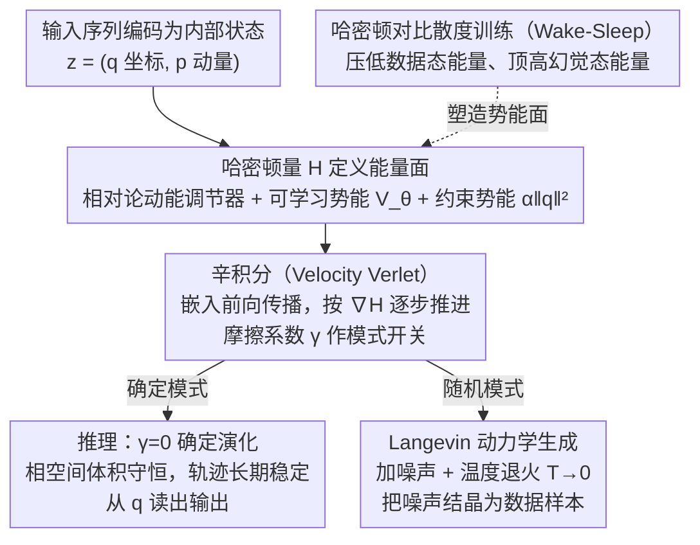

# CHLU: The Causal Hamiltonian Learning Unit as a Symplectic Primitive for Deep Learning

**会议**: ICLR 2026  
**arXiv**: [2603.01768](https://arxiv.org/abs/2603.01768)  
**代码**: 有（软件包）  
**领域**: 物理启发深度学习 / 时序建模  
**关键词**: 哈密顿神经网络, 辛积分, 相对论动能, 能量守恒, 长期稳定性  

## 一句话总结
CHLU 是一种基于相对论哈密顿力学和辛积分的计算学习原语，通过强制相空间体积守恒和引入因果速度上限，解决了 LSTM 的梯度爆炸/消失和 Neural ODE 的信息耗散问题，实现无限时域稳定性和热力学生成能力。

## 研究背景与动机
**领域现状**：深度学习中的时序建模存在根本性二分法——离散单元（LSTM/RNN）具有表达力但不稳定（梯度爆炸/消失），连续模型（Neural ODE）平滑但耗散性地破坏信息

**现有痛点**：
   - LSTM 在长程推理时数值误差正向累积，轨迹发散
   - Neural ODE 因耗散本质导致轨迹收缩到原点，丢失长期信息
   - 哈密顿神经网络（Greydanus 2019）主要用于物理仿真，未扩展到一般推理和生成任务

**核心矛盾**：记忆长期依赖（需要保持信息）和稳定性（需要约束更新）是此消彼长的——守恒律可以同时解决两者

**本文目标**：设计一个将能量守恒作为结构先验（而非学习目标）的计算单元

**切入角度**：用相对论力学提供速度上限防止动能爆炸，用辛积分保证长期能量守恒

**核心 idea**：把信息传播重新定义为内部状态在可学习势能面上的哈密顿演化

## 方法详解

### 整体框架
CHLU 想解决的是时序建模里"记得住"和"稳得住"的矛盾：要长期保留信息就得让状态自由演化，但自由演化又容易发散。它的做法是把信息传播整个重新理解成一个物理系统在势能面上的运动——单元内部状态写成 $\mathbf{z} = (\mathbf{q}, \mathbf{p})$，分别是广义坐标和动量，输入驱动它们按哈密顿方程 $\dot{q} = \partial\mathcal{H}/\partial p$、$\dot{p} = -\partial\mathcal{H}/\partial q$ 一步步演化，输出再从坐标读出。整个单元的"物理定律"由哈密顿量 $\mathcal{H}$ 决定，它拆成三块：相对论动能、可学习势能 $V_\theta$、约束势能 $\alpha\|\mathbf{q}\|^2$。前向传播不是普通的矩阵乘加，而是用辛积分器一步步推进这套动力学，于是"能量守恒"从一开始就被刻进了架构里，而不是靠损失函数事后约束。同一套势能面下，把摩擦系数 $\gamma$ 设 0 走确定演化就是推理，加上噪声并退火就是生成——推理与生成统一在同一个哈密顿算子里。

### 关键设计

**1. 相对论动能调节器：给速度一个物理上限，从根上掐掉动能爆炸**

LSTM 之所以会发散，是因为状态更新没有天花板，扰动一旦被正反馈放大就一路冲到非物理的高能区。CHLU 把牛顿动能换成相对论动能 $T(\mathbf{p}) = \sqrt{c^2 \mathbf{p}^T \mathbf{M}^{-1} \mathbf{p} + m_0^2 c^4}$，关键在于此时速度是动能对动量的梯度 $\dot{\mathbf{q}} = \nabla_p T$，当动量 $\mathbf{p}$ 不断增大时这个梯度会饱和、逼近速度上限 $c$。也就是说不管输入怎么把动量推高，状态的移动速度都被 $c$ 这个"光速"卡死，动能不可能无界增长，自然也就没有梯度爆炸。这里 $c$、静质量 $m_0$、对角质量矩阵 $\mathbf{M}$ 都是可学习的，相当于让网络自己调出合适的物理常数。

**2. 辛积分（Velocity Verlet）：用保体积的积分器换来无限时域的能量有界**

光有好的哈密顿量还不够，普通的数值积分会慢慢累积误差、把能量越积越高或越耗越低。CHLU 直接把 Velocity Verlet 这一辛积分器嵌进前向传播，每一步按 $\mathbf{p}_{t+0.5} = \mathbf{p}_t - \frac{\epsilon}{2}\nabla V_\theta(\mathbf{q}_t)$ → $\mathbf{q}_{t+1} = \mathbf{q}_t + \epsilon \nabla T(\mathbf{p}_{t+0.5})$ → $\mathbf{p}_{t+1} = (1-\gamma)\mathbf{p}^*_{t+1}$ 推进。辛积分的好处是严格保持相空间体积（Liouville 定理），这意味着能量只会在一个有界区间里振荡，而不会像 Neural ODE 那样单调衰减到原点、把长期信息耗散掉。式中的摩擦系数 $\gamma$ 是一个可调开关：推理时令 $\gamma=0$ 走纯守恒、轨迹长期不塌；需要收敛到某个稳定状态时令 $\gamma>0$ 引入耗散，让系统落进吸引子。

**3. 哈密顿对比散度训练（Wake-Sleep）：用塑造能量面的方式来学，而不是直接回归输出**

既然信息是在势能面上滚动，训练的本质就变成"把势能面捏成对的形状"——让真实数据待在低能谷里、让错误状态处在高能坡上。CHLU 借用 Wake-Sleep 的对比思路：Wake 阶段是有监督的，最小化预测与目标的 MSE，再加一项 Lyapunov 指数正则化压住混沌倾向；Sleep 阶段是无监督的，从 replay buffer 里让状态自由演化，把这些"幻觉"（hallucination）状态的能量抬高。两个阶段合起来的权重更新方向是 $\Delta\theta \propto -\nabla_\theta \mathcal{H}(z_{\text{wake}}) + \nabla_\theta \mathcal{H}(z_{\text{sleep}})$，即压低数据态能量、顶高幻觉态能量，最终把数据流形雕刻成势能面的低谷。

**4. Langevin 动力学生成：同一套势能面，加点噪声和退火就能采样**

因为势能面已经把数据流形刻成了低能盆地，生成就不需要另起炉灶——只要把确定性的哈密顿演化换成带噪声的 Langevin 动力学 $d\mathbf{p} = -\nabla V_\theta dt - \gamma\mathbf{p}dt + \sqrt{2\gamma k_B \mathcal{T}} d\mathbf{W}$，让系统在随机扰动下探索势能面。再配合温度退火 $\mathcal{T} \to 0$，逐渐冻结随机性、把状态沉进低能模式，就能像"结晶"一样析出一个数据样本。于是推理和生成在 CHLU 里是同一套物理：前者是无温度的确定演化，后者是带温度退火的随机演化。

### 损失函数 / 训练策略
- **Wake 损失**：MSE + $\lambda \mathcal{L}_{reg}$，其中 $\mathcal{L}_{reg}$ 是 Lyapunov 指数正则化，用来防止系统进入混沌。
- **Sleep 损失**：对比信号——降低数据态能量、升高幻觉态能量。
- **关键超参数**：可学习对角质量矩阵 $\mathbf{M}$、速度上限 $c$、静质量 $m_0$、约束势系数 $\alpha$。

## 实验关键数据

### 实验 I — 长程稳定性（Lemniscate 轨迹追踪，训练 3 周期，推理 50 周期）

| 模型 | 表现 |
|------|------|
| LSTM | 数值误差正向累积，轨迹发散到高能极限环 |
| Neural ODE | 轨迹向内螺旋塌缩到原点（耗散）|
| **CHLU** | **轨迹保持闭合稳定**，误差有界不累积 |

### 实验 II — 动能安全（扰动正弦波预测）

| 模型 | 对初始扰动的响应 |
|------|---------------|
| LSTM | 产生非物理的瞬时速度尖峰（无限加速）|
| Neural ODE | 波形完全塌缩为零（平凡解）|
| **CHLU** | **速度平滑饱和于 $c$**，扰动转化为相位偏移而非幅度发散 |

### 实验 III — MNIST 热力学生成

- 从测试集质心+高斯噪声出发，通过 Langevin 动力学退火生成手写数字
- 成功产生可辨识的数字模式，但某些数字（3,5,8,9）生成频率偏高

### 关键发现
- **辛约束是长期拓扑保真的必要条件**：LSTM 和 NODE 都无法在 50 周期后保持轨迹拓扑
- **因果速度上限是对抗初始化不稳定性的鲁棒防御**：将扰动转化为相位偏移而非幅度爆炸
- **生成能力是副产品**：势能面自然定义了数据流形的吸引盆，通过温度退火即可采样

## 亮点与洞察
- **将守恒律作为结构先验而非学习目标**：根本性的设计哲学差异——不是让网络"学会"守恒，而是由架构"保证"守恒
- **从物理到计算的优雅类比**：数据点=势能井低点，推理=哈密顿演化，生成=Langevin 退火——整个框架的物理直觉非常清晰
- **速度上限 $c$ 作为可调超参数**：控制信息传播速度的上限，类似于 Transformer 中的注意力窗口但有物理基础

## 局限与展望
- 目前只是概念验证阶段（MNIST），未在大规模/高维数据上验证
- 三个实验都未做超参数调优，不与 SOTA 比较性能
- Wake-Sleep 训练机制是"经验性选择"，缺乏收敛性理论保证
- 单个 CHLU 单元的能力有限，多 CHLU 组网的架构设计留待未来
- 可学习势能 $V_\theta$ 的表达力是否受辛约束限制？未讨论

## 相关工作与启发
- **vs LSTM**：LSTM 的门控机制是学习何时遗忘/记忆，CHLU 用辛几何从结构上保证信息不丢失
- **vs Neural ODE**：NODE 建模耗散系统，CHLU 建模守恒系统——前者适合收敛到稳态，后者适合保持轨迹
- **vs HNN（Greydanus 2019）**：HNN 学习哈密顿量用于仿真，CHLU 用固定哈密顿结构作为推理和生成的原语

## 评分
- 新颖性: ⭐⭐⭐⭐⭐ 相对论哈密顿 + 辛积分 + 热力学生成的组合是全新的深度学习原语
- 实验充分度: ⭐⭐⭐ 只是概念验证，三个简单实验，无 SOTA 对比
- 写作质量: ⭐⭐⭐⭐ 物理直觉清晰，但部分推导细节在附录中
- 价值: ⭐⭐⭐⭐ 独特的物理启发视角，对长程记忆和稳定性问题提供了根本性的解决思路

<!-- RELATED:START -->

## 相关论文

- [\[AAAI 2026\] How to Marginalize in Causal Structure Learning?](../../AAAI2026/others/how_to_marginalize_in_causal_structure_learning.md)
- [\[ICML 2026\] Possibilistic Predictive Uncertainty for Deep Learning](../../ICML2026/others/possibilistic_predictive_uncertainty_for_deep_learning.md)
- [\[CVPR 2026\] Towards Knowledge-augmented Bayesian Deep Learning For Computer Vision](../../CVPR2026/others/towards_knowledge-augmented_bayesian_deep_learning_for_computer_vision.md)
- [\[ICML 2026\] Sequential Group Composition: A Window into the Mechanics of Deep Learning](../../ICML2026/others/sequential_group_composition_a_window_into_the_mechanics_of_deep_learning.md)
- [\[CVPR 2025\] Potential Field Based Deep Metric Learning](../../CVPR2025/others/potential_field_based_deep_metric_learning.md)

<!-- RELATED:END -->
