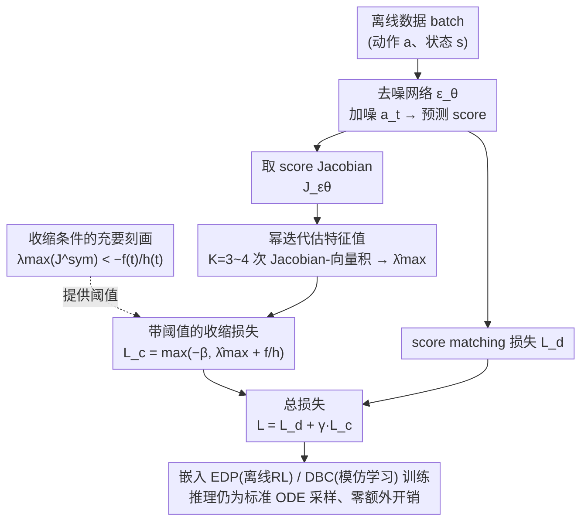

# Contractive Diffusion Policies: Robust Action Diffusion via Contractive Score-Based Sampling with Differential Equations

**会议**: ICLR2026  
**arXiv**: [2601.01003](https://arxiv.org/abs/2601.01003)  
**代码**: 待确认  
**领域**: 图像生成  
**关键词**: 扩散策略, 收缩理论, 离线强化学习, 模仿学习, Score-Based Models  

## 一句话总结
提出 Contractive Diffusion Policies (CDPs)，通过在扩散采样 ODE 中引入收缩正则化来抑制 score 匹配误差和求解器误差的累积，以最小修改和单一超参数 $\gamma$ 提升离线学习中扩散策略的鲁棒性。

## 研究背景与动机
1. 扩散策略在离线 RL 和模仿学习中表现优异，但其迭代采样过程中 score 估计误差、离散化误差和数值积分误差会逐步累积
2. 与图像生成不同，机器人控制中微小的动作偏差会复合放大，将策略推离数据分布支撑，导致任务失败
3. 现有 Diffusion Policy 在相同状态下生成动作的一致性不足，且在数据稀缺场景下效果显著下降
4. 收缩理论（Contraction Theory）研究微分方程解的收敛性，可使系统快速遗忘初始扰动并自然抑制误差增长
5. 之前的 contractive DDPM 方法全局强制收缩，可能降低多样性且难以高效融入离线学习框架
6. 需要一种理论有据、实现简单且计算开销可控的方法，在不损害动作分布多样性的前提下增强鲁棒性

## 方法详解

### 整体框架
CDP 把扩散策略的反向采样看成一条 ODE $d\mathbf{a}_t = F_\theta(\mathbf{a}_t, t)\, dt$，并要求这条 ODE 是"收缩"的——相近的两条采样轨迹会越走越近，从而把途中累积的 score 误差和数值误差自然遗忘掉。具体做法是把 ODE 的 Jacobian 拆成漂移项 $f(t)I$ 与 score Jacobian $h(t)J_{\epsilon_\theta}$（其中 $h(t)=g(t)^2/(2\sigma_t)$），在训练时对每个去噪步约束 score Jacobian 的最大特征值，使采样过程满足收缩条件；部署阶段策略冻结，照常用 ODE 采样生成动作，无需任何额外推理开销。

整个方法只改训练侧的损失：从一批离线数据出发，去噪网络给出 score 后取其 Jacobian，用幂迭代廉价估出最大特征值，再按收缩条件把它压进一个带阈值的收缩损失，与原本的 score matching 损失加权相加，最后无缝嵌进 EDP / DBC 等现有学习框架。

### 关键设计

**1. 收缩条件的充要刻画：把"误差会不会爆"变成一个可检验的特征值不等式**

直接证明误差不累积很难，CDP 借收缩理论把它转成对 Jacobian 谱的约束。Theorem 3.1 证明扩散 ODE 收缩当且仅当 score Jacobian 对称部分的最大特征值满足 $\lambda_{\max}(J_{\epsilon_\theta}^{\text{sym}}) < -f(t)h(t)^{-1}$，即只要把这个特征值压到漂移项决定的阈值以下，途中的 score 匹配误差和离散化误差就会被指数遗忘而非放大。在此基础上 Corollary 3.1.1 进一步给出动作方差对初始种子敏感度的上界，从理论上解释了为什么收缩能提升"同一状态下重复采样的一致性"——这正是机器人控制比图像生成更在意的性质。

**2. 幂迭代估特征值：让收缩约束的代价从不可承受降到可忽略**

收缩条件需要在每个 batch、每个去噪步都拿到 score Jacobian 的最大特征值，若显式构造并对角化 Jacobian 开销极高。CDP 改用幂迭代（Power Iteration），只靠 Jacobian-向量积反复迭代即可逼近主特征值，实测仅需 $K=3\sim4$ 次迭代就能稳定估出 $\hat{\lambda}_{\max}$，避免了完整谱分解。正因为这一步足够便宜，收缩正则才得以嵌进逐步去噪的训练循环，整体只带来约 14% 的训练耗时增长。

**3. 带阈值的收缩损失：把约束变成可微惩罚，同时防止收缩过头压垮多样性**

有了特征值估计，CDP 用一个可微损失把"特征值要低于阈值"软性地施加进去，并提供两种形式：截断惩罚 $\max(-\beta,\ \hat{\lambda}_{\max} + f(t)h(t)^{-1})$，以及基于 Frobenius 范数的替代版 $\|J_{\epsilon_\theta}^{\text{sym}} + \beta I\|_F$。两者都靠参数 $\beta$ 设定一个收缩下限：只要特征值已落到 $-\beta$ 以内就不再继续往下压，从而避免把 score 场逼成处处坍向一点的平凡收缩、保住动作分布的多样性。这一阈值机制也是 CDP 与全局强制收缩的 contractive DDPM 的关键差异。

### 损失函数 / 训练策略
总损失为 $\mathcal{L}(\theta) = \mathcal{L}_d(\theta) + \gamma\, \mathcal{L}_c(\theta)$，其中 $\mathcal{L}_d$ 是标准 score matching 损失、$\mathcal{L}_c$ 是上面的收缩损失，$\gamma$（默认 $\gamma=0.1$）是全方法唯一新增的超参数。两项构成一种有益张力：score matching 保证去噪准确、拉住策略贴合数据，防止收缩惩罚把 score 推向"什么都收敛到同一点"的平凡解。实现上离线 RL 基于 EDP（Efficient Diffusion Policy）、模仿学习基于 DBC（Diffusion Behavior Cloning）；骨干网络在低维观测用 residual MLP、图像观测用 Diffusion Transformer，训练 200k–500k 步，每 20k 步存检查点并在仿真环境评估。

## 实验关键数据

### 主实验 — D4RL 离线 RL（Table 1）

| 环境 | EDP | IDQL | CDP |
|------|-----|------|-----|
| ME-HalfCheetah | 93.4 | 88.9 | **94.8** |
| M-Hopper | 61.1 | 54.2 | **62.8** |
| M-Walker2D | 81.7 | 80.9 | **86.5** |
| MR-Hopper | 55.1 | 51.5 | **63.5** |
| Complete-Kitchen | 32.9 | 31.6 | **51.0** |
| **整体平均** | 61.2 | 60.3 | **65.7** |

### 消融/低数据实验（Figure 5）

| 数据比例 | EDP | CDP |
|----------|-----|-----|
| 100% | 基线 | 略优 |
| 10% | 明显下降 | **决定性优势** |

### 关键发现
- Robomimic IL 成功率：CDP-Unet 平均 0.90 vs DP-Unet 0.88，在 Can-H 上达 1.00 vs 0.95，Transport-H 上 0.75 vs 0.68
- 物理 Franka 臂实验：CDP 成功完成 3/4 任务（Slide/Stack/Peg），在 Peg 等困难任务上显著优于 DBC
- Kitchen-Complete 环境提升最突出：CDP 51.0 vs EDP 32.9，绝对提升 +18.1
- MR-Walker2D：CDP 89.7 vs IDQL 84.6 vs EDP 82.0，在 replay 数据质量差的场景优势明显
- 训练开销：CDP 约 5236 秒/100k步 vs EDP 4594 秒，增加约 14% 计算成本
- 超参数 $\gamma$ 在 $\{0.001, 0.01, 0.1, 1, 10, 100\}$ 范围内搜索，直接设 $\gamma=0.1$ 即可获得稳定效果

## 亮点与洞察
- **理论优雅**：将收缩理论与扩散采样 ODE 精确对接，Theorem 3.1 建立了 score Jacobian 特征值与采样收缩的充要条件
- **实用性强**：仅添加一个超参数 $\gamma$ 和一个可高效计算的收缩损失，即可无缝嵌入现有扩散策略架构
- **低数据优势显著**：在 10% 数据下 CDP 决定性地超越所有基线，说明收缩确实抑制了 score 匹配误差在数据稀缺时的放大
- **真机验证**：在物理 Franka 臂上的 4 项操作任务中验证了方法的实用价值

## 局限与展望
- 收缩损失系数 $\gamma$ 对性能敏感，调优不当会损害策略表现，缺少自适应调节机制
- 仅基于 EDP 和 DBC 实现，未探索与 DiffusionQL、IDQL 等其他离线学习方法的组合效果
- 图像观测空间的实验较有限，且未在真实环境中进行低维观测的实验
- 在某些已接近最优的环境中（如 ME-Walker2D），收缩正则化带来的增益有限甚至略有损失

## 相关工作与启发
- **vs DiffusionQL**：DQL 通过扩散损失 + 值函数最大化进行行为正则化，CDP 则从采样动力学层面增强鲁棒性；D4RL 平均 CDP 65.7 vs DQL 58.8
- **vs Contractive DDPM**：后者全局强制收缩，可能损失多样性；CDP 通过截断参数 $\beta$ 控制收缩强度，避免模式坍塌，更适合策略学习
- **vs Diffusion Policy (DP-Unet)**：DP-Unet 在 IL 中依靠 UNet 架构和长动作序列优势领先；CDP-Unet 在整合收缩后进一步提升至 0.90 平均成功率

## 评分
- 新颖性: ⭐⭐⭐⭐ 首次将收缩理论系统性地引入扩散策略采样过程
- 实验充分度: ⭐⭐⭐⭐ D4RL + Robomimic + 真机，覆盖离线 RL 和 IL 两种范式
- 写作质量: ⭐⭐⭐⭐ 理论推导严谨，实验叙述清晰
- 价值: ⭐⭐⭐⭐ 以极低实现代价带来一致的性能提升，尤其适用于数据稀缺场景

<!-- RELATED:START -->

## 相关论文

- [\[AAAI 2026\] ASAG: Toward the Frontiers of Reliable Diffusion Sampling via Adversarial Sinkhorn Attention Guidance](../../AAAI2026/others/toward_the_frontiers_of_reliable_diffusion_sampling_via_adversarial_sinkhorn_att.md)
- [\[ICLR 2026\] Harpoon: Generalised Manifold Guidance for Conditional Tabular Diffusion](harpoon_generalised_manifold_guidance_for_conditional_tabular_diffusion.md)
- [\[ICLR 2026\] Compositional Diffusion with Guided Search for Long-Horizon Planning](compositional_diffusion_long_horizon_planning.md)
- [\[ACL 2025\] Unifying Continuous and Discrete Text Diffusion with Non-simultaneous Diffusion Processes](../../ACL2025/others/neodiff_unified_text_diffusion.md)
- [\[CVPR 2026\] Advancing Image Classification with Discrete Diffusion Classification Modeling](../../CVPR2026/others/advancing_image_classification_with_discrete_diffusion_classification_modeling.md)

<!-- RELATED:END -->
