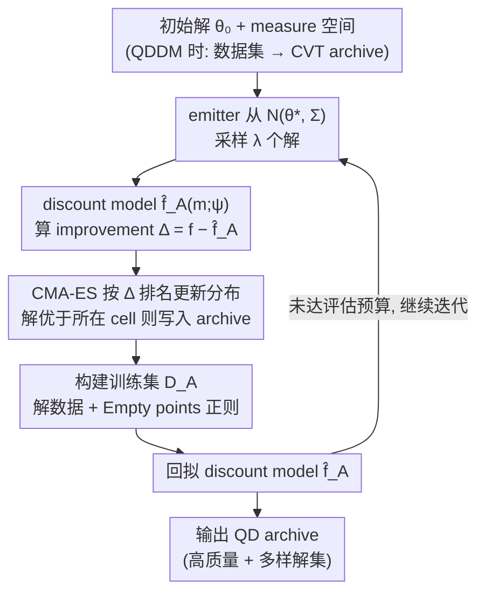

# Discount Model Search for Quality Diversity Optimization in High-Dimensional Measure Spaces

**会议**: ICLR2026 Oral  
**arXiv**: [2601.01082](https://arxiv.org/abs/2601.01082)  
**代码**: [discount-models.github.io](https://discount-models.github.io)  
**领域**: LLM评测  
**关键词**: Quality Diversity, MAP-Elites, CMA-MAE, Discount Model, High-Dimensional Measure Space  

## 一句话总结

提出 Discount Model Search (DMS)，用神经网络拟合连续平滑的 discount 函数替代 CMA-MAE 中基于直方图的离散表示，解决高维 measure space 下 distortion 导致搜索停滞的问题，并首次实现以图像数据集直接定义 measure space（QDDM 范式）。

## 背景与动机

Quality Diversity (QD) 优化旨在找到一组既高质量又多样化的解集合：每个解不仅要最大化目标函数 $f$，还要在用户定义的 measure 函数 $\bm{m}$ 输出空间中尽可能覆盖。经典应用包括机器人控制策略搜索、生成式建模和 LLM 红队测试等。

当前最先进的黑盒 QD 算法 CMA-MAE 使用直方图（histogram）将 measure space 划分为离散 cell，在每个 cell 中存储标量 discount 值来引导搜索。然而在高维 measure space 中，由于 **distortion**（大量解映射到 measure space 的狭小区域），很多解落入同一个 cell，获得相同的 discount 值，导致算法无法区分这些解的改进方向，搜索迅速停滞。

作者通过实验验证了这一现象：在 10D LP (Sphere) 基准上，CMA-MAE 每迭代采样 540 个解，但随时间推移落入不同 cell 的解数量从数百急剧下降到仅 30 个左右，表明高维 distortion 严重削弱了搜索信号。

## 核心问题

1. **高维 distortion 放大效应**：measure space 维度增高时，每个 cell 体积指数增大，更多具有相近 measure 的解被归入同一 cell，CMA-MAE 给予它们相同 discount 值，导致 CMA-ES 无法识别最大 archive improvement 方向
2. **增大 archive 分辨率不可行**：虽然更小的 cell 可缓解 distortion，但所需内存随维度指数增长
3. **缺乏高维 measure 的应用范式**：传统 QD 仅考虑 <10D 的手设 measure，难以扩展到以图像等高维数据作为 measure 的场景

## 方法详解

### 整体框架

DMS 要解决的是：在高维 measure space 里，CMA-MAE 那套"按 cell 存标量 discount 值的直方图"会因 distortion 而失灵，搜索很快停滞。它的整体思路是沿用 MAP-Elites 的 archive 和 CMA-ES emitter 这套黑盒 QD 骨架，但把直方图换成一个直接拟合连续 discount 函数的神经网络 $\hat{f}_A(\cdot;\psi)$。每轮迭代在"搜索"和"训练 discount model"两个阶段间循环：emitter 先从当前高斯分布采一批解，用 discount model 给出的 improvement 排名更新搜索方向、并把更优的解写进 archive；随后用这批新解外加一批"空 cell 样本"回拟 discount model。如此往复，即便维度很高、大量解的 measure 彼此接近，连续模型仍能给出有差别的 discount，从而始终保有可区分的搜索信号。当 measure space 由一个数据集（QDDM）定义时，archive 改用 CVT 在数据流形上划分，整套流程不变。

### 关键设计

**1. 连续 discount model 替代离散直方图**

CMA-MAE 把 measure space 切成网格，同一 cell 内的所有解共享一个标量 discount；高维下大量相近 measure 的解落进同一 cell、拿到相同 discount，CMA-ES 便无法分辨谁的 archive improvement 更大而停滞。DMS 改用神经网络 $\hat{f}_A(\bm{m};\psi)$ 直接把 measure 向量映射到 discount 值：网络输出天然连续平滑，即便两个解的 measure 非常接近也会给出略有差别的 discount，从而保留可用于排名的梯度方向——这正是 10D 以上场景里 DMS 相对直方图实现数量级提升的根因。由于模型输入就是 measure，骨干可按模态灵活替换：低维 measure 用 MLP、图像 measure 用 CNN、文本 measure 用 Transformer，这让 DMS 能直接吃高维输入而无需手工降维。

**2. improvement 排名驱动 emitter 更新**

有了连续 discount，搜索就要被拉向 archive 增益最大的方向。每个 emitter 从高斯分布 $\mathcal{N}(\bm{\theta}^*,\bm{\Sigma})$ 采样 $\lambda$ 个解，对每个解 $\bm{\theta}_i$ 计算目标值 $f(\bm{\theta}_i)$ 与 measure $\bm{m}(\bm{\theta}_i)$，再用 discount model 给出 improvement $\Delta_i = f(\bm{\theta}_i) - \hat{f}_A(\bm{m}(\bm{\theta}_i))$。$\Delta_i$ 衡量该解相对 archive 当前水位能带来多大增益，CMA-ES 据此对这批解排名并更新分布参数 $(\bm{\theta}^*,\bm{\Sigma})$，把搜索逐步推向 archive improvement 最大的方向；若某个解优于其对应 cell 中已有解，则替换之。

**3. Empty points 正则化**

神经网络在没见过的 measure 区域可能外推出虚高的 discount，使那里的 improvement 被低估、误导搜索绕开本该探索的空白区。DMS 在每轮训练集里额外加入"空 cell 数据"：从 archive 随机采样 $n_{empty}$ 个未被占据的 cell，取其中心 measure，把 target 钉在最小目标值 $f_{min}$。这相当于对未探索区域做 clamping，强制模型在这些位置输出合理的低 discount，于是新解一旦落到空白处就能拿到足够大的 improvement 而被搜索青睐，探索得以持续推进。

**4. QDDM 范式：用数据集直接定义 measure space**

连续 discount model 让 DMS 支撑起一种新用法——Quality Diversity with Datasets of Measures (QDDM)：用户不再手设低维 measure 函数，而是直接给一个数据集（如图像集）来表达期望的多样性维度。构建 archive 时以数据集样本作为质心，做 centroidal Voronoi tessellation (CVT) 划分；依据流形假设（manifold hypothesis），高维数据实际分布在低维流形上，CVT 因此只需划分用户真正关心的子空间，避免网格在高维下的指数内存。cell 间的距离函数也可灵活选择，文中用过欧氏距离与 CLIP score，后者借预训练模型的语义表征来度量图像 measure 之间的差异。

### 损失函数 / 训练策略

每轮迭代构建训练集 $\mathcal{D}_A$ 来回拟 discount model，由两类数据组成。一是**解数据**：对 emitter 本轮采样的每个解生成 $(\bm{m}(\bm{\theta}), t_A)$ 条目，其中 target $t_A$ 仿照 CMA-MAE 的阈值更新规则，由 archive learning rate $\alpha$ 控制探索/利用平衡（$\alpha=1$ 趋于纯探索、铺满 archive，$\alpha=0$ 趋于纯目标优化、只追高 $f$）——只有当解超过当前水位 $\hat{f}_A(\bm{s})$ 时才以 $\alpha$ 向 $f(\bm{\theta})$ 抬升，否则维持原值：

$$t_A = \begin{cases} \hat{f}_A(\bm{s}) & \text{if } f(\bm{\theta}) \leq \hat{f}_A(\bm{s}) \\ (1-\alpha)\hat{f}_A(\bm{s}) + \alpha f(\bm{\theta}) & \text{if } f(\bm{\theta}) > \hat{f}_A(\bm{s}) \end{cases}$$

二是**空 cell 数据**：随机采样 $n_{empty}$ 个未占据 cell 中心，target 设为 $f_{min}$，即上文 Empty points 正则化。网络以这两类 $(\text{measure}, \text{target})$ 对做回归训练，使 $\hat{f}_A$ 既在已探索区域逼近 CMA-MAE 式阈值、又在空白区域保持低值。

## 实验关键数据

### 基准测试（LP 系列，20 trials）

| 基准 | DMS QD Score | CMA-MAE QD Score | DMS Coverage | CMA-MAE Coverage |
|---|---|---|---|---|
| 2D LP (Sphere) | **6,978** | 6,328 | **95.9%** | 81.0% |
| 10D LP (Sphere) | **6,410** | 609 | **89.2%** | 7.0% |
| 20D LP (Sphere) | **7,406** | 882 | **96.0%** | 9.1% |
| 50D LP (Sphere) | **6,991** | 2,327 | **87.0%** | 24.2% |
| 10D LP (Rastrigin) | **5,139** | 247 | **88.2%** | 3.0% |

高维场景下 DMS 优势极为显著：10D LP (Sphere) 上 QD Score 是 CMA-MAE 的 **10.5 倍**，Coverage 从 7% 提升到 89%。

### QDDM 域（5 trials）

| 域 | DMS QD Score | CMA-MAE QD Score | DMS Coverage | CMA-MAE Coverage |
|---|---|---|---|---|
| TA (MNIST) | 951.56 | **954.27** | **99.84%** | 99.48% |
| TA (F-MNIST) | **701.14** | 625.65 | **72.28%** | 63.92% |
| LSI (Hiker) | **214.91** | 14.61 | **3.77%** | 1.56% |

- TA (MNIST) 的高 coverage 说明不是所有 QDDM 域都有强 distortion
- LSI (Hiker) 中 DMS 显著优于 CMA-MAE（QD Score 215 vs 15），但绝对 coverage 仍较低（3.77%），体现复杂 QDDM 域的挑战
- DMS 甚至在 diversity-only 的 LP (Flat) 域上超越了专为 diversity 设计的 DDS

### 计算开销

DMS 因训练 discount model 比 CMA-MAE 慢 2-3 倍（LP 基准），但在 QDDM 域中因解的评估（如 StyleGAN3 渲染）成为瓶颈，算法本身的开销差异不显著。

## 亮点

1. **核心 insight 清晰有力**：用连续模型替代离散直方图的想法简洁且效果显著，10D 以上维度实现数量级提升
2. **QDDM 范式创新**：首次提出用图像数据集直接定义 measure space，降低 QD 使用门槛——用户无需手设 measure 函数，只需提供期望的数据集
3. **LSI (Hiker) 演示效果出色**：生成的登山者图像确实按地形匹配了穿着风格（雪山穿厚外套、海滩穿轻装），直观展示了方法价值
4. **实验全面**：涵盖 9 个基准 + 3 个 QDDM 域，20/5 trials 统计检验严格（Welch ANOVA + Games-Howell）
5. **消融实验完整**：验证了 $\alpha$ 和 $n_{empty}$ 的关键作用

## 局限与展望

1. **Discount 模型噪声**：在需要精细目标优化的域（如 TA (MNIST)）中，模型误差作为噪声干扰 improvement 排名，DMS 无法超越 CMA-MAE 的精确直方图
2. **LSI (Hiker) coverage 极低**：仅 3.77%，说明在极高维复杂 QDDM 域中探索仍远未充分
3. **计算成本**：LP 基准上比 CMA-MAE 慢约 2-3 倍，大规模应用时训练 discount model 的开销不可忽视
4. **CVT archive 的距离函数选择**：当前仅探索了 Euclidean 和 CLIP score，更好的距离度量可能进一步提升性能
5. **DDS 无法在 QDDM 域运行**：KDE 运行时间随维度线性增长，限制了对比完整性
6. **缺乏非图像 QDDM 实验**：文中虽提到音频/文本，但未实际验证

## 与相关工作的对比

| 方法 | 核心机制 | 高维支持 | 优化目标 |
|---|---|---|---|
| MAP-Elites | 随机突变 + 网格 archive | 差（指数内存） | QD |
| CMA-MAE | CMA-ES + 直方图 discount | 差（同 cell 停滞） | QD |
| DDS | KDE 密度估计 | 中（KDE 慢） | 仅 diversity |
| **DMS** | CMA-ES + 神经网络 discount model | **强** | QD |

DMS 继承了 CMA-MAE 的 archive improvement 框架，但将离散直方图替换为连续模型，同时借鉴了 DDS 中平滑信号有利于探索的思想。与 DDS 不同，DMS 同时考虑目标值和多样性。

## 启发与关联

- **"用数据集替代手设函数" 的思路**具有广泛迁移价值：在机器人策略搜索中，可以用目标行为演示代替手设 behavior descriptor；在 LLM 红队测试中，可以用攻击样本集定义多样性方向
- **连续模型替代离散计数器**的思路可类比于经典的 count-based exploration → neural density estimation 的演进（如 RL 中的 RND、ICM）
- QDDM 中 CLIP score 作为距离函数的做法，提示在其他高维空间中也可利用预训练模型的语义表征来定义 measure space 结构

## 评分
- 新颖性: ⭐⭐⭐⭐ (连续 discount model + QDDM 范式均为原创贡献)
- 实验充分度: ⭐⭐⭐⭐⭐ (12 个域、严格统计检验、全面消融)
- 写作质量: ⭐⭐⭐⭐ (动机阐述清晰，Figure 1 对比直观)
- 价值: ⭐⭐⭐⭐ (高维 QD 和 QDDM 范式有实际应用潜力)

<!-- RELATED:START -->

## 相关论文

- [\[ICLR 2026\] Soft Quality-Diversity Optimization](soft_quality-diversity_optimization.md)
- [\[ICML 2025\] Diversity By Design: Leveraging Distribution Matching for Offline Model-Based Optimization](../../ICML2025/others/diversity_by_design_leveraging_distribution_matching_for_offline_model-based_opt.md)
- [\[CVPR 2026\] Revisiting F-measure Optimization in Multi-Label Classification: A Sampling-based Approach](../../CVPR2026/others/revisiting_f-measure_optimization_in_multi-label_classification_a_sampling-based.md)
- [\[AAAI 2026\] Theoretical and Empirical Analysis of Lehmer Codes to Search Permutation Spaces with Evolutionary Algorithms](../../AAAI2026/others/theoretical_and_empirical_analysis_of_lehmer_codes_to_search_permutation_spaces_.md)
- [\[ICLR 2026\] DA-AC: Distributions as Actions — A Unified RL Framework for Diverse Action Spaces](distributions_as_actions_a_unified_framework_for_diverse_action_spaces.md)

<!-- RELATED:END -->
