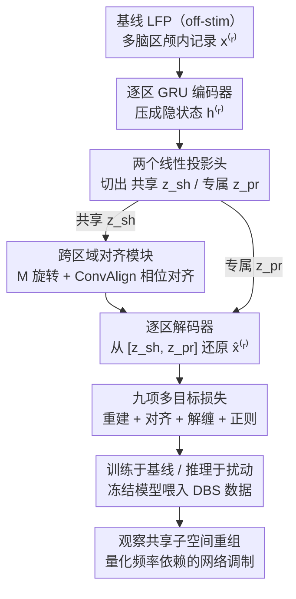

# Disentangling Shared and Private Neural Dynamics with SPIRE: A Latent Modeling Framework for Deep Brain Stimulation

**会议**: ICLR2026  
**arXiv**: [2510.25023](https://arxiv.org/abs/2510.25023)  
**代码**: [GitHub](https://github.com/Rahil-Soroush/spire-iclr2026)  
**领域**: LLM评测  
**关键词**: latent variable model, shared-private disentanglement, deep brain stimulation, multi-region neural dynamics, autoencoder

## 一句话总结

提出 SPIRE（Shared–Private Inter-Regional Encoder），一种非线性双潜空间自编码器框架，通过跨区域对齐与正交解缠损失将多脑区颅内记录分解为共享与专属子空间，仅在基线数据训练即可检测 DBS 刺激引发的频率依赖性网络重组。

## 研究背景与动机

**领域现状**：运动障碍（肌张力障碍、帕金森病等）涉及基底神经节-丘脑-皮层回路的功能失调。深脑刺激（DBS）靶向苍白球内侧部（GPi）和丘脑底核（STN）在临床上疗效显著，但其调制跨区域神经动态的网络级机制仍不清楚。

**现有痛点**：大多数 DBS 分析聚焦于局部特征（频谱功率、诱发电位），忽视了跨区域协调模式的变化。现有潜变量模型存在关键限制：(1) GPFA 和 CCA 假设线性关系，无法捕捉真实神经数据的非线性结构；(2) DLAG 虽能分解 shared/private 成分，但受限于线性高斯框架且主要针对 spike 数据；(3) SharedAE、MMVAE 等多模态模型对齐共享空间，但并非为颅内刺激记录设计，缺少显式的 shared-private 解缠机制。

**核心矛盾**：缺少一个同时满足三个条件的框架——非线性建模能力、显式的 shared vs. private 分解、以及适用于人类 LFP 数据在外部扰动下的分析。理解刺激如何重组固有的跨区域协调模式，对于揭示 DBS 的回路级作用机制至关重要。

**切入角度**：设计一个"训练于基线、推理于扰动"的双潜空间框架——在无刺激数据上建立内在协调的参考模型，然后在 DBS 条件下观察共享潜空间的重组模式，借此揭示刺激对网络级动态的影响。

## 方法详解

### 整体框架

SPIRE 想回答的问题是：深部脑刺激（DBS）究竟如何重组多个脑区之间的协调模式？它的策略是先在无刺激的基线记录上学出一套"脑区间内在协调"的参考模型，再把刺激数据喂进这套冻结的模型，看共享动态相对基线被改写了多少。

具体地，SPIRE 为每个脑区 $r$ 配一套独立的 GRU 编码器-解码器：编码器把多通道输入 $x^{(r)} \in \mathbb{R}^{B \times T \times C_r}$ 压成隐状态 $h^{(r)}$，再经两个线性投影头切出承载跨区域协调信息的共享潜变量 $z_{\text{sh}}^{(r)} \in \mathbb{R}^{B \times T \times d_{\text{sh}}}$ 与只属于本区域的专属潜变量 $z_{\text{pr}}^{(r)} \in \mathbb{R}^{B \times T \times d_{\text{pr}}}$；共享潜变量先过一个跨区域对齐模块把两区对到同一坐标系，解码器再从拼接的 $[z_{\text{sh}}^{(r)}, z_{\text{pr}}^{(r)}]$ 还原信号 $\hat{x}^{(r)} = f_{\text{dec}}^{(r)}([z_{\text{sh}}^{(r)}, z_{\text{pr}}^{(r)}])$。整个训练过程由一组九项多目标损失监督，且**只在无刺激的基线数据上训练**；训练完成后才把 DBS 刺激数据输入冻结模型，量化共享子空间被如何重组。

### 关键设计

**1. 跨区域对齐模块：让两个脑区的共享子空间真正对得上**

不同脑区的信号在采集时存在毫秒级传导延迟和非线性的子空间旋转，如果只用一个静态矩阵去对齐两区的共享潜变量，时间偏移就被硬生生抹掉了。SPIRE 因此把对齐拆成两步：先用一个轻量线性映射 $M^{(s \to r)} \in \mathbb{R}^{d_{\text{sh}} \times d_{\text{sh}}}$（初始化为单位矩阵）做子空间旋转，再用一个深度一维卷积 ConvAlign（奇数核 $2K{+}1$、初始化为脉冲响应、每个共享维度各维护一个滤波器）容许小幅相位偏移来吸收传导延迟，对齐后的共享潜变量为 $\tilde z_{\text{sh}}^{(s \to r)} = M^{(s \to r)}\,\mathrm{ConvAlign}(z_{\text{sh}}^{(s)})$。关键是这两个映射都带方向性——$s \to r$ 与 $r \to s$ 各自独立学习、不假设对称，正好对应脑区间信号传导本身就是有方向的，从而在保留各区视角差异的前提下把共享流形真正对齐。

**2. 九项多目标损失：在"信息充分"与"严格解缠"之间拉平衡**

共享/专属分解最容易塌成两类退化解——要么共享潜变量坍缩成常量、要么专属潜变量抢走全部方差，所以单一重建损失远远不够。SPIRE 把训练目标拆成四组协同约束：重建组用 $\mathcal{L}_{\text{rec}}$（共享+专属自重建）、$\mathcal{L}_{\text{cross}}$（借另一区共享重建）和 $\mathcal{L}_{\text{self}}$（仅用自身共享重建）逼共享潜变量承载有意义的方差；对齐组的 $\mathcal{L}_{\text{align}}$ 用 VICReg 的方差-不变性-协方差三项正则对齐跨区共享潜变量，强制子空间重叠却不抹平区域差异；解缠组用 $\mathcal{L}_{\text{orth}}$ 惩罚共享与专属潜变量的交叉协方差（Frobenius 范数），再加方差守卫 $\mathcal{L}_{\text{var-sh}}, \mathcal{L}_{\text{var-pr}}$ 把共享标准差推向 1、给专属设方差下限以防任一侧坍缩；最后正则组用 $\mathcal{L}_{\text{mapid}}$ 把线性映射拉回单位矩阵附近、用 $\mathcal{L}_{\text{align-reg}}$ 把 ConvAlign 滤波器拉回脉冲响应附近，保证对齐模块学到的旋转和延迟都在可解释范围内。四组目标合力，才使共享子空间既装得下跨区信息又与专属信息正交。

**3. "训练于基线、推理于扰动"范式：把基线模型当成度量重组的标尺**

DBS 刺激会引入强烈伪影，若把刺激数据直接拿来训练，伪影会污染模型参数，模型就分不清学到的是神经动态还是刺激噪声。SPIRE 反其道而行：只在无刺激（off-stimulation）基线上训练，先建立一套"内在跨区域协调"的参考框架；推理时才把 DBS 刺激条件数据输入这套冻结的模型，观察共享潜空间相对基线被重组了多少、专属潜空间又如何反映局部效应。这样既彻底隔开了刺激伪影对参数的污染，又天然给出一把"重组程度"的标尺——一切偏离基线参考的变化都可量化归因于刺激。

## 实验关键数据

### 合成数据验证

三个合成数据集从线性到非线性逐步递增复杂度，每个含 100 trials × 250 时间步（0.5s@500Hz），3 shared + 3 private 维度：

| 数据集 | 混合方式 | 噪声 | SPIRE CCA (shared) | DLAG CCA (shared) |
|--------|----------|------|-------------------|-------------------|
| D0 | 线性 + 高斯噪声 | 高斯 | 与 DLAG 相当 | 线性友好基准 |
| D1 | 非线性扭曲 + 双线性混合 | 1/f + AR(1) | (0.92, 0.91, 0.71) | (0.86, 0.79, 0.60) |
| D2 | D1 + 时变正弦延迟 | 同 D1 | 优于 DLAG | 进一步退化 |

SPIRE 在恢复 private 潜变量方面统计显著优于 DLAG（$p < 0.05$）。在非线性（D1）和时变延迟（D2）条件下，SPIRE 对 shared 潜变量恢复也优于 DLAG。D0 是线性场景，对 DLAG 友好，SPIRE 并无劣势但优势也不显著。

### 人类 DBS 记录数据

- 10 名肌张力障碍儿科患者（5-23岁）的颅内 LFP，电极覆盖 GPi 和 STN，共 17 个半球
- 刺激条件：GPi 85/185/250 Hz、STN 85/185 Hz 及 off-stimulation
- 预处理：双极参考、降采样至 500 Hz、50 Hz 低通 Butterworth 滤波去除高频刺激伪影
- 0.5s 非重叠窗口分段，0-3 阶时间延迟特征增强

### 解缠与重建验证

| 指标 | GPi | STN |
|------|-----|-----|
| Shared GPi/STN CCA 中位数 | ≈1.0 | ≈1.0 |
| Shared-Private CCA 中位数 | 0.55–0.65 | 0.55–0.65 |
| Full (shared+private) 重建 MSE | 0.00211 | 0.000983 |
| 仅 private 重建 MSE | 0.544 | 0.391 |
| 仅 shared（同区域）重建 MSE | 0.0462 | 0.0178 |

解读：shared 子空间跨区域高度一致（CCA≈1.0），而 shared-private 间仅弱相关（0.55-0.65），表明有效解缠。重建分析显示大部分可恢复的神经动态位于 shared 流形中——仅用 private 重建误差增大两个数量级，而仅用 shared 就能获得接近完整重建的效果。

### 刺激频率解码

随机森林从各类潜变量解码刺激频率（GPi 4类 / STN 3类），shared 潜变量在两个解码任务中均显著优于 private 潜变量（$p < 0.001$），且 GPi-shared 与 STN-shared 无显著差异——说明 shared 空间编码了跨区域泛化的刺激特征签名，刺激以频率依赖的方式系统性重组跨区域协调模式。

### 与基线方法对比

| 方法 | 非线性 | Shared/Private 分解 | 适用 LFP | DBS 场景 | 重建 MSE |
|------|--------|---------------------|----------|----------|----------|
| GPFA / CCA | ✗ | ✗ | ✓ | ✗ | — |
| DLAG | ✗ | ✓ | ✗（spike） | ✗（无法收敛） | 数值不稳定 |
| SharedAE | ✓ | 部分（无时间分辨率） | ✗ | ✗ | 高于 SPIRE |
| MMVAE | ✓ | ✗（无显式解缠） | ✗ | ✗ | 高于 SPIRE |
| **SPIRE** | **✓** | **✓** | **✓** | **✓** | **最低** |

DLAG 在真实颅内数据上高斯过程优化数值不稳定无法收敛。SPIRE 在 GPi 和 STN 的重建误差上均显著低于 SharedAE 和 MMVAE。

## 亮点与洞察

- **首个非线性 shared-private 分解框架**用于人类多区域颅内记录，填补了线性模型与真实非线性 LFP 数据间的方法论空白
- **训练范式设计巧妙**：仅在基线数据上训练避免刺激伪影污染模型参数，同时建立了度量刺激引起重组程度的参考锚点。这一"训练于控制、推理于处理"的范式具有广泛迁移价值
- **9 项损失函数各有物理含义**：VICReg 对齐 + 正交解缠 + ConvAlign 时间对齐的组合经过精心设计，方差守卫防止退化解，对齐模块正则确保可解释性
- 首次在儿科 DBS 数据上展示共享潜变量编码频率依赖的网络重组，为 DBS 的分布式网络调制理论提供了定量证据
- shared-private 解缠思想可迁移到多模态 AI 模型中，如视觉-语言模型中分解模态共享与模态专属表示

## 局限与展望

- 仅限较短时间尺度刺激，未验证长期慢性刺激效果及可塑性变化
- 仅使用 LFP 信号，未整合 spike 数据或行为学模态，多模态融合是自然扩展方向
- 缺少概率性目标函数（如 VAE 的 ELBO），无法量化潜变量的不确定性
- 目前仅验证双区域（GPi-STN），尚未扩展到皮层、丘脑等更多区域的多区域场景
- 共享潜变量维度是统计抽象，赋予精确生物物理含义需要互补实验和多模态验证
- 样本量较小（10 名患者，17 个半球），跨病因和年龄段的泛化性有待更大规模数据验证

## 评分

- 新颖性: ⭐⭐⭐⭐ — 首个将非线性 shared-private 分解应用于人类颅内 DBS 记录，"训练于基线推理于扰动"范式有新意
- 实验充分度: ⭐⭐⭐⭐ — 合成基准+真实临床数据+多基线对比+解缠验证+解码分析，但样本量偏小
- 写作质量: ⭐⭐⭐⭐ — 结构清晰，损失函数定义完整，图表丰富直观
- 价值: ⭐⭐⭐⭐ — 对计算神经科学和 DBS 机制理解有实质贡献，方法可迁移到其他多视角动态系统

<!-- RELATED:START -->

## 相关论文

- [\[CVPR 2026\] Neural Differentiation in Deep Networks: A Theoretical Framework for Expressivity and Representational Diversity](../../CVPR2026/others/neural_differentiation_in_deep_networks_a_theoretical_framework_for_expressivity.md)
- [\[AAAI 2026\] TDSNNs: Competitive Topographic Deep Spiking Neural Networks for Visual Cortex Modeling](../../AAAI2026/others/tdsnns_competitive_topographic_deep_spiking_neural_networks_for_visual_cortex_mo.md)
- [\[ICLR 2026\] LPWM: Latent Particle World Models for Object-Centric Stochastic Dynamics](latent_particle_world_models_self-supervised_object-centric_stochastic_dynamics_.md)
- [\[ICLR 2026\] Biologically Plausible Online Hebbian Meta-Learning: Two-Timescale Local Rules for Spiking Neural Brain Interfaces](biologically_plausible_online_hebbian_meta-learning_two-timescale_local_rules_fo.md)
- [\[CVPR 2026\] Negative Binomial Variational Autoencoders for Overdispersed Latent Modeling](../../CVPR2026/others/negative_binomial_variational_autoencoders_for_overdispersed_latent_modeling.md)

<!-- RELATED:END -->
