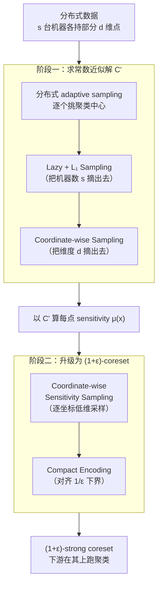

# Distributed Algorithms for Euclidean Clustering

**会议**: ICLR2026  
**arXiv**: [2603.08615](https://arxiv.org/abs/2603.08615)  
**代码**: 无（理论工作）  
**领域**: 其他  
**关键词**: distributed clustering, coreset, communication complexity, k-means, k-median

## 一句话总结

在分布式环境下为 Euclidean $(k,z)$-clustering 构造 $(1+\varepsilon)$-coreset，在 coordinator 模型和 blackboard 模型中均达到通信复杂度的最优下界（至多差 polylog 因子）。

## 背景与动机

- **Euclidean $(k,z)$-clustering** 是经典的聚类问题：给定 $n$ 个 $d$ 维点，找 $k$ 个中心使得所有点到最近中心的 $z$ 次方距离之和最小。$z=1$ 对应 $k$-median，$z=2$ 对应 $k$-means。
- 现代数据集规模巨大，数据天然分布在多台机器上，无法集中处理。**分布式聚类**成为核心需求：$n$ 个点分布在 $s$ 台机器上，各机器通过交换简短摘要（coreset）来协作完成聚类，同时最小化通信量。
- 已有的分布式方法（如 merge-and-reduce）通信量中 $s$、$d$、$1/\varepsilon$ 等因子互相耦合（如 $\tilde{O}(skd/\varepsilon^4 \cdot \log(n\Delta))$），远未达到已知的通信下界。
- **核心动机**：能否设计通信最优的协议，使得 $s$（机器数）、$d$（维度）、$1/\varepsilon$（精度）之间解耦，达到理论下界？

## 核心问题

在两种经典分布式通信模型中，为 $(k,z)$-clustering 构造 $(1+\varepsilon)$-strong coreset，同时达到通信复杂度最优：

1. **Coordinator 模型**：$s$ 台机器只能通过一个 coordinator 中继通信，使用私有信道和私有随机性。
2. **Blackboard 模型**：$s$ 台机器通过共享黑板通信，任何机器写入的消息对所有机器可见。

## 方法详解

### 整体框架

协议遵循"先粗后精"的两步范式：先用极低的通信量在分布式数据上求出一个常数近似解 $C'$，再以它为基准算出每个点的 sensitivity $\mu(x)$ 并做重要性采样，把摘要升级成 $(1+\varepsilon)$-strong coreset，最后在 coreset 上跑任意中心化聚类算法即可。算法骨架本身并不新，真正的难点在于让每一步的通信比特数与三个量彻底解耦——机器数 $s$、维度 $d$、精度 $1/\varepsilon$，否则它们会像已有方法那样相乘成 $\tilde O(skd/\varepsilon^4)$ 这样的大项。本文的四个核心技术正好对应这三个解耦目标：阶段一用 Lazy + $L_1$ Sampling 把 $s$ 摘出去、用逐坐标采样把 $d$ 摘出去求常数近似；阶段二再用逐坐标 sensitivity 采样和紧凑编码把 $d$、$1/\varepsilon$ 控制住完成升级。最终在 Coordinator 模型达到 $\tilde{O}(sk + dk/\min(\varepsilon^4, \varepsilon^{2+z}) + dk\log(n\Delta))$、在 Blackboard 模型达到 $\tilde{O}(s\log(n\Delta) + dk\log(n\Delta) + dk/\min(\varepsilon^4, \varepsilon^{2+z}))$，二者均匹配已知下界（至多差 polylog 因子）。

### 关键设计

**1. Lazy + $L_1$ Sampling：把"机器数 $s$"从每轮通信里摘出去**

阶段一在 Blackboard 模型求常数近似，最自然的做法是分布式 $k$-means++ 式的 adaptive sampling，但它每采一个中心就要全部 $s$ 台机器上报各自的距离和 $D_i$，单轮 $O(sk\log n)$ 比特，$s$ 与 $k$ 直接相乘，代价过高。本文用两层"用采样代替广播"的技巧把 $s$ 摘出来。第一层 Lazy Sampling：黑板上只维护各机器距离和的过时近似 $\widehat{D_i}$，按 $\widehat{D_i}$ 的比例挑机器采样——只要 $\widehat{D_i}$ 仍是 $D_i$ 的常数近似，单次采样失败概率就是常数，总轮次维持 $O(k)$；某次失败恰好说明该机器的 $D_i$ 已大幅下降，此时机器 $i$ 才更新黑板上的值，而距离和单调递减，每台机器最多更新 $O(\log n)$ 次、每次仅传 $O(\log\log n)$ 比特（一个指数）。第二层 $L_1$ Sampling 解决"何时该触发全局更新"本身也会引发全员通信的问题：随机选一台机器 $i$（概率正比于 $\widehat{D_i}$），用无偏估计 $D_i/p_i$ 判断全局总权重 $\sum_i D_i$ 是否下降超过阈值 $1/64$；再配合指数增长的批采样（总权重未明显下降时一次性采 $2^i$ 个样本，$i$ 逐轮递增），把通信轮次从 $O(k)$ 压到 $O(\log n \log k)$。两者合起来，让 $s$ 项只以 $\log(n\Delta)$ 的代价出现在最终上界里——容忍过时信息、仅在偏差超阈值时纠正，是把全局开销摊薄的核心。

**2. Coordinate-wise Sampling：逐坐标二分定位，把维度 $d$ 从常数近似的传输里摘出去**

求常数近似时朴素做法要把采到的高维中心点完整传一遍，通信量直接正比于 $d$，于是 $s$ 又会乘上 $d$。本文不传完整坐标：在 coordinator 与持有该点的机器之间，对排序后的坐标序列做分布式二分搜索，最终只传一个小偏移量来定位目标点。这样每次采样的通信代价与维度 $d$ 解耦，是 Coordinator 模型里去掉 $s\cdot d$ 乘积项的关键一步。一个值得注意的副产物是：整个协议不需要任何机器把完整点坐标广播给所有人。

**3. Coordinate-wise Sensitivity Sampling：把高维 coreset 采样拆成逐坐标的低维问题**

进入阶段二，用常数近似解 $C'$ 算出每点 sensitivity $\mu(x)$ 后，需要按 sensitivity 分布采 $\tilde{O}(k/\min(\varepsilon^4, \varepsilon^{2+z}))$ 个点；若仍按整点传输，维度 $d$ 又会回到通信量里。本文把每个点按坐标分解，依据各维度的重要性逐维采样：coordinator 先发一份紧凑摘要，各机器只在确有需要时才请求额外信息，于是高维采样被拆成一组低维问题。代价是重构出的样本可能不对应数据集中任何真实点，但论文证明由此引入的聚类代价失真可控，coreset 的近似保证不受影响。

**4. Compact Encoding：把每个采样点压到对数比特，对齐 $1/\varepsilon$ 下界**

最后一步是采样点的表示方式。每个点编码为 $(c'(x), y)$：$c'(x)$ 是它最近中心的索引，$y$ 则把残差向量逐坐标取对数后只保留指数。这样每个采样点仅需 $O(\log k + d\log(1/\varepsilon,\, d,\, \log(n\Delta)))$ 比特即可表示，使得 coreset 总通信量里关于 $1/\varepsilon$ 的项不再额外乘上 $\log(n\Delta)$，恰好对齐通信下界——这是把精度项 $1/\varepsilon$ 单独控制住、不与数据规模 $\log(n\Delta)$ 耦合的最后一块拼图。

## 实验关键数据

本文为纯理论工作，无实验部分。主要贡献是通信复杂度的理论上界证明及与已知下界的匹配。

| 模型 | 已有最优 | 本文结果 | 改进 |
|------|----------|----------|------|
| Coordinator | $O(skd/\varepsilon^4 \cdot \log(n\Delta))$ | $\tilde{O}(sk + dk/\varepsilon^4 + dk\log(n\Delta))$ | $s,d,1/\varepsilon$ 解耦，去掉乘法关系 |
| Blackboard | $\tilde{O}((s+dk)\log^2(n\Delta))$（仅常数近似） | $\tilde{O}(s\log(n\Delta) + dk\log(n\Delta) + dk/\varepsilon^4)$ | 从常数近似升级到 $(1+\varepsilon)$ 且去掉多余 $\log$ 因子 |

## 亮点

- **通信量达到最优下界**：在两种分布式模型中均匹配 [Chen et al., NeurIPS 2016] 和 [Huang et al., STOC 2024] 的下界，是理论意义上的完全解决。
- **参数解耦**：Coordinator 模型中 $s$（机器数）不再乘以 $d$（维度）和 $1/\varepsilon$（精度），Blackboard 模型中 $1/\varepsilon$ 不乘以 $\log(n\Delta)$。
- **无需"明文"传输坐标**：coordinator 模型中不需要任何站点广播完整的点坐标给所有机器，这是一个意外且重要的结果。
- **Lazy Sampling + $L_1$ Sampling**：分布式 adaptive sampling 的优雅变体，避免每轮全局通信。
- **Coordinate-wise Sensitivity Sampling** 是新技术，可能对分布式回归和低秩近似等问题也有价值。
- 结果可推广到任意连通通信拓扑，不限于 coordinator 或 blackboard。

## 局限与展望

- **纯理论工作**：没有实验验证实际通信量和运行时间的改善，尤其是 polylog 因子在实际中可能不小。
- **通信轮次**：Blackboard 模型中虽然通信比特数最优，但轮次为 $O(\log n \log k)$，在延迟敏感的场景中可能不理想。
- **$\varepsilon$ 为常数时退化**：当 $\varepsilon$ 为常数时，$1/\varepsilon^4$ 项退化为常数，此时通信量主导项变为 $dk\log(n\Delta)$（传输中心坐标本身），无法进一步优化。
- **假设有限精度网格**：输入点需在 $\{1,\ldots,\Delta\}^d$ 网格上，实际连续数据需要额外的离散化步骤。
- **仅针对欧氏空间**：非欧氏度量或非聚类代价函数不在本文讨论范围内。

## 与相关工作的对比

| 工作 | 近似比 | 通信量 | 备注 |
|------|--------|--------|------|
| Merge-and-reduce + [BCP+24] | $(1+\varepsilon)$ | $\tilde{O}(skd/\varepsilon^4 \cdot \log(n\Delta))$ | 参数耦合 |
| [BEL13] + [BCP+24] | $(1+\varepsilon)$ | $O(dk/\varepsilon^4 \cdot \log(n\Delta) + sdk\log(sk)\log(n\Delta))$ | $s$ 仍乘以 $dk$ |
| [CSWZ16] (Blackboard) | $O(1)$ | $\tilde{O}((s+dk)\log^2(n\Delta))$ | 仅常数近似 |
| **本文 (Coordinator)** | $(1+\varepsilon)$ | $\tilde{O}(sk + dk/\varepsilon^4 + dk\log(n\Delta))$ | **最优** |
| **本文 (Blackboard)** | $(1+\varepsilon)$ | $\tilde{O}(s\log(n\Delta) + dk\log(n\Delta) + dk/\varepsilon^4)$ | **最优** |

## 启发与关联

- **分布式算法 + Coreset** 的组合范式：先用低通信量获得常数近似，再通过 sensitivity sampling 升级精度。这个两步框架对其他分布式优化问题（如低秩近似、回归）可能有迁移价值。
- **Lazy Sampling** 的思想（容忍过时信息、仅在偏差超阈值时更新）类似于分布式系统中的 eventual consistency，可应用于分布式 SGD 中的梯度压缩。
- **Coordinate-wise Sampling** 将高维通信问题拆解为逐坐标的低维问题，类似于 quantization 和 sparsification 在联邦学习中的应用。
- 论文作者明确指出这些技术与 LLM 训练中的数据量化和通信压缩有天然联系。

## 评分
- 新颖性: ⭐⭐⭐⭐⭐ (解决了分布式聚类通信最优性的开放问题)
- 实验充分度: ⭐⭐ (纯理论无实验)
- 写作质量: ⭐⭐⭐⭐ (结构清晰，技术概览部分讲解透彻)
- 价值: ⭐⭐⭐⭐ (理论上完全解决问题，技术手段有迁移潜力)

<!-- RELATED:START -->

## 相关论文

- [\[ICLR 2026\] Non-Clashing Teaching in Graphs: Algorithms, Complexity, and Bounds](non-clashing_teaching_in_graphs_algorithms_complexity_and_bounds.md)
- [\[AAAI 2026\] Improved Differentially Private Algorithms for Rank Aggregation](../../AAAI2026/others/improved_differentially_private_algorithms_for_rank_aggregation.md)
- [\[NeurIPS 2025\] Coresets for Clustering Under Stochastic Noise](../../NeurIPS2025/others/coresets_for_clustering_under_stochastic_noise.md)
- [\[CVPR 2026\] Reliable Clustering Number Estimation for Contrastive Multi-View Clustering](../../CVPR2026/others/reliable_clustering_number_estimation_for_contrastive_multi-view_clustering.md)
- [\[NeurIPS 2025\] Johnson-Lindenstrauss Lemma Beyond Euclidean Geometry](../../NeurIPS2025/others/johnson-lindenstrauss_lemma_beyond_euclidean_geometry.md)

<!-- RELATED:END -->
