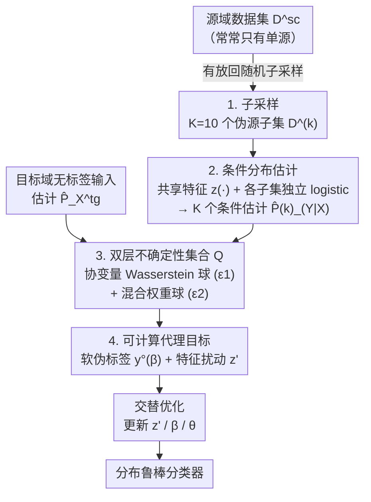

# Distributionally Robust Classification for Multi-Source Unsupervised Domain Adaptation

**会议**: ICLR 2026  
**arXiv**: [2601.21315](https://arxiv.org/abs/2601.21315)  
**代码**: 无  
**领域**: 其他  
**关键词**: 分布鲁棒优化, 无监督域适应, 多源域适应, Wasserstein距离, 伪标签

## 一句话总结

提出一种分布鲁棒学习框架，通过联合建模目标域协变量分布和条件标签分布的不确定性，在目标数据极度稀缺或源域存在虚假相关性的UDA场景中显著提升泛化性能。

## 研究背景与动机

无监督域适应（UDA）假设训练（源域）和测试（目标域）数据分布不同，仅有源域标签和目标域无标签数据。现有方法主要分两类：

**分布对齐方法**（DANN、CDAN、MK-MMD）：通过对齐源/目标域分布来减小域差异，但在虚假相关性存在时容易对齐无关特征（如背景、颜色）

**伪标签方法**（STAR、ATDOC）：利用源域训练模型生成目标域伪标签，但标签质量依赖初始模型

这两类方法在以下两个实际场景中表现不佳：
- **目标数据稀缺**：对齐估计不可靠，伪标签噪声大
- **虚假相关性**：模型依赖非因果特征（如背景、性别、颜色），这些特征不迁移到目标域

现有DRO方法（如GroupDRO）通常需要组标签，且不利用无标签目标数据。本文希望设计一种同时处理协变量移位和条件分布移位的鲁棒框架。

## 方法详解

### 整体框架

这篇论文要解决的是无监督域适应（UDA）里两个最棘手的场景：**目标域几乎没有数据**、**源域里藏着虚假相关性**。它不去强行对齐源/目标分布，而是承认"我对目标域分布的估计本来就不准"，转而构造一个把这种不确定性显式包进去的**不确定性集合（ambiguity set）**，再训练一个对集合里最坏情况都成立的分类器。

整条流水线这样转：先把（可能只有一个的）源域子采样成 $K$ 个伪源子集；在每个子集上估出一个条件分布 $\hat{P}_{Y|X}^{(k)}$；把这些条件估计的混合（管标签漂移）和目标输入分布的一个 Wasserstein 球（管协变量漂移）拼成一个双层不确定性集合 $\mathcal{Q}$；由于直接对 $\mathcal{Q}$ 做 min-max 不可解，再推出一个可计算的代理目标，把它落成"软伪标签 + 特征扰动"上的对抗损失；最后交替更新对抗特征、混合权重和模型参数，得到鲁棒分类器。

### 关键设计

**1. 子采样：把单源问题伪装成多源**

整个框架建立在"多源"假设上，但现实里很多 UDA 任务只有一个源域。作者的处理是对单源数据集 $\mathbf{D}^{\text{sc}}$ 做有放回随机子采样，生成 $K=10$ 个子集 $\mathbf{D}^{(k)}$，每个子集大小为 $N^{\text{sc}}/5$。这样做并非凑数：当源分布本身是若干异质子群体的混合时，重复子采样会让某些子样本恰好近似落在单一子群体上，于是后续对混合权重的对抗优化就能覆盖"不同子群体占比"的各种情形，对混合比例的漂移天然鲁棒。这一思路直接借自回归里的 maximin effect（Meinshausen & Bühlmann, 2015），本文把它搬到了分类。

**2. 条件分布估计：共享特征 + 各子集独立 logistic 回归**

要算出后面不确定性集合里要用的 $\hat{P}_{Y|X}^{(k)}$，作者先在全部源数据上训练一个分类模型，去掉最后分类层得到特征映射 $z:\mathcal{X}\to\mathcal{Z}$；然后在每个子集上独立训练一个线性 logistic 回归，把 softmax 输出当作该子集的条件概率估计。共享特征保证不同子集的估计可比，独立回归头则让每个 $\hat{P}_{Y|X}^{(k)}$ 反映各自子群体的偏置。这个特征提取器并不限定自家训练——可以直接换成 CDAN、STAR 等现成 UDA 方法的 backbone，于是整套框架就成了挂在已有方法之后的鲁棒化模块。

**3. 双层不确定性集合：协变量与条件分布各给一个球**

方法的核心是用上一步估出的 $K$ 个条件分布，构造一个同时容纳两类漂移的不确定性集合 $\mathcal{Q}$。给定容许参数 $\epsilon_1, \epsilon_2 \geq 0$ 和参考向量 $\bar{\beta} \in \Delta_{K-1}$：

$$\mathcal{Q} = \left\{ Q = (Q_X, Q_{Y|X}) \mid Q_{Y|X} = \sum_{k=1}^K \beta_k \hat{P}_{Y|X}^{(k)}, \ D_1(Q_X, \hat{P}_X^{\text{tg}}) \leq \epsilon_1, \ D_2(\beta, \bar{\beta}) \leq \epsilon_2 \right\}$$

第一层管输入分布：用 Wasserstein 距离 $D_1$ 把候选协变量分布 $Q_X$ 约束在目标域估计 $\hat{P}_X^{\text{tg}}$ 的 $\epsilon_1$-球内，半径 $\epsilon_1$ 在目标数据稀缺、协变量估计不可靠时尤其关键。第二层管条件分布：把目标条件 $Q_{Y|X}$ 写成各源条件估计 $\hat{P}_{Y|X}^{(k)}$ 的混合 $\sum_k \beta_k \hat{P}_{Y|X}^{(k)}$，再用欧氏距离 $D_2$ 把混合权重 $\beta$ 约束在参考 $\bar{\beta}$ 的 $\epsilon_2$-球内。两个半径分别对应两类漂移，这正是它比单一 DRO（只扰动协变量或只扰动标签）更通用的地方。

**4. 可计算代理目标：把 minimax 写成软伪标签上的对抗损失**

原始的 $\min_\theta \max_{Q\in\mathcal{Q}}$ 直接优化不可行。作者通过 Proposition 3.1 给出一个可计算上界，把对 $Q_X$ 的 Wasserstein 上确界转化为对特征的局部扰动，对 $Q_{Y|X}$ 的上确界转化为对混合权重 $\beta$ 的优化：

$$\sup_{\beta} \mathbb{E}_{\hat{P}_X^{\text{tg}}} \left[ \sup_{\|z' - z(X)\|_2 \leq \epsilon_1} \ell(f_Z^\theta(z'), y^\circ(\beta, X)) \right]$$

这里 $y^\circ(\beta, x) = \sum_{k=1}^K \beta_k \hat{p}_{Y|X}^{(k)}(\cdot|x)$ 是一个**软伪标签向量**——它不是 0/1 硬标签，而是各源条件估计按 $\beta$ 加权的概率分布。于是整个鲁棒目标变成：在特征 $\epsilon_1$-球内找最坏扰动 $z'$、在权重 $\epsilon_2$-球内找最坏软标签 $y^\circ$，再让分类器对这对最坏组合也分得对。

### 损失函数 / 训练策略

交替优化三个变量（Algorithm 1）：

1. **更新对抗特征 $z'$**：固定 $\theta, \beta$，对特征做投影梯度上升，在 $\epsilon_1$-球内寻找最大化损失的扰动（类似对抗训练）
2. **更新混合权重 $\beta$**：固定 $\theta, z'$，使用指数化梯度上升 + 投影到 $\epsilon_2$-球内，给损失较大的条件估计更高权重
3. **更新模型参数 $\theta$**：固定 $z', \beta$，标准梯度下降最小化损失

核心直觉：$\beta$ 的更新创建条件分布的对抗性混合，$\theta$ 的更新迫使分类器对这种对抗性混合具有鲁棒性。

## 实验关键数据

### 主实验

**实验1：数字识别任务（MNIST/SVHN/USPS）**

| 方法 | SVHN→MNIST (100) | SVHN→MNIST (10) | MNIST→USPS (100) | USPS→MNIST (100) |
|------|:-:|:-:|:-:|:-:|
| ERM | 59.6 | - | 63.4 | 60.4 |
| DANN | 66.0 | 61.2 | 82.0 | 74.8 |
| CDAN | 63.4 | 56.9 | 80.8 | 58.3 |
| MCD | 79.1 | 61.3 | 89.3 | 96.1 |
| **Ours (STAR)** | **94.4** | **91.3** | **95.6** | **97.3** |

目标数据仅10样本/类时，Ours(STAR) 仍达91.3%（SVHN→MNIST），远超所有基线。

**实验2：虚假相关性基准（Waterbirds/CelebA/CMNIST）**

| 方法 | Waterbirds | CelebA | CMNIST |
|------|:-:|:-:|:-:|
| ERM | 48.4 | 35.5 | 0.9 |
| CORAL | 50.9 | 31.7 | 1.7 |
| MCD | 59.0 | 30.7 | 1.9 |
| GroupDRO (需组标签) | 61.4 | 63.0 | 3.4 |
| **Ours (ERM)** | **87.3** | **85.0** | **7.5** |

相比ERM，Waterbirds +38.9%，CelebA +49.5%。无需组标签即大幅超越GroupDRO。

### 消融实验

- **超参数敏感性**：$\epsilon_1$ 和 $\epsilon_2$ 的热力图显示，中等不确定性（$\epsilon_1 \in \{0.2,0.4\}$, $\epsilon_2 \geq 0.2$）时性能稳定，存在宽广的最优平台
- **目标数据极度稀缺时**：$\epsilon_1$ 的影响更显著，因为协变量分布估计更不可靠；$\epsilon_2$ 可设为较大值而不影响稳定性
- **LODO-CV验证**：不依赖标签目标验证数据的*Ours版本虽略低，但仍超越所有基线

### 关键发现

1. 与CDAN结合可在SVHN→MNIST上提升+29.1%
2. 方法在目标数据从100降到10样本时性能下降远小于基线方法
3. 协变量鲁棒半径 $\epsilon_1$ 在数据稀缺时至关重要，条件混合半径 $\epsilon_2$ 较为稳定

## 亮点与洞察

1. **双层不确定性建模**：同时考虑协变量和条件分布的不确定性，是对单一DRO方法的重要推广
2. **无需组标签**：与GroupDRO不同，本方法不需要知道数据的组/子群体信息
3. **即插即用**：可与CDAN、STAR等现有UDA方法无缝结合，作为后处理鲁棒化模块
4. **单源到多源的统一**：通过子采样巧妙将单源问题转化为多源框架

## 局限与展望

1. 实验仅覆盖视觉基准（数字识别、spurious correlation），未验证NLP或时序数据
2. 需要小量标签目标验证数据进行超参数选择（虽然LODO-CV可替代）
3. 条件分布估计依赖预训练特征提取器的质量
4. 子采样数 $K=10$ 是固定选择，自适应选择策略可能进一步提升
5. 计算开销来自 $K$ 个独立logistic回归 + minimax优化的交替迭代

## 相关工作与启发

- **Maximin Effect**（Meinshausen & Bühlmann, 2015）：本文的直接灵感来源，将回归设定的DRO推广到分类
- **GroupDRO**（Sagawa et al., 2019）：处理子群体偏移但需组标签
- **Wasserstein DRO**（Gao et al., 2024）：提供协变量扰动的理论基础
- 可启发**联邦学习**中异质客户端的鲁棒聚合策略

## 评分

| 维度 | 分数 |
|------|------|
| 新颖性 | ★★★★☆ |
| 技术深度 | ★★★★☆ |
| 实验充分性 | ★★★★☆ |
| 写作质量 | ★★★★☆ |
| 实用价值 | ★★★★☆ |

<!-- RELATED:START -->

## 相关论文

- [\[ICLR 2026\] Mitigating Spurious Correlation via Distributionally Robust Learning with Hierarchical Ambiguity Sets](mitigating_spurious_correlation_via_distributionally_robust_learning_with_hierar.md)
- [\[NeurIPS 2025\] Distributionally Robust Feature Selection](../../NeurIPS2025/others/distributionally_robust_feature_selection.md)
- [\[CVPR 2026\] Back to Source: Open-Set Continual Test-Time Adaptation via Domain Compensation](../../CVPR2026/others/back_to_source_open-set_continual_test-time_adaptation_via_domain_compensation.md)
- [\[ICLR 2026\] Learning Structure-Semantic Evolution Trajectories for Graph Domain Adaptation](learning_structure-semantic_evolution_trajectories_for_graph_domain_adaptation.md)
- [\[ICLR 2026\] Learning Adaptive Distribution Alignment with Neural Characteristic Function for Graph Domain Adaptation](learning_adaptive_distribution_alignment_with_neural_characteristic_function_for.md)

<!-- RELATED:END -->
