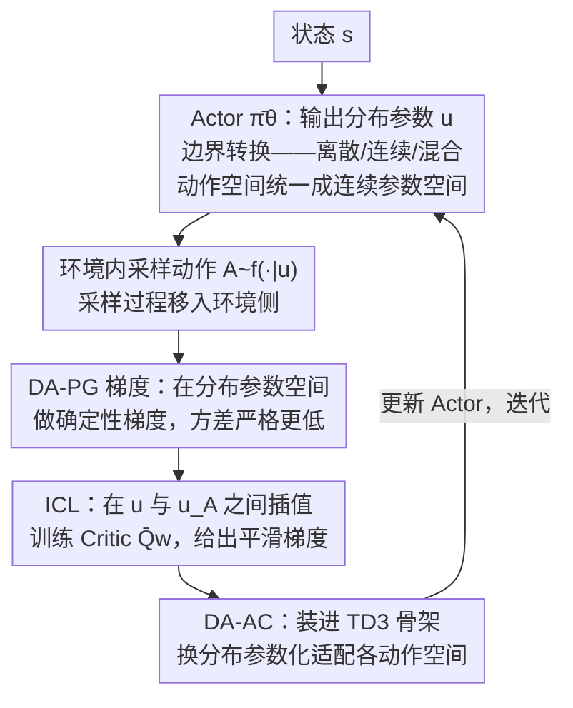

# DA-AC: Distributions as Actions — A Unified RL Framework for Diverse Action Spaces

**会议**: ICLR 2026  
**arXiv**: [2506.16608](https://arxiv.org/abs/2506.16608)  
**代码**: [GitHub](https://github.com/hejm37/da-ac)  
**领域**: 其他  
**关键词**: 统一动作空间, 分布参数化, 确定性策略梯度, 离散连续混合控制, 方差缩减  

## 一句话总结
DA-AC 提出将动作分布的参数（如 softmax 概率或 Gaussian 均值/方差）作为 Agent 的"动作"输出，将动作采样过程移入环境，从而用统一的确定性策略梯度框架处理离散/连续/混合动作空间，理论证明方差严格低于 LR 和 RP 估计器，并在 40+ 环境上取得 competitive 或 SOTA 性能。

## 研究背景与动机
**领域现状**：当前 RL 算法与动作空间类型紧密耦合——离散用 DQN/DSAC，连续用 DDPG/TD3/SAC，混合动作需要 PADDPG 等专用算法。不同估计器架构完全不同，难以设计跨域统一的通用算法。

**现有痛点**：
   - LR（Likelihood Ratio）估计器虽通用，但方差高，需要精心设计 baseline
   - DPG/RP 估计器方差低，但只能用于连续动作空间
   - 混合动作空间（同时含离散和连续维度）需要额外的工程设计

**核心矛盾**：需要低方差的梯度估计器，但低方差的 DPG/RP 又要求连续动作空间——如何在离散动作上也享受 DPG 的低方差优势？

**本文要解决**：设计一个统一的 actor-critic 算法，能在任意类型的动作空间上工作，且理论上保证低方差。

**切入角度**：重新思考 Agent-环境的边界——Agent 的"动作"不一定要是环境定义的原始动作，可以是**分布参数**。策略通常可以分解为 $\bar{\pi}_\theta$ (输出分布参数) + $f$ (从分布中采样)。如果把 $f$ 移到环境侧，Agent 的动作空间就变成了连续的参数空间 $\mathcal{U}$，无论原始动作空间是什么类型。

**核心idea**：Distributions-as-Actions——分布参数就是动作，采样是环境的一部分。

## 方法详解

### 整体框架
这篇论文想解决的是 RL 算法和动作空间类型死死绑定的问题：离散、连续、混合各用一套互不相通的算法。它的破局点在于重新划分 Agent 与环境的边界。经典 RL 里，策略 $\pi_\theta$ 其实可以拆成两步——先由 $\bar{\pi}_\theta$ 把状态映射成一组分布参数（高斯策略的均值/方差、softmax 策略的类别概率），再由采样函数 $f$ 从这组参数定义的分布里抽出真正的动作。DA 框架把第二步 $f$ 整个挪到环境侧：Agent 不再输出动作，而是直接输出分布参数 $u=\bar{\pi}_\theta(s)$，采样变成环境随机转移的一部分。

这样一来，无论底层动作空间是离散、连续还是混合，Agent 面对的动作空间都统一成了连续的参数空间 $\mathcal{U}$，从而可以用同一套连续控制算法处理所有情形。形式上这定义了一个新的 MDP——DA-MDP $\langle \mathcal{S}, \mathcal{U}, \bar{p}, d_0, \bar{r}, \gamma \rangle$，其转移和奖励是对原始动作取期望：

$$\bar{p}(s'|s,u) = \mathbb{E}_{A \sim f(\cdot|u)}[p(s'|s,A)], \quad \bar{r}(s,u) = \mathbb{E}_{A \sim f(\cdot|u)}[r(s,A)]$$

这个转换不改变问题本身：状态价值守恒 $\bar{v}_{\bar{\pi}}(s)=v_\pi(s)$，而分布参数的 Q 值恰好是原始 Q 值在分布下的期望 $\bar{q}_{\bar{\pi}}(s,u)=\mathbb{E}_{A\sim f(\cdot|u)}[q_\pi(s,A)]$。在此之上，论文给出梯度估计器 DA-PG、为它配套的 critic 学习方法 ICL，最后把两者装进 TD3 得到可用算法 DA-AC，整个训练循环如下图：

### 关键设计

**1. DA-PG 梯度估计器：把确定性梯度带到任意动作空间，且方差严格更低**

边界转换把动作空间变成连续参数空间后，紧接着的问题是怎么算策略梯度——以往低方差的 DPG/RP 类估计器只能用于连续动作，离散动作只能退而用方差高的 LR（likelihood-ratio）估计器。既然 Agent 现在输出的分布参数 $U=\bar{\pi}_\theta(S_t)$ 本身就是连续的，DA-PG 就直接套用 DPG 风格的确定性梯度，形式与经典 DPG 一模一样：

$$\hat{\nabla}_\theta^{\text{DA-PG}} = \nabla_\theta \bar{\pi}_\theta(S_t)^\top \nabla_U \bar{Q}_w(S_t, U)\big|_{U=\bar{\pi}_\theta(S_t)}$$

差别只在语义——$\bar{\pi}$ 吐的是分布参数而非单一动作、$\bar{Q}$ 估的是分布下的期望回报，于是 DPG「只能用于连续动作」的限制被绕开，离散动作也能享受确定性梯度（当 $f(\cdot|u)$ 退化成 Dirac delta、参数直接等于动作时，DA-PG 完全退回经典 DPG，后者是它的特例）。它为什么更省方差，论文给出一个漂亮的结果：DA-PG 恰好是 LR 估计器对采样动作 $A$、以及 RP（reparameterization）估计器对噪声 $\epsilon$ 取条件期望的结果，

$$\hat{\nabla}_\theta^{\text{DA-PG}} = \mathbb{E}_{A}\big[\hat{\nabla}_\theta^{\text{LR}}\big] = \mathbb{E}_{\epsilon}\big[\hat{\nabla}_\theta^{\text{RP}}\big]$$

由全方差公式「先取期望再算方差不会变大」，DA-PG 方差严格低于 LR 和 RP。代价是 critic 的输入从动作扩成了分布参数、空间更大更难学准，可能引入偏差——这正是下一个设计要补的。其意义在于：这是首个在离散动作空间上提供无偏、RP 风格低方差估计的方法，把原本专属连续控制的低方差优势带到了离散设定。

**2. ICL（插值式 critic 学习）：让 critic 在整个参数空间而不只是当前策略附近学准**

DA-PG 的确定性梯度 $\nabla_U \bar{Q}_w$ 要求 critic 在分布参数空间里到处都有可靠的梯度，但标准 TD 更新只在当前策略产生的参数 $U_t$ 处训练 critic，参数空间其他位置估得很糟，梯度自然指错方向。ICL（Interpolated Critic Learning）的做法是在当前参数 $U_t$ 与采样动作对应的确定性参数 $U_{A_t}$ 之间随机线性插值，再用插值点更新 critic：

$$\hat{U}_t = \omega_t U_t + (1-\omega_t) U_{A_t}, \quad \omega_t \sim \text{Uniform}[0,1]$$

这等于强迫 critic 在 $U_t$ 到 $U_{A_t}$ 整段区间上都学准，从而捕捉到更平滑、更丰富的曲率，让 DA-PG 的梯度能指向真正高价值的区域，也缓和了设计 1 提到的偏差问题。其精神类似 off-policy 学习，只是操作对象是分布参数而非策略本身；bandit 设定下的可视化直接验证了这点——ICL 训出的 critic 曲率明显更丰富，标准更新的 critic 只在当前策略附近才准。

**3. DA-AC 算法：把 DA-PG 与 ICL 装进 TD3，得到适配所有动作空间的统一 actor-critic**

前两个设计要落成一个能跑的深度 RL 算法，需要稳定的训练骨架。DA-AC 直接以 TD3 为底座，沿用双 critic、延迟策略更新、目标噪声这些稳定化技巧，只换掉两处：用 DA-PG 替换 DPG 来更新 actor，用 ICL 替换标准 TD 更新来训 critic；消融发现此时 actor 的目标网络已无必要，索性移除。面对不同动作空间只需换分布参数化——连续用 Gaussian（输出均值/方差）、离散用 Softmax（输出类别概率）、混合则把 Gaussian 与 Softmax 拼接——算法主体一行不改，这正是「一套算法通吃离散/连续/混合」的来处。

## 实验关键数据

### 主实验——连续控制（MuJoCo + DMC, 20 环境, 1M steps）

| 算法 | MuJoCo (归一化) | DMC (归一化) |
|------|----------------|-------------|
| TD3 | ~0.82 | ~0.70 |
| SAC | ~0.78 | ~0.65 |
| RP-AC | ~0.80 | ~0.72 |
| PPO | ~0.55 | ~0.48 |
| **DA-AC** | **~0.85** | **~0.78** |

在 20 个单独环境对比中，DA-AC 在多数环境优于 TD3，尤其在高维动作空间（如 Humanoid、Dog）中优势显著。

### 离散控制（Classic Control + MinAtar, 9 环境）
DA-AC 在 Classic Control 和 MinAtar 上均与 DQN 可比较，显著优于 LR-AC 和 ST-AC。

### 高维离散控制（$7^{17}$ 动作空间的 Humanoid）
DQN、DSAC、EAC 完全无法扩展（需要枚举不可行动作空间），DA-AC 保持与连续版本相当的性能。

### 混合控制（7 个 PAMDPs 环境）
DA-AC 与 PATD3（专为混合动作设计的算法）可比较或更优。

### 消融实验——ICL 的贡献

| 配置 | MuJoCo | DMC | MinAtar | Hybrid |
|------|--------|-----|---------|--------|
| DA-AC (w/ ICL) | **0.85** | **0.78** | **0.73** | **0.82** |
| DA-AC w/o ICL | 0.80 | 0.72 | 0.68 | 0.77 |

ICL 在所有设置中带来一致的提升，paired t-test 显示统计显著。

### 关键发现
- **统一性验证**：一个算法在离散、连续、混合三种动作空间上都 competitive——这是首次实现
- **DA-PG 的方差优势**：bias-variance 分析实验确认 DA-PG 方差低于 LR 和 RP，验证了理论预测
- **ICL 对 critic 质量至关重要**：可视化显示 ICL 使 critic 在分布参数空间中有更好的梯度信号

## 亮点与洞察
- **Agent-环境边界的重新思考**极其优雅——这不是 trick，而是一个深刻的概念转变：改变看待问题的方式可以统一原本不兼容的方法
- **DA-PG 作为 LR 和 RP 的条件期望**——这个理论结果非常漂亮，用全方差公式直接证明方差降低
- **ICL 的设计直觉**：标准 critic 只在策略附近准确，但策略优化需要知道其他区域的 Q 值；ICL 通过插值采样让 critic "看得更远"——类似 off-policy 但在分布空间操作
- **高维离散控制**的实验特别有说服力：$7^{17}$ 的动作空间让 DQN/DSAC/EAC 完全失效，但 DA-AC 无缝处理

## 局限与展望
- ICL 引入偏差（无重要性采样修正），对收敛性的影响尚待理论分析
- 仅基于 TD3 实现，与 SAC（最大熵）或 PPO（on-policy）的整合是自然的下一步
- critic 学习在高维分布参数空间中可能更困难——Gaussian 策略中 critic 输入翻倍（均值+方差）
- 未探索 model-based RL、层次控制等扩展方向

## 相关工作与启发
- **vs TD3/DDPG**：DA-AC 是 TD3 的自然推广，DPG 是 DA-PG 的特例
- **vs SAC**：SAC 用 RP 估计器+熵正则，DA-AC 用 DA-PG（方差更低）+无熵，两者可结合
- **vs EPG (Expected Policy Gradient)**：EPG 也追求零方差但仅在低维离散或特殊连续情况可行，DA-AC 推广到任意高维
- **vs Gumbel-Softmax/ST**：这些是有偏的离散松弛方法，DA-PG 在离散空间上提供首个无偏低方差估计
- 可启发 Agent 系统设计：当 Agent 需要同时做离散决策和连续控制时，DA 框架提供统一接口

## 评分
- 新颖性: ⭐⭐⭐⭐⭐ 重新定义 Agent-环境边界的概念非常优雅且深刻
- 实验充分度: ⭐⭐⭐⭐⭐ 40+ 环境覆盖 4 种动作空间类型，消融全面
- 写作质量: ⭐⭐⭐⭐ 理论推导清晰，可视化有效
- 价值: ⭐⭐⭐⭐⭐ 为 RL 统一框架迈出重要一步，实际可用

<!-- RELATED:START -->

## 相关论文

- [\[ICML 2026\] iWorld-Bench: A Benchmark for Interactive World Models with a Unified Action Generation Framework](../../ICML2026/others/iworld-bench_a_benchmark_for_interactive_world_models_with_a_unified_action_gene.md)
- [\[ICLR 2026\] Jackpot: Optimal Budgeted Rejection Sampling for Extreme Actor-Policy Mismatch RL](jackpot_optimal_budgeted_rejection_sampling_for_extreme_actor-policy_mismatch_re.md)
- [\[CVPR 2026\] A Unified Framework for Knowledge Transfer in Bidirectional Model Scaling](../../CVPR2026/others/a_unified_framework_for_knowledge_transfer_in_bidirectional_model_scaling.md)
- [\[CVPR 2026\] CAD-Refiner: A Unified Framework for CAD Generation and Iterative Editing](../../CVPR2026/others/cad-refiner_a_unified_framework_for_cad_generation_and_iterative_editing.md)
- [\[ECCV 2024\] An Incremental Unified Framework for Small Defect Inspection](../../ECCV2024/others/an_incremental_unified_framework_for_small_defect_inspection.md)

<!-- RELATED:END -->
