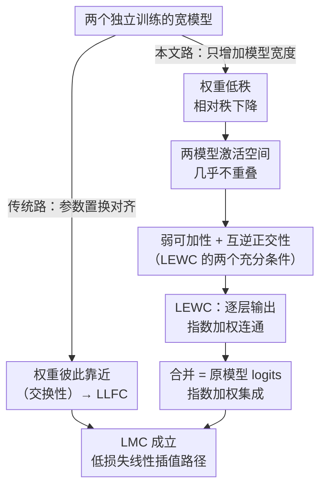

# Do We Really Need Permutations? Impact of Model Width on Linear Mode Connectivity

**会议**: ICLR 2026  
**arXiv**: [2510.08023](https://arxiv.org/abs/2510.08023)  
**代码**: 无  
**领域**: LLM评测  
**关键词**: 线性模式连通性, 模型合并, 参数置换对称性, 模型宽度, 损失景观

## 一句话总结

实证表明无需参数置换，仅靠增加模型宽度即可实现独立训练模型间的线性模式连通性（LMC），并提出"逐层指数加权连通性"（LEWC）解释这一现象的机理。

## 研究背景与动机

**线性模式连通性（LMC）**是指两个独立训练的模型参数之间存在一条低损失的线性路径，即参数线性插值不会导致显著的损失增加。LMC对于理解损失景观结构和模型合并（federated learning、model merging）至关重要。

### 已有认知

Entezari et al. (2022) 提出假说：对于充分宽的模型，总存在一个参数置换 $\pi$ 使得 LMC 成立。Ainsworth et al. (2023) 通过 Weight Matching (WM) 实证验证了这一假说，但发现需要非常大的宽度倍数（如ResNet-20需32×，VGG-16需4×）。此前人们相信：
- 宽度的作用是增加候选置换空间，提高找到好置换的概率
- 没有置换，LMC 不成立

### 本文的核心发现

即使**不做任何置换**，只要模型足够宽，简单地平均两个独立训练模型的权重就能达到与原始模型相当的测试精度。这颠覆了"置换是LMC的必要条件"的传统认知。

## 方法详解

### 整体框架

这是一篇**分析性工作**，不提新的训练或合并算法，而是要回答一个反直觉的问题：为什么把两个独立训练的宽模型权重直接平均、不做任何置换对齐，测试精度也几乎不掉？作者的回答分三步：先用一个叫 LEWC 的性质刻画"合并后到底发生了什么"，再给出 LEWC 成立的两个充分条件，最后说明宽度通过低秩结构同时满足这两个条件，从而把"宽 → 无需置换的 LMC"这条因果链补全。值得对照的是：达成 LMC 其实有两条互斥的路——传统的"参数置换对齐"让两个模型权重彼此靠近（走 LLFC），而本文揭示的"只加宽度"让权重低秩、正交（走 LEWC），两条路最终都通向 LMC，但机制完全相反。

### 关键设计

**1. 逐层指数加权连通性（LEWC）：用一个精确等式刻画合并模型每层的输出**

要解释合并为什么不掉精度，先得说清合并后每一层在算什么。作者定义：两个模型参数 $\boldsymbol{\theta}_a$、$\boldsymbol{\theta}_b$ 满足 LEWC，当且仅当对任意层 $\ell$ 和任意插值系数 $\lambda \in [0,1]$，合并模型的第 $\ell$ 层输出恰好是两个原始模型对应层输出的指数衰减加权和：

$$f_\ell(\mathbf{x}; \lambda\boldsymbol{\theta}_a + (1-\lambda)\boldsymbol{\theta}_b) = \lambda^\ell f_\ell(\mathbf{x}; \boldsymbol{\theta}_a) + (1-\lambda)^\ell f_\ell(\mathbf{x}; \boldsymbol{\theta}_b)$$

权重里的指数 $\lambda^\ell$ 是关键：层数越深，衰减越快。推到最后一层，合并模型的输出就等价于两个原始模型 logits 的加权集成。而缩放 logits 不改变 argmax 预测，所以只要 LEWC 成立，合并模型的预测标签就和集成一致，精度自然不掉——LEWC 直接蕴含 LMC。这一步把"插值不掉精度"这个现象，翻译成了"每层输出满足一个可验证的等式"。

**2. LEWC 的两个充分条件：弱可加性 + 互逆正交性**

LEWC 看似很强，作者证明它其实由两个更基本的条件保证。第一个是 **ReLU 弱可加性（Weak Additivity）**，要求 ReLU 在两个模型预激活的插值路径上表现得像线性函数：

$$\sigma(\lambda \tilde{\mathbf{z}}_\ell^{(a)} + (1-\lambda)\tilde{\mathbf{z}}_\ell^{(b)}) = \lambda\sigma(\tilde{\mathbf{z}}_\ell^{(a)}) + (1-\lambda)\sigma(\tilde{\mathbf{z}}_\ell^{(b)})$$

它之所以在宽模型里成立，有两个互相印证的原因：一是**维度诅咒效应**，高维空间里两个高斯预激活向量经 ReLU 后的余弦相似度会趋向 0.93，几乎共线；二是**低秩权重导致激活不重叠**，宽模型的权重矩阵相对秩很低，两个模型激活的大二阶矩落在不重叠的维度上，使得 ReLU 的非线性几乎不被插值触发。第二个条件是**互逆正交性（Reciprocal Orthogonality）**，要求一个模型的权重作用在另一个模型的激活上结果为零：

$$\mathbf{W}_\ell^{(b)} \mathbf{z}_{\ell-1}^{(a)} = 0 \quad \text{且} \quad \mathbf{W}_\ell^{(a)} \mathbf{z}_{\ell-1}^{(b)} = 0$$

直观上就是两个模型在特征空间里"各占一块、互不干扰"——A 的权重只对 A 自己的激活有响应，对 B 的激活视而不见。作者据此给出**定理 5.3**：对无偏置的模型，弱可加性和互逆正交性一旦同时成立，LEWC 就成立。这把"为什么合并不掉精度"归约到了两个关于权重几何的具体条件上。

**3. 与 LLFC 的本质区别：靠近 vs 正交，两条互斥的路**

读者很容易把 LEWC 和 Zhou et al. (2023) 的 LLFC（逐层线性特征连通性）混为一谈，作者特意点明二者机制相反。LLFC 依赖**交换性（commutativity）**，要求两个模型的权重足够*接近*——这正是 Weight Matching 做置换对齐后达到的状态。而 LEWC 依赖**互逆正交性**，要求两个模型的权重高度*不同且正交*。两者不可兼容：LLFC 解释的是置换后的 LMC（对齐→权重靠近），LEWC 解释的是无置换的 LMC（够宽→权重正交）。这一区分说明，宽模型走的根本不是"找到好置换"那条路，而是另一条独立的机制。

**4. 低秩结构是把宽度和 LMC 串起来的那一环**

最后一块拼图是回答"宽度凭什么能同时满足上面两个条件"。作者给出的因果链是：宽度增加使权重矩阵的相对秩下降，激活向量的有效维度随之降低，于是两个模型的激活空间几乎不重叠——而激活不重叠正好同时支撑了弱可加性（ReLU 不被触发）和互逆正交性（权重互不响应），两个充分条件齐了，LEWC 成立，LMC 也就跟着成立。换句话说，过去人们以为"宽度的好处是扩大候选置换空间"，本文指出宽度真正的作用是把权重压到低秩、逼出正交结构，置换本身反而是多余的。

### 损失函数 / 训练策略

本文用标准训练（SGD + weight decay 0.003），不提新训练方法。唯一需要留意的工程细节是 softmax 的温度校准：因为 LEWC 让 logit 范数随层数指数衰减，合并模型的 logits 整体被缩小，需要用逆温度参数把 softmax 校准回来，校准后的损失 barrier 才会趋近于零。这也反过来印证了 LEWC——logits 是被指数加权缩放的，而非被破坏。

## 实验关键数据

### 主实验

**Table 1：有/无置换时的Barrier值（$\lambda=1/2$）**

| 网络 | 数据集 | 无置换 Acc barrier | 无置换 Loss barrier | 有WM置换 Acc barrier | 有WM置换 Loss barrier |
|------|--------|:-:|:-:|:-:|:-:|
| MLP (16×) | MNIST | 0.519% | 0.013 | -0.027% | -0.003 |
| VGG-11 (16×) | CIFAR-10 | 1.308% | 0.066 | 7.000% | 0.177 |
| ResNet-20 (32×) | CIFAR-10 | 2.694% | 0.087 | 5.135% | 0.173 |

充分宽的模型无需置换即可达到很小的barrier。甚至在某些情况下，WM置换后的barrier反而更大（如VGG-11和ResNet-20）。

**随机置换实验**：对充分宽的模型施加随机置换后合并，精度依然保持——说明一旦模型足够宽，置换是无关紧要的。

### 消融实验

**弱权重衰减（$10^{-4}$）的影响**

| 条件 | VGG-11 LEWC | VGG-11 弱可加性 | VGG-11 互逆正交性 |
|------|:-:|:-:|:-:|
| 标准WD (0.003) | ✓ (高余弦相似度) | ✓ | ✓ (低比率) |
| 弱WD ($10^{-4}$) | ✗ (低余弦相似度) | ✗ | ✗ (高比率) |

弱权重衰减→高秩权重→LEWC两个充分条件均不成立→LMC失败。这证实了低秩结构是LEWC的关键驱动因素。

### 关键发现

1. **宽度单调提升合并性能**：增加宽度使合并模型精度单调上升直至匹配原始模型
2. **温度校准是必要的**：LEWC导致logit范数指数衰减，需校准softmax才能使loss barrier趋零
3. **LEWC ≠ 平坦性**：随机扰动实验表明，仅靠损失景观平坦无法解释LMC——LEWC是独立机制
4. 维度约2×以上宽度（如VGG-11 16×，ResNet-20 32×）即可实现无置换LMC

## 亮点与洞察

1. **颠覆性发现**：推翻了"置换是LMC必要条件"的普遍假设，揭示宽度本身比置换空间更重要
2. **LEWC概念**：优雅地将合并模型解释为原始模型的指数加权集成，建立了模型合并与集成学习的桥梁
3. **互逆正交性vs交换性**：清晰地区分了两种本质不同的LMC机制，深化了对神经网络损失景观的理解
4. **低秩—>LMC的因果链**：低秩权重→激活不重叠→弱可加性+互逆正交性→LEWC→LMC

## 局限与展望

1. 实验限于简单数据集（MNIST、CIFAR-10），因为无置换LMC需要较大宽度倍数
2. 仅考虑MLP、VGG-11、ResNet-20等标准架构，未验证Transformer等现代架构
3. 作为分析工作，未提出实用的模型合并或联邦学习方法
4. LEWC需要BN重新校准和温度缩放，增加了实际使用复杂度
5. 理论分析主要是充分条件而非必要条件
6. 在更复杂数据集（如CIFAR-100、ImageNet）上LMC的宽度需求可能过大

## 相关工作与启发

- **Ainsworth et al. (2023)**：Weight Matching方法，本文的主要对比框架
- **Zhou et al. (2023)**：提出LLFC概念，与本文的LEWC形成互补解释
- **Entezari et al. (2022)**：提出置换不变性假说，本文实质上修正了这一假说
- 对**联邦学习**的启发：若客户端模型足够宽，简单FedAvg可能就足够好，无需复杂的对齐策略
- 对**模型合并**的实践启示：训练更宽的模型 + 适当weight decay可能是最简单的合并策略

## 评分

| 维度 | 分数 |
|------|------|
| 新颖性 | ★★★★★ |
| 技术深度 | ★★★★☆ |
| 实验充分性 | ★★★★☆ |
| 写作质量 | ★★★★★ |
| 实用价值 | ★★★☆☆ |

<!-- RELATED:START -->

## 相关论文

- [\[NeurIPS 2025\] Generalized Linear Mode Connectivity for Transformers](../../NeurIPS2025/others/generalized_linear_mode_connectivity_for_transformers.md)
- [\[ICLR 2026\] On the Impact of the Utility in Semivalue-based Data Valuation](on_the_impact_of_the_utility_in_semivalue-based_data_valuation.md)
- [\[ICLR 2026\] Key and Value Weights Are Probably All You Need: On the Necessity of the Query, Key, and Value Weight Triplet in Self-Attention](key_and_value_weights_are_probably_all_you_need_on_the_necessity_of_the_query_ke.md)
- [\[ICML 2026\] Connecting Independently Trained Modes via Layer-Wise Connectivity](../../ICML2026/others/connecting_independently_trained_modes_via_layer-wise_connectivity.md)
- [\[ICLR 2026\] The Hot Mess of AI: How Does Misalignment Scale With Model Intelligence and Task Complexity?](the_hot_mess_of_ai_how_does_misalignment_scale_with_model_intelligence_and_task_.md)

<!-- RELATED:END -->
