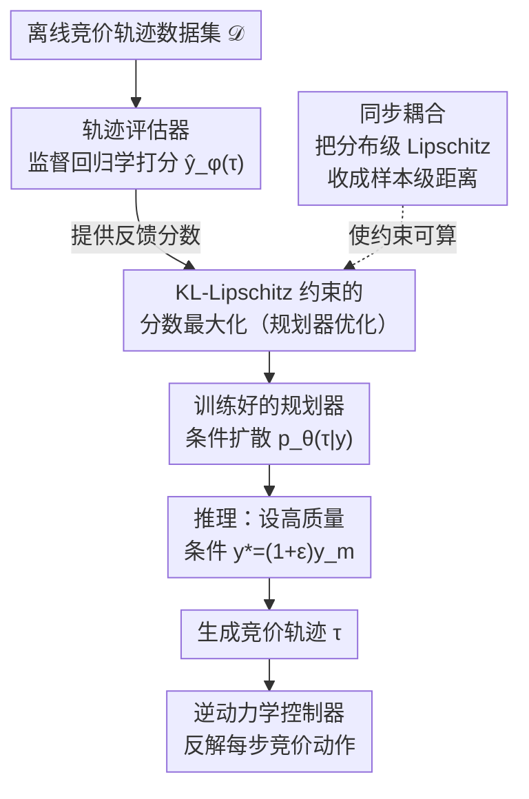

# Enhancing Generative Auto-bidding with Offline Reward Evaluation and Policy Search

**会议**: ICLR 2026 Oral  
**arXiv**: [2509.15927](https://arxiv.org/abs/2509.15927)  
**代码**: 无  
**领域**: 其他  
**关键词**: auto-bidding, generative planning, offline RL, trajectory evaluator, KL-Lipschitz constraint

## 一句话总结
提出 AIGB-Pearl，为生成式自动竞价方法引入离线轨迹评估器和 KL-Lipschitz 约束的分数最大化方案，使生成模型能在理论保证下安全地突破静态离线数据的性能天花板，在淘宝真实广告系统上实现 GMV +3% 的显著提升。

## 研究背景与动机
**领域现状**：自动竞价（auto-bidding）是在线广告的核心技术。AI-Generated Bidding（AIGB）用扩散模型等生成模型将竞价建模为条件轨迹生成任务，从离线数据中学习条件轨迹分布 $p_\theta(\tau|y)$，在推理时通过设置高质量条件 $y^*$ 来生成高回报的竞价轨迹。AIGB 避免了 TD 学习的自举不稳定性，比标准离线 RL 方法表现更好。

**现有痛点**：AIGB 本质上是条件行为克隆——只从离线数据中学习模仿，没有机制利用反馈信号来改进生成质量。当推理时设置超出训练数据范围的条件（外推），生成质量不可控，可能产生有风险的竞价轨迹。类比 LLM，AIGB 相当于只做了 SFT，缺少 RLHF 这一步。

**核心矛盾**：想要给 AIGB 加策略优化（最大化评估器分数），但评估器在离线数据外不可靠——如果生成模型偏离离线数据太远，评估器给出的分数就不准确（OOD 问题），优化会走偏。

**本文目标**：如何在保证安全性（不偏离数据太远）的前提下，让 AIGB 通过策略优化提升生成质量？

**切入角度**：从理论上分析评估器偏差的上界，发现偏差可以被两个因素控制：(1) 生成模型对条件 $y$ 的 Lipschitz 连续性（控制外推敏感度），(2) 生成模型对离线数据的 KL 散度（控制模仿误差）。

**核心 idea**：构建轨迹评估器提供反馈 + KL-Lipschitz 双重约束确保安全外推，将生成式规划和策略优化有机统一。

## 方法详解

### 整体框架
AIGB-Pearl 要解决的问题是：让生成式竞价模型不再只会模仿离线数据，而是能在安全前提下主动突破数据的性能天花板。它把这件事拆成"评估—优化"两个阶段串起来。先用一个**轨迹评估器**（Evaluator）从离线数据里学出一个打分函数 $\hat{y}_\phi(\tau)$，给任意一条竞价轨迹估出它的回报；再让**生成式规划器**（Planner，一个条件扩散模型 $p_\theta(\tau|y)$）以"最大化评估器分数"为目标迭代改进自己生成的轨迹，但同时被 KL 和 Lipschitz 双重约束拴住、不让它跑到数据覆盖不到的地方，其中 Lipschitz 约束靠**同步耦合**技术落地为可计算的训练项。推理时给规划器设一个高质量目标条件 $y^*=(1+\epsilon)y_m$ 生成轨迹，再由一个现成的**逆动力学控制器**从轨迹里反解出每一步真正要出的竞价动作。整条 pipeline 正好对应 LLM 里的 SFT→RLHF：评估器是奖励模型，约束优化是带 KL 惩罚的策略改进。

### 关键设计

**1. 轨迹评估器：给只会模仿的 AIGB 补上一个能打分的反馈信号**

原始 AIGB 是纯条件行为克隆，没有任何机制告诉模型"这条轨迹好不好"，所以也无从改进。评估器就是来填这个空白的——它在离线数据集 $\mathcal{D}$ 上做一个监督回归，学习用轨迹预测它的累计回报（GMV/Budget）：

$$\min_\phi \mathbb{E}_{\tau \sim \mathcal{D}}\big[(\hat{y}_\phi(\tau) - y(\tau))^2\big]$$

光会拟合还不够，关键是评估器一旦被规划器拿去当优化目标，规划器就会想方设法把轨迹推到能骗高分的地方，而这些地方往往在数据之外。为此评估器额外施加 $\sqrt{T}R_m$-Lipschitz 正则化，让它继承真实轨迹质量函数本身的 Lipschitz 性质——这样它在离线数据外的预测不会剧烈跳变，给后续的安全外推留出可信的打分空间。

**2. KL-Lipschitz 约束的分数最大化：让规划器在突破天花板的同时不脱离数据**

有了评估器，规划器的优化目标很直接，就是最大化生成轨迹拿到的评估分数：

$$\max_\theta \mathbb{E}_{\tau \sim p_\theta(\tau|y^*)}\big[\hat{y}_\phi(\tau)\big]$$

但前面说过，评估器在离线数据外不可靠，无约束地最大化分数会让规划器钻评估器的空子、生成 OOD 的病态轨迹。本文的做法是给这个最大化套两个约束：(a) KL 约束 $\mathbb{E}_{y}[D_{KL}(p_D(\tau|y) \| p_\theta(\tau|y))] \leq \delta_K$，限制规划器分布不要偏离离线数据分布太远，控制的是模仿误差；(b) Lipschitz 约束 $\text{Lip}_{W_1}(p_\theta(\tau|y)) \leq L_p$，限制规划器输出对条件 $y$ 的敏感度，控制的是外推时的生成波动。这两个约束不是拍脑袋加的——Theorem 2 把评估器偏差的上界严格分解成了三项：评估器训练误差 $\delta_D$、KL 散度项（模仿误差）和 Wasserstein 距离项（生成敏感度），而 KL 约束和 Lipschitz 约束恰好分别压住后两项，于是整体偏差可控，分数最大化才有理论保证。

**3. 同步耦合技术：把不可算的分布级 Lipschitz 约束变成可算的样本级距离**

Lipschitz 约束写出来好看，落到训练里却是个难题——它要求衡量两个条件下生成分布之间的 Wasserstein 距离，而分布间的 $W_1$ 距离没法直接计算。同步耦合（Synchronous Coupling）的技巧是：对两个不同条件 $y_1, y_2$ 生成轨迹时，强制它们共用同一串高斯噪声序列 $\{\eta_1, ..., \eta_T\}$。噪声一旦对齐，两条轨迹的差异就只来自条件本身，分布间距离被收紧成一对样本之间的距离，于是 Lipschitz 常数可以用样本级惩罚来约束：

$$\hat{W}_1(y_1, y_2; \theta) / |y_1 - y_2| \leq L_p$$

这样原本算不动的约束就变成训练里能直接优化的一项。

### 训练策略
整体是两阶段：先用监督学习把评估器训好，再训规划器做约束优化。规划器这一步的两个约束通过拉格朗日乘子法转成无约束问题来优化；同时把扩散模型的方差 $\sigma_\theta$ 固定为常数，进一步简化 Lipschitz 惩罚的计算。

## 实验关键数据

### 主实验（模拟环境，GMV）

| 预算 | USCB | BCQ | CQL | DT | DiffBid | **AIGB-Pearl** | Δ |
|------|------|-----|-----|----|---------|------------|------|
| 1.5k | 454.25 | 454.72 | 461.82 | 477.39 | 480.76 | **502.98** | +4.62% |
| 2.0k | 482.67 | 483.50 | 475.78 | 507.30 | 511.17 | **521.84** | +2.09% |
| 2.5k | 497.66 | 498.77 | 481.37 | 527.88 | 531.29 | **545.03** | +2.59% |
| 3.0k | 500.60 | 501.86 | 491.36 | 550.66 | 556.32 | **574.17** | +3.21% |

### 真实系统 A/B 测试（淘宝，6k 广告主，19 天）

| 对比 | GMV 提升 | BuyCnt 提升 | ROI 提升 | Cost 波动 |
|------|---------|-----------|---------|----------|
| vs DiffBid | +3.00% | +2.20% | +1.89% | +1.10% |
| vs DT | +3.30% | +0.64% | +0.16% | +0.66% |
| vs USCB | +3.43% | +0.74% | +4.24% | -0.78% |
| vs MOPO | +3.13% | +2.14% | +4.87% | -1.77% |

### 消融实验（真实 A/B，6k 广告主，8 天）

| 配置 | GMV 变化 | 说明 |
|------|---------|------|
| Full AIGB-Pearl | baseline | 完整模型 |
| w/o KL constraint | -1.09% | 去掉 KL 约束后 GMV 下降 |
| w/o Lipschitz constraint | -1.81% | 去掉 Lipschitz 约束后下降更多 |

### 关键发现
- AIGB-Pearl 在所有预算水平和所有对比方法上一致胜出，GMV 提升约 3%（在淘宝规模下每天百万级 RMB 增量）
- Lipschitz 约束的贡献（+1.8%）大于 KL 约束（+1.1%），说明控制生成对条件的敏感度比约束对离线数据的偏离更关键
- 评估器在训练数据上 AUC 89.9%、OOD 数据上 85.5%（5-fold CV），泛化良好
- 对未见过的 4k 广告主，AIGB-Pearl 仍保持 +3% 的 GMV 提升，泛化能力优于原始 AIGB
- 去掉双重约束后，生成的轨迹出现明显病态行为：过度消耗预算、反向预算分配、预算利用不足

## 亮点与洞察
- **理论与实践的统一**：从评估器偏差上界（Theorem 2）严格推导出 KL + Lipschitz 双约束的必要性，再通过同步耦合使理论约束可计算。方法论可迁移到其他使用生成模型做离线决策的场景
- **"AIGB 的 RLHF"**：AIGB 到 AIGB-Pearl 的转变完美平行于 LLM 中 SFT → RLHF 的范式。评估器 = 奖励模型，KL 约束 = PPO 中的策略约束
- **真实部署验证**：在淘宝级别的真实广告系统上做了 19 天的大规模 A/B 测试（6k 广告主），工业级验证

## 局限与展望
- 评估器基于离线数据训练，其预测上限决定了策略优化的天花板
- 超参数 $L_p$ 需从数据估计，估计精度影响约束松紧
- 仅在广告竞价场景验证，向机器人控制等其他决策场景的迁移需更多实验
- 同步耦合增加训练开销（每步需生成两条轨迹比较）
- 评估器与规划器分阶段训练，联合训练是否更优未做探索

## 相关工作与启发
- **vs DiffBid/AIGB**：原始 AIGB 仅做条件行为克隆，无反馈优化；AIGB-Pearl 增加了评估器反馈 + 约束优化
- **vs 离线 RL（CQL/IQL）**：离线 RL 使用 TD 自举估值，训练不稳定；AIGB-Pearl 用监督学习评估器，训练更稳定
- **vs MORL**：基于模型的离线 RL 通过环境模型做保守搜索；AIGB-Pearl 直接在轨迹空间优化

## 评分
- 新颖性: ⭐⭐⭐⭐ 将 RL 策略优化融入生成式规划的框架新颖，KL-Lipschitz 约束有理论创新
- 实验充分度: ⭐⭐⭐⭐⭐ 模拟 + 淘宝真实系统大规模 A/B 测试，消融和理论验证完整
- 写作质量: ⭐⭐⭐⭐ 理论推导严谨清晰
- 价值: ⭐⭐⭐⭐⭐ 在淘宝级别部署验证的实用系统，直接产生商业价值

<!-- RELATED:START -->

## 相关论文

- [\[ECCV 2024\] Auto-GAS: Automated Proxy Discovery for Training-Free Generative Architecture Search](../../ECCV2024/others/auto-gas_automated_proxy_discovery_for_training-free_generative_architecture_sea.md)
- [\[AAAI 2026\] Enhancing Control Policy Smoothness by Aligning Actions with Predictions from Preceding States](../../AAAI2026/others/enhancing_control_policy_smoothness_by_aligning_actions_with_predictions_from_pr.md)
- [\[CVPR 2026\] From Pixel to Precision: Enhancing Handwritten Mathematical Expression Recognition with Image-Level Reward](../../CVPR2026/others/from_pixel_to_precision_enhancing_handwritten_mathematical_expression_recognitio.md)
- [\[ICLR 2026\] Evaluating GFlowNet from Partial Episodes for Stable and Flexible Policy-Based Training](evaluating_gflownet_from_partial_episodes_for_stable_and_flexible_policy-based_t.md)
- [\[ICLR 2026\] Jackpot: Optimal Budgeted Rejection Sampling for Extreme Actor-Policy Mismatch RL](jackpot_optimal_budgeted_rejection_sampling_for_extreme_actor-policy_mismatch_re.md)

<!-- RELATED:END -->
