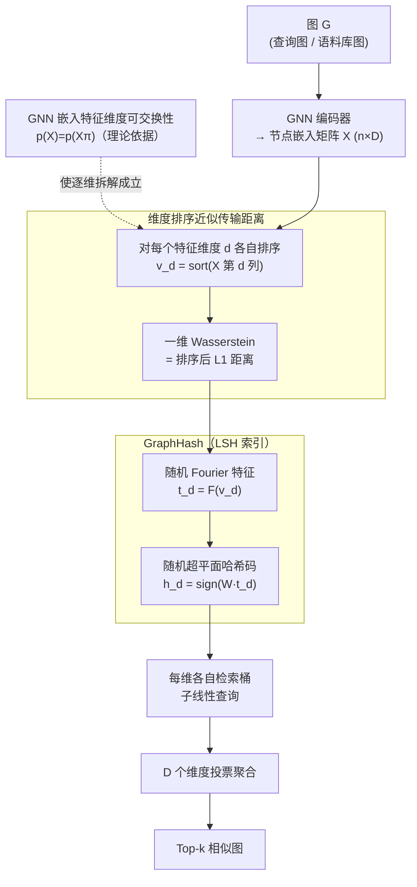

# Exchangeability of GNN Representations with Applications to Graph Retrieval

**会议**: ICLR 2026 Oral  
**OpenReview**: [HQcCd0laFq](https://openreview.net/forum?id=HQcCd0laFq)  
**代码**: 有  
**领域**: 其他  
**关键词**: GNN, exchangeability, graph retrieval, LSH, GraphHash, transportation distance, Wasserstein distance

## 一句话总结
发现训练好的 GNN 节点嵌入沿特征维度是可交换随机变量（即 $p(\mathbf{X}) = p(\mathbf{X}\pi)$ 对任意维度排列 $\pi$ 成立），利用此性质通过维度排序将基于传输距离（EMD/Wasserstein）的图相似度近似为欧氏距离，构建统一的局部敏感哈希（LSH）框架 GraphHash，在子图匹配和图编辑距离（GED）检索任务上以 AUC 指标一致超越 FourierHashNet、DiskANN、IVF、CORGII、SWWL 等基线，可扩展到 100 万图语料库。

## 研究背景与动机
**领域现状**：图检索需要衡量图间相似度（子图匹配、图编辑距离等），但这些相似度涉及最优传输问题，计算代价极高（$O(n^3)$ 的匈牙利算法或 $O(n^2)$ 的 Sinkhorn）。对于大规模语料库（$|C| \gg 10^5$），穷举逐对打分不可行。

**现有痛点**：标准的近似最近邻（ANN）方法如 DiskANN、IVF 假设相似度为欧氏距离或余弦相似度。但 GNN 产生的图表征是节点嵌入集合 $\mathbf{X} \in \mathbb{R}^{n \times D}$，图间相似度是定义在嵌入集合上的传输距离——这不能直接用向量 ANN 方法加速。

**核心矛盾**：传输距离计算昂贵且不满足标准 LSH 的度量条件，而欧氏距离高效但无法捕捉集合间的对齐关系。

**本文目标**：找到一种理论支撑的近似方法，将传输距离图相似度归约为标准欧氏距离，从而启用 LSH 实现高效图检索。

**切入角度**：发现 GNN 嵌入的一个此前未注意的概率对称性——特征维度的可交换性——并利用它简化传输距离计算。

**核心 idea**：GNN 嵌入沿特征维度的可交换性使排序后的嵌入可用欧氏距离近似传输距离，从而实现 LSH 高效图检索。

## 方法详解

### 整体框架
这篇论文要解决的是大规模图检索的瓶颈：图间相似度（子图匹配、图编辑距离）本质上是定义在节点嵌入集合上的最优传输距离，算一次就要 $O(n^3)$，语料库一大就跑不动；而高效的向量 ANN 方法又只认欧氏距离，接不上传输距离。作者的破局点是先发现一个性质——训练好的 GNN 节点嵌入沿**特征维度**是可交换的——再用它把昂贵的传输距离改写成可被 LSH 加速的欧氏距离。

整条流水线这样转：一张图先过 GNN 编码器得到节点嵌入矩阵 $\mathbf{X} \in \mathbb{R}^{n \times D}$；接着对**每个特征维度 $d$ 各自独立排序**，得到 $\mathbf{v}_d = \text{sort}(\mathbf{X}_{:,d})$；排序后的向量过随机 Fourier 特征映射 $\mathbf{t}_d = F(\mathbf{v}_d)$，再用随机超平面 LSH 得到哈希码 $\mathbf{h}_d = \text{sign}(\mathbf{W}\mathbf{t}_d)$；查询时每个维度各自查自己的检索桶，最后把 $D$ 个维度的投票聚合起来。可交换性是地基，维度排序是把传输距离降为欧氏距离的桥，GraphHash 则是落地的索引结构。

### 关键设计

**1. 可交换性发现与证明：现有 GNN 在标准训练下自然就有的维度对称性**

传输距离贵，根源在于它要在嵌入集合之间做对齐。作者绕开"重新设计 GNN"这条路，转而证明现成的 GNN 已经藏着可利用的结构：在标准训练条件下（i.i.d. 初始化 + 置换不变损失 + 等变优化器），节点嵌入矩阵 $\mathbf{X}$ 的特征维度本身就是一组可交换随机变量，即 $p(\mathbf{X}) = p(\mathbf{X}\pi)$ 对任意维度排列 $\pi$ 成立。

证明走的是一条引理链：若初始参数 $\theta_0$ 的各维度是 i.i.d. 的，则由 Lemma 2 的置换诱导变换 $\Gamma_\pi$，SGD 的每步更新都保持等变性 $\theta_t(\pi) = \Gamma_\pi(\theta_t)$，于是"初始化可交换 → 梯度等变 → 更新等变 → 嵌入可交换"一路推到 Theorem 5。值得强调的是这不是对 GNN 加的新约束，而是揭示它本就具备、此前没人注意到的对称性；而且该性质在 BatchNorm、LayerNorm、Dropout、Adam/Adagrad 等现代组件下依然成立（作者在 rebuttal 中补了详细证明）。

**2. 维度排序近似传输距离：把 $D$ 维组合优化拆成 $D$ 个一维排序**

有了可交换性，每个维度 $d$ 的边际分布都相同，这就允许把 $D$ 维的传输距离 $\text{sim}(\mathbf{G}_c, \mathbf{G}_q)$ 拆解成 $D$ 个一维子问题的平均：

$$\text{sim}(\mathbf{G}_c, \mathbf{G}_q) \approx \frac{1}{D}\sum_{d=1}^D \text{sim}_d(\mathbf{G}_c, \mathbf{G}_q)$$

关键在于一维情形下最优传输有闭式解——一维 Wasserstein 距离恰好等于两组值**排序后**的 L1 距离，所以每个维度内只要各自排序再算欧氏距离即可，不必再解组合对齐。精度由 Proposition 7 兜底：$\Pr(|\frac{\text{sim}}{D} - \text{sim}_d| \geq \epsilon)$ 以 $O(1/D)$ 的速率收敛，且即便维度间存在依赖，只要嵌入 $L_2$-有界，这个 $O(1/D)$ 的收敛仍然保持——维度越多，近似越准。代价上，计算量从 $O(n^3 D)$ 直接降到 $O(nD \log n)$，而且 $D$ 个排序天然可并行。

**3. GraphHash：把排序嵌入接进 LSH 实现子线性查询**

排序后的欧氏距离虽然好算，但要做到子线性检索还得套一层 LSH。对每维 $d$ 的排序嵌入 $\mathbf{v}_d$，先算随机 Fourier 特征 $\mathbf{t}_d = [\cos(\omega_j^T \mathbf{v}_d + b_j)]_{j=1}^M$（$M=10$），把它映到希尔伯特空间让欧氏距离变得有意义，再用随机超平面得到哈希码 $\mathbf{h}_d = \text{sign}(\mathbf{W}\mathbf{t}_d)$。随机超平面 LSH 的理论（Theorem 18，给出 $(p, p', r_1, r_2)$-敏感性）保证高相似度的图对有更高碰撞概率，于是查询时间降到 $O(|C|^\gamma)$，其中 $\gamma = \frac{\log(1/p)}{\log(1/p')} < 1$。空间上也很省，复杂度仅 $O(D|C|)$，10 万张图只占 3.5MB。

## 实验关键数据

### 主实验：AUC of MAP-Efficiency Tradeoff (|C|=1M)

| 数据集 (任务) | GraphHash | FourierHashNet | DiskANN | IVF | CORGII |
|-------------|-----------|---------------|---------|-----|--------|
| COX2 (SM) | **0.361** | 0.332 | 0.213 | - | 0.274 |
| COX2 (GED) | **0.230** | 0.222 | 0.190 | - | 0.154 |
| PTC-FM (SM) | **0.347** | 0.322 | 0.161 | - | 0.216 |
| PTC-FM (GED) | **0.284** | 0.270 | 0.231 | - | 0.186 |
| PTC-FR (SM) | **0.333** | 0.317 | 0.157 | - | 0.217 |
| PTC-MR (SM) | **0.337** | 0.288 | 0.122 | - | 0.205 |

### 消融实验

| 配置 | 关键指标 | 说明 |
|------|---------|------|
| 近似误差 (MAP*-MAP)/MAP* | 6.73%-11.89% | 近似传输距离的精度损失有界 (<12%) |
| 跨 seed 稳定性 (10 runs) | std < 0.009 AUC | 性能跨随机种子极其稳定 |
| D=2→30 | AUC 持续提升 | 与 Prop.7 一致，D 越大近似越精确 |
| dim_h=10 | AUC 最优 | 哈希长度 10 bits 是 sweet spot |
| M (Fourier 维度)=10 | AUC 最优 | M<10 性能急剧下降 |
| MMD 检验 $p_X$ vs $p_{X\pi}$ | MMD²≈-3.89e-5 ± 2.69e-5 | 统计证实可交换性（MMD 接近 0） |
| vs SWWL (SM) | GraphHash 0.354 vs SWWL 0.023 | SWWL 对称相似度无法捕捉非对称子图匹配 |

### 关键发现
- 可交换性对 BatchNorm、LayerNorm、Dropout、Adam 均成立（理论+实验证明）
- 近似误差 <12%，可扩展到 $|C|=10^6$，空间仅 3.5MB/100K 图
- 在子图匹配任务上 GraphHash 在所有 4 个数据集上 AUC 最优
- 在 GED 任务上 GraphHash 在 4 个数据集中 3 个上最优

## 亮点与洞察
- **GNN 表征的新理论视角**：可交换性是 GNN 嵌入此前未被注意到的概率对称性，理论意义超越具体应用。此前 GNN 的对称性研究集中在节点排列不变性/等变性，本文揭示了正交于此的"维度方向"对称性
- **将图检索降维为标准向量检索**：通过可交换性 + 维度排序，NP-hard 的传输距离近似为可 LSH 加速的欧氏距离
- **retriever-reranker 架构中的定位清晰**：GraphHash 是 retriever（快速粗筛），与 IsoNet++/SWWL 等 reranker（精确打分）正交互补
- **证明扩展到非置换不变损失**：通过将网络分为嵌入层+分类头，证明中间层嵌入仍满足可交换性

## 局限与展望
- 仅在小分子图数据集（PTC、COX2，节点数 <50）上验证，大规模社交网络/知识图谱未测试
- 近似误差虽有界但 ~12%，对精度要求极高的应用可能需要 reranker 补偿
- 理论假设 i.i.d. 初始化——预训练后 fine-tune 的 GNN 是否仍满足可交换性未分析
- 仅支持子图匹配和 GED 两种相似度，未扩展到图对齐等其他任务

## 相关工作与启发
- **vs FourierHashNet**: 同为 LSH 方法但不利用可交换性，在所有设置下 AUC 低于 GraphHash
- **vs DiskANN/IVF**: 标准 ANN 方法将图嵌入拉平为单向量做检索，丢失了集合结构信息
- **vs IsoNet++**: 早期交互模型，query 与 corpus 嵌入不能独立计算，不支持索引。单次查询耗时 32.52s vs GraphHash 3.54s
- **vs CORGII**: 同为图检索 retriever，GraphHash AUC 一致更高（差距 0.05-0.12）

## 评分
- 新颖性: ⭐⭐⭐⭐⭐ 可交换性发现、维度排序近似传输距离、GraphHash 构造均为原创，理论贡献突出
- 实验充分度: ⭐⭐⭐⭐ 4 数据集 + 100 万图扩展 + MMD 统计检验 + 丰富超参分析，但数据集规模偏小
- 写作质量: ⭐⭐⭐⭐ 理论推导清晰，reviewer 评 "well-structured and clearly presented"
- 价值: ⭐⭐⭐⭐ 理论视角新颖，为图检索提供了实用的理论工具，但当前实验数据集偏小限制了实际影响

<!-- RELATED:START -->

## 相关论文

- [\[AAAI 2026\] LeanRAG: Knowledge-Graph-Based Generation with Semantic Aggregation and Hierarchical Retrieval](../../AAAI2026/others/leanrag_knowledge-graph-based_generation_with_semantic_aggregation_and_hierarchi.md)
- [\[ICML 2026\] Continual Learning of Domain-Invariant Representations](../../ICML2026/others/continual_learning_of_domain-invariant_representations.md)
- [\[ICLR 2026\] Learning Structure-Semantic Evolution Trajectories for Graph Domain Adaptation](learning_structure-semantic_evolution_trajectories_for_graph_domain_adaptation.md)
- [\[ICML 2025\] On the Importance of Gaussianizing Representations](../../ICML2025/others/on_the_importance_of_gaussianizing_representations.md)
- [\[ICLR 2026\] Learning Adaptive Distribution Alignment with Neural Characteristic Function for Graph Domain Adaptation](learning_adaptive_distribution_alignment_with_neural_characteristic_function_for.md)

<!-- RELATED:END -->
