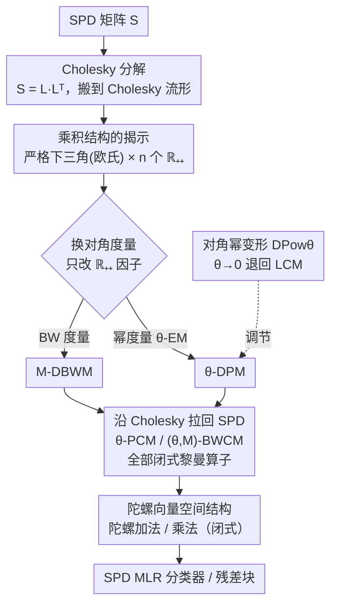

# Fast and Stable Riemannian Metrics on SPD Manifolds via Cholesky Product Geometry

**会议**: ICLR 2026  
**arXiv**: [2407.02607](https://arxiv.org/abs/2407.02607)  
**代码**: [github.com/GitZH-Chen/PCM_BWCM](https://github.com/GitZH-Chen/PCM_BWCM)  
**领域**: 其他  
**关键词**: SPD流形, 黎曼度量, Cholesky分解, 乘积几何, SPD神经网络

## 一句话总结

揭示Cholesky流形上的简单乘积结构，基于此提出两种快速且数值稳定的SPD度量（PCM和BWCM），所有黎曼算子均有闭式表达式，在SPD深度学习中实现效果、效率和稳定性的三重提升。

## 研究背景与动机

### SPD矩阵学习

对称正定（SPD）矩阵广泛应用于医学影像、脑电分析、信号处理和计算机视觉。SPD矩阵构成非欧几何流形 $\mathcal{S}_{++}^n$，传统欧氏方法不适用，需要黎曼度量来定义距离、测地线、对数/指数映射等基本运算。

### 现有SPD度量

目前主流度量包括：
- **AIM**（仿射不变度量）：理论性质好但计算昂贵（需SVD），$O(n^3)$ 复杂度
- **LEM**（对数欧氏度量）：需矩阵对数，数值不稳定
- **PEM**（幂欧氏度量）：需矩阵幂，较灵活
- **LCM**（对数Cholesky度量）：基于Cholesky分解，计算快且稳定，是目前实践中的常用选择
- **BWM**（Bures-Wasserstein度量）：来自最优传输，部分算子无闭式解
- **GBWM**（广义BWM）：BWM的推广

### LCM的优势与局限

LCM通过Cholesky分解将SPD运算转化为下三角矩阵运算，具有闭式算子、高效率和数值稳定性。但LCM的对角部分使用**对数映射**（log/exp），当对角元素很小时会导致数值溢出（如 $\log(10^{-15})$）或过度拉伸。

### 本文的核心洞察

LCM所对应的Cholesky度量（diagonal log metric）实际上具有一个**乘积结构**：严格下三角部分用欧氏度量，对角部分是 $n$ 个 $\mathbb{R}_{++}$ 上黎曼度量的乘积。这意味着**只要替换 $\mathbb{R}_{++}$ 上的度量**，就能得到新的Cholesky度量和SPD度量。

## 方法详解

### 整体框架

这篇论文要解决的是 SPD 流形上"既快又稳"的黎曼度量难题：现有度量要么慢（AIM 要 SVD），要么在对角元素逼近 0 时数值爆炸（LCM 的对数映射）。作者的破局点是先做一次 Cholesky 分解，把 SPD 流形搬到 Cholesky 流形上，再观察到这个 Cholesky 流形其实是一个**乘积空间**——严格下三角部分是平凡的欧氏空间，对角部分是 $n$ 个一维正实数流形 $\mathbb{R}_{++}$ 的乘积。整条 pipeline 因此变成：把 SPD 矩阵分解到 Cholesky 流形，只在对角的 $\mathbb{R}_{++}$ 因子上换一个更稳的度量（幂度量得到 θ-DPM，BW 度量得到 M-DBWM），再把新度量沿 Cholesky 映射拉回 SPD 流形，得到 θ-PCM 与 (θ,M)-BWCM 两族新度量。因为只改了对角这一个一维因子，所有黎曼算子都能继承闭式表达式，并进一步补上一套陀螺代数结构供 SPD 网络调用。

### 关键设计

**1. 乘积结构的揭示：把度量设计降维到 $\mathbb{R}_{++}$ 上的一道选择题**

整篇方法的地基是这样一个观察：LCM 背后的 Cholesky 度量（diagonal log metric）并不是铁板一块，而是可以拆成一个乘积流形

$$\{\mathcal{L}_{++}^n, g^{\text{DL}}\} = \{\mathcal{SL}^n, g^E\} \times \underbrace{\{\mathbb{R}_{++}, g^{\mathbb{R}_{++}}\} \times \cdots \times \{\mathbb{R}_{++}, g^{\mathbb{R}_{++}}\}}_{n}$$

其中 $\mathcal{SL}^n$ 是严格下三角矩阵空间（配欧氏度量 $g^E$），每个 $\mathbb{R}_{++}$ 对应一个对角元素。LCM 在对角上用的度量是 $g_p(v,w) = p^{-2}vw$，正好是 AIM/LEM/LCM 在一维 $\mathcal{S}_{++}^1$ 上退化后的统一形式。这个拆分之所以关键，是因为它把"设计一个全新 SPD 度量"这种高维难题，降维成了"在 $\mathbb{R}_{++}$ 上挑一个一维度量"——只要换掉对角因子的度量，就自动得到一族新的 Cholesky 度量进而得到新的 SPD 度量。

**2. 换对角度量：两族快速稳定的新度量，且算子全闭式**

顺着上面的乘积结构，作者把对角 $\mathbb{R}_{++}$ 上的度量分别换成两种更友好的选择。第一种是 θ-DPM（Diagonal Power Metric），对角改用幂欧氏度量（$\theta$-EM）：

$$g_L^{\theta\text{-DE}}(X,Y) = \langle \lfloor X \rfloor, \lfloor Y \rfloor \rangle + \langle \mathbb{L}^{\theta-1}\mathbb{X}, \mathbb{L}^{\theta-1}\mathbb{Y} \rangle$$

第二种是 M-DBWM（Diagonal Bures-Wasserstein Metric），对角改用来自最优传输的 BW 度量：

$$g_L^{\mathbb{M}\text{-DBW}}(X,Y) = \langle \lfloor X \rfloor, \lfloor Y \rfloor \rangle + \frac{1}{4}\langle \mathbb{L}^{-1}\mathbb{X}, \mathbb{M}^{-1}\mathbb{Y} \rangle$$

式中 $\lfloor\cdot\rfloor$ 取严格下三角部分、$\mathbb{L}/\mathbb{X}$ 取对角部分。两个式子的下三角项都保持欧氏内积不变，区别只在对角项——这正是乘积结构带来的模块化好处：换度量是局部手术，不牵动整体。

因为只动了对角这一个一维因子，θ-DPM 与 M-DBWM 拉回 SPD 流形后得到的 θ-PCM 与 (θ,M)-BWCM，测地线、对数映射、指数映射、平行移动、距离、加权 Fréchet 均值全部保留闭式表达式，无需迭代求解——这就是"换度量不丢可计算性"。以 θ-DPM 下的距离为例：

$$d^2(L,K) = \|\lfloor K \rfloor - \lfloor L \rfloor\|_F^2 + \frac{1}{\theta^2}\|\mathbb{K}^\theta - \mathbb{L}^\theta\|_F^2$$

把它和 LCM 对照就能看出数值稳定性的来源：LCM 的对角项用 $\log(\mathbb{K}) - \log(\mathbb{L})$，而 θ-DPM 用 $\mathbb{K}^\theta - \mathbb{L}^\theta$。当对角元素 $x \to 0^+$ 时，$\log(x)$ 直冲 $-\infty$（如 $\log(10^{-15})$ 直接溢出），而 $x^\theta$ 只是温和地趋向 0——用幂函数替代对数/指数函数，正是整套方法又稳（小特征值不溢出）又快（无需 SVD）的根本。

**3. 对角幂变形：一个旋钮连续插值新旧度量**

为了把新度量和已有度量统一在一个框架里，作者定义了对角幂变形 $\text{DPow}_\theta$，用参数 $\theta$ 在两端之间连续插值：$\theta \to 0$ 时变形后的度量趋向对数 Cholesky 度量（即退回 LCM），$\theta = 1$ 时恢复本文提出的度量。这样 $\theta$ 就成了一个可调旋钮，让使用者按数据特性（对角元素是否均衡）在"接近 LCM"和"本文新度量"之间权衡，而不必在两套互不相通的度量里二选一。

**4. 陀螺向量空间结构：给 SPD 网络补上代数基础**

要把这些度量真正用进 SPD 神经网络，还需要一套能做"加法/乘法"的代数结构。作者在新度量下给出了陀螺加法与陀螺乘法的闭式表达式，例如陀螺加法：

$$L \oplus K = \lfloor L \rfloor + \lfloor K \rfloor + (\mathbb{L}^\beta + \mathbb{K}^\beta - I)^{1/\beta}$$

并证明它满足陀螺交换群与陀螺向量空间的全部公理。有了这套闭式的群运算，后面的 SPD MLR 分类器、SPD 残差块等网络组件才能直接套用新度量来搭建。

### 损失函数 / 训练策略

将新度量应用于两种SPD网络组件：

**SPD MLR分类器**（基于点到超平面距离的黎曼推广）：

$$p(y=k|S) \propto \exp\left[\langle \lfloor K \rfloor - \lfloor L_k \rfloor, \lfloor A_k \rfloor \rangle + \frac{1}{2\theta}\langle \mathbb{K}^\theta - \mathbb{L}_k^\theta, \mathbb{A}_k \rangle\right]$$

**SPD残差块**（基于黎曼指数映射的推广）：
$$Y = \text{Exp}_X(Q \cdot \text{diag}(f(\text{spec}(X))) \cdot Q^T)$$

## 实验关键数据

### 主实验

**Table 2：SPDNet + SPD MLR分类器**

| 度量 | Radar (Acc/Time) | HDM05 3-Block (Acc/Time) | FPHA (Acc/Time) |
|------|:-:|:-:|:-:|
| AIM | 94.53 / 0.80s | 61.14 / 19.23s | 85.57 / 7.14s |
| LEM | 93.55 / 0.76s | 60.28 / 3.50s | 85.90 / 0.98s |
| LCM | 93.49 / 0.72s | 62.33 / 2.90s | 86.37 / 0.74s |
| **θ-PCM** | **95.79 / 0.72s** | **65.75 / 2.76s** | **89.40 / 0.69s** |
| θ-BWCM | 93.93 / 0.71s | 67.40 / 2.87s | 86.27 / 0.70s |

**Table 3：GyroSPD骨干**

| 度量 | Radar | HDM05 | FPHA |
|------|:-:|:-:|:-:|
| LCM | 96.29 | 68.37 | 89.83 |
| **θ-PCM** | **97.04** | **71.93** | **91.17** |
| **θ-BWCM** | 96.21 | **72.74** | **91.00** |

在HDM05（动作识别）上，θ-BWCM比LCM高出+5.1%精度（GyroSPD骨干下+4.37%）。

### 消融实验

**数值稳定性：小特征值测试（Table 5）**

| $\epsilon$（最小特征值） | DLM失败率 | θ-DPM失败率 | θ-DBWM失败率 |
|:-:|:-:|:-:|:-:|
| $10^{-1}$ | 0.62% | **0%** | **0%** |
| $10^{-3}$ | 51.32% | **0%** | **0%** |
| $10^{-5}$ | 99.39% | **0%** | **0%** |
| $10^{-10}$ | 100% | **0%** | **0%** |
| $10^{-20}$ | 100% | **0%** | **0%** |

对数Cholesky度量（DLM/LCM）在小特征值时几乎100%失败（产生Inf/NaN），而本文提出的度量**完全不失败**。

**变形参数 $\theta$ 消融**：从 $-2$ 到 $1.5$ 扫描 $\theta$ 值，在HDM05（Cholesky对角元素高度不均衡的数据集）上存在显著最优 $\theta$，而在Radar/FPHA（对角元素较均衡）上影响较小。

### 关键发现

1. θ-PCM和θ-BWCM在精度上通常超越LCM，尽管两者同源于Cholesky乘积结构
2. 新度量的计算速度与LCM相当（远快于AIM的10-25倍），且在高维（256×256）下更优
3. 残差块实验（Table 4）中θ-PCM在所有数据集上取得最佳精度
4. 数值稳定性是决定性优势——在任何特征值范围下零失败率

## 亮点与洞察

1. **乘积结构的揭示**：看似简单但极具指导意义——将度量设计问题降维到 $\mathbb{R}_{++}$ 上的度量选择
2. **幂函数替代对数函数**：核心数值洞察——$x^\theta$ 比 $\log(x)$ 在 $x \to 0^+$ 时温和得多
3. **理论完备性**：提供了完整的黎曼算子闭式表达式 + 陀螺向量空间公理验证 + 变形连续性
4. **实用性强**：直接插入现有SPD网络框架（SPDNet、GyroSPD、RResNet），无需修改架构

## 局限与展望

1. 实验限于中小规模SPD矩阵（$n \leq 93$），超大规模（如 $n > 1000$）的表现有待验证
2. 仅考虑了分类任务，回归/生成等其他SPD学习任务未涉及
3. $\theta$ 和 $\mathbb{M}$ 的选择目前依赖网格搜索，理论最优选择指导尚缺
4. 乘积结构假设严格下三角部分用标准欧氏度量，能否用更灵活的度量？
5. 与BWM在全SPD矩阵上的比较不完全公平（BWM不基于Cholesky分解）

## 相关工作与启发

- **LCM**（Lin, 2019）：本文的直接基础，揭示了其度量的乘积结构本质
- **GyroSPD**（Nguyen & Yang, 2023）：提供了陀螺向量空间框架，本文扩展其代数结构
- **SPD ResNet**（Katsman et al., 2024）：提供了残差块框架，本文直接适配新度量
- **Thanwerdas & Pennec (2022)**：SPD变形度量的理论框架，本文在Cholesky层面实现了类似思想
- 启发：**任意流形上的乘积结构识别**可能是设计高效度量的通用策略

## 评分

| 维度 | 分数 |
|------|------|
| 新颖性 | ★★★★☆ |
| 技术深度 | ★★★★★ |
| 实验充分性 | ★★★★☆ |
| 写作质量 | ★★★★★ |
| 实用价值 | ★★★★☆ |

<!-- RELATED:START -->

## 相关论文

- [\[ICLR 2026\] Evaluating GFlowNet from Partial Episodes for Stable and Flexible Policy-Based Training](evaluating_gflownet_from_partial_episodes_for_stable_and_flexible_policy-based_t.md)
- [\[ICML 2026\] Decision Tree Learning on Product Spaces](../../ICML2026/others/decision_tree_learning_on_product_spaces.md)
- [\[ICML 2026\] Riemannian Networks over Full-Rank Correlation Matrices](../../ICML2026/others/riemannian_networks_over_full-rank_correlation_matrices.md)
- [\[ICLR 2026\] Probabilistic Kernel Function for Fast Angle Testing](probabilistic_kernel_function_for_fast_angle_testing.md)
- [\[ICLR 2026\] Refine Now, Query Fast: A Decoupled Refinement Paradigm for Implicit Neural Fields](refine_now_query_fast_a_decoupled_refinement_paradigm_for_implicit_neural_fields.md)

<!-- RELATED:END -->
