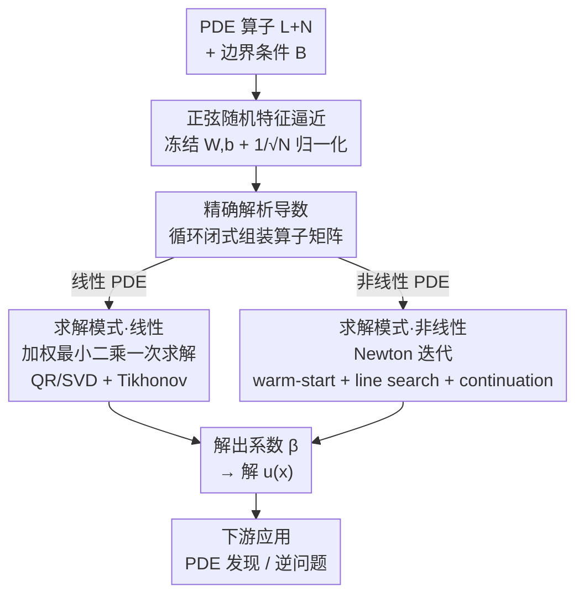

# FastLSQ: Solving PDEs in One Shot via Fourier Features with Exact Analytical Derivatives

**会议**: ICLR2026  
**arXiv**: [2602.10541](https://arxiv.org/abs/2602.10541)  
**代码**: [sulcantonin/FastLSQ](https://github.com/sulcantonin/FastLSQ) (`pip install fastlsq`)  
**领域**: 其他  
**关键词**: PDE solving, random Fourier features, physics-informed computing, one-shot solver, Newton-Raphson, inverse problems

## 一句话总结
利用正弦基函数的循环导数闭式结构，实现了无需自动微分、无需迭代训练的 PDE 一次性求解框架，在线性 PDE 上 0.07s 达到 $10^{-7}$ 精度，非线性 PDE 上 <9s 达到 $10^{-8}$–$10^{-9}$ 精度，比 PINNs 快数千倍且精确数个数量级。

## 背景与动机
- **经典数值方法**（有限元、有限差分、谱方法）是科学计算主力，但高维问题（$d \geq 5$）计算量随 $h^{-d}$ 爆炸，且需要大量问题特定的实现工作
- **PINNs** 提供了无网格替代方案，但存在严重缺陷：训练需要数分钟到数小时、存在 spectral bias、因果性违反、损失权重敏感等问题
- **随机特征方法**（如 PIELM、RF-PDE）是折中路线，冻结随机参数只训练线性输出层。但 PIELM 使用 $\tanh$ 激活函数，缺乏闭式循环导数结构，需要为每个 PDE 算子手动推导符号微积分；RF-PDE 仍需 600–2000 轮迭代优化
- **核心观察**：正弦特征 $\phi_j(\mathbf{x}) = \sin(\mathbf{W}_j \cdot \mathbf{x} + b_j)$ 的任意阶导数具有循环闭式结构（$\sin \to \cos \to -\sin \to -\cos$），可在 $\mathcal{O}(1)$ 内完成任意线性微分算子矩阵的组装，无需自动微分或计算图

## 核心问题
如何构建一个**算子无关**（operator-agnostic）的 PDE 求解框架，既能避免 PINNs 的迭代训练开销，又能消除 PIELM 针对每个新 PDE 算子手动推导导数公式的负担？

## 方法详解

### 整体框架
FastLSQ 把 PDE 解写成一组冻结的正弦随机特征（random Fourier features）的线性组合，只解那一层线性系数。它的全部技巧建立在一个被长期忽视的初等事实上：正弦的导数在 $\sin\to\cos\to-\sin\to-\cos$ 之间循环，所以把任意线性微分算子作用到特征上都有闭式表达式，无需自动微分（automatic differentiation）也无需搭计算图。流程因此非常短：先随机采样并冻结一批正弦基，再用闭式导数把 PDE 算子组装成系数矩阵；线性 PDE 退化成一次最小二乘（least squares）直接求出系数，非线性 PDE 退化成几步 Newton 迭代，每步仍只是一次线性求解；拿到系数就得到解 $u(\mathbf{x})$。由于导数精确，同一套结构还能直接撬动 PDE 发现与逆问题。整个过程对 PDE 算子的种类完全无感。

### 关键设计

**1. 正弦随机特征逼近：用冻结基把"求解 PDE"变成"解系数"**

整体框架要先有一个可解的解空间。框架用 $N$ 个随机正弦基逼近解 $u(\mathbf{x})$：$u_N(\mathbf{x}) = \frac{1}{\sqrt{N}} \sum_{j=1}^{N} \beta_j \sin(\mathbf{W}_j^\top \mathbf{x} + b_j)$，其中频率 $\mathbf{W}_j \sim \mathcal{N}(\mathbf{0}, \sigma^2 \mathbf{I}_d)$ 与相位 $b_j \sim \mathcal{U}(0, 2\pi)$ 随机采样后冻结不变，唯一待定的就是线性系数 $\boldsymbol{\beta}$——这是把无限维 PDE 求解压成有限维线性代数的第一步。这里最不能省的是 $1/\sqrt{N}$ 归一化：它让经验核稳定收敛到高斯 RBF 核，避免系数膨胀到 $10^6$–$10^8$ 量级把线性系统拖入病态，消融显示去掉它精度直接掉 4 个数量级甚至发散。带宽 $\sigma$ 决定能抓多细的频率，单一 $\sigma$ 难以同时覆盖光滑大尺度和尖锐小尺度，于是框架用多块（multi-block）架构，把 $B$ 个各带不同带宽 $\sigma_b$ 的块拼成一个长特征向量一起求解（实验里取 3 块 × 500 共 1500 个特征）。

**2. 精确解析导数：一个公式吃掉所有线性算子**

有了基函数，还要把 PDE 算子作用上去——这是全文的命门，也是相对 PIELM 的根本优势所在。对任意多重指标 $\alpha=(\alpha_1,\dots,\alpha_d)$，特征的高阶导数有统一闭式：

$$D^\alpha \phi_j(\mathbf{x}) = \left(\prod_{k=1}^d W_{jk}^{\alpha_k}\right)\Phi_{|\alpha|\bmod 4}(\mathbf{W}_j^\top \mathbf{x} + b_j),\quad \Phi_0=\sin,\ \Phi_1=\cos,\ \Phi_2=-\sin,\ \Phi_3=-\cos$$

也就是说常见算子都坍缩成"一次三角函数求值乘以权重单项式"：Laplacian 是 $\Delta\phi_j=-\|\mathbf{W}_j\|^2\sin(\cdot)$，Biharmonic 是 $\Delta^2\phi_j=\|\mathbf{W}_j\|^4\sin(\cdot)$，Advection 是 $\mathbf{v}\cdot\nabla\phi_j=(\mathbf{v}\cdot\mathbf{W}_j)\cos(\cdot)$。组装任意线性微分算子矩阵因此只要 $\mathcal{O}(1)$，彻底绕开自动微分和符号推导。对比之下 PIELM 用的 $\tanh$ 没有这种循环结构（$n$ 阶导是 $n+1$ 次多项式），每换一个算子都得手推一遍——这正是 FastLSQ 做到"算子无关"（operator-agnostic）的来由，也是它在相同特征数下精度高 10×–1000× 的根因。

**3. 两种求解模式：线性 PDE 一次最小二乘、非线性 PDE 几步 Newton**

算子矩阵装好后，剩下的就是解系数 $\boldsymbol{\beta}$，分两条路。对线性 PDE $\mathcal{L}[u]=f$ 加边界条件 $\mathcal{B}[u]=g$，由于导数都是闭式、方程对 $\boldsymbol{\beta}$ 完全线性，把内部点和边界点堆成一个加权增广系统 $\begin{pmatrix}\mathbf{A}^{\text{pde}}\\ \lambda\mathbf{A}^{\text{bc}}\end{pmatrix}\boldsymbol{\beta}=\begin{pmatrix}\mathbf{f}\\ \lambda\mathbf{g}\end{pmatrix}$，用 QR 或 SVD 一次性算出 $\boldsymbol{\beta}^*=\mathbf{A}^\dagger\mathbf{b}$——没有迭代、没有梯度下降，这就是它 0.07s 解出 5D Poisson 的原因（配 Tikhonov 正则化压条件数，去掉精度掉 3 个数量级）。对非线性 PDE $\mathcal{L}[u]+\mathcal{N}[u]=f$，在系数空间跑 Newton-Raphson 迭代 $\mathbf{J}^{(k)}\delta\boldsymbol{\beta}=-\mathbf{R}^{(k)},\ \boldsymbol{\beta}^{(k+1)}=\boldsymbol{\beta}^{(k)}+\alpha\,\delta\boldsymbol{\beta}$，Jacobian 仍是闭式、每步仍是一次线性求解，复用同一套解析装配。为在对流主导问题上稳住收敛，作者叠了四个手段：用线性解作 warm-start 给好初值、backtracking line search 限步长、以解级别变化 $\|\Delta u\|/\|u\|$ 而非系数变化作收敛判据、以及 continuation 同伦（把 Burgers 粘度沿 $\nu=1.0\to0.5\to0.2\to0.1$ 逐步降）——消融显示去掉 warm-start 或 continuation 会掉一个数量级乃至发散。代价是 Newton 模式比线性慢 40–100 倍（4–9s）。

**4. 解析导数撬动的下游应用：PDE 发现与逆问题**

因为导数是精确闭式而非有限差分，同一套结构顺手吃下两类下游任务。PDE 发现里，解析导数字典比有限差分干净约 6000 倍（RMSE 0.4 对 2500），把 SINDy（稀疏回归发现方程）能容忍的噪声范围大幅拉宽；逆问题里，由于前向只是一次预分解的线性求解，梯度能解析地反传，于是能从 4 个传感器反演 4 个各向异性高斯热源（共 24 个参数），或从 8 个稀疏磁场测量恢复隐藏线圈位置（误差 <0.02）。这把"解一个 PDE"延伸成了"可微分数字孪生"。

## 实验关键数据

### 线性 PDE（Solver Mode）

| 问题 | FastLSQ 时间 | FastLSQ $L^2$ | PINNacle 时间 | PINNacle $L^2$ | 加速比 |
|------|------------|-------------|-------------|--------------|--------|
| Poisson 5D | 0.07s | 4.8e-7 | ~1780s | 4.7e-4 | 25000× |
| Wave 1D | 0.06s | 1.3e-6 | ~272s | 9.8e-2 | 4500× |
| Helmholtz 2D | 0.08s | 1.9e-6 | N/A | N/A | — |
| Maxwell 2D | 0.05s | 6.7e-7 | N/A | N/A | — |

### 非线性 PDE（Newton Solver Mode）
- NL-Poisson：$L^2 = 6.1 \times 10^{-8}$（8.2s），甚至优于拟合精确解的回归基线（$1.9 \times 10^{-7}$）
- Burgers ($\nu=0.1$)：$L^2 = 3.9 \times 10^{-9}$（7.4s，48 次迭代含同伦）
- 与 scikit-fem P2 FEM 对比：FastLSQ 在 1500 特征下达到 $10^{-7}$–$10^{-9}$，FEM 在 ~4000 DoF 下为 $10^{-6}$

### 消融实验
- 去掉 $1/\sqrt{N}$ 归一化：精度下降 4 个数量级或发散
- 去掉 Tikhonov 正则化：精度下降 3 个数量级
- 去掉 warm-start：精度下降 1 个数量级或发散
- 去掉 continuation：Burgers 问题发散

### sin vs tanh 基函数对比（相同求解协议）
精度差距 10×–1000× 完全归因于基函数选择。梯度精度方面，FastLSQ 的梯度误差通常在值误差的一个数量级内，而 PIELM 的梯度误差差 10×–100×。

## 亮点
- **极其简洁的核心洞察**：正弦函数的循环导数性质（$\sin \to \cos \to -\sin \to -\cos$）看似初等，但其对 PDE 求解的实际意义被长期忽视，将其系统化为通用求解框架非常巧妙
- **算子无关性**：一个公式适用于任意线性微分算子，而 PIELM 每换一个 PDE 就要手动推一遍
- **速度与精度兼得**：线性 PDE 在 0.07s 内达到 $10^{-7}$，比最快 PINN 变体快 25000 倍且精确 1000 倍
- **实用下游应用**：PDE 发现（解析导数字典）和逆问题（热源/线圈定位）展示了框架的实际工程价值
- **完整的可复现包**：`pip install fastlsq`，代码公开

## 局限与展望
- 带宽 $\sigma$ 需要网格搜索调参，尚无自动选择策略（虽然可微分优化在附录有演示）
- 高阶 PDE 或大 $\sigma$ 时单项式前因子放大条件数，限制可达精度
- 当前仅支持简单 box 域，不规则几何需要额外的边界采样策略
- $1/\sqrt{N}$ 归一化意味着增加 $N$ 不能简单提升精度，大 $N$ 时核逼近饱和且条件恶化
- Newton 扩展虽有效但比线性模式慢 40–100 倍（4–9s vs <0.1s）
- 对含间断的解（如激波）正弦基会产生 Gibbs 振荡，此时 $\tanh$ 基反而更稳健

## 与相关工作的对比

| 方法 | 类型 | 迭代 | 算子推导 | 典型精度 | 典型时间 |
|------|------|------|---------|---------|---------|
| **FastLSQ** | 正弦随机特征 | 线性一次/NL Newton | 闭式通用 | $10^{-7}$–$10^{-9}$ | 0.07–9s |
| PIELM | tanh 随机特征 | 一次 | 手动逐算子 | $10^{-3}$–$10^{-6}$ | ~0.07s |
| PINNs | 神经网络 | SGD 数千步 | 自动微分 | $10^{-2}$–$10^{-4}$ | 270–7500s |
| RF-PDE | 随机特征 | 600–2000 轮 | 自动微分 | $10^{-3}$–$10^{-5}$ | 38–51s |
| RBF Kansa | 径向基函数 | 一次 | 解析 | ~$10^{-5}$ | 依问题而定 |
| FEM | 有限元 | 直接 | 弱形式 | ~$10^{-6}$ | $d \geq 5$ 不可行 |

## 启发与关联
- 这篇工作表明 **"回到初等数学找闭式结构"** 在深度学习主导的时代仍有巨大价值——正弦的循环导数是高中知识，但系统利用它可以碾压复杂的神经网络方法
- 随机 Fourier 特征（Rahimi & Recht 2007）在核方法领域已经很经典，本文将其与 PDE 求解的需求精准对接，是一个漂亮的跨领域迁移
- 解析导数字典对 SINDy 类方法的提升（6000×）暗示在科学发现任务中，**表示的可微分性质量**可能比模型容量更重要
- 对逆问题的应用（热源定位、线圈恢复）展示了从 "解 PDE" 到 "可微分数字孪生" 的路径

## 评分
- 新颖性: ⭐⭐⭐⭐ （核心洞察虽初等但被系统化为通用框架，与 PIELM 区分明确）
- 实验充分度: ⭐⭐⭐⭐⭐ （17 个 PDE、多基线、消融、逆问题、梯度精度分析，极为全面）
- 写作质量: ⭐⭐⭐⭐⭐ （论述清晰、表格信息量大、与相关工作的对比非常公允）
- 价值: ⭐⭐⭐⭐ （对 PDE 求解社区有很高的实用价值，pip 包降低使用门槛）

<!-- RELATED:START -->

## 相关论文

- [\[CVPR 2026\] Content-Aware Frequency Encoding for Implicit Neural Representations with Fourier-Chebyshev Features](../../CVPR2026/others/content-aware_frequency_encoding_for_implicit_neural_representations_with_fourie.md)
- [\[ICLR 2026\] Latent Fourier Transform](latent_fourier_transform.md)
- [\[NeurIPS 2025\] Exact Learning of Arithmetic with Differentiable Agents](../../NeurIPS2025/others/exact_learning_of_arithmetic_with_differentiable_agents.md)
- [\[AAAI 2026\] Online Linear Regression with Paid Stochastic Features](../../AAAI2026/others/online_linear_regression_with_paid_stochastic_features.md)
- [\[AAAI 2026\] Certified Branch-and-Bound MaxSAT Solving (Extended Version)](../../AAAI2026/others/certified_branch-and-bound_maxsat_solving_extended_version.md)

<!-- RELATED:END -->
