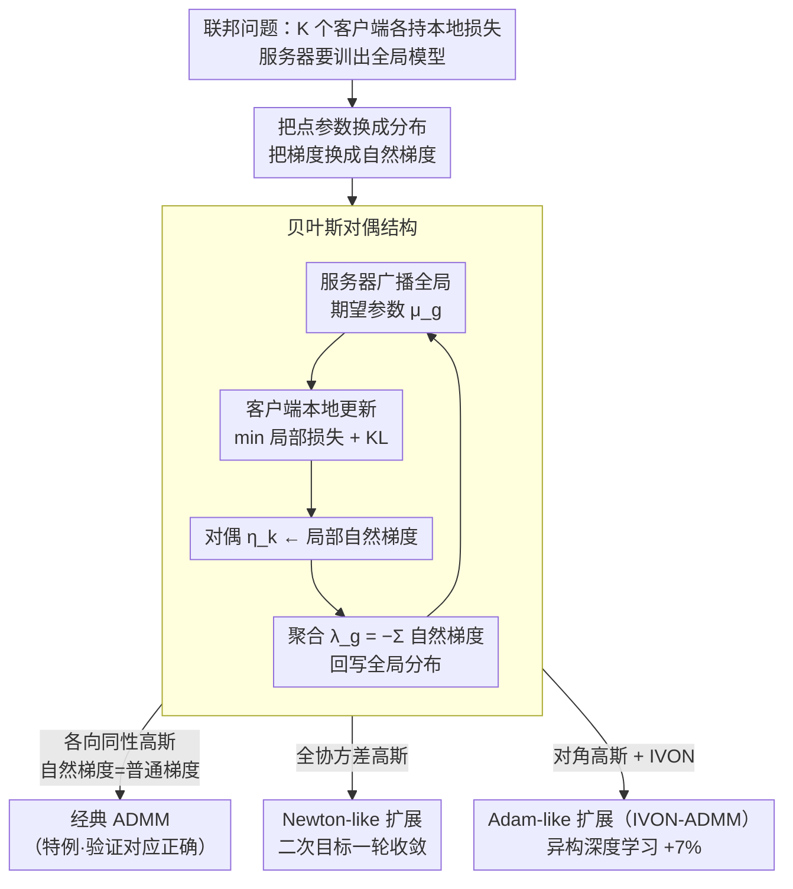

# Federated ADMM from Bayesian Duality

**会议**: ICLR 2026  
**arXiv**: [2506.13150](https://arxiv.org/abs/2506.13150)  
**代码**: [有](https://github.com/xxx)  
**领域**: 其他  
**关键词**: ADMM, 变分贝叶斯, 自然梯度, 联邦学习, 贝叶斯对偶

## 一句话总结
从变分贝叶斯(VB)视角推导出ADMM的贝叶斯对偶结构，证明经典ADMM是VB在各向同性高斯族上的特例，并导出Newton-like（二次目标一轮收敛）和Adam-like（深度异构场景+7%准确率）两个新扩展。

## 研究背景与动机

**领域现状**：ADMM是联邦学习的核心算法骨架，自1970年代提出至今形式几乎未变。其鲁棒的算法结构令人好奇：是否存在一个更一般的形式化能把它包进去。

**现有痛点**：ADMM已有的加速变体（过松弛、动量、缩放范数等）只是引入额外变量，并不改变算法本身的形式。Swaroop等人发现VB和ADMM之间存在逐行相似性，但始终无法推导出精确对应。

**核心矛盾**：ADMM是确定性优化框架，难以自然扩展到异构深度学习场景，因此需要一个更一般的框架来统一并泛化它。

**切入角度**：关键洞察是VB目标函数的解本身具有对偶结构，不仅与ADMM不动点结构类似，还自然泛化它；而此前一直缺失的关键环节是**自然梯度**。

**核心 idea**：用指数族分布的自然参数-期望参数对偶性建立"贝叶斯对偶"结构，ADMM正是VB在各向同性高斯族下的特例。

## 方法详解

### 整体框架
这篇论文要回答一个问题：经典ADMM能否被放进一个更一般的概率框架里。作者的做法是把ADMM的原始-对偶结构整体"翻译"到变分贝叶斯（variational Bayes, VB）的语言下。经典ADMM求解的是参数四元组 $(\theta_g^*, \theta_k^*, \mathbf{v}_k^*, \mathbf{v}_g^*)$ 构成的原始-对偶不动点；贝叶斯ADMM则把它升级为分布参数四元组 $(\mu_g^*, \mu_k^*, \eta_k^*, \lambda_g^*)$ 构成的期望参数-自然参数对偶。两者结构一一对应，核心差别只有两点：梯度换成自然梯度，点参数换成分布。

落到算法上，这套对偶结构就是一轮联邦通信：服务器广播全局分布参数 → 各客户端用它做本地更新、并把局部自然梯度当作对偶变量回传 → 服务器把这些自然梯度求和得到新的全局自然参数，如此迭代直到收敛。框架真正的灵活性在于"选哪种指数族分布"这一步：取各向同性高斯时自然梯度退回普通梯度，整套结构精确还原成经典ADMM（既是特例、也验证了对应关系）；换成全协方差高斯就得到一轮收敛的 Newton-like 变体；换成对角高斯（配合 IVON）则得到能跑深度模型的 Adam-like 变体。

### 关键设计

**1. 贝叶斯对偶结构：用指数族的自然-期望参数对偶复刻ADMM的原始-对偶**

VB目标的不动点条件可以写成全局自然参数等于各客户端损失自然梯度之和的负值，即 $\lambda_g^* = -\sum_{k=0}^{K} \nabla \mathcal{L}_k(\mu_g^*)$。作者为每个客户端引入局部分布 $q_k^*$ 和对偶变量 $\eta_k^*$，于是这条不动点条件展开成一组四条件结构，形态上与ADMM的四个更新（局部原始、全局原始、局部对偶、全局对偶）逐行对齐。关键在于这里用的是自然梯度而非普通梯度——正是这一步补上了Swaroop等人当年缺失的环节，让"逐行相似"升级成精确对应。当 $q$ 取各向同性高斯时，Fisher信息退化为单位阵，自然梯度等于普通梯度，整个结构精确恢复经典ADMM，从而证明经典ADMM只是这套贝叶斯对偶在最简分布族上的特例。

**2. Newton-like扩展：换成全协方差高斯，在二次目标上一轮收敛**

经典ADMM即使面对二次目标也要多轮迭代才能收敛。作者让 $q$ 取完整协方差的多元高斯，此时自然梯度自带Fisher信息矩阵的逆，在二次目标上恰好等价于Newton法的一步更新，因此只需一轮通信就能收敛到最优。这把ADMM在二次目标上的线性收敛直接压缩成一步到位，是对偶结构"免费"带来的加速，也从实验上验证了对应关系的正确性。

**3. Adam-like扩展（IVON-ADMM）：换成对角高斯，自适应学习率落地深度学习**

完整协方差的Fisher矩阵在深度模型上太贵、无法实用。作者改用对角协方差高斯，并借助IVON方法高效估计对角Fisher，于是每个参数维度获得各自的自适应步长，效果类似Adam。这样既保留了贝叶斯对偶的结构优势，又把计算开销压到与普通联邦学习相当的水平，使整套框架真正能跑在异构深度学习场景上。

### 损失函数 / 训练策略
- 客户端：最小化局部损失 + KL 正则（贝叶斯版本的局部目标）
- 服务器：聚合的是自然梯度参数（分布的自然参数），而非梯度本身

## 实验关键数据

### 主实验
深度异构联邦学习：

| 方法 | 准确率 | 运行时间 | 说明 |
|------|--------|---------|------|
| FedADMM | 基线 | 基线 | 经典ADMM |
| FedAvg | 基线级 | 基线级 | 标准联邦 |
| IVON-ADMM | **+7%** | **相当** | Adam-like扩展 |

### 理论验证（二次目标）

| 方法 | 收敛轮数 | 说明 |
|------|---------|------|
| 经典ADMM | 多轮 | 线性收敛 |
| Newton-like ADMM | **1轮** | 一步到位 |

### 关键发现
- IVON-ADMM在深度异构场景（non-IID数据）上+7%准确率，且不增加通信和计算开销
- Newton-like变体在二次目标上确实一轮收敛，验证了理论预测
- 自然梯度是连通VB和ADMM的关键——正是Swaroop等人缺失的环节

## 亮点与洞察
- **数学之美**：经典ADMM竟然是贝叶斯方法在最简单分布族上的特例。这个关联不仅优美，还打开了用概率分布族泛化优化算法的新途径。
- **自然梯度的关键角色**：之前的工作用普通梯度无法建立精确对应，换成自然梯度后一切自然。说明信息几何在算法设计中的深层作用。
- **免费的午餐**：IVON-ADMM使用IVON的高效对角Fisher实现，不增加运行时间但显著提升异构场景性能。

## 局限与展望
- 深度学习实验规模较小（7层CNN），更大模型(LLM)上的效果未知
- 对角Fisher近似可能在某些模型上不够准确
- 需要选择指数族分布作为先验假设，分布选择的指导规则不明确
- 通信效率分析相对简单

## 相关工作与启发
- **vs FedADMM**: 经典ADMM是特例，贝叶斯ADMM提供了严格泛化
- **vs FedAvg**: 在异构场景下IVON-ADMM有显著优势
- **vs PVI (Swaroop 2025)**: 修复了PVI与ADMM之间的精确对应缺失

## 评分
- 新颖性: ⭐⭐⭐⭐⭐ 贝叶斯对偶结构原创且优美，统一了两大范式
- 实验充分度: ⭐⭐⭐ 理论验证充分但深度学习实验规模较小
- 写作质量: ⭐⭐⭐⭐⭐ 理论推导清晰，对偶图示直观
- 价值: ⭐⭐⭐⭐ 为联邦优化提供新的理论基础和实用扩展

<!-- RELATED:START -->

## 相关论文

- [\[ICLR 2026\] A Federated Generalized Expectation-Maximization Algorithm for Mixture Models with an Unknown Number of Components](a_federated_generalized_expectation-maximization_algorithm_for_mixture_models_wi.md)
- [\[ICLR 2026\] Bayesian Influence Functions for Hessian-Free Data Attribution](bayesian_influence_functions_for_hessian-free_data_attribution.md)
- [\[NeurIPS 2025\] Rethinking PCA Through Duality](../../NeurIPS2025/others/rethinking_pca_through_duality.md)
- [\[CVPR 2026\] Towards Stable Federated Continual Test-Time Adaptation in Wild World](../../CVPR2026/others/towards_stable_federated_continual_test-time_adaptation_in_wild_world.md)
- [\[AAAI 2026\] Bayesian Network Structural Consensus via Greedy Min-Cut Analysis](../../AAAI2026/others/bayesian_network_structural_consensus_via_greedy_min-cut_analysis.md)

<!-- RELATED:END -->
