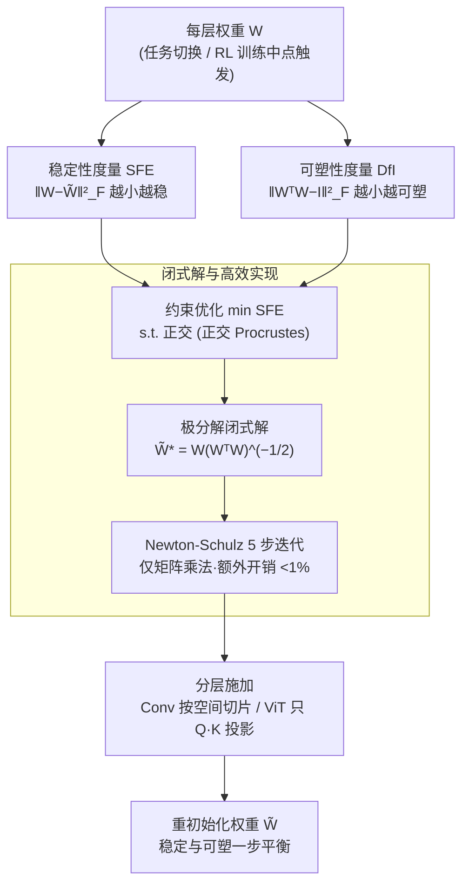

# FIRE: Frobenius-Isometry Reinitialization for Balancing the Stability-Plasticity Tradeoff

**会议**: ICLR 2026 Oral  
**arXiv**: [2602.08040](https://arxiv.org/abs/2602.08040)  
**代码**: 有  
**领域**: 持续学习 / 强化学习  
**关键词**: stability-plasticity, reinitialization, orthogonal Procrustes, continual learning, plasticity loss

## 一句话总结
将持续学习中的稳定性-可塑性平衡形式化为约束优化问题——最小化权重偏差（稳定性）同时约束权重正交性（可塑性），得到正交 Procrustes 问题的闭式解 $\tilde{W}^* = W(W^\top W)^{-1/2}$（极分解），通过 Newton-Schulz 迭代高效实现（<1% 额外时间），在视觉持续学习、LLM 持续预训练和 RL 上全面超越 S&P 等基线。

## 研究背景与动机

**领域现状**：神经网络在非平稳数据上训练时面临 **稳定性-可塑性困境**：强稳定性→模型僵化无法学新知识；强可塑性→灾难性遗忘丢失旧知识。现有方法包括 Shrink & Perturb (S&P)、DASH、重初始化等。

**现有痛点**：(a) S&P 需要仔细调 shrinkage 和 perturbation 比例；(b) DASH 计算成本高（69 秒 vs FIRE 0.06 秒）；(c) 完全重初始化破坏有用知识导致不稳定；(d) 现有可塑性度量（损失面曲率、休眠神经元、特征秩）不可微且依赖数据，难以直接优化。

**核心矛盾**：稳定性要求权重不变，可塑性要求权重"好"（正交、低曲率）。两者如何在一个公式中统一？

**本文目标** 提出一个有闭式解的原则性重初始化方法，自动找到稳定性和可塑性的最优平衡点，无需超参数调优。

**切入角度**：提出 **Deviation from Isometry (DfI)** 作为可微、数据无关的可塑性度量：$\text{DfI}(W) = \|W^\top W - I\|_F^2$。证明 DfI 同时捕获损失面曲率（Theorem 2）、特征秩（Theorem 3）、休眠神经元（Theorem 4）。

**核心 idea**：将重初始化建模为"最小化权重偏差 subject to 正交约束"，得到极分解闭式解，一步搞定稳定性-可塑性平衡。

## 方法详解

### 整体框架
FIRE 想解决的是：持续学习里换任务或换数据分布时，到底该不该动权重、动多少。它不在训练过程中加正则，而是在两个学习阶段交界处（视觉/语言任务每次新数据到来、RL 训练中点）对每层权重做一次性的正交化重初始化 $\tilde{W}^* = W(W^\top W)^{-1/2}$。这一步同时满足两个相互拉扯的目标：偏离原权重尽量小（保稳定性），又把权重拉成正交矩阵（恢复可塑性）。整个方法的骨架是先给两侧各立一个度量——稳定性侧的 SFE 和可塑性侧的 DfI，再把"稳定 vs 可塑"写成一个带约束的优化问题，最后证明它有闭式最优解（正交 Procrustes 的极分解），于是不需要任何超参数去权衡两者；落地时用 Newton-Schulz 迭代把这个解算得飞快，并按层结构分别施加。



### 关键设计

**1. 稳定性度量 SFE：用权重偏差量化"改动了多少知识"**

要保稳定，首先得有个东西去衡量重初始化把权重改了多少。FIRE 直接用平方 Frobenius 误差 $\text{SFE}(W, \tilde{W}) = \|W - \tilde{W}\|_F^2$ 来度量改动幅度——它小，说明新权重离旧权重近，旧任务学到的东西基本没被擦掉。这不是拍脑袋的代理量：Theorem 1 证明了 SFE 给出了新旧两个网络在归一化特征协方差差异上的上界，也就是说权重改得少，网络在特征空间里表现出来的行为也改得少，稳定性因此有了形式化的保证。

**2. 可塑性度量 DfI：用"偏离正交性"统一刻画可塑性丧失**

可塑性这一侧的麻烦在于，过去衡量"模型还学不学得动"的指标——损失面曲率、休眠神经元数量、特征秩——彼此割裂，而且大多不可微、还依赖数据，没法直接拿来优化。FIRE 提出一个可微且数据无关的单一指标，偏离等距度（Deviation from Isometry，DfI）$\text{DfI}(W) = \|W^\top W - I\|_F^2$，衡量权重矩阵离正交有多远。关键是三条定理把上述看似不同的症状都收编到 DfI 之下：Theorem 2 把 Hessian 谱范数（损失面曲率）上界成 layerwise DfI 的函数，DfI 低则损失面更平滑；Theorem 3 说明 DfI 低时特征有效秩高，所有维度都被有效利用；Theorem 4 说明最小化 DfI 会抬高神经元活性分数的下界，不会出现休眠神经元。于是"正交一点"就同时治好了曲率、秩塌缩和休眠三种病，这也让可塑性第一次变成一个可以直接优化的标量。

**3. 闭式解与高效实现：正交 Procrustes 的极分解，再用 Newton-Schulz 跑得飞快**

有了 SFE 和 DfI 两侧的度量，FIRE 把重初始化写成一个约束优化：$\min_{\tilde{W}} \|W - \tilde{W}\|_F^2 \;\text{ s.t. }\; \tilde{W}^\top \tilde{W} = I$，即"在所有正交矩阵里找一个离 $W$ 最近的"。这正是经典的正交 Procrustes 问题，最优解就是 $W$ 的极分解

$$\tilde{W}^* = W(W^\top W)^{-1/2}.$$

它一步同时压低 SFE（解本身就是最近的正交阵）和把 DfI 归零（解严格满足 $\tilde{W}^\top\tilde{W}=I$），稳定与可塑的权衡因此不靠调参、而是被这个闭式解一次性钉死。直接算极分解要做 SVD，成本 $O(d^3)$ 偏重；FIRE 改用 5 步 Newton-Schulz 迭代近似，全程只有矩阵乘法：

```python
X = X / ||X||
for _ in range(5):
    A = X.T @ X
    X = 1.5*X - 0.5*X @ A
```

迭代固定 5 次即收敛、对迭代数不敏感，整体额外开销 <1%，这也是 FIRE 比 DASH 快上千倍的原因。落地时这个重初始化还要按层结构分别施加：卷积层沿空间维度逐切片做（每个 $(i,j)$ 位置的 $W[:,:,i,j]$ 单独正交化，保证每个滤波器独立处理），ViT 只对 Q/K 投影正交化，避免破坏其它对正交性不敏感的参数；触发时机上，视觉/语言任务在每次新数据到来时做、RL 在训练中点做一次。

## 实验关键数据

### 主实验

| 基准 | 任务 | FIRE vs 最佳基线 |
|------|------|-----------------|
| CIFAR-10 (ResNet-18) | 持续分类 | 一致超越 S&P/DASH |
| CIFAR-100 (ViT-Tiny) | 持续分类 | 一致超越所有基线 |
| Tiny-ImageNet (VGG-16) | 持续分类 | 一致超越所有基线 |
| GPT-0.1B (WikiText→OWT) | LLM 持续预训练 | 超越 S&P（S&P 需调参）|
| Atari (DQN, 3 游戏) | 离散控制 | 超越 S&P |
| HumanoidBench (SAC) | 连续控制 | 竞争/超越 |

### 消融实验

| 分析 | 关键发现 |
|------|---------|
| DfI 对比 | FIRE 达到最低 DfI 同时最低 SFE |
| 损失面平滑度 | FIRE 产生比 S&P 更平滑的损失面 |
| 计算开销 | FIRE: 0.06s, 55MB vs DASH: 69s, 2834MB |
| Newton-Schulz 迭代数 | 5 即够，对此参数不敏感 |
| 完全重初始化 | 严重退化——擦除知识带来不稳定 |

### 关键发现
- **无超参数调优**：约束优化自动找到最优平衡，而 S&P/DASH 需要仔细调参
- **计算极轻**：0.06 秒 + 55MB，比 DASH 快 1000×
- **DfI 统一多种症状**：一个度量同时捕获曲率/秩/休眠神经元，理论优雅且实用
- **LLM 持续预训练有效**：在 GPT-0.1B 上验证了 FIRE 对大模型的适用性

## 亮点与洞察
- **原则性 > 启发式**：将稳定-可塑平衡建模为约束优化而非临时 trick，理论保证清晰。极分解正好是最优解——数学之美
- **DfI 作为可塑性的"统一理论"**：三个定理将损失面曲率、特征秩、休眠神经元统一到一个可微度量下，这个贡献可能比方法本身更持久
- **无需调参**：S&P 需要平衡 shrinkage 和 noise，FIRE 自动找到最优点。这对实际部署至关重要

## 局限与展望
- **仅在小型 LLM 上验证**：GPT-0.1B 太小，需验证 7B+ 模型
- **假设可访问旧数据**：某些持续学习场景中旧数据不可用
- **关于"何时做正交化"**：论文中在训练中点或任务切换时做一次，最优时机的自动选择未探索
- **RL 实验规模偏小**：仅 3 个 Atari 游戏和 HumanoidBench，更大规模 RL（如 MuJoCo 全套）未覆盖

## 相关工作与启发
- **vs S&P (Shrink & Perturb)**：S&P 将权重收缩后加随机噪声，启发式地平衡稳定-可塑。FIRE 证明正交投影是理论最优的、S&P 是次优的近似
- **与 Neon 的类比**：Neon 在权重空间做负外推改进生成模型，FIRE 在权重空间做正交投影改善持续学习——都是"在参数空间做简单变换获得大提升"的范式
- **与 LoongRL 的联系**：RL 训练中的可塑性丧失是实际问题，FIRE 可用于改善 GRPO 等 RL 训练的稳定性

## 评分
- 新颖性: ⭐⭐⭐⭐⭐ DfI 统一度量 + 正交 Procrustes 闭式解，理论创新突出
- 实验充分度: ⭐⭐⭐⭐ 跨视觉/NLP/RL 三个领域验证，但各领域规模偏小
- 写作质量: ⭐⭐⭐⭐⭐ 理论推导清晰，Theorem 链条完整，实验组织有序
- 价值: ⭐⭐⭐⭐⭐ 极简实用——一行代码解决持续学习核心问题，DfI 度量可广泛复用

<!-- RELATED:START -->

<div class="related-papers" markdown="1">

## 相关论文

- [\[NeurIPS 2025\] Plasticity as the Mirror of Empowerment](../../NeurIPS2025/others/plasticity_as_the_mirror_of_empowerment.md)
- [\[AAAI 2026\] Guided Perturbation Sensitivity (GPS): Detecting Adversarial Text via Embedding Stability and Word Importance](../../AAAI2026/others/guided_perturbation_sensitivity_gps_detecting_adversarial_text_via_embedding_sta.md)
- [\[CVPR 2026\] Parameter-efficient Continual Learning for Enhancing Plasticity without Forgetting under Limited Model Capacity](../../CVPR2026/others/parameter-efficient_continual_learning_for_enhancing_plasticity_without_forgetti.md)
- [\[ECCV 2024\] CLR-GAN: Improving GANs Stability and Quality via Consistent Latent Representation and Reconstruction](../../ECCV2024/others/clr-gan_improving_gans_stability_and_quality_via_consistent_latent_representatio.md)
- [\[NeurIPS 2025\] Meta-learning three-factor plasticity rules for structured credit assignment with sparse feedback](../../NeurIPS2025/others/meta-learning_three-factor_plasticity_rules_for_structured_credit_assignment_wit.md)

</div>

<!-- RELATED:END -->
