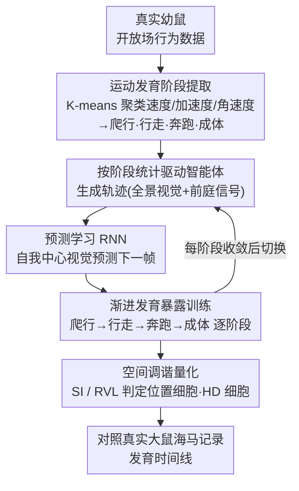

# From Movement to Cognitive Maps: RNNs Reveal How Locomotor Development Shapes Hippocampal Spatial Coding

**会议**: ICLR 2026 Oral  
**OpenReview**: [8bM7MkxJee](https://openreview.net/forum?id=8bM7MkxJee)  
**代码**: 有  
**领域**: 计算神经科学  
**关键词**: hippocampus, spatial coding, locomotor development, RNN, place cells, head direction cells, cognitive maps

## 一句话总结
结合幼鼠运动发育的聚类分析和浅层 RNN 预测学习模型，首次计算性地证明运动统计特征的发育变化（爬行→行走→奔跑→成年）驱动了海马空间调谐神经元（位置细胞、方向细胞、联合编码细胞）的序贯涌现，定量复现大鼠海马记录数据的发育时间线，并预测了联合位置-方向编码细胞在发育中逐渐增多这一现象且在实验数据中得到验证。

## 研究背景与动机
**领域现状**：海马体中存在位置细胞（place cells）、头方向细胞（HD cells）、边界细胞（border cells）、网格细胞（grid cells）等空间编码神经元。它们在个体发育中按特定时间线依次涌现（HD 细胞最早 ~P12，位置细胞 ~P16，网格细胞 ~P20），但驱动其涌现的计算机制未知。

**现有痛点**：已有模型（如 Cueva & Wei 2018、TEM）能在训练过程中产生空间表征，但它们使用恒定运动模式、直接提供空间坐标作为监督信号，从未考虑真实运动发育统计的影响。两种竞争假说——"内在电路成熟" vs "经验依赖发育"——尚无计算模型直接检验。

**核心矛盾**：运动经验被假设对空间认知至关重要，但没有计算模型能解释为什么发育不同阶段的运动特征（速度、加速度、转弯频率等）会导致不同类型的空间神经元在特定时间点涌现。

**本文目标** 建立运动发育统计与海马空间编码涌现之间的因果计算链路。

**切入角度**：用数据驱动方法提取真实幼鼠运动的发育阶段统计，驱动预测学习 RNN，检测其是否自发涌现出与生物数据匹配的空间编码发育时间线。

**核心 idea**：具身感知运动经验（embodied sensorimotor experience）的发育统计变化足以驱动海马空间编码的个体发育。

## 方法详解

### 整体框架
论文想回答一个具体问题：是否仅凭运动发育阶段的统计变化，就能驱动海马空间编码神经元按生物学时间线依次涌现。为此它搭了一条从行为数据到神经表征的计算链路——先从真实幼鼠的开放场行为里把运动统计（速度、加速度、转弯频率等）按发育阶段聚类出来，再用每个阶段的统计去驱动模拟环境中的智能体生成轨迹，让一个浅层 RNN 在这些轨迹上做"预测下一帧视觉"的自监督任务。RNN 按爬行→行走→奔跑→成体的顺序逐阶段训练，最后分析它隐藏状态的空间调谐特性，和真实大鼠海马记录的发育时间线逐项对照。

### 关键设计

**1. 运动发育阶段提取：让数据自己划出发育的转折点**

已有模型普遍用一套恒定的运动模式生成轨迹，根本没法反映幼鼠在不同年龄运动方式的质变，自然也就无从检验"运动发育是否驱动空间编码"。本文改从已发表的幼鼠开放场实验数据里提取速度、加速度、角速度等运动统计，再用 K-means 聚类把 P12–P60 的运动数据自动切成三个阶段——爬行（crawl, ~P12-P15）、行走（walk, ~P16-P19）、奔跑（run, ~P20+），外加成体阶段。关键在于发育阶段不是人为划的，而是聚类从运动模式里读出的自然转折点，这样喂给 RNN 的运动统计才真实对应生物学上的发育节点。

**2. 预测学习 RNN：用自我中心视觉，不给特权坐标**

以往模型（如路径积分类）往往直接把 $x$-$y$ 坐标作为监督信号喂进去，等于提前把"空间"这个答案泄露给了网络。本文换成预测学习框架：浅层 RNN 接收当前时刻的全景视觉 $\mathbf{v}_t \in \mathbb{R}^{80}$ 和前庭信号（角速度 $\omega_t$），用隐藏状态去预测下一时刻的视觉输入 $\hat{\mathbf{v}}_{t+1}$，

$$\mathbf{h}_t = f(\mathbf{W}_{vh}\mathbf{v}_t + \mathbf{W}_{hh}\mathbf{h}_{t-1} + \mathbf{W}_{\omega h}\omega_t + \mathbf{b}), \qquad \mathcal{L} = \|\hat{\mathbf{v}}_{t+1} - \mathbf{v}_{t+1}\|^2$$

这个选择有两层考虑：一是预测学习框架本身有大量文献支持（Eichenbaum et al. 2004; Levy 1989），海马常被建模成"比较传入感觉与记忆预测"的系统；二是只用自我中心视觉而非绝对位置坐标，空间表征就只能是网络为完成预测任务自发学出来的，而不是被直接灌进去的，这才让"运动统计驱动涌现"的结论站得住。

**3. 渐进发育暴露训练：把动物的成长顺序搬进训练课程**

要检验发育顺序本身是否重要，就不能一次性把所有运动模式混着训。本文让同一个 RNN 依次经历各阶段的轨迹——先在爬行模式的轨迹上训到收敛，再切到行走、奔跑、成体。每个阶段的轨迹都由带有该阶段运动统计（速度分布、转弯频率等）的模拟智能体在 $0.625 \times 0.625$ m 的环境里运动生成；成体阶段还额外引入网格细胞输入 $g(\mathbf{x}) = \sum_k \cos(\mathbf{k}_i \cdot \mathbf{x})$，scale 参数 $\lambda \in \{0.2, 0.4, 0.6\}$ m。这套渐进暴露其实就是在模拟真实动物的成长过程：幼鼠在不同年龄表现出质性不同的运动模式，每种模式给网络的是统计特征不同的感觉经验，发育顺序也因此被编码进了训练课程里。

**4. 空间调谐量化：用标准指标把"像不像空间细胞"算成数**

光看隐藏状态还不够，得有客观尺子才能和海马记录对齐。本文用标准空间信息指标量化位置编码，

$$SI = \sum_i p_i \frac{r_i}{\bar{r}} \log_2 \frac{r_i}{\bar{r}}$$

其中 $p_i$ 是落在第 $i$ 个空间 bin 的占用概率，$r_i$、$\bar{r}$ 分别是该 bin 的发放率与平均发放率；再用 Rayleigh 向量长度（RVL）量化方向选择性，最后用阈值法把符合标准的单元判定为位置细胞或 HD 细胞。为排除混淆因素，配套了一组对照实验：反转发育顺序、控制帧间时间间距、控制累积训练量——分别用来证明发育顺序、时间分辨率和训练量各自的作用边界。

## 实验关键数据

### 主实验：发育时间线匹配

| 发育阶段 | 对应年龄 | 位置细胞 | HD 细胞 | 联合编码 | 生物数据匹配 |
|---------|---------|---------|---------|---------|------------|
| 爬行 (crawl) | ~P12-15 | 少/无 | 微弱 | 无 | ✓ |
| 行走 (walk) | ~P16-19 | 涌现 | 成人样 | 涌现 | ✓ |
| 奔跑 (run) | ~P20+ | 增多 | 稳定 | 增多 | ✓ |
| 成体 (adult) | >P30 | 成熟 | 成熟 | 成熟 | ✓ |

### 消融实验

| 配置 | 关键指标 | 说明 |
|------|---------|------|
| 正常发育顺序 | SI 和 RVL 逐阶段递增 | 基线：匹配生物数据 |
| 反转发育顺序 | 空间编码涌现模式异常 | 证明发育顺序重要性 |
| 仅加速感觉变化 | 位置中心表征不涌现 | 仅改变帧率不等价于运动发育 |
| 控制累积训练量 | 不影响涌现时间线 | 排除训练量混淆 |
| 控制帧间距 | 不改变核心结论 | 排除时间分辨率混淆 |

### 关键发现
- 模型预测方向选择性主要通过联合位置-方向编码（conjunctive place-HD coding）涌现，而非先产生纯 HD 细胞——在海马记录数据中得到验证
- 跨试次空间编码相关性 >0.8，证明学到的表征稳定可靠
- 纯 HD 细胞在行走阶段 (~P16) 出现成人样调谐，匹配 MEC 中 HD 细胞 ~P15 的实验数据

## 亮点与洞察
- **首个运动发育→空间编码的计算桥梁**：此前只有描述性观察，本文首次提供了机制性解释
- **具身认知的计算证据**：运动不仅是输出，还是塑造认知表征的关键输入——对 embodied AI 有直接启示
- **预测→验证闭环**：模型产生新预测（联合编码细胞的发育规律），并在实验数据中确认，这是计算神经科学的黄金标准
- **发育式课程学习的灵感**：类似 curriculum learning，"先简单后复杂"的发育暴露顺序对表征学习至关重要

## 局限与展望
- 模型为单层 RNN，无法自发产生网格细胞（需要更复杂的 attractor dynamics）
- 环境为简单的 2D 方形区域，未测试复杂多房间环境
- 训练在 5.9s 级别短片段上进行，未测试长时间跨度的空间记忆
- 线性解码方式可能低估表征复杂性
- 未直接操控真实动物的运动发育来做因果验证

## 相关工作与启发
- **vs Cueva & Wei 2018**: 同样用 RNN 产生空间表征，但 Cueva 使用路径积分任务（直接给 x-y 坐标作监督）且未考虑运动发育变化
- **vs TEM (Whittington et al. 2020)**: TEM 使用多组件架构（attractor + 路径积分 + 多损失函数）解决结构知识问题，与本文关注发育机制的问题正交
- **vs Levenstein et al. 2024**: 同用预测学习但关注成年表征，未涉及发育

## 评分
- 新颖性: ⭐⭐⭐⭐⭐ 首次建立运动发育→空间编码涌现的计算机制，问题新颖且重要
- 实验充分度: ⭐⭐⭐⭐ 计算模型+5项控制实验+真实海马记录验证，唯一遗憾是缺少实际动物干预实验
- 写作质量: ⭐⭐⭐⭐⭐ 跨学科写作清晰，reviewer 最高评分10分（"should be highlighted as oral"）
- 价值: ⭐⭐⭐⭐⭐ 对计算神经科学和 embodied AI 有深远启示，建立了新研究方向

<!-- RELATED:START -->

## 相关论文

- [\[ICML 2026\] How the Optimizer Shapes Learned Solutions in Equivariant Neural Networks](../../ICML2026/others/how_the_optimizer_shapes_learned_solutions_in_equivariant_neural_networks.md)
- [\[ICLR 2026\] Characterizing and Optimizing the Spatial Kernel of Multi Resolution Hash Encodings](characterizing_and_optimizing_the_spatial_kernel_of_multi_resolution_hash_encodi.md)
- [\[ICLR 2026\] Building Spatial World Models from Sparse Transitional Episodic Memories](building_spatial_world_models_from_sparse_transitional_episodic_memories.md)
- [\[NeurIPS 2025\] Estimation of Stochastic Optimal Transport Maps](../../NeurIPS2025/others/estimation_of_stochastic_optimal_transport_maps.md)
- [\[AAAI 2026\] How Wide and How Deep? Mitigating Over-Squashing of GNNs via Channel Capacity Constrained Estimation](../../AAAI2026/others/how_wide_and_how_deep_mitigating_over-squashing_of_gnns_via_channel_capacity_con.md)

<!-- RELATED:END -->
