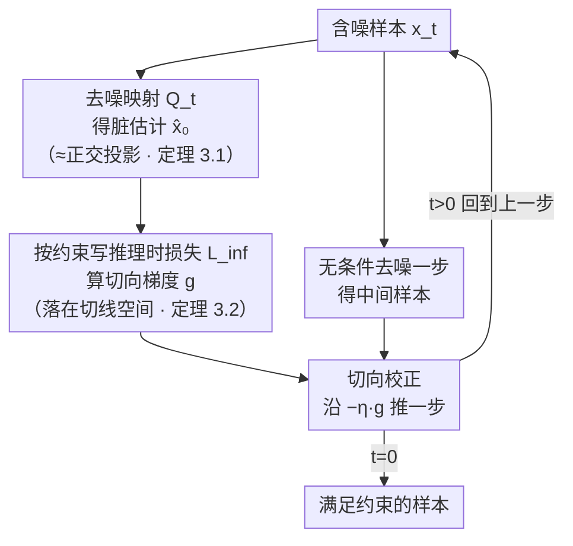

# Harpoon: Generalised Manifold Guidance for Conditional Tabular Diffusion

**会议**: ICLR 2026  
**arXiv**: [2602.07875](https://arxiv.org/abs/2602.07875)  
**代码**: [GitHub](https://github.com/adis98/Harpoon)  
**领域**: 扩散模型/表格数据  
**关键词**: 表格数据, 流形引导, 条件生成, 推理时引导, 不等式约束

## 一句话总结
将流形理论从图像扩展到表格数据扩散模型，证明任意可微推理时损失的梯度都位于数据流形切线空间中（不限于平方误差损失），据此提出Harpoon方法在推理时沿流形引导无条件样本满足多样化表格约束。

## 研究背景与动机

**领域现状**：表格扩散模型可以生成高质量表格数据，但条件生成（缺失值填补、不等式约束等）是核心需求。现有条件方法分为训练时（难以泛化到新约束）和推理时（仅限填补任务）两类。

**现有痛点**：(1) 训练时方法（条件输入/分类器引导/无分类器引导）无法泛化到训练时未见的约束；(2) 推理时方法仅支持填补不支持不等式约束；(3) 图像扩散的流形理论假设连续特征+平坦几何，不适用于混合类型表格数据。

**核心矛盾**：需要一次训练、推理时适应任意约束的方法，但现有流形引导理论只对平方误差损失+平坦流形有保证。

**切入角度**：证明两个更强的理论结果：(1) Theorem 3.1: 去噪映射 $Q_t$ 在 $\bar{\alpha}_t \to 1$ 时收敛到流形正交投影（不需平坦假设）；(2) Theorem 3.2: 任意可微损失的梯度都在切线空间中（不限于平方误差）。

**核心 idea**：证明推理时任意可微目标的梯度与流形对齐，据此交替做无条件去噪和切向校正来满足多样化约束。

## 方法详解

### 整体框架
Harpoon 想做的是「一次训练、推理时适应任意约束」的表格条件生成：先按标准方式训练一个**无条件**扩散模型，约束信息完全不进训练；真正的条件化全部留到采样阶段。采样时每往前走一步都做两件事——先让无条件模型正常去噪一步，再用一个针对当前约束临时写的**推理时损失（inference-time loss）** $\mathcal{L}_{\text{inf}}$ 算出梯度、对样本做一次校正，把它往满足约束的方向推一点。把「去噪」和「校正」这样交替叠起来跑完整条反向链，样本就会沿着合法数据的几何逐步漂到满足约束的区域。

这套交替机制能成立、且能用同一个模型同时支持缺失值填补、范围/分类约束乃至它们的合取与析取，靠的是两条新证的流形定理：单步去噪得到的「脏估计（dirty estimate）」本身就落在数据流形上（定理 3.1），且任意可微损失对样本的梯度都沿着流形的**切线空间（tangent space）**（定理 3.2）——前者保证校正有个合法的起点，后者保证校正这一推不会把样本顶离合法数据的几何。

### 关键设计

**1. 定理 3.1（去噪即正交投影）：把流形引导从平坦几何推广到弯曲流形**

图像扩散的流形引导理论（Chung 等人）有个隐含前提——数据流形局部是平坦的，这对混合类型的表格数据并不成立。本文证明：用 MSE 训练出来的去噪映射 $Q_t$，在 $\bar{\alpha}_t \to 1$（噪声趋近于零）的极限下，等价于把含噪样本**正交投影**到数据流形 $\mathcal{M}_0$ 上，而这个结论**不需要平坦假设**，弯曲流形同样成立。它的直接后果是：单步去噪得到的脏估计 $\hat{x}_0 = Q_t(x_t)$ 本身就落在流形上，于是上面流程图里后续所有校正都有一个合法的几何起点。这一步对应框架图中由 $x_t$ 算出脏估计的那个节点。

**2. 定理 3.2（梯度落在切线空间）：把可用的引导损失从平方误差放开到任意可微损失**

光知道脏估计在流形上还不够，关键是校正这一步会不会把样本顶出流形。本文进一步证明：对**任意**可微的推理时损失 $\mathcal{L}_{\text{inf}}$，它对样本的梯度都落在脏估计处的切线空间里，即

$$\nabla_{x_t}\mathcal{L}_{\text{inf}}(\hat{x}_0, c) \in T_{\hat{x}_0}\mathcal{M}_0.$$

这把已有理论从「只对形如 $\|W(x_0 - H(\hat{x}_0))\|_2^2$ 的平方误差损失有保证」推广到交叉熵、L1、ReLU 不等式罚项等任意可微目标，且不再需要平坦流形假设。直白说，就是推理时拿任何一个合理的损失去做梯度校正，都只会沿着流形切向移动、不会把样本推离合法数据，因此各种异质约束都能套进同一套引导框架——这正是框架图里「算切向梯度 $g$」节点的理论依据。

**3. Harpoon 算法：把无条件去噪和切向校正交替起来跑完整条反向链**

有了两条定理做地基，算法本身就很直接，对应框架图里「去噪一步 + 切向校正」再回到上一步的那个回环。每一步先按定理 3.1 得到脏估计、按定理 3.2 预先算好切向梯度，再用无条件模型去噪一步得到中间样本 $x_{t-1}'$，最后沿梯度做一次切向校正

$$x_{t-1} = x_{t-1}' - \eta \cdot \nabla_{x_t}\mathcal{L}_{\text{inf}}(\hat{x}_0, c),$$

其中 $\eta$ 是控制约束满足强度的引导步长。由于相邻流形几乎平行（论文 Proposition 1），用上一步的梯度做本步校正不会偏离太多，于是样本逐步收敛到目标区域。约束的种类完全由怎么写 $\mathcal{L}_{\text{inf}}$ 决定：观测到部分特征 $(1-m)\odot x_0$ 就是填补，写成 $\text{Age}\ge 10$ 这样的不等式就是范围约束，写成 $\text{Gender}=\text{Male}$ 就是分类约束，多个条件还能用合取（and）或析取（or）组合——全部不必重训模型，换损失即可。

### 损失函数 / 训练策略
- 训练：标准 MSE 去噪损失，无条件、一次训练。
- 推理时损失可选：MAE（默认，其稀疏诱导特性更契合表格离散特征的稀疏 one-hot 结构）、MSE、交叉熵、ReLU 不等式罚项；推理损失可以和训练损失不同，这正是定理 3.2 的实用价值。
- 引导强度 $\eta$ 控制约束满足程度，需按任务调参。

## 实验关键数据

### 主实验 - 填补 (MAR, 50%缺失)

| 方法 | Adult | Bean | California | Magic | 平均 |
|------|-------|------|-----------|-------|------|
| GAIN | 1.86 | 1.41 | 15.06 | 1.27 | 高 |
| DiffPuter (SOTA) | 中 | 中 | 中 | 中 | 中 |
| Harpoon | **低** | **低** | **低** | **低** | **SOTA** |

### 不等式约束

| 约束类型 | 违反率↓ | α-score↑ | 效用↑ |
|---------|---------|----------|-------|
| 范围约束 | **最低** | 高 | 高 |
| 分类约束 | **最低** | 高 | 高 |
| 合取(and) | **最低** | 高 | 高 |
| 析取(or) | **最低** | 高 | 高 |

### 关键发现
- 实验验证推理时梯度确实与"dirty estimate"近似正交（~90°），即使在较大时步也成立
- 不同推理时损失（MSE/MAE/CE）在同一训练目标下行为一致→实证验证Theorem 3.2
- MAE损失对表格数据效果最好（稀疏诱导特性适合离散特征）
- 一次训练，多种推理时约束→比训练时条件化方法灵活得多

## 亮点与洞察
- **理论贡献是核心**：两个定理显著推广了图像扩散的流形引导理论——弯曲流形+任意可微损失。这个理论不仅适用于表格，对其他模态也有指导意义。
- **"一次训练，任意约束"**：训练无条件模型→推理时加任意约束，这是条件生成的理想范式。Harpoon证明了这在表格数据中可行且有理论保证。
- **MAE优于MSE的发现**：表格数据的离散特征更适合稀疏诱导的L1损失，这个领域特异的insight有实用价值。

## 局限与展望
- 正交投影保证仅在 $\bar{\alpha}_t \to 1$ 时严格成立，实际大时步可能有偏差
- 表格数据的连续嵌入（如one-hot）是近似，离散-连续gap仍存在
- 引导强度 $\eta$ 需要调参
- 仅在UCI数据集上验证，更大规模表格数据的scalability未知

## 相关工作与启发
- **vs DiffPuter**: DiffPuter是训练时条件化，Harpoon是推理时引导——前者更专一后者更灵活
- **vs Chung等人的图像流形引导**: Harpoon推广了理论（弯曲流形+任意损失），并首次应用到表格
- **vs CTGAN/TabDDPM**: 这些不支持推理时条件化

## 评分
- 新颖性: ⭐⭐⭐⭐⭐ 流形理论的推广是重要理论贡献，表格适配自然
- 实验充分度: ⭐⭐⭐⭐ 多数据集、多任务(填补+不等式)、理论验证
- 写作质量: ⭐⭐⭐⭐⭐ 理论推导清晰，直觉解释到位
- 价值: ⭐⭐⭐⭐ 理论影响超出表格领域，对扩散模型引导有通用意义

<!-- RELATED:START -->

## 相关论文

- [\[CVPR 2026\] Accelerating Diffusion via Hybrid Data-Pipeline Parallelism Based on Conditional Guidance Scheduling](../../CVPR2026/others/accelerating_diffusion_via_hybrid_data-pipeline_parallelism_based_on_conditional.md)
- [\[AAAI 2026\] ASAG: Toward the Frontiers of Reliable Diffusion Sampling via Adversarial Sinkhorn Attention Guidance](../../AAAI2026/others/toward_the_frontiers_of_reliable_diffusion_sampling_via_adversarial_sinkhorn_att.md)
- [\[ICLR 2026\] Compositional Diffusion with Guided Search for Long-Horizon Planning](compositional_diffusion_long_horizon_planning.md)
- [\[ICLR 2026\] TabStruct: Measuring Structural Fidelity of Tabular Data](tabstruct_measuring_structural_fidelity_of_tabular_data.md)
- [\[ICLR 2026\] Contractive Diffusion Policies: Robust Action Diffusion via Contractive Score-Based Sampling with Differential Equations](contractive_diffusion_policies_robust_action_diffusion_via_contractive_score-bas.md)

<!-- RELATED:END -->
