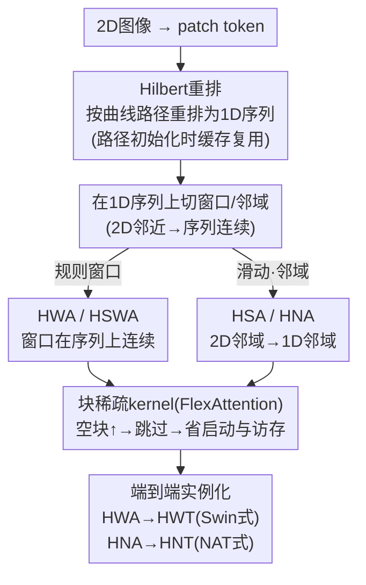

# Hilbert-Guided Sparse Local Attention

**会议**: ICLR 2026  
**arXiv**: [2511.05832](https://arxiv.org/abs/2511.05832)  
**代码**: [GitHub](https://github.com/Yunge6666/Hilbert-Local-Attention)  
**领域**: 高效Transformer/注意力机制  
**关键词**: Hilbert曲线, 局部注意力, 块稀疏, FlexAttention, 视觉Transformer

## 一句话总结
利用Hilbert空间填充曲线将2D图像token重排为保持空间邻近性的1D序列，大幅提升局部注意力的块稀疏率（空块比例从87.5%到96.9%），结合FlexAttention实现窗口注意力4倍和滑动注意力18倍加速，精度损失极小。

## 研究背景与动机

**领域现状**：Vision Transformer的全局自注意力 $O(N^2)$ 限制了高分辨率图像处理。局部注意力（如Swin的窗口注意力、NAT的邻域注意力）将复杂度降低，是主流方案。

**现有痛点**：局部注意力在理论上减少了计算，但实际GPU效率取决于底层kernel实现。传统行优先(row-major)序列排列使得2D窗口内的token在1D序列中不连续，导致块稀疏注意力（如FlexAttention）产生大量partial blocks（部分有效块），需额外mask开销，稀疏加速效果有限。

**核心矛盾**：块稀疏kernel跳过空块(empty blocks)加速→但行优先序列的窗口注意力空块率低（87.5%）、partial blocks多→加速受限。

**切入角度**：Hilbert曲线具有优秀的局部性保持特性——2D空间邻近的点在1D曲线上也邻近。用Hilbert曲线重排token→窗口内token在1D上连续→空块率大增、partial blocks大减。

**核心 idea**：Hilbert重排让2D局部注意力模式在1D序列中更紧凑→更多空块→块稀疏kernel更高效。

## 方法详解

### 整体框架
这篇工作要解决的，是局部注意力"理论省了计算、实际跑不快"的落差：块稀疏 kernel（block-sparse kernel，如 FlexAttention）把注意力矩阵切成固定大小的块，靠整块跳过全空的块（empty block）来加速，但传统行优先（row-major）排列让 2D 窗口里的 token 在 1D 序列上散落，空块少、半满的部分块（partial block）多，加速大打折扣。它的做法是在注意力计算前插一步纯排列操作——把图像 token 按 Hilbert 空间填充曲线的路径重排成 1D 序列，使空间邻近的 token 在序列里也连续；之后照常在这条 1D 序列上划窗口或邻域，交给块稀疏 kernel 计算。重排只改物理布局、不改注意力的空间语义，窗口内 token 变连续后空块率大涨、kernel 能跳过更多块。整条路径分两个方向落地：窗口注意力走 HWA（再配移位版 HSWA），滑动/邻域注意力走 HSA/HNA；两者最后分别被装进 Swin 式的 HWT 与 NAT 式的 HNT 两个端到端模型。Hilbert 路径只依赖图像尺寸，可在模型初始化时算好并缓存复用。

### 关键设计

**1. Hilbert 窗口注意力（HWA）：让窗口在 1D 序列上连续，把部分块变成空块**

行优先排列下，一个 2×2 窗口会取到 token (1,2,5,6)——它们在 1D 序列里跨行，落进多个块的边角，形成 4 个半满的部分块，块稀疏 kernel 既不能整块跳过、又要逐元素 mask、额外开销不小。换成 Hilbert 序列后同一个窗口取到的是连续的 (1,2,3,4)，整齐落进 2 个全满块（full block），另外 2 个块完全为空——空块率从 0% 直接提到 50%。HWA 就是把这种"先 Hilbert 重排、再连续切窗口"的思路用到标准窗口注意力上，窗口覆盖的空间邻域不变，只是物理布局更适配块稀疏 kernel，于是 FlexAttention 能跳过的块更多。

**2. Hilbert 滑动 / 邻域注意力（HSA / HNA）：把 2D 邻域注意力等效成 1D 邻域注意力**

滑动窗口和邻域注意力在行优先排列下最"碎"——每个 query 的邻域在 1D 上跨多行，块稀疏几乎无从下手。Hilbert 曲线的局部性保持（locality-preserving）特性正好对症：1D 序列上的近邻 $\approx$ 2D 空间上的近邻，于是原本要在 2D 上定义的邻域注意力，可以直接当成 1D 邻域注意力来算（用 NATTEN 的 `na1d` 或 FlexAttention 的 `mask_mod`/`score_mod` 都能实现，只换底层 kernel、不改注意力模式与精度）。这样既复用了成熟的 1D 稀疏 kernel，又绕开了 2D 邻域注意力为构造邻域要维护 $N^2$ 量级中间存储的问题。

**3. 加速原理：空块越多，启动和访存越少**

块稀疏 kernel 的总运行时间可近似写成

$$T \approx \frac{\sum_{i=1}^{M}(\alpha + \beta \cdot r_i)}{P_{\text{eff}}}$$

其中对每个被处理的块都有一份固定启动开销 $\alpha$（CTA 启动、加载 query 块、初始化）和与该块非空行数 $r_i$ 成正比的访存/计算开销 $\beta \cdot r_i$，$P_{\text{eff}}$ 是有效并行度。空块被整块跳过、根本不进求和，所以空块越多，需要启动的 CTA 越少、要加载的 K/V 越少，$T$ 越短。这条公式解释了为什么前两个设计要不遗余力地"造空块"——HWA/HSA 提升的空块率，直接对应这里被砍掉的项；同时它也提醒块大小（block size）和窗口大小的搭配会左右空块分布，需要调到让空块率尽量高。

**4. 端到端实例化（HWT / HNT）：把 HWA、HNA 零侵入塞进现成架构**

光有更快的注意力算子还不够，论文进一步把它们装进两个可训练模型。HWT 与 Swin Transformer 同构，用 HWA 替掉其中的 WSA，并成对使用 HWA 与 Hilbert 移位窗口注意力（HSWA）保留跨窗口交流——窗口位移直接在 1D 序列上偏移固定数量的 token，比在 2D 上做移位的 mask 简单得多；代价是序列首尾可能凑进 2D 上并不相邻的 token，需额外 mask 掉。由于 Hilbert 窗口形状不规则，按窗口形状定义的相对位置偏置（window RPB）失效，改用覆盖整张特征图的全局 RPB。HNT 则与 NAT 同构，用 HNA 替掉邻域注意力。两者都通过 FlexAttention 的 `mask_mod`/`score_mod` 接口落地，不需手写 kernel、不改训练流程。

### 损失函数 / 训练策略
- 标准 ImageNet 分类训练，不改训练目标与流程。
- Hilbert 路径在模型初始化时一次性计算并缓存，推理时直接复用。
- 兼容 FlexAttention、FlashAttention、xFormers、NATTEN 等多种 kernel。

## 实验关键数据

### 注意力计算效率

| 注意力类型 | 输入 | 窗口 | 空块率 | 前向时间 | 加速比 |
|-----------|------|------|--------|---------|--------|
| WSA (Flex) | 96×96 | 16×16 | 83.3% | 2.63ms | 1× |
| **HWA (Flex)** | 96×96 | 16×16 | **97.2%** | **0.40ms** | **6.6×** |
| SA (Flex) | 64×64 | 7×7 | ~低 | 慢 | 1× |
| **HSA (Flex)** | 64×64 | 7×7 | ~高 | 快 | **~18×** |

### 端到端模型 (ImageNet)

| 模型 | 参数量 | Top-1 Acc | 吞吐量 | 说明 |
|------|--------|----------|--------|------|
| Swin-T | 28M | 81.3% | 基线 | 原始Swin |
| **HWT-T** | 28M | 81.0% | **更快** | -0.3%精度 |
| NAT-Mini | - | 81.8% | 基线 | 原始NAT |
| **HNT-Mini** | - | 81.5% | **更快** | -0.3%精度 |

### 关键发现
- Hilbert重排将空块率从83-91%提升到96-98%——接近理论上限
- 窗口越大或序列越长→加速比越大（因为空块比例差距更明显）
- 精度损失仅0.2-0.3%——Hilbert窗口虽然形状不规则但空间邻近性保持良好
- HSA的加速最显著(~18×)——因为滑动窗口在行优先中特别"碎片化"

## 亮点与洞察
- **空间填充曲线的妙用**：Hilbert曲线的locality-preserving property完美契合块稀疏优化的需求。这是数学工具与系统优化的优雅结合。
- **不修改模型，只改排列**：插入Hilbert重排不改变注意力的逻辑语义（仍是相同空间邻域），只改变物理布局以适配块稀疏kernel。对现有模型零侵入。
- **FlexAttention的杀手应用**：HWA/HSA/HNA都可以通过FlexAttention的mask_mod/score_mod接口定义，无需手写kernel。展示了可编程稀疏注意力框架的威力。

## 局限与展望
- 全局RPB比窗口RPB参数多，可能在小模型上引入过拟合
- Hilbert曲线仅适用于2的幂次尺寸——非方形或非2^n尺寸需要padding
- shifted window在Hilbert序列上可能引入不相邻token共窗——需要额外mask
- 加速依赖FlexAttention等框架，不同硬件/CUDA版本效果可能变化

## 相关工作与启发
- **vs Swin Transformer**: HWT用Hilbert重排加速Swin的WSA，精度损失<0.3%
- **vs NAT/NATTEN**: HNT将2D邻域注意力转化为1D——可直接用1D优化kernel
- **vs FlashAttention**: FlashAttention针对dense注意力优化，HWA/HSA利用稀疏性进一步加速

## 评分
- 新颖性: ⭐⭐⭐⭐ Hilbert曲线+块稀疏注意力的结合新颖实用
- 实验充分度: ⭐⭐⭐⭐ 多种注意力类型、多种kernel、端到端模型验证
- 写作质量: ⭐⭐⭐⭐ 图示清晰，加速原理解释到位
- 价值: ⭐⭐⭐⭐ 对高分辨率视觉Transformer有直接实用价值

<!-- RELATED:START -->

## 相关论文

- [\[AAAI 2026\] GDBA Revisited: Unleashing the Power of Guided Local Search for Distributed Constraint Optimization](../../AAAI2026/others/gdba_revisited_unleashing_the_power_of_guided_local_search_for_distributed_const.md)
- [\[ICLR 2026\] Beyond Linearity in Attention Projections: The Case for Nonlinear Queries](beyond_linearity_in_attention_projections_the_case_for_nonlinear_queries.md)
- [\[ICLR 2026\] Compositional Diffusion with Guided Search for Long-Horizon Planning](compositional_diffusion_long_horizon_planning.md)
- [\[CVPR 2026\] UPLiFT: Efficient Pixel-Dense Feature Upsampling with Local Attenders](../../CVPR2026/others/uplift_efficient_pixel-dense_feature_upsampling_with_local_attenders.md)
- [\[ACL 2025\] Unique Hard Attention: A Tale of Two Sides](../../ACL2025/others/unique_hard_attention_a_tale_of_two_sides.md)

<!-- RELATED:END -->
