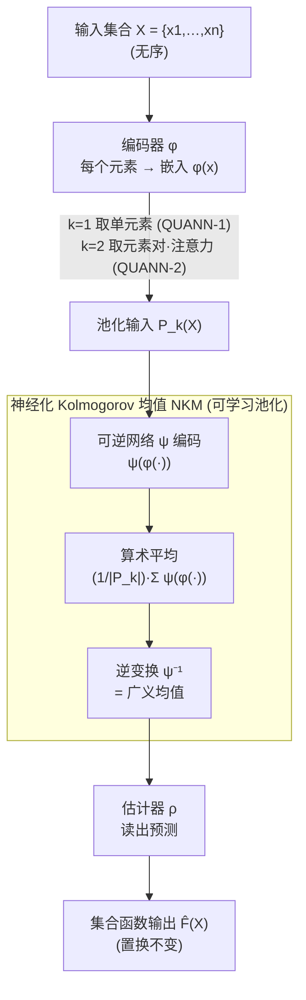

# Improving Set Function Approximation with Quasi-Arithmetic Neural Networks

**会议**: ICLR 2026  
**arXiv**: [2602.04941](https://arxiv.org/abs/2602.04941)  
**代码**: 无  
**领域**: 深度学习理论/集合函数  
**关键词**: 集合函数, Kolmogorov均值, 可逆网络, 可学习池化, 置换不变性

## 一句话总结
提出QUANN（准算术神经网络），用可逆神经网络实现可学习的Kolmogorov均值作为池化操作，首次实现机器学习版本的广义中心趋势度量，QUANN是均值可分解集合函数的通用近似器，且学到的嵌入跨任务迁移性更强。

## 研究背景与动机

**领域现状**：集合函数学习要求置换不变性。DeepSets用sum池化，PointNet用max池化——两种固定、不可训练的池化操作将近似负担推给编码器和估计器。

**现有痛点**：(1) 固定池化迫使编码器学习既适应下游任务又适应特定池化操作的嵌入→限制了嵌入迁移性；(2) sum和max是Kolmogorov均值的极端特例→大量中间形式（几何均值、调和均值等）未被利用；(3) 已有可学习池化方法要么复杂难用、要么表达力有限（如Power DeepSets仅学一个指数）。

**核心矛盾**：需要一个理论有保证、实现简洁、足够表达的可学习池化操作。

**切入角度**：Kolmogorov均值 $M_f = f^{-1}(\frac{1}{n}\sum_i f(x_i))$ 通过选择不同可逆函数 $f$ 统一了各种均值。用可逆神经网络实现 $f$ →可学习的广义中心趋势。

## 方法详解

### 整体框架
QUANN 要解决的是集合函数学习里"池化操作写死、不可训练"的根本限制。它沿用 DeepSets 式的"编码—池化—读出"骨架，但把中间的池化换成可学习的部件：编码器 $\phi$ 先把集合里每个元素映射成嵌入，中间的可逆神经网络 $\psi$ 把这些嵌入聚合成一个可学习的 Kolmogorov 均值，最后估计器 $\rho$ 从聚合表示读出预测。整体写成

$$\hat{F}(X) = \rho\Big(\psi^{-1}\big(\tfrac{1}{|P_k(X)|}\sum_{\pi} \psi(\phi(\pi))\big)\Big)$$

其中 $\phi$ 是编码器、$\psi$ 是充当生成函数的可逆神经网络、$\rho$ 是估计器，$P_k(X)$ 是参与池化的元素组合：$k=1$ 时直接喂单个元素（对应 QUANN-1），$k=2$ 时用注意力把元素对的交互喂进去（对应 QUANN-2）。关键在于中间这层不再是固定的 sum 或 max，而是一个形状由数据决定的广义均值。

### 关键设计

**1. 神经化 Kolmogorov 均值（NKM）：把池化从固定算子变成可学习的广义均值**

DeepSets 用 sum、PointNet 用 max，这两种池化都写死、不可训练，把所有近似负担都推给了编码器。NKM 的做法是回到 Kolmogorov 均值的统一形式 $M_\psi(X) = \psi^{-1}(\frac{1}{n}\sum_{i=1}^n \psi(x_i))$，生成函数 $\psi$ 选什么、均值就是什么——$\psi$ 取线性对应算术平均，取 log 对应几何平均，取幂对应幂均值。QUANN 用一个 RevNet 把 $\psi$ 直接学出来，于是池化形式由训练数据决定。这是首个可学习的 Kolmogorov 均值实现：RevNet 的可逆性保证了 $\psi^{-1}$ 一定存在（Kolmogorov 均值有定义的前提），同时网络的表达力又足以拟合 sum 与 max 之间的任意中间形态。

**2. 通用近似保证：换了池化还要有理论兜底**

可学习池化若没有近似能力的保证，只是把不确定性从池化挪到了别处。QUANN 给出了两级结论：只聚合单元素信息的 QUANN-1 已经是均值可分解集合函数的通用近似器；进一步把元素对交互纳入的 QUANN-2 更强，能覆盖需要高阶交互的函数；而且在温和条件下，QUANN 还能近似 max 可分解的函数——也就是说它表达力的上界把 DeepSets 和 PointNet 两类固定池化都包了进去。

**3. 嵌入解耦：可逆池化让编码器学到能迁移的表示**

固定池化的隐藏代价，是编码器必须同时迁就下游任务和那个特定池化，学出的嵌入与池化强耦合，换个任务就用不了。因为 $\psi$ 可逆，NKM 在聚合时不丢失输入的结构信息（不像 max 直接扔掉非最大值），编码器于是不必再为某种池化"补偿"，可以专心学通用的嵌入。实证上，QUANN 的编码器迁移到非集合任务也表现良好，正说明它学到的表示不再依附于某一种聚合方式。

### 损失函数 / 训练策略
- 标准监督学习，端到端训练
- $\psi$ 用RevNet架构实现可逆性

## 实验关键数据

### 主实验

| 方法 | 集合分类 | 集合回归 | 点云分类 | 平均 |
|------|---------|---------|---------|------|
| DeepSets (sum) | 基线 | 基线 | 基线 | 基线 |
| PointNet (max) | 中 | 中 | 中 | 中 |
| HPDS (幂均值) | 好 | 好 | 好 | 好 |
| **QUANN-1** | **最优** | **最优** | **最优** | **SOTA** |

### 消融实验

| 配置 | 在非集合任务上的表现 |
|------|-------------------|
| DeepSets编码器 | 差→嵌入与sum池化强耦合 |
| PointNet编码器 | 差→嵌入与max池化强耦合 |
| **QUANN编码器** | **好→嵌入通用** |

### 关键发现
- NKM学到的池化形式介于sum和max之间→自动适应任务
- 可逆 $\psi$ 确保信息不丢失→编码器不需要为特定池化"补偿"
- QUANN在所有基准上超越SOTA，包括需要高阶交互的任务

## 亮点与洞察
- **Kolmogorov均值的神经化**：首次将百年数学概念（准算术均值）与现代深度学习结合。用可逆网络做生成函数，既有理论美感又实用。
- **解耦编码器与池化**：固定池化→编码器必须"适配"池化→嵌入不通用。可学习池化→编码器只需学好的嵌入→池化自动适配→嵌入迁移性增强。
- **可逆性的双重价值**：(1) 保证Kolmogorov均值有定义（需要可逆生成函数）；(2) 保持信息→不像max那样丢弃信息。

## 局限与展望
- RevNet增加了计算开销（虽然可逆性让我们不需要存储中间激活）
- QUANN-2对元素对的二次复杂度限制了大集合
- 仅在有限集合上实验，函数集合（连续集合）的情况未考虑
- 没有与Slot Attention等非Janossy方法充分比较

## 评分
- 新颖性: ⭐⭐⭐⭐⭐ Kolmogorov均值的神经化是优美的理论贡献
- 实验充分度: ⭐⭐⭐⭐ 多种任务+迁移性验证+消融
- 写作质量: ⭐⭐⭐⭐⭐ 理论框架清晰，统一表格一目了然
- 价值: ⭐⭐⭐⭐ 对集合函数学习有基础性改进

<!-- RELATED:START -->

## 相关论文

- [\[ICLR 2026\] On the Lipschitz Continuity of Set Aggregation Functions and Neural Networks for Sets](on_the_lipschitz_continuity_of_set_aggregation_functions_and_neural_networks_for.md)
- [\[ICLR 2026\] Learning Adaptive Distribution Alignment with Neural Characteristic Function for Graph Domain Adaptation](learning_adaptive_distribution_alignment_with_neural_characteristic_function_for.md)
- [\[ICLR 2026\] Learning on a Razor's Edge: Identifiability and Singularity of Polynomial Neural Networks](learning_on_a_razors_edge_identifiability_and_singularity_of_polynomial_neural_n.md)
- [\[ICML 2025\] Improving the Effective Receptive Field of Message-Passing Neural Networks](../../ICML2025/others/improving_the_effective_receptive_field_of_message-passing_neural_networks.md)
- [\[ICLR 2026\] Consistent Low-Rank Approximation](consistent_low-rank_approximation.md)

<!-- RELATED:END -->
