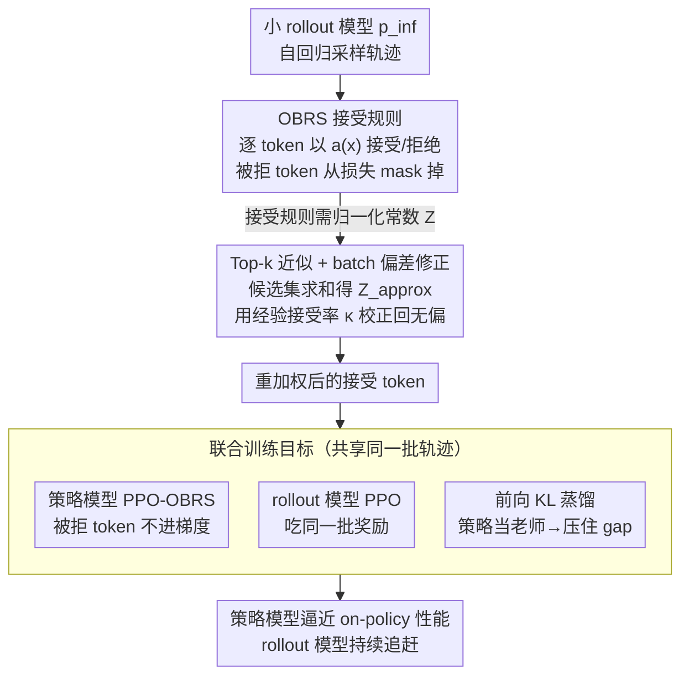

# Jackpot: Optimal Budgeted Rejection Sampling for Extreme Actor-Policy Mismatch RL

**会议**: ICLR 2026  
**arXiv**: [2602.06107](https://arxiv.org/abs/2602.06107)  
**代码**: [Infini-AI-Lab/jackpot](https://github.com/Infini-AI-Lab/jackpot)  
**领域**: 其他  
**关键词**: rejection sampling, actor-policy mismatch, decoupled RL, importance sampling, OBRS, off-policy RL

## 一句话总结

提出 Jackpot 框架，通过 Optimal Budget Rejection Sampling（OBRS）以可控接受预算在 token 级别拒绝/重加权 rollout 样本，理论证明任意预算下都能严格缩小 actor-policy 间 KL 散度，配合 rollout 模型联合训练与蒸馏，使小模型（如 Qwen3-1.7B）rollout 训练大模型（如 Qwen3-8B）达到接近 on-policy 的性能。

## 研究背景与动机

**RL 训练瓶颈**：LLM RL 训练中约 80% 的计算成本来自 rollout（自回归生成轨迹），这是当前 RL 扩展的最大瓶颈。

**解耦 rollout 的诱惑**：如果能用更小、更快的模型（如 1.7B）替代策略模型（如 8B）做 rollout，可以大幅降低训练成本，但会引入极端的分布不匹配。

**现有方案失败**：Truncated Importance Sampling（TIS）和 IceProp 等后验校正方法在极端不匹配（KL 散度高出一个数量级）时训练崩溃，因为它们仅做事后加权修正，无法从源头缩小分布差距。

**标准 RS 不可行**：经典 rejection sampling 理论上能精确匹配分布，但 LLM 词表超 100k，极少 token 上的概率比 $p_i/q_i$ 尖峰导致归一化常数 $\lambda$ 极大，接受率趋近于零。

**Gap 持续扩大**：朴素解耦训练中，策略模型不断更新但 rollout 模型固定，导致分布差距随训练推进持续恶化。

**核心洞察**：与其事后修正分布差距，不如从源头直接缩小——用带预算约束的最优 rejection sampling 替代硬接受/拒绝规则，在可控的样本损失下最大程度对齐分布。

## 方法详解

### 整体框架

Jackpot 要解决的是「用小模型代替大模型做 rollout」省成本时带来的极端分布不匹配：小 rollout 模型采出的轨迹分布 $q$ 和真正要训练的策略分布 $p$ 差出一个数量级，事后加权（TIS 等）压不住就会崩。它的思路是在 rollout 模型自回归采完轨迹后、反向传播前插一道 **token 级闸门**——对每个 token 用带预算约束的最优拒绝采样（Optimal Budget Rejection Sampling，OBRS）判断接受还是丢弃，被拒 token 直接从损失里 mask 掉，从源头把 rollout 分布拉向策略分布。接受规则里要的归一化常数 $Z$ 本该对全词表求和，Jackpot 用 top-k 近似 + batch 偏差修正把它压成可负担的开销。最后策略模型和 rollout 模型联合训练，再加一项在线蒸馏让 rollout 模型持续追赶策略模型，避免分布差距随训练越拉越大。

### 关键设计

**1. OBRS 接受规则：用任意预算换取分布对齐的闭式最优解**

经典 rejection sampling 要精确匹配分布，须取归一化常数 $\lambda \geq \max_i p_i/q_i$，可 LLM 词表超 10 万、个别 token 上概率比 $p_i/q_i$ 极度尖峰，导致 $\lambda$ 巨大、接受率趋近于零，根本跑不动。OBRS 的做法是放开这个约束：对 rollout 模型 $p_{\text{inf}}$ 采到的 token $x$，以 $a(x) = \min\!\left(1, \frac{p_{\text{target}}(x)}{\lambda \cdot p_{\text{inf}}(x)}\right)$ 的概率接受，其中 $\lambda>0$ 是用户自定的接受预算——$\lambda$ 越小拒得越多、对齐越精确，$\lambda$ 越大保留越多、接受率越高。理论上对任意 $\lambda$ 都有 $D_{\text{KL}}(p \| \tilde{q}) \leq D_{\text{KL}}(p \| q)$，即接受后的后验分布 $\tilde q$ 严格不比原 rollout 分布更差，且在该预算下它是唯一最小化 $D_{\text{KL}}(p\|\hat q)$ 的接受规则。接受后样本服从重加权分布 $P_{\text{OBRS}}(x) = \frac{\min\!\left(p_{\text{inf}}(x), p_{\text{target}}(x)/\lambda\right)}{Z}$，等价于把概率被 rollout 模型高估的 token 削平、低估的保留，从而在可控的样本损失下最大程度贴近目标。

**2. Top-k 近似与 batch 偏差修正：把全词表归一化压成可负担的开销**

OBRS 重加权分布里的归一化常数 $Z$ 原本要对超 10 万的整个词表求和，显存吃不消。注意到 LLM 输出概率高度集中在少数 token，Jackpot 只在候选集 $\mathcal{V}_k = \text{top-k}(p_{\text{inf}}) \cup \text{top-k}(p_{\text{new}})$ 上求和得到 $Z_{\text{approx}}$。但截断会系统性低估真实 $Z$，于是再做一次偏差修正：利用 $Z$ 恰好等于期望接受率 $\bar\alpha$ 这一性质，用一个 batch 里的经验接受率反算校正因子 $\kappa = \frac{\hat{\bar{\alpha}}}{\frac{1}{B}\sum_{i=1}^{B} Z_{\text{approx}}^{(i)}}$，把 top-k 估计整体放大回无偏水平。整套流程不必碰 vLLM、无需定制算子，与 speculative decoding 不同，拒掉 token 后剩余轨迹原样保留、不做重采样。

**3. 联合训练目标：让 rollout 模型追着策略模型跑，堵住持续扩大的 gap**

朴素解耦训练里策略模型不断更新而 rollout 模型固定，分布差距只会越拖越大，OBRS 也就得拒越来越多的 token。Jackpot 把两者一起优化，总损失为 $\mathcal{L}^{\text{Jackpot}}(\theta, \omega) = \mathcal{L}^{\text{PPO-OBRS}}(\theta) + \mathcal{L}^{\text{PPO}}(\omega) + \lambda_{\text{distill}} \mathcal{L}^{\text{distill}}(\omega)$ 三项：第一项是带 OBRS mask 与重加权的策略模型 PPO，被拒 token 不进梯度；第二项让 rollout 模型也吃同一批奖励信号做标准 PPO；第三项是前向 KL 蒸馏 $D_{\text{KL}}(\text{SG}(p_{\theta_{\text{new}}}) \| p_\omega)$，把策略模型当老师、用 stop-gradient 固定，逼 rollout 模型持续跟踪策略模型的改进。三项共享同一批 rollout 轨迹，不额外采样，正是蒸馏这一项把 gap 主动压住，OBRS 才不至于一直在拒越来越多的 token。

### 损失函数 / 训练策略

目标分布 $p_{\text{target}}$ 既可取参考策略 $p_{\text{ref}}$，也可取最新策略 $p_{\text{new}}$，后者在大 batch、异步训练场景下对齐更紧、表现更好。三项损失复用同一批轨迹，训练侧不引入额外 rollout 开销，且直接落在标准 vLLM 上实现。

## 实验

### 主实验：极端 actor-policy 不匹配下的联合训练

| 训练配置 | GSM8K | MATH-500 | AMC22/23 | AMC12 | AIME24 Mean@4 | AIME25 Mean@4 |
|:---|:---:|:---:|:---:|:---:|:---:|:---:|
| **Qwen2.5-1.5B → 3B** (MATH-8k, 14k steps) | | | | | | |
| 3B On-policy | 85.00 | 63.90 | 37.65 | 26.11 | – | – |
| TIS + Reverse KL | 82.50 | 60.45 | 32.53 | 24.44 | – | – |
| **Jackpot** | **84.28** | **62.75** | **38.55** | **27.78** | – | – |
| **Qwen3-1.7B → 4B** (DeepScaleR, 20k steps) | | | | | | |
| 4B On-policy | 92.56 | 80.82 | 58.13 | 51.66 | 25.00 | 21.56 |
| TIS + Reverse KL | 91.21 | 73.65 | 46.39 | 32.77 | 13.33 | 10.41 |
| **Jackpot** | **92.15** | **80.52** | **59.49** | **53.88** | **23.50** | **20.83** |
| **Qwen3-1.7B → 8B** (DeepScaleR, 15k steps) | | | | | | |
| 8B On-policy | 93.29 | 79.50 | 61.14 | 53.33 | 24.37 | 16.87 |
| TIS + Reverse KL | 93.61 | 76.45 | 56.62 | 37.22 | 17.70 | 15.41 |
| **Jackpot** | **93.57** | **82.65** | **62.04** | **54.44** | **25.00** | **19.16** |

### 消融实验：Jackpot 在何时有效/无效

| 场景 | 方法 | MATH-500 | AMC22/23 | AIME24 Mean@16 | AIME25 Mean@16 | 结论 |
|:---|:---|:---:|:---:|:---:|:---:|:---|
| 大 batch (64×) | Off Policy | 81.55 | 60.54 | 27.50 | 23.12 | 差距小，Jackpot 无额外收益 |
| 大 batch (64×) | Jackpot | 81.95 | 59.94 | 27.71 | 22.70 | ≈ 持平 |
| FP8 KV 量化 | TIS | 83.65 | 60.84 | 25.83 | 22.70 | TIS 已足够 |
| FP8 KV 量化 | Jackpot | 81.30 | 62.35 | 24.79 | 22.29 | ≈ 持平 |
| **无 PPO clip (128×)** | Off Policy | 60.20 | 33.00 | 8.00 | 5.00 | 训练严重退化 |
| **无 PPO clip (128×)** | No-Clip | 19.10 | 7.80 | 1.00 | 1.00 | 训练崩溃 |
| **无 PPO clip (128×)** | **Jackpot** | **80.00** | **51.20** | **19.16** | **18.52** | **显著优势** |

### 关键发现

1. **极端不匹配下 Jackpot 大幅领先**：1.7B rollout → 8B 策略，Jackpot 达到甚至超越 on-policy 水平，而 TIS 在 MATH-500 上低 6 个点、AMC12 上低 17 个点
2. **KL 散度降低一个数量级**：数值模拟显示 OBRS 在接受率 >90% 的情况下将 KL 散度压缩 10 倍
3. **训练稳定性**：无对齐方案在几十步后崩溃，TIS 在 100 步后 KL 爆炸，Jackpot 稳定训练 300 步
4. **分布差距小时无优势**：当 PPO clipping 已充分约束更新步长或 FP8 量化引入的差距较小时，Jackpot 与 TIS 持平
5. **去掉 PPO clip 仍稳定**：Jackpot 允许更大的策略更新步长而不崩溃，加速收敛

## 亮点

- **理论最优性闭合解**：在固定接受预算下，OBRS 是唯一最小化 $D_{\text{KL}}(p \| \hat{q})$ 的接受规则，有严格证明
- **从源头解决问题**：不同于 TIS 等事后修正，Jackpot 在采样阶段直接过滤不匹配 token，与 IS 互补
- **工程友好**：无需修改推理框架（vLLM），无额外 rollout，Top-k 近似 + batch 偏差修正使内存开销可控
- **实际成本意义**：用 1.7B 模型 rollout 训练 8B 策略，推理成本可降低约 4 倍，且性能不损失
- **联合训练设计精巧**：策略模型和 rollout 模型同时训练，蒸馏损失防止 gap 扩大，三项损失共享同一批数据

## 局限性

- **仅验证数学推理任务**：所有实验限于 GSM8K、MATH、AIME 等数学基准，未在代码生成、开放对话等场景验证
- **同模型族限制**：actor-policy 均来自同一 Qwen 系列，跨架构（如 Llama actor + Qwen policy）的可行性未知
- **仍需策略模型前向传播**：训练阶段仍需大模型的前向传播计算 $p_{\text{ref}}$ 和 $p_{\text{new}}$，节省的主要是 rollout 推理，训练侧计算未减少
- **超参数敏感性**：$\lambda$（接受预算）、$\lambda_{\text{distill}}$（蒸馏权重）、clip 阈值 $c_1, c_2$ 等需要调节
- **小 gap 场景无收益**：分布差距较小时（PPO clip 已充分、FP8 量化等），Jackpot 不优于简单 TIS

## 相关工作

- **RL for LLM 训练系统**：Verl、AReal、TRL、OpenRLHF 等框架优化吞吐但假设同模型 rollout
- **分布不匹配校正**：AReal 用 IS ($F(x)=x$)、Flash-RL/Llama-RL 用 TIS ($F(x)=\min(x,C)$)、IceProp 用双向截断
- **推理加速方案**：异步训练、FP8 量化、speculative decoding 等减少 rollout 成本但仍需目标模型参与
- **Rejection Sampling 理论**：Verine et al. (2024) 提出 OBRS 原始理论，本文将其首次应用于 LLM RL 训练的 actor-policy 对齐
- **策略蒸馏**：在线蒸馏 rollout 模型的思路借鉴知识蒸馏，但创新性地与 OBRS 结合防止 gap 扩大

## 评分

- 新颖性: ⭐⭐⭐⭐ 将 OBRS 理论引入 LLM RL 的 actor-policy 对齐是清晰且有力的贡献
- 实验充分度: ⭐⭐⭐ 数学推理任务验证充分，但缺乏代码/对话等多样化任务
- 写作质量: ⭐⭐⭐⭐ 理论推导清晰，图表丰富，算法伪代码完整
- 价值: ⭐⭐⭐⭐ 对降低 LLM RL 训练成本有直接工程意义，提供了解耦 rollout 的可行路径

<!-- RELATED:START -->

## 相关论文

- [\[ICLR 2026\] Evaluating GFlowNet from Partial Episodes for Stable and Flexible Policy-Based Training](evaluating_gflownet_from_partial_episodes_for_stable_and_flexible_policy-based_t.md)
- [\[ICLR 2026\] DA-AC: Distributions as Actions — A Unified RL Framework for Diverse Action Spaces](distributions_as_actions_a_unified_framework_for_diverse_action_spaces.md)
- [\[ICLR 2026\] Enhancing Generative Auto-bidding with Offline Reward Evaluation and Policy Search](enhancing_generative_auto_bidding.md)
- [\[AAAI 2026\] Extreme Value Monte Carlo Tree Search for Classical Planning](../../AAAI2026/others/extreme_value_monte_carlo_tree_search_for_classical_planning.md)
- [\[AAAI 2026\] Enhancing Control Policy Smoothness by Aligning Actions with Predictions from Preceding States](../../AAAI2026/others/enhancing_control_policy_smoothness_by_aligning_actions_with_predictions_from_pr.md)

<!-- RELATED:END -->
