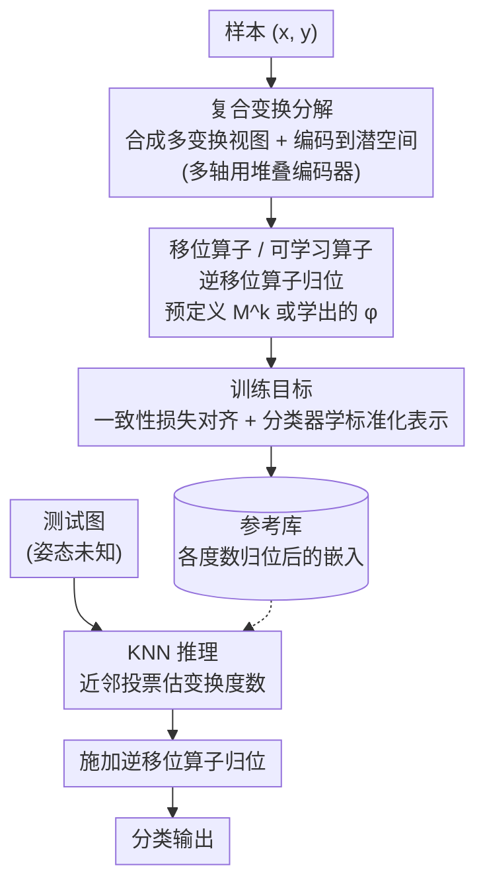

# Latent Equivariant Operators for Robust Object Recognition: Promises and Challenges

**会议**: ICLR 2026  
**arXiv**: [2602.18406](https://arxiv.org/abs/2602.18406)  
**代码**: [GitHub](https://github.com/BRAIN-Aalto/equivariant_operator)  
**领域**: 鲁棒视觉/等变学习  
**关键词**: 等变算子, OOD泛化, 群变换, 潜空间, KNN推理

## 一句话总结
在潜空间中学习/预定义等变移位算子来处理旋转和平移等群变换，推理时通过KNN搜索推断变换参数并恢复到标准pose后分类，在MNIST上展示了训练范围外变换的成功外推能力，相比传统网络和等变网络更灵活，但向复杂数据集扩展仍面临挑战。

## 研究背景与动机

- **领域现状**: 深度网络在IID测试集上表现优异，甚至超越人类水平，但在OOD场景下——例如识别不常见pose、尺度或位置下的物体——非常脆弱。这些变换场景可以用群论来描述：pose变化、尺度变化和位置变化本质上都是群变换作用于视觉物体的结果。
- **现有痛点**:
  1. **等变神经网络**需要完整的先验知识：必须数学指定变换群结构（例如某阶循环群）和具体表示（例如旋转或平移），这在实际中非常受限
  2. **数据增强方案**需要在训练时均匀采样测试时可能遇到的全部变换参数范围，但实际中往往只能获得有限范围的变换示例
  3. 现有方法要么不灵活，要么数据需求过大，无法优雅地处理OOD变换泛化
- **核心矛盾**: 我们希望模型能泛化到训练时未见过的变换参数（外推），但传统网络只能在训练分布内插值，等变网络需要完整的数学先验
- **本文目标**: 证明潜空间等变算子方法可以用于OOD分类——仅在有限变换范围上训练，就能外推到未见过的变换度数和组合
- **切入角度**: 不从数据增强或数学指定的等变架构入手，而是在潜空间中学习（或预定义）一个等变算子，利用群的闭合性通过递归应用算子来外推到训练范围之外
- **核心idea**: 由于群变换的闭合性，训练范围外的变换可以分解为训练范围内变换的组合。如果模型在潜空间学到了正确的群作用（等变算子），就能通过递归应用同一算子来实现外推。推理时用KNN搜索确定输入的变换参数，免去显式标注

## 方法详解

### 整体框架
方法分训练和推理两阶段。训练时给定样本 $(x, y)$，先合成两个不同变换度数 $k_1, k_2$ 的视图 $x_1 = T^{k_1}(x)$、$x_2 = T^{k_2}(x)$，共享编码器把它们映射到潜空间，再用逆移位算子 $\varphi^{-k}$ 把表示拉回标准pose，一致性损失逼两个视图标准化后对齐，分类器只在这个标准化表示上学习。推理时输入的变换参数未知，先用最近邻（KNN）搜参考库估出最可能的变换度数，再施加对应逆算子归位后分类。下图给出训练与推理两条数据流，二者共用同一套移位算子完成"归位"。

### 关键设计

**1. 移位算子：把群变换搬进潜空间，靠闭合性外推**

等变网络脆弱的根源在于它只能在训练见过的变换范围内插值，一旦遇到训练范围外的旋转角度就崩。本文的切入点是群作用的闭合性——任何范围外变换都能写成若干范围内变换的复合。为此在潜空间构造一个循环移位矩阵 $M$ 作为基本生成元，$k$ 度变换对应 $M^k$，矩阵尺寸等于变换群的阶，再用Kronecker积沿对角线重复以匹配潜空间维度。这样连续变换在表示空间里退化成加法组合：$T^{k_2} T^{k_1} x = f_E^{-1}(M^{k_1+k_2} f_E(x))$。于是模型不必知道每个输入的具体变换度数，只要递归应用同一个算子，就能把训练时只见过小角度旋转的能力外推到大角度。

**2. 可学习算子：用数据学出等变结构，而非手工指定**

预定义的移位矩阵证明了"潜空间等变算子存在"，但手工矩阵未必在整个pipeline里最优，真实场景下群结构往往也未知。本文于是把算子换成可训练参数，初始化取随机矩阵QR分解的正交因子 $Q$ 保证稳定起点，再和编码器、分类器联合优化。为了不让算子退化、保留群的周期性，额外加正则项 $\mathcal{L}_{op} = \|\varphi^N - I\|_2$，其中阶数 $N$ 统一设为潜空间维度70——这个上界远大于真实周期（旋转10、平移7），所以无需预先知道精确周期，只需给个宽松上界。实验里可学习算子能逼近甚至局部超过手工算子，说明等变结构确实能从数据中恢复。

**3. 复合变换分解：单轴训练换多轴泛化，把样本量从指数压到线性**

当物体同时沿X和Y平移时，直接枚举所有组合需要 $O(N^M)$ 量级的样本（$N$ 为单轴度数、$M$ 为维度），代价不可承受。本文只用单轴变换训练：对每个样本分别生成X轴和Y轴视图，用堆叠编码器配各自的逆算子分别标准化，一致性损失 $\mathcal{L}_{reg} = \|Z_x - Z_y\|_2^2$ 逼两轴对齐；推理时顺序施加各轴逆算子逐步归位。这样训练数据需求降到 $O(NM)$，算子空间也大幅缩小，却能泛化到训练时从未出现的变换组合。

**4. KNN推理：测试不给变换标签，靠近邻投票估参数**

训练时变换度数已知，但实际推理拿到的是一张姿态未知的图，硬性要求标签会让方法失去实用价值。本文先离线建一个与类别无关的参考库 $\mathcal{R} = \{r_j = \varphi^{-\ell_j} f(x_j)\}$，每条都是某张图在已知度数 $\ell_j$ 下归位后的嵌入；对测试输入则在所有候选变换 $\ell$ 下算嵌入 $z_\ell = f(\varphi_\ell(x))$，与参考库逐一比欧氏距离，用Top-K投票选出最可能的度数 $\hat{\ell} = \text{mode}(\text{TopK}(\{\|z_\ell - r_j\|_2\}_{\ell,j}))$。这套class-agnostic设计免去了测试时的变换标注，代价约10%准确率，换来了真实可用的推理流程。

### 损失函数 / 训练策略
总损失为分类项加一致性项 $\mathcal{L} = \mathcal{L}_{CE} + \lambda \mathcal{L}_{reg}$。分类损失 $\mathcal{L}_{CE} = \text{CrossEntropy}(f_D(Z_1), y)$ 作用在标准化嵌入 $Z_1$ 上；一致性正则 $\mathcal{L}_{reg} = \|Z_1 - Z_2\|_2^2$ 逼不同变换视图归位后表示一致；用可学习算子时再叠加周期性正则 $\mathcal{L}_{op} = \|\varphi^N - I\|_2$。训练用Adam，学习率0.001，batch size 512，跑20 epochs，$\lambda = 1$，单块RTX 5090。

## 实验关键数据

### 主实验

数据集为带噪声棋盘格背景的MNIST（去掉数字9以避免与6混淆）。旋转按36°离散化为10个元素，平移按步长2在28×28网格上移动（周期边界条件）。

**Table 1: 平移外推分类准确率（%）— Y轴平移**

| 算子 | 变换参数已知 | k=-12 | k=-4 | k=0 | k=4 | k=12 |
|------|------------|-------|------|-----|------|------|
| 无算子 | — | 18.2 | 21.3 | 78.5 | 83.3 | 15.2 |
| Fixed | ✓ | 95.9 | 96.0 | 96.1 | 95.8 | 95.6 |
| Fixed | ✗(k=1) | 93.8 | 94.1 | 94.1 | 93.9 | 93.9 |
| Learned | ✓ | 94.6 | 96.3 | 96.0 | 96.3 | 95.0 |
| Learned | ✗(k=1) | 91.3 | 92.8 | 91.9 | 93.8 | 91.4 |

**Table 2: 旋转外推分类准确率（%）**

| 算子 | 变换参数已知 | -144° | -72° | 0° | 72° | 144° | 180° |
|------|------------|-------|------|-----|------|------|------|
| 无算子 | — | 25.2 | 74.5 | 77.3 | 75.1 | 26.1 | 25.6 |
| Fixed | ✓ | 95.7 | 95.8 | 95.9 | 95.6 | 95.6 | 95.8 |
| Fixed | ✗(k=1) | 86.0 | 86.8 | 86.8 | 86.7 | 85.9 | 86.6 |
| Learned | ✓ | 95.8 | 96.2 | 96.1 | 96.3 | 95.3 | 95.7 |
| Learned | ✗(k=1) | 86.2 | 85.9 | 85.4 | 88.7 | 86.8 | 86.7 |

### 消融实验

**KNN参数对旋转MNIST的影响（参考集大小 vs k值）**

| k值 | N=100 cls | N=500 cls | N=2000 cls | N=5000 cls |
|-----|-----------|-----------|------------|------------|
| GT  | 95.8      | 95.8      | 95.8       | 95.8       |
| 1   | 76.1      | 83.4      | 87.0       | 88.7       |
| 3   | 74.0      | 83.1      | 87.2       | 88.9       |
| 10  | 75.1      | 84.4      | 88.1       | 89.8       |
| 100 | 66.8      | 78.4      | 84.6       | 87.3       |

**复合变换（X+Y平移联合）**：无算子模型在训练交叉区域外准确率急剧下降；预定义和可学习算子在整个变换平面上保持高准确率，可学习算子甚至在某些角落区域略优于预定义算子。

### 关键发现
- **外推能力**: 无算子基线在训练范围外准确率暴跌（Y轴平移从78.5%→13.6%，旋转从77%→25%），而算子模型在全范围内保持95%+（已知参数时）或85-94%（KNN推断时）
- **可学习算子表现接近预定义**: 可学习算子在大多数场景下与手工设计的移位矩阵表现相当，甚至在复合变换的角落区域略优，证明等变结构可以从数据中恢复
- **KNN参考集大小是关键因素**: 参考集从100增加到5000时，分类准确率从76%提升到89%。k值影响较小，k=1和k=10差距不大
- **复合变换分解有效**: 只用单轴变换训练→成功泛化到未见过的变换组合，数据需求从 $O(N^M)$ 降到 $O(NM)$

## 亮点与洞察
- **群论视角的巧妙利用**: 群作用的闭合性是外推能力的数学保证——训练范围外的变换可以分解为训练范围内变换的组合，这是一个非常优雅的理论洞察。类比人类的"心理旋转"（Shepard & Metzler 1971），算子可以理解为在潜空间中改变视角的内部模拟
- **最小化设置的说服力**: 作者刻意使用最简设置（线性编码器+MNIST+合成噪声），剥离所有不必要的复杂性，清晰展示了方法的核心原理。这种"less is more"的研究风格值得学习
- **实用推理方案**: KNN推理免去了测试时的变换标签需求，虽然有性能代价（约10%），但大大提高了实用性。KNN的class-agnostic设计也很巧妙

## 局限与展望
- **仅在MNIST上验证**: 所有实验基于合成噪声背景的MNIST，距离真实世界图像（自然纹理、遮挡、复杂3D变换）有巨大鸿沟。作者自己也承认扩展到复杂数据集是关键未解问题
- **线性编码器的局限**: 仅用单层线性映射做编码器，对于仿射变换足够（有理论支持），但复杂变换（如深度方向的3D旋转）可能需要多少层完全未知
- **KNN推理效率问题**: 需要对所有候选变换计算嵌入并与参考集逐一比较，当变换群阶数和参考集大小增加时，计算开销将显著增长
- **周期性先验仍是手动设定**: 可学习算子虽然不需要知道精确周期，但仍需设定上界（本文设为潜空间维度70），对于未知群结构的真实场景如何设定仍不清楚
- **理论保证缺失**: 缺乏对算子在训练范围外保持等变性的理论分析，仅有经验观察。外推的可靠性边界是什么？何时会失效？

## 相关工作与启发
- **vs 等变神经网络 (Cohen et al., 2019; Bekkers, 2019)**: 等变网络提供变换不变性的数学保证，但需要完整指定群结构和表示。本方法放松了这个要求——只需知道变换是循环的，具体参数可从数据中学习
- **vs 数据增强 (Benton et al., 2020; Zbontar et al., 2021)**: 数据增强需要覆盖测试时的全部变换参数范围。本方法只需有限范围的示例即可外推，这是根本性的优势
- **vs 去纠缠方法 (Higgins et al., 2018)**: 去纠缠可看作等变算子在子空间上的特殊情况，但子空间约束会导致拓扑缺陷（Bouchacourt et al., 2021）。本方法使用分布式算子避免了这个问题
- **vs Bouchacourt et al. (2021)**: 本文直接继承了移位算子构造，但做了三个关键扩展：(1) 证明了OOD分类的可行性；(2) 不需要测试时的变换标签；(3) 用可学习算子替代固定算子

## 评分
- 新颖性: ⭐⭐⭐⭐ 核心移位算子和等变框架来自前人工作，本文贡献主要是验证其OOD外推能力和KNN推理方案，idea本身更偏验证性而非全新
- 实验充分度: ⭐⭐⭐⭐ MNIST上的实验设计完整（单变换/复合变换/消融），但缺乏真实数据集验证让说服力大打折扣
- 写作质量: ⭐⭐⭐⭐⭐ 写作清晰、结构合理，用最简设置讲清楚故事。Discussion部分对局限性的坦诚讨论也很有价值
- 价值: ⭐⭐⭐⭐ 作为概念验证有意义——清晰展示了潜空间等变算子的外推能力和实用推理方案。但离实际应用还有很长的路，更像是一个有启发性的Workshop level work

<!-- RELATED:START -->

## 相关论文

- [\[ICLR 2026\] LPWM: Latent Particle World Models for Object-Centric Stochastic Dynamics](latent_particle_world_models_self-supervised_object-centric_stochastic_dynamics_.md)
- [\[ICLR 2026\] The Invisibility Hypothesis: Promises of AGI and the Future of the Global South](the_invisibility_hypothesis_promises_of_agi_and_the_future_of_the_global_south.md)
- [\[ICLR 2026\] Out of the Shadows: Exploring a Latent Space for Neural Network Verification](out_of_the_shadows_exploring_a_latent_space_for_neural_network_verification.md)
- [\[ICML 2026\] Identifiable Equivariant Networks are Layerwise Equivariant](../../ICML2026/others/identifiable_equivariant_networks_are_layerwise_equivariant.md)
- [\[ICLR 2026\] Latent Fourier Transform](latent_fourier_transform.md)

<!-- RELATED:END -->
