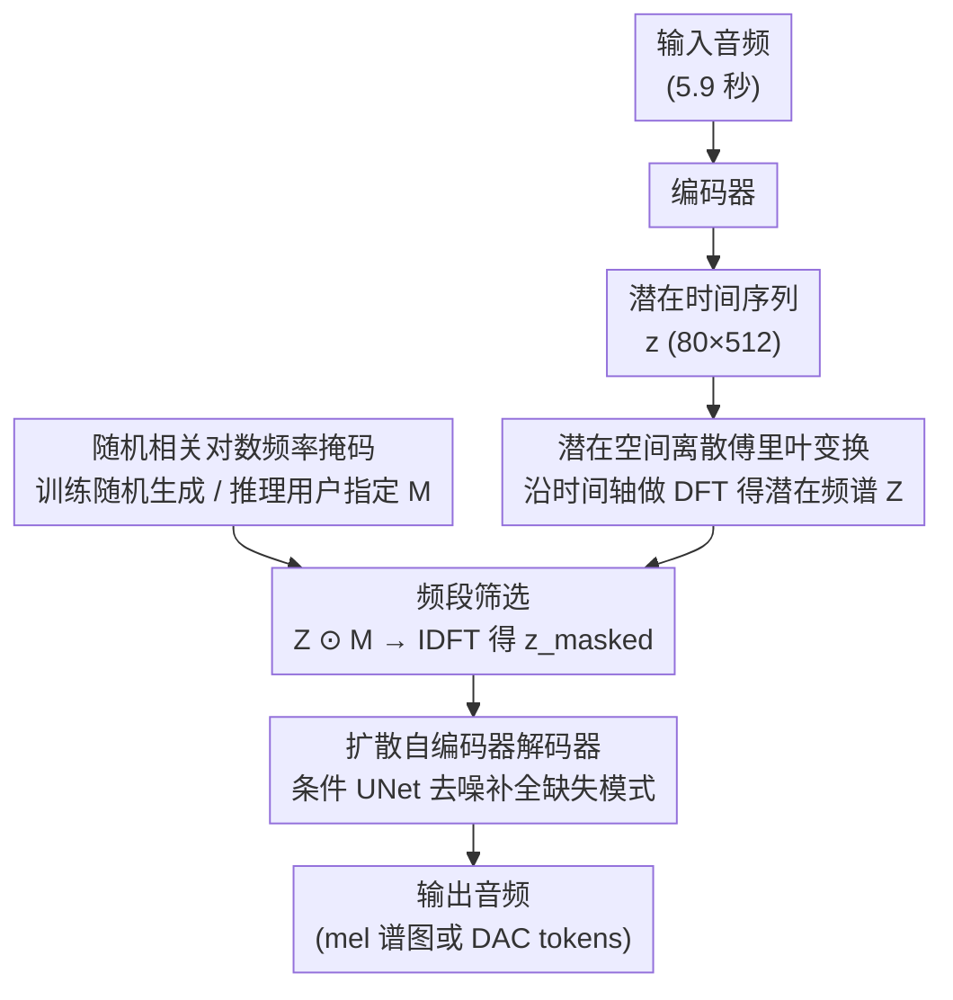

# Latent Fourier Transform

**会议**: ICLR 2026 Oral  
**OpenReview**: [ogMxCjdCCq](https://openreview.net/forum?id=ogMxCjdCCq)  
**代码**: 有  
**领域**: 其他  
**关键词**: diffusion autoencoder, Fourier transform, music generation, latent frequency, timescale control, controllable generation

## 一句话总结
提出 LatentFT 框架，在扩散自编码器的潜在时间序列表征上应用离散傅里叶变换按时间尺度分离音乐模式，训练时使用随机相关对数频率掩码让解码器学习从部分频谱重建，推理时用户通过指定频率掩码选择性保留/混合不同时间尺度的音乐元素，在条件生成和音乐融合任务上全面超越 ILVR/Guidance/Codec Filtering/RAVE 等基线，29 名音乐家听力测试统计显著确认其音质和融合能力优越。

## 研究背景与动机
**领域现状**：音乐生成模型（如基于扩散的自编码器、语言模型等）已能生成高质量音乐，但缺乏对音乐结构在不同时间尺度上的细粒度控制能力。音乐包含多尺度结构——和弦进行（~0.5 Hz）、旋律线（~2-5 Hz）、节奏型（~8 Hz）——它们在时间轴上以不同速率变化。

**现有痛点**：现有控制方法（text prompt、style transfer、guidance）只能整体调控，无法独立操控"保留这首歌的和弦进行，但替换节奏"这类多尺度需求。深度多尺度表征（如 UNet 不同层）中粗细粒度信息相互纠缠，难以独立操控。

**核心矛盾**：音乐生成需要在不同时间尺度上进行解耦控制，但当前没有一个自然的、连续的、可解释的控制轴来实现这一点。

**本文目标** 提供一个基于潜在频率域的新控制轴，让用户像使用均衡器调控音色一样调控音乐结构。

**切入角度**：利用傅里叶变换天然的"按频率分解"特性——不同频率分量正交、独立修改不互相干扰——将其应用到学到的潜在时间序列上。

**核心 idea**：在潜在空间做 DFT，用频率掩码控制音乐生成——"音乐结构的均衡器"。

## 方法详解

### 整体框架
LatentFT 想给音乐生成一个像均衡器旋钮一样的控制轴：用户能单独保留或替换某个时间尺度上的音乐元素——和弦、旋律、节奏。整篇都围绕一个想法展开——把这种控制放到潜在频率域里做。流程上，编码器先把一段音频压成潜在时间序列 $\mathbf{z} \in \mathbb{R}^{C \times T'}$（$C=80$ 通道，$T'=512$ 帧，对应 5.9 秒音频）；潜在 DFT 层沿时间轴把 $\mathbf{z}$ 变到频域、乘上一个频率掩码 $\mathbf{M}$ 只留下想要的频段；扩散解码器再从掩码后的潜在频谱 $\mathbf{z}_{\text{masked}} = \text{IDFT}(\text{DFT}(\mathbf{z}) \odot \mathbf{M})$ 把完整音频"想象"回来。三个组件端到端一起训练。

### 关键设计

**1. 潜在空间离散傅里叶变换：把控制轴建在频率域，靠正交性保证改一个频段不动其他频段**

直接在时域、或在 UNet 不同层上操控音乐结构，会撞上粗细粒度信息相互纠缠的老问题。LatentFT 改在编码器输出的潜在时间序列 $\mathbf{z}$ 上沿时间轴做 DFT，得到潜在频谱 $\mathbf{Z} = \text{DFT}(\mathbf{z})$。潜在帧率 $f_r \approx 86$ Hz，对应潜在 Nyquist 频率约 43 Hz；频率 bin $k$ 映射到潜在频率 $f_k = k \cdot f_r / T'$，并用 zero-padding factor $L=2$ 把频率分辨率提到 1024 个 bin。之所以用 DFT 而不是 bandpass filter，关键在正交性——不同频率分量彼此正交，修改其中一个不会泄漏到其他分量。论文实验里 bandpass 替代方案训练不稳定、得降学习率，而 DFT masking 等价于理想 bandpass 加周期 padding，不会留下边缘伪影。

**2. 随机相关对数频率掩码训练：训练时见过各种频段组合，推理时才能按用户指定掩码生成**

如果解码器只在完整频谱上训练，推理时突然喂给它一个只剩部分频段的潜在频谱就会崩。所以训练时对潜在频谱施加一个 0-1 随机掩码 $\mathbf{M}$，逼解码器学会从任意频段子集重建完整音频。掩码不是纯随机散斑，而是经过相关、对数两步变换：先在频率 bin 之间按对数尺度距离算一个相关矩阵 $\mathbf{K} \in \mathbb{R}^{F \times F}$，用它把独立随机分数加权成相关分数，再阈值化成 0-1 掩码。相关性让被掩/保留的 bin 倾向于成片出现，形成连续的频段"组"而非散斑，更贴近"保留和弦频段"这类音乐语义；对数尺度则让高频组更宽，匹配音乐信号 $1/f$ 频谱（每个 octave 等能量）的能量分布。消融里去掉相关或去掉对数尺度，条件生成和融合的 FAD 都会变差。

**3. 扩散自编码器解码器：用生成能力补全被掩码删掉的音乐模式**

掩码删掉部分频段后，信息是真的缺了一块，需要解码器"想象"出合理的缺失内容——这正是扩散模型擅长的事。解码器是一个条件 UNet，以 $\mathbf{z}_{\text{masked}}$ 为条件，走标准 DDPM 去噪过程生成 mel 谱图（也可换成 DAC tokens），训练用标准扩散损失

$$\mathcal{L} = \mathbb{E}_{\epsilon, t}\big[\|\epsilon - \epsilon_\theta(\mathbf{x}_t, t, \mathbf{z}_{\text{masked}})\|^2\big].$$

每次采样的随机性还顺带带来一个好处：同一组掩码也能生成多个不同的变体。

### 一个完整示例：从两首歌融合出一首新歌
以音乐融合为例走一遍：用户想要"歌 A 的和弦进行 + 歌 B 的节奏型"。先把两首歌各自编码成潜在时间序列、做潜在 DFT。和弦进行落在低频（~0.5 Hz），于是从歌 A 的潜在频谱里保留低频段；节奏/鼓点落在高频（~8 Hz），从歌 B 的潜在频谱里保留高频段；旋律所在的中频（~2–5 Hz）按需分给其中一方。两段互不重叠的频段合并成一个新的潜在频谱，送进扩散解码器去噪，就生成出一首和弦来自 A、节奏来自 B 的新音乐。条件生成是这个流程的特例——只给一个参考音频，用掩码保留目标频段、丢掉其余，解码器在保留这部分模式的前提下生成变体。论文也诚实标出了边界：当两个参考选用的是重叠或相邻的频段时，融合会失败。

## 实验关键数据

### 主实验：条件生成

| 方法 | Loudness ↑ | Rhythm ↑ | Timbre ↓ | Harmony ↓ | FAD ↓ |
|------|-----------|----------|----------|-----------|-------|
| LatentFT-UNet | **0.834** | **0.966** | **0.391** | **0.079** | **0.348** |
| LatentFT-MLP | 0.815 | 0.963 | 0.376 | 0.079 | 0.337 |
| ILVR | 0.540 | 0.881 | 1.183 | 0.116 | 1.478 |
| Guidance | 0.459 | 0.876 | 1.419 | 0.133 | 2.084 |
| Codec Filtering | 0.712 | 0.926 | 0.857 | 0.108 | 2.523 |
| RAVE | -0.016 | 0.718 | 3.836 | 0.180 | 4.695 |

### 消融实验

| 配置 | FAD (条件) | FAD (融合) | 说明 |
|------|----------|----------|------|
| LatentFT-MLP 完整 | 0.337 | 1.387 | 基线 |
| w/o 频率掩码训练 | 差（未报具体值） | 差 | 解码器无法从掩码输入重建 |
| w/o 对数尺度 | 更高 FAD | 更高 FAD | 高低频组宽度不匹配 $1/f$ |
| w/o 相关掩码 | 更高 FAD | 更高 FAD | 散斑掩码不对应音乐语义 |
| w/ Bandpass 替代 | 1.511 | 2.58 | 训练不稳定，FAD 显著更差 |
| LatentFT-DAC (waveform codec) | 0.915 | 1.364 | 可泛化到不同前端 |

### 关键发现
- **不同音乐属性对应不同潜在频率范围**：和弦进行 ~0.5 Hz（低频），旋律 ~2-5 Hz（中频），节奏/鼓点 ~8 Hz（高频）——这种对应是歌曲相关的，不同歌曲有微调
- 29 名音乐家听力测试：Kruskal-Wallis H + Wilcoxon signed-rank 检验，LatentFT 在音质和融合能力上统计显著优于所有基线
- 成功泛化到 30 秒片段（通过 fine-tuning），可捕获 0.05 Hz（20 秒周期）的段落转换
- 泛化到 Maestro（钢琴）和 GTZAN（10 流派）数据集

## 亮点与洞察
- **全新的控制轴**：潜在频率是音乐生成中前所未有的控制维度——正交、连续、可解释
- **DFT 正交性的实用价值**：修改一个频段不影响其他频段，这比 bandpass filter 等时域方法稳定得多（训练稳定性实验实证）
- **均衡器的结构化类比**：传统均衡器操控声音频谱改变音色，LatentFT 操控潜在频谱改变音乐结构——概念跃迁优雅
- **失败模式分析透明**：作者展示了当两个参考使用重叠频段或相邻频段时融合失败，诚实界定了方法边界

## 局限与展望
- 主要在 5.9 秒短片段上训练，30 秒需 fine-tuning，更长（3 分钟+）尚不可行
- 潜在频率与音乐属性的映射是歌曲相关的，不具有跨歌曲一致性
- DAC 编码器性能略差于 mel 编码器，可能因训练 batch size 更小导致
- 未与 text-conditioned 音乐生成模型（如 MusicLM）在组合控制场景上对比

## 相关工作与启发
- **vs ILVR/Guidance**: 这些方法在 mel 谱图上做 DFT 掩码引导扩散去噪，没有专门的潜在空间和掩码训练，效果显著差于 LatentFT
- **vs RAVE**: RAVE 的潜在空间不适合频率域操控（直接掩码+解码产生低质量音频），说明不是任何潜在空间都适合做 DFT 操控
- **vs AudioMAE**: AudioMAE 在时频谱图上做 patch 掩码重建，LatentFT 在潜在频谱上做频率掩码重建，方向类似但目标不同

## 评分
- 新颖性: ⭐⭐⭐⭐⭐ 潜在傅里叶域控制是全新概念，"音乐结构的均衡器"类比非常优雅
- 实验充分度: ⭐⭐⭐⭐⭐ 3 数据集 + 音乐家听力测试（统计显著）+ 丰富消融 + 替代编码器 + 失败模式分析 + 30 秒泛化
- 写作质量: ⭐⭐⭐⭐ 概念解释直觉清晰，但 reviewer 批评部分术语（timescale vs latent frequency）使用不一致
- 价值: ⭐⭐⭐⭐⭐ 为音乐生成提供了全新的、可解释的控制范式，开启新研究方向

<!-- RELATED:START -->

## 相关论文

- [\[NeurIPS 2025\] Deep Legendre Transform](../../NeurIPS2025/others/deep_legendre_transform.md)
- [\[ICLR 2026\] LPWM: Latent Particle World Models for Object-Centric Stochastic Dynamics](latent_particle_world_models_self-supervised_object-centric_stochastic_dynamics_.md)
- [\[ICLR 2026\] FastLSQ: Solving PDEs in One Shot via Fourier Features with Exact Analytical Derivatives](fastlsq_solving_pdes_in_one_shot_via_fourier_features_with_exact_analytical_deri.md)
- [\[ICLR 2026\] Latent Equivariant Operators for Robust Object Recognition: Promises and Challenges](latent_equivariant_operators_for_robust_object_recognition_promises_and_challeng.md)
- [\[ICLR 2026\] Out of the Shadows: Exploring a Latent Space for Neural Network Verification](out_of_the_shadows_exploring_a_latent_space_for_neural_network_verification.md)

<!-- RELATED:END -->
