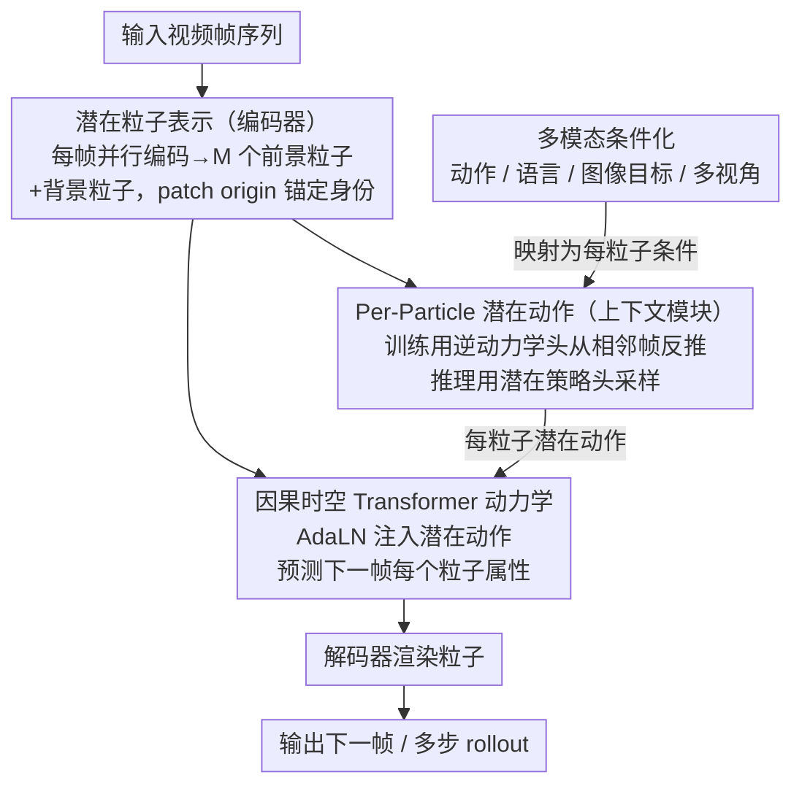

# LPWM: Latent Particle World Models for Object-Centric Stochastic Dynamics

**会议**: ICLR 2026 Oral  
**arXiv**: [2603.04553](https://arxiv.org/abs/2603.04553)  
**代码**: [项目页](https://taldatech.github.io/lpwm-web)  
**领域**: 世界模型 / 物体中心表示 / 视频预测  
**关键词**: 物体中心, 潜在粒子, 自监督, 世界模型, 随机动力学, 潜在动作

## 一句话总结
LPWM 是首个能扩展到真实世界多物体数据集的自监督物体中心世界模型，核心创新是为每个粒子学习独立的潜在动作分布（per-particle latent actions），通过因果时空 Transformer 并行编码所有帧，支持动作/语言/图像目标/多视角等多种条件生成，在视频预测上达到 SOTA 并展示了模仿学习能力（OGBench task3 成功率 89%）。

## 研究背景与动机
**领域现状**：物体中心世界模型通过将场景分解为独立物体表示（slot/patch/particle），天然适合理解多物体交互。DLP（Deep Latent Particles）框架用关键点+扩展属性表示物体（位置、尺度、深度、透明度、视觉特征）。

**现有痛点**：
   - **Slot-based 方法**（SlotFormer 等）：分解不一致、预测模糊、收敛困难，且需要两阶段训练
   - **Patch-based 方法**（G-SWM 等）：依赖跨帧后处理匹配，无法扩展到复杂数据
   - **DDLP**（当前最好的 particle-based 方法）：依赖显式粒子追踪 + 顺序编码 → 无法并行化、不支持随机性
   - 所有物体中心方法都**局限于简单仿真环境**，无法处理真实世界多物体视频

**核心矛盾**：物体中心表示有天然优势（可解释、组合泛化、稀疏交互建模），但扩展到真实世界复杂场景的关键瓶颈是——如何处理多物体独立的随机运动？全局潜在动作无法捕捉"物体 A 左移、物体 B 不动"的独立行为

**核心 idea**：为每个潜在粒子学习独立的潜在动作分布 $z_c^m$——训练时用逆动力学从帧对推断，推理时用学到的潜在策略采样，通过 AdaLN 条件化因果时空 Transformer

## 方法详解

### 整体框架
LPWM 想解决的是「物体中心世界模型扩展不到真实世界多物体视频」这个老问题，关键在于把每个物体的独立随机运动建模进来。整套模型作为一个变分自编码器（VAE）端到端联合训练，纯靠视频驱动，由四个模块组成：编码器（Encoder）、解码器（Decoder）、上下文模块（Context Module）、动力学模块（Dynamics Module）。先用编码器把每一帧并行拆成 $M$ 个前景粒子（每个粒子带属性向量 $z_{fg}^m = [z_p, z_s, z_d, z_t, z_f]$，覆盖 2D 位置、尺度、深度、透明度、视觉特征）外加一个背景粒子；接着上下文模块为每个粒子单独采样一个潜在动作（latent action）$z_c^m$，刻画它这一步「想怎么动」；动力学模块拿当前粒子加上对应的潜在动作，预测下一帧每个粒子的属性，潜在动作通过 AdaLN 注入；最后解码器把预测出的粒子渲染成下一帧图像，渲染结果同时用于重构损失。多模态条件（动作 / 语言 / 图像目标 / 多视角）统一从上下文模块注入，被映射成每个粒子的潜在动作。因为粒子身份不靠追踪而靠 patch origin 锚定，所有帧可以一次并行编码，这也是它能扩展到复杂数据的前提。

### 关键设计

**1. 潜在粒子表示：用 patch origin 锚定身份，彻底甩掉显式追踪**

DDLP 这类 particle-based 前辈的可扩展性瓶颈就在「显式追踪」——它要顺序地追踪少数粒子的运动轨迹，一旦某帧追踪失败，错误会沿时间累积，而且顺序依赖让它没法并行。LPWM 换了个思路：每帧独立编码出 $M$ 个前景粒子，粒子的身份直接由它的 patch origin 决定，于是「同一个 origin 上的粒子」天然在帧间对应，无需任何跨帧匹配或轨迹追踪。这样做的直接好处是所有帧可以并行编码、没有顺序依赖。它的定位刚好卡在 patch-based 与 object-centric 之间——粒子允许在自己 origin 附近的一定范围内移动以贴合物体运动，但不会完全自由漫游，既保住了组合性又避免了 patch 表示的僵硬。

**2. Per-Particle 潜在动作（Context Module）：给每个物体单独建一套随机性，这是全篇核心创新**

真实多物体场景里物体的运动是各自独立的——球往左滚、方块纹丝不动——一个全局潜在动作根本没法同时描述这两件事。LPWM 因此为每个粒子 $m$ 单独学一个潜在动作分布，上下文模块本身是一个因果时空 Transformer，带两个互补的头。训练时走**逆动力学头**：给定相邻两帧 $o_t, o_{t+1}$，从「实际发生了什么」反推每个粒子的潜在动作 $q(z_c^m \mid o_t, o_{t+1})$（类似 inverse model）。推理时换成**潜在策略头** $\pi(z_c^m \mid o_{\leq t})$，只看历史帧预测下一步每个粒子的潜在动作分布，再从中采样，从而实现随机预测。两者用 KL 散度对齐——潜在策略充当先验来正则化逆动力学，训练目标里包含 $D_{KL}\big(q(z_c^m \mid o_t, o_{t+1}) \,\|\, \pi(z_c^m \mid o_{\leq t})\big)$，让策略学会逼近逆动力学推断出的真实动作分布。和 Genie、CADDY 用的全局潜在动作相比，消融实验直接证明 per-particle 才是关键——全局动作无法捕捉多物体各自独立的运动模式。

**3. 因果时空 Transformer 动力学：用 AdaLN 把潜在动作注进每一层**

预测下一帧粒子属性变化的主干是一个同时管时间和空间的 Transformer：因果注意力保证每个粒子只看得到历史帧、不偷看未来，空间注意力让同一帧内的粒子相互交互（建模物体间的碰撞、遮挡等关系）。潜在动作 $z_c^m$ 不是简单拼接进输入，而是通过 Adaptive Layer Normalization（AdaLN）调制每个 Transformer 层的归一化参数注入进去。消融验证表明，AdaLN 这种调制式条件化比把动作当作加法位置嵌入更有效地传递条件信号。

**4. 多模态条件化：同一套接口接住动作 / 语言 / 图像目标 / 多视角**

LPWM 把外部条件统一塞进 Transformer 的条件化通道，使同一个模型不必改结构就能服务多种下游任务：外部动作信号可直接作为条件融入；文本经编码后作为语言条件；目标帧编码后作为图像目标条件引导生成；多视角下不同视角的粒子可同时建模同一动态。正是这套统一接口，让「视频预训练 → 机器人控制」的迁移变得自然，无须为每种条件单独设计模块。

### 损失函数 / 训练策略
- 端到端纯视频自监督训练（无需物体标签/分割标注），最大化时序 ELBO，即最小化重构误差 + KL 散度之和，拆成首帧的 $\mathcal{L}_{static}$（对固定先验算每粒子 KL + 透明度正则）和后续帧的 $\mathcal{L}_{dynamic}$（含潜在动作 KL + 预测粒子 KL），所有 KL 项闭式可解
- 重构损失：仿真数据用逐像素 MSE，真实数据用 MSE + LPIPS；KL 项按粒子透明度掩码，只让可见粒子参与
- 潜在动作维度 $d_{ctx}=7$；训练分辨率 128×128，$M$ 个粒子随数据集调整；Adam 优化，学习率 $8\times10^{-5}$

## 实验关键数据

### 视频预测（主实验）

| 数据集 | 条件类型 | DVAE LPIPS↓ | LPWM LPIPS↓ | DVAE FVD↓ | LPWM FVD↓ |
|--------|---------|-------------|-------------|-----------|-----------|
| Sketchy-U | 潜在动作 | 0.113 | **0.070** | 140.06 | **85.45** |
| BAIR-U | 潜在动作 | 0.063 | **0.062** | 164.41 | **163.91** |
| Bridge-L | 语言 | — | — | 146.85 | **47.78** |
| Mario-U | 潜在动作 | — | **最优** | — | **最优** |

LPWM 在所有随机动力学数据集上的 LPIPS 和 FVD 指标均超越所有基线。

### 模仿学习

| 环境/任务 | GCIVL | HIQL | **LPWM** |
|-----------|-------|------|---------|
| PandaPush 1 Cube | 74±4 | — | **100±0** |
| PandaPush 3 Cubes | 62.1±4.4 | — | **89.4±2.5** |
| OGBench task1 | 84±4 | 80±6 | **100±0** |
| OGBench task3 | 16±8 | 61±11 | **89±9** |

LPWM 在 PandaPush 和 OGBench 的多任务上显著超越基线。OGBench task3（涉及 4 个原子行为）成功率 89% vs EC Diffuser 16%。

### 消融实验

| 配置 | 效果 | 说明 |
|------|------|------|
| 全局 vs per-particle 潜在动作 | Per-particle 显著更优 | 核心创新被验证 |
| 潜在动作维度 | 接近有效粒子维度 ($6+d_{obj}$) 最佳 | 模型对维度鲁棒 |
| AdaLN vs 加法位置嵌入 | AdaLN 更优 | 条件化方式很重要 |

### 关键发现
- Per-particle 潜在动作是性能的决定性因素——全局潜在动作导致多物体场景的独立运动无法被建模
- LPWM 的紧凑模型在 BAIR-64 上的 FVD（89.4）匹配大规模视频生成模型——说明物体中心归纳偏差的效率优势
- 真实世界数据集（Sketchy、BAIR、Bridge）上的成功验证打破了物体中心方法仅适用于仿真的传统认知
- 想象轨迹与实际执行高度匹配（Figure 4），证明世界模型的准确性可直接转化为决策能力

## 亮点与洞察
- **物体中心表示的"扩展突破"**：长期以来物体中心方法被认为只能在简单仿真中工作。LPWM 证明了通过正确的设计（per-particle latent actions + 去掉追踪 + 并行编码）可以扩展到真实世界——这是概念性的进步
- **"what-where"视觉通路的计算实现**：粒子表示天然对应视觉系统的物体分解，潜在动作对应动作预测，整体架构与人类视觉-空间世界模型的神经科学发现吻合
- **统一的多条件接口**：同一个模型支持无条件/动作/语言/图像/多视角条件化——这使得从视频预训练 → 机器人控制的迁移变得自然

## 局限与展望
- 假设小的相机运动和重复场景（如机器人桌面操作），不适用于任意视频（如街景、电影）
- >4 个原子行为的长 horizon 任务（OGBench task4/5）全部方法失败——长期规划仍是挑战
- 粒子数 $M$ 固定，无法动态适应不同复杂度的场景
- 隐式追踪（粒子在 origin 附近移动）在大位移场景可能失效
- 尚未与显式奖励模型/RL 结合

## 相关工作与启发
- **vs SlotFormer（slot-based）**：两阶段训练、分解不一致、模糊预测；LPWM 端到端训练、per-particle latent actions 更灵活
- **vs Genie/CADDY（全局潜在动作）**：全局动作无法捕捉多物体独立运动；PlaySlot 加了 slot-level latent actions 但受限于 slot 表示的缺陷
- **vs DDLP（最近的 particle-based 前辈）**：DDLP 需要显式追踪和顺序编码；LPWM 去掉追踪、并行编码、加入随机性

## 评分
- 新颖性: ⭐⭐⭐⭐⭐ Per-particle latent actions 是自然但非显然的关键创新，物体中心世界模型扩展到真实世界是重要突破
- 实验充分度: ⭐⭐⭐⭐ 6+ 数据集（合成+真实）+ 视频预测 + 模仿学习 + 消融
- 写作质量: ⭐⭐⭐⭐ 动机和设计逻辑清晰，与先前工作的对比充分
- 价值: ⭐⭐⭐⭐⭐ 物体中心世界模型领域的开创性工作，代码/数据/模型全部开源

<!-- RELATED:START -->

## 相关论文

- [\[ICLR 2026\] Latent Equivariant Operators for Robust Object Recognition: Promises and Challenges](latent_equivariant_operators_for_robust_object_recognition_promises_and_challeng.md)
- [\[AAAI 2026\] Beyond World Models: Rethinking Understanding in AI Models](../../AAAI2026/others/beyond_world_models_rethinking_understanding_in_ai_models.md)
- [\[ICLR 2026\] Latent Fourier Transform](latent_fourier_transform.md)
- [\[ICML 2025\] General Agents Contain World Models](../../ICML2025/others/general_agents_contain_world_models.md)
- [\[ICLR 2026\] Building Spatial World Models from Sparse Transitional Episodic Memories](building_spatial_world_models_from_sparse_transitional_episodic_memories.md)

<!-- RELATED:END -->
