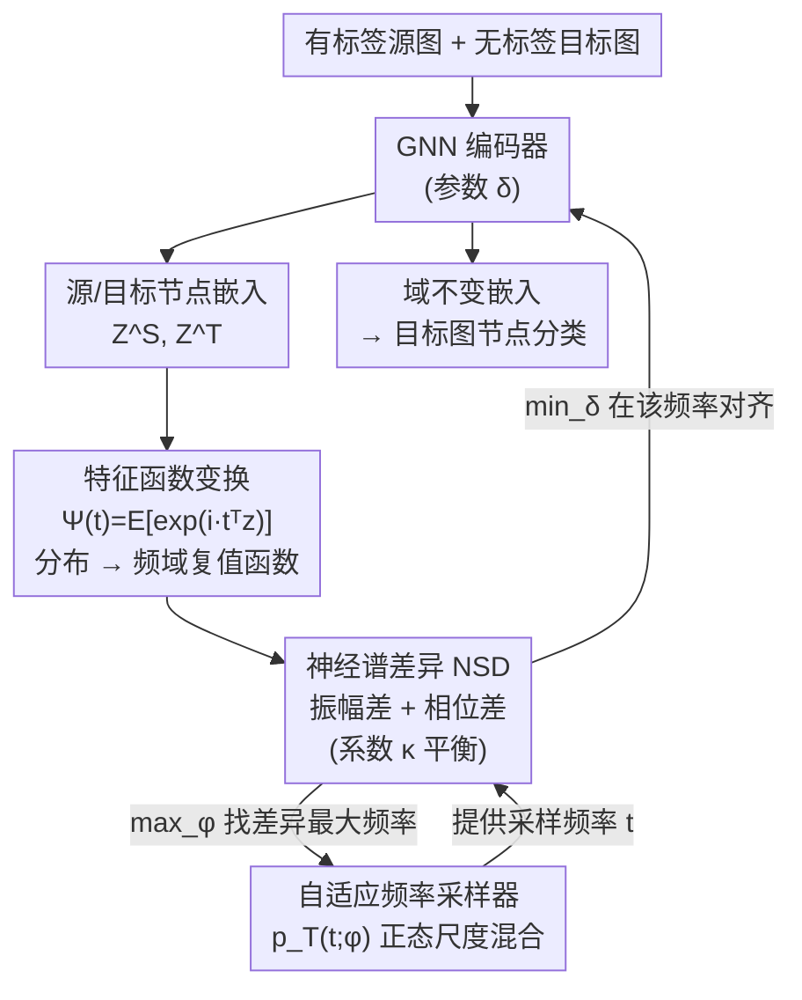

# Learning Adaptive Distribution Alignment with Neural Characteristic Function for Graph Domain Adaptation

**会议**: ICLR 2026  
**arXiv**: [2602.10489](https://arxiv.org/abs/2602.10489)  
**代码**: [https://github.com/gxingyu/ADAlign](https://github.com/gxingyu/ADAlign)  
**领域**: 其他 / 图神经网络  
**关键词**: 图域适应, 特征函数, 谱域对齐, 自适应频率采样, minimax优化

## 一句话总结
提出ADAlign框架，利用神经特征函数在谱域自适应对齐源/目标图分布——无需手动选择对齐标准，自动识别每个迁移场景中最显著的分布差异。在10个数据集16个迁移任务上达SOTA，同时降低内存和训练时间。

## 研究背景与动机
图域适应(GDA)旨在将有标签源图的知识迁移到无标签目标图。分布偏移的来源复杂多样——节点属性差异、度分布差异、同质性差异等往往交织在一起。现有方法依赖人工设计的图滤波器提取特定特征（如属性或结构统计量）再对齐，但不同迁移场景中主导差异不同，固定策略难以适应。

如Figure 1可视化所示，三个Airport迁移任务中最大KL散度对应的特征维度完全不同——B-E中feature 2,3最大，U-E中feature 1,2,4最大。固定对齐某几个特征无法捕获所有场景的完整偏移。

核心创新：用特征函数(CF)在谱域统一表示分布差异——CF唯一确定概率分布(Thm 2)且可自适应地在频域中寻找最信息量的频率成分进行对齐(NSD + learnable frequency sampler)。

## 方法详解

### 整体框架
ADAlign 要解决的是图域适应（GDA）里"分布偏移来源混杂"的难题——节点属性、度分布、同质性的差异往往同时存在，手工挑某类特征去对齐换个场景就失灵。它的做法是把对齐这件事整体搬到频域：先用一个 GNN 编码器（参数 $\delta$）把有标签源图和无标签目标图映射成节点嵌入 $Z^S,Z^T$，再用特征函数把两侧嵌入的经验分布变换成频域复值函数，用神经谱差异（NSD）在每个频率上度量它们的差距。关键在于这个度量里的"看哪些频率"不是固定的：一个可学习的频率采样器与编码器做 minimax 博弈——采样器专挑差异最大的频率"找茬"，编码器则被迫在这些被挑出的频率上把分布拉齐，从而不必人工指定该对齐属性还是结构，对齐后的域不变嵌入直接用于目标图节点分类。

### 关键设计

**1. 特征函数变换：用频域整体表示绕开"该对齐什么"的人工选择**

GDA 的麻烦在于分布偏移的来源（节点属性、度分布、同质性）交织在一起，传统方法靠手工滤波器抽某类特征再对齐，换个迁移场景主导差异就变了。ADAlign 改用特征函数（characteristic function, CF）刻画整个分布：对嵌入 $z$ 定义 $\Psi(t) = \mathbb{E}\big[\exp(i\,t^\top z)\big]$，把概率分布变换到以频率 $t$ 为坐标的复值函数。论文证明特征函数唯一确定一个概率分布（Thm 2），并给出经验估计的收敛性保证（Thm 1），因此对齐 $\Psi^S(t)$ 与 $\Psi^T(t)$ 等价于对齐完整分布而非某几个手选维度，从根上消除了"该对齐属性还是结构"的人工取舍。

**2. 神经谱差异（NSD）：把分布差异分解成振幅与相位两路**

有了两侧特征函数，还需要一个可优化的距离。NSD 定义为按频率分布加权的差异积分 $\mathrm{NSD} = \int_{t}\sqrt{\big|\Psi^S(t) - \Psi^T(t)\big|^2}\, dF_T(t)$。论文对复值差异做极坐标分解，把逐点差异拆成两项：

$$\ell(t) = \underbrace{\big(|\Psi^S(t)|-|\Psi^T(t)|\big)^2}_{\text{振幅差}} + \underbrace{2|\Psi^S(t)||\Psi^T(t)|\big(1-\cos(\theta^S(t)-\theta^T(t))\big)}_{\text{相位差}}$$

振幅项反映嵌入在各频率上的能量分布、对应全局结构与低频同质模式；相位项编码频率模式间的相对位置、对应关系结构错位与异质不规则。再用系数 $\kappa\in[0,1]$ 做凸组合 $\ell_\kappa(t) = \kappa\,(\text{振幅差}) + (1-\kappa)\,(\text{相位差})$ 平衡两路（$\kappa$ 越大越偏重振幅）。这种分解让度量既能捕捉粗粒度的整体漂移，又能捕捉细粒度的关系错位；实验中 $\kappa$ 取 $0.65\!-\!0.75$ 表现最稳，推向任一极端（仅振幅 $\kappa=1$ 或仅相位 $\kappa=0$）都明显退化，说明两类信息互补。

**3. 自适应频率采样器：让模型自己找最该对齐的频率**

NSD 中的积分要在频率空间采样近似，而不同迁移任务最显著的差异落在不同频段（Figure 1 中三个 Airport 任务的最大 KL 维度各不相同），固定网格要么太稀漏掉关键 shift、要么太密引入冗余与噪声。ADAlign 因此把采样密度本身参数化为正态尺度混合（normal scale mixture）$p_T(t;\varphi)$——它涵盖高斯、柯西、Student-$t$ 等多种分布族，能自适应地把质量压在低频（全局变化）或高频（细粒度偏移），并用重参数化技巧（reparameterization trick）保证采样可微。训练时采样参数 $\varphi$ 朝最大化 NSD 贡献的方向走，主动把概率质量移向差异最大的频率，从而为下游对齐挑出一组紧凑、高信号的频率点。

**4. minimax 优化：对抗式地"先找茬再对齐"**

上述两股力量合成一个 minimax 目标（Eq 14）：$\min_{\delta}\max_{\varphi}\big[\mathcal{L}_{\text{source}} + \lambda\,\mathcal{L}_{\text{align}}\big]$。内层 $\max_\varphi$ 让采样器对抗性地寻找当前差异最大的频率，外层 $\min_\delta$ 让 GNN 同时优化源域分类与跨域对齐。这种博弈把"自动识别最显著差异"自然编码进训练流程：采样器越擅长挑刺，编码器就越被迫在最难对齐的方向上拉平分布，收敛后即得到对全谱差异都稳健的对齐。

### 损失函数 / 训练策略
总损失为源域分类项与对齐项之和 $\mathcal{L} = \mathcal{L}_{\text{source}}(\text{CE}) + \lambda\,\mathcal{L}_{\text{align}}(\text{NSD})$。对齐项 $\mathcal{L}_{\text{align}}$ 通过 Monte Carlo 在采样分布上取 $M$ 个频率点近似 NSD 积分，$M$ 越大方差越小但开销越高；采样过程用重参数化技巧改写，使频率采样参数 $\varphi$ 可微，从而 minimax 两侧都能用梯度联合优化。

## 实验关键数据

### 主实验（部分展示）

| 任务 | GAT | GCN | UDAGCN | DEAL | **ADAlign** | 说明 |
|------|-----|-----|--------|------|----------|------|
| A→C (Citation) | 62.8 | 69.2 | 72.1 | 74.3 | **76.8** | +2.5 |
| C→D (Citation) | 67.1 | 68.1 | 71.5 | 73.2 | **75.4** | +2.2 |
| B1→B2 (Blog) | 21.2 | 20.5 | 23.1 | 24.8 | **28.3** | +3.5 |

### 消融实验

| 组件 | 效果 | 说明 |
|------|------|------|
| 去掉adaptive sampler（fixed频率） | 显著下降 | 自适应是关键 |
| 去掉phase alignment | 下降 | 两者都重要 |
| 去掉amplitude alignment | 下降 | 互补信息 |
| κ→极端（κ=0 仅相位 / κ=1 仅振幅） | 都不如 κ∈[0.65,0.75] | 需要平衡两路 |

### 效率比较

| 方法 | 内存(MB) | 训练时间(s) | 说明 |
|------|---------|-----------|------|
| DEAL | 1,245 | 892 | 重型GNN对齐 |
| FLAN | 987 | 756 | 滤波器设计 |
| **ADAlign** | **423** | **312** | 轻量谱域操作 |

### 关键发现
- ADAlign在16/16个迁移任务上达到最优或接近最优。
- 内存和训练时间分别降低2-3倍——CF操作比GNN-based对齐更轻量。
- 自适应频率采样在不同场景自动聚焦不同谱成分——验证了设计初衷。
- PAC-Bayesian分析(Thm 3 + Prop 1)为NSD提供了泛化理论支持。

## 亮点与洞察
- 特征函数为图分布对齐提供了统一、完备的理论工具——不需要手动选择对齐什么。
- 振幅/相位分解有直觉意义：振幅≈全局统计量差异，相位≈关系结构差异。
- minimax中的frequency sampler是"对抗性搜索最大差异"的自然表达。
- 效率优势使框架实用性更强。

## 局限与展望
- Monte Carlo近似的频率采样引入方差，M的选择需要权衡。
- 仅在节点分类任务验证，图级任务待探索。
- κ的选择目前是超参，自适应κ可能更优。
- 对极端domain gap的处理能力需进一步测试。

## 相关工作与启发
- 将特征函数从生成模型/知识蒸馏引入GDA，开辟了新的方法空间。
- 自适应谱域对齐的思路可推广到其他domain adaptation任务。

## 评分
- 新颖性: ⭐⭐⭐⭐ 特征函数+谱域对齐+自适应采样
- 实验充分度: ⭐⭐⭐⭐⭐ 10数据集16任务+消融+效率分析
- 写作质量: ⭐⭐⭐⭐ 数学推导清晰
- 价值: ⭐⭐⭐⭐ GDA方法论的有意义贡献

<!-- RELATED:START -->

## 相关论文

- [\[ICLR 2026\] Learning Structure-Semantic Evolution Trajectories for Graph Domain Adaptation](learning_structure-semantic_evolution_trajectories_for_graph_domain_adaptation.md)
- [\[ICLR 2026\] Distributionally Robust Classification for Multi-Source Unsupervised Domain Adaptation](distributionally_robust_classification_for_multi-source_unsupervised_domain_adap.md)
- [\[ICLR 2026\] Improving Set Function Approximation with Quasi-Arithmetic Neural Networks](improving_set_function_approximation_with_quasi-arithmetic_neural_networks.md)
- [\[ICLR 2026\] Noisy-Pair Robust Representation Alignment for Positive-Unlabeled Learning](noisy-pair_robust_representation_alignment_for_positive-unlabeled_learning.md)
- [\[ICLR 2026\] Noise-Aware Generalization: Robustness to In-Domain Noise and Out-of-Domain Generalization](noise-aware_generalization_robustness_to_in-domain_noise_and_out-of-domain_gener.md)

<!-- RELATED:END -->
