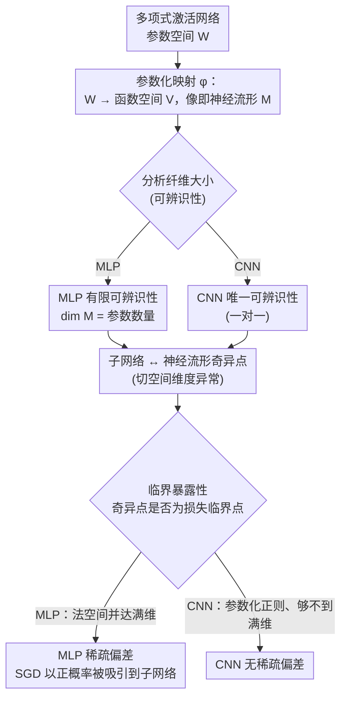

# Learning on a Razor's Edge: Identifiability and Singularity of Polynomial Neural Networks

**会议**: ICLR 2026  
**arXiv**: [2505.11846](https://arxiv.org/abs/2505.11846)  
**代码**: 无  
**领域**: 深度学习理论 / 代数几何  
**关键词**: 可辨识性, 神经流形奇异点, 多项式神经网络, 稀疏偏差, 代数几何

## 一句话总结

本文利用代数几何工具，对多项式激活的 MLP 和 CNN 进行了系统性分析：证明了 MLP 的有限可辨识性和 CNN 的唯一可辨识性，揭示了稀疏子网络对应神经流形的奇异点，并从"临界暴露性"角度给出了 MLP 稀疏偏差的几何解释——而 CNN 不具备这种偏差。

## 研究背景与动机

- **领域现状**: 神经网络参数化了一个函数空间（称为"神经流形" / neuromanifold）。该流形的几何性质——维度、可辨识性、奇异点——直接影响模型的表达能力、训练动态和泛化能力。现有的可辨识性分析仅限于 Tanh、Sigmoid、ReLU 等特定激活函数。
- **现有痛点**: (1) 对一般激活函数的可辨识性（不同参数对应同一函数的冗余度）缺乏系统证明；(2) 神经流形奇异点的完整刻画仅限于线性网络和单项式 CNN；(3) 训练中观察到的"稀疏偏差"（网络倾向于丢弃神经元、收敛到稀疏子网络）缺少几何层面的理论解释。
- **核心矛盾**: 虽然经验上人们相信 MLP 具有离散参数对称性（来自神经元排列），但形式化证明只对 Tanh/Sigmoid 等特定激活存在。单项式激活的可辨识性虽有进展，但存在无限纤维（来自逐神经元缩放），无法直接推广。
- **本文目标**: 对"足够通用"的多项式激活函数，统一证明 MLP/CNN 的可辨识性和维度公式，刻画奇异点与子网络的关系，并解释稀疏偏差的几何成因。
- **切入角度**: 多项式激活 → 神经流形是半代数簇 → 代数几何工具（Zariski 拓扑、纤维维度定理、环面几何）可用 → 证得的结论对"通用"多项式成立 → 通过多项式逼近可推广到一般激活函数。
- **核心 idea**: 稀疏子网络（部分神经元被置零的网络）恰好构成神经流形上的奇异点；对 MLP 而言这些奇异点还是损失函数的临界点（以正概率），SGD 会被吸引到这些点——这从几何角度解释了"Lottery Ticket Hypothesis"和稀疏偏差。

## 方法详解

### 整体框架

本文是纯理论工作，主线是把多项式激活的 MLP/CNN 看成把参数空间 $\mathcal{W}$ 映到函数空间 $\mathcal{V}$ 的代数映射 $\varphi$，其像即神经流形 $\mathcal{M}_{\mathbf{d},\sigma}$。围绕这个映射依次回答三件事：纤维（fiber）有多大决定可辨识性，切空间维度在哪里异常决定奇异点，再用"临界暴露性"把奇异点和损失函数的临界点接起来，从而落到优化动态上。整套论证对 MLP 与 CNN 分头进行、最后在"稀疏偏差"这个结论上对照分流，且都建立在 Zariski 拓扑的不可约性上——只要在一个通用点验证成立，结论就在稠密开集上成立。

### 关键设计

**1. MLP 有限可辨识性（Theorem 4.1）：把缩放对称性"切"成有限解**

目标是证明对通用多项式激活、足够大的度 $r$，MLP 参数化映射的通用纤维是有限的，即同一函数只对应有限多组参数。证明的关键是构造一个稀疏多项式激活 $\sigma(x) = \sum_{i=1}^{L} x^{\beta_i}$，使 MLP 输出可分解成若干单项式 MLP 之和（Lemma B.1）。单项式 MLP 的纤维结构已知（神经元排列加对角缩放），借此把可辨识性问题归结为一个多项式方程组 $\lambda_{L,1}^{\beta_{L-1}^{L-2}} \cdots \lambda_{L,L-1} = 1$，再用 Smith 正规形和环面几何证明它只有有限多解，从而得到 $\dim(\mathcal{M}_{\mathbf{d},\sigma}) = \sum_{i=1}^{L} d_i d_{i-1}$，即神经流形维度恰等于参数数量，解决了 Kileel 等人 2019 年的维度猜想。之所以单项式激活做不到这一点，是因为它只有缩放对称性带来的无限纤维；多项式的多个非零系数提供了额外约束方程，正好把缩放自由度消掉。

**2. CNN 唯一可辨识性（Theorem 4.4）：权重共享换来一对一**

这里要证 CNN 的参数化在 $\mathcal{W} \setminus \varphi^{-1}(0)$ 上是正则的（Jacobian 满秩）且通用一对一。卷积的权重共享让 Jacobian 分析比 MLP 简洁得多：通过 Lemma C.1 的对数导数技巧，构造辅助函数 $P(x) = x\sigma'(x)/\sigma(x)$ 并做渐近展开，可证任何让两组参数化重合的缩放因子 $\lambda_i$ 都必须为 1，于是不存在冗余。结论比 MLP 更强的根源在于权重共享消除了 MLP 中神经元排列带来的离散对称性——这一差异会在奇异点类型和稀疏偏差上被进一步放大。

**3. 子网络与奇异点（Theorems 4.2, 4.6）：稀疏结构 ↔ 几何奇异性**

本设计建立稀疏子网络（部分神经元被置零）与神经流形奇异点之间的精确对应。对 MLP，在子网络参数 $\mathbf{W}$ 处，被置零神经元所在的行可以自由变动而不改变 $f_\mathbf{W}$；$\varphi$ 对这些"死亡"参数的偏导数 $\frac{\partial \varphi}{\partial W_{i+2}[k,j]}$ 给出一族切向量，随自由参数变化张成的空间维度超过 $\dim(\mathcal{M})$，按定义即奇异点。对 CNN，Theorem 4.6 给出当且仅当的完整刻画：奇异点恰对应"合适的"子网络——滤波器在左端或右端填零，且递推量 $\tilde{t}_i = t_i + \tilde{t}_{i-1}/s_{i-1}$ 满足整数性条件。两者奇异点的几何形态不同，MLP 是 Jacobian 秩降的尖点型，CNN 则全是参数化仍正则的节点型（自交叉），这一区别是下一步优化分析的基础。

**4. 临界暴露性（Theorem 4.3, Proposition 4.5）：把奇异点接到 SGD 的吸引子上**

最后引入"临界暴露性"(critically exposed) 概念，解释为什么 MLP 会落进稀疏子网络而 CNN 不会。称集合 $S$ 临界暴露，若 $U_S = \{u \in \mathcal{V} \mid \exists \mathbf{W} \in S, \nabla(\mathcal{L}_u \circ \varphi)(\mathbf{W}) = 0\}$ 在 $\mathcal{V}$ 中有非空内部；几何上 $U_S = \bigcup_{\mathbf{W} \in S} f_\mathbf{W} + \mathrm{im}(J_\mathbf{W}\varphi)^\perp$ 是一族仿射子空间的并。对 MLP，严格子网络处 Jacobian 有对应死亡参数的零列，使这族法空间的并达到满维 $\dim(\mathcal{V})$；对 CNN，参数化正则（无零列），代数集的像够不到满维。满维意味着对随机采样的数据目标 $u$ 以正概率在子网络处存在损失临界点，于是 SGD 以正概率被吸引到稀疏子网络——这就给 MLP 的稀疏偏差一个纯几何的解释，也对照出 CNN 没有这种偏差。

### 损失函数 / 训练策略

全程采用标准均方误差损失 $\mathcal{L}_\mathcal{D}(f) = \sum_{(x,y) \in \mathcal{D}} \|f(x) - y\|^2$。关键在于把它改写成 $\mathcal{L}_u(f) = Q(f - u)$，其中 $Q$ 是 $\mathcal{V}$ 上的二次型、$u \in \mathcal{V}$ 由数据集决定。由链式法则，$\mathbf{W}$ 是 $\mathcal{L}_u \circ \varphi$ 的临界点，当且仅当 $f_\mathbf{W} - u$ 正交于参数化映射的 Jacobian 像——正是这一几何等价，支撑了上面所有与优化相关的论证。

## 实验关键数据

### 计算实例 (Appendix D)

本文为纯理论工作，无大规模实验。但附录中给出了显式计算的小规模验证：

| 架构 | 激活函数 | 参数空间 | 神经流形定义方程 | 奇异点 |
|------|----------|---------|----------------|--------|
| MLP (2,2,1) | $\sigma(x) = x^3 + x^2$ | $\mathbb{R}^6$ | 超曲面 $F = 0 \subset \mathbb{R}^7$ | $\nabla F = 0$ 恰好对应子网络 |
| CNN stride=2, $k_1=3, k_2=2$ | $\sigma(y) = y^2 + y$ | $\mathbb{R}^5$ | — | 正则 + 几乎处处单射 |

### 主要理论结果对比

| 性质 | MLP | CNN |
|------|-----|-----|
| 通用可辨识性 | 有限纤维（有限多个参数对应同一函数） | 唯一（一对一映射） |
| 神经流形维度 | $= \sum d_i d_{i-1}$（参数数量） | $= \sum k_i$（滤波器大小之和） |
| 子网络是奇异点? | 是（在瓶颈条件下） | 是（但完全刻画，当且仅当） |
| 奇异点类型 | 尖点型（Jacobian 秩降） | 节点型（自交叉） |
| 子网络临界暴露? | 是 | 否 |
| 稀疏偏差? | 有（几何解释） | 无（与实证一致） |

### 消融：度 $r$ 的要求

| 条件 | 要求 |
|------|------|
| MLP 可辨识性 | $r > (6m)^{2(L-1)^{L-1}}$，$m = 2\max\{d_1, \ldots, d_{L-1}\}$ |
| MLP 奇异点 | $\sigma$ 的非零系数 $> \dim(\mathcal{M}) + 1$ |
| CNN 可辨识性 | $r \gg 0$（取决于 $L$），$\sigma(0) = 0$ |

### 关键发现

- MLP 的维度恰好等于参数数量，解决了 Kileel 等人 2019 年的维度猜想。
-  MLP 的稀疏子网络是神经流形的奇异点，且是 MSE 损失的临界点（以正概率）——SGD 会被这些点吸引。
- CNN 的稀疏子网络虽然也是奇异点，但不是临界暴露的，因此 CNN 不展现同样的稀疏偏差——这与 Blumenfeld et al. (2020) 的实验发现一致。
- 两种架构奇异点的类型本质不同：MLP 是尖点型（Jacobian 秩降），CNN 是节点型（自交叉、参数化仍正则）。

## 亮点与洞察

- **从经验到定理的飞跃**: Lottery Ticket Hypothesis 和稀疏偏差长期以来只是经验观察。本文给出了一条严格的因果链：稀疏子网络 → 神经流形奇异点 → 损失函数临界点（临界暴露性）→ SGD 被吸引（动态稳定性）。这为理解 NN 的隐式正则化提供了全新的几何视角。
- **MLP vs CNN 的深层差异**: CNN 的权重共享消除了神经元排列对称性，使参数化从"多对一"变为"一对一"，奇异点类型从"尖点"变为"节点"，从而失去了临界暴露性。这说明架构设计的细微差异会导致学习行为的深层不同——不仅在表达能力方面，更在优化动态方面。
- **代数几何工具的威力**: Zariski 拓扑的不可约性（非空开集就是稠密集）使得"只需验证一个例子即可推广到通用情况"的论证成为可能。环面几何和 Smith 正规形被精确用于消解缩放对称性。这展示了 neuroalgebraic geometry 领域的巨大潜力。

## 局限与展望

- **MLP 奇异点的完整刻画**: Theorem 4.2 只证明了子网络产生奇异点，但未排除其他奇异点的存在。完整刻画除了附录中的小例子之外仍然是开放问题。
- **临界点类型未区分**: 本文只分析了是否为临界点，未区分局部最小值、最大值和鞍点。而只有局部最小值才是梯度流的真正吸引子，这对理解稀疏偏差的强度至关重要。
- **多项式度数要求太大**: Theorem 4.1 要求多项式度数 $r > (6m)^{2(L-1)^{L-1}}$，这是极其松的上界。虽然通过多项式逼近可以论证结果的适用范围，但严格的函数分析论证仍待完成（Remark 4.1 只是 sketch）。
- **单通道 CNN 的限制**: 本文只考虑了单通道 CNN，未处理多通道卷积、多头注意力等更复杂的架构。

## 相关工作与启发

- **vs 单项式激活的可辨识性 (Finkel et al., 2024; Usevich et al., 2025)**: 单项式 $\sigma(x) = x^r$ 的 MLP 有无限纤维（来自逐神经元缩放），只能证明维度等于参数数量。本文通过多项式激活的多个非零系数提供额外约束方程，将无限纤维"切"成有限集合。
- **vs Singular Learning Theory (Watanabe, 2009)**: SLT 中的奇异点是 Fisher 信息矩阵退化的参数空间点，本文的奇异点是神经流形本身的代数几何奇异点。两者概念不同也不蕴含，但都指向"奇异结构影响学习"的核心洞见。
- **vs 稀疏偏差研究 (Chen et al., 2023; Woodworth et al., 2020)**: 以往工作基于动力系统理论分析简单模型（如深对角线性网络）的隐式稀疏正则化。本文从几何而非动力学的角度出发，且适用于更一般的深多项式网络。

## 评分

- 新颖性: ⭐⭐⭐⭐⭐ 同时解决了维度猜想和稀疏偏差的几何解释，引入了"临界暴露性"这一新概念
- 实验充分度: ⭐⭐ 纯理论工作，仅有附录中的小规模符号计算验证
- 写作质量: ⭐⭐⭐⭐⭐ 数学严谨，定义清晰，定理间逻辑环环相扣，proof sketch 帮助读者抓住核心思路
- 价值: ⭐⭐⭐⭐ 为理解 NN 的学习过程提供了深层理论基础，MLP vs CNN 差异的几何解释对架构设计有启发意义

<!-- RELATED:START -->

## 相关论文

- [\[ICLR 2026\] On the Lipschitz Continuity of Set Aggregation Functions and Neural Networks for Sets](on_the_lipschitz_continuity_of_set_aggregation_functions_and_neural_networks_for.md)
- [\[ICLR 2026\] Improving Set Function Approximation with Quasi-Arithmetic Neural Networks](improving_set_function_approximation_with_quasi-arithmetic_neural_networks.md)
- [\[ICML 2026\] On the Epistemic Uncertainty of Overparametrized Neural Networks](../../ICML2026/others/on_the_epistemic_uncertainty_of_overparametrized_neural_networks.md)
- [\[ICLR 2026\] A Scalable Inter-edge Correlation Modeling in CopulaGNN for Link Sign Prediction](a_scalable_inter-edge_correlation_modeling_in_copulagnn_for_link_sign_prediction.md)
- [\[CVPR 2026\] Convolutional Neural Networks Driven by Content Similarity](../../CVPR2026/others/convolutional_neural_networks_driven_by_content_similarity.md)

<!-- RELATED:END -->
