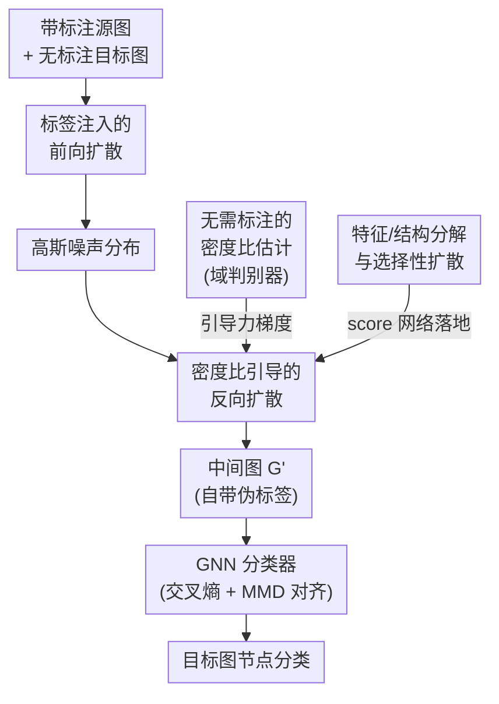

# Learning Structure-Semantic Evolution Trajectories for Graph Domain Adaptation

**会议**: ICLR 2026  
**arXiv**: [2602.10506](https://arxiv.org/abs/2602.10506)  
**代码**: [DiffGDA](https://github.com/chenwei23/DiffGDA)  
**领域**: 其他  
**关键词**: 图域适应, 扩散模型, SDE, 连续演化, 域感知引导

## 一句话总结

提出DiffGDA——首个将扩散模型引入图域适应(GDA)的方法，用随机微分方程(SDE)建模源图到目标图的连续时间结构-语义联合演化过程，配合基于密度比的域感知引导网络驾驶扩散轨迹朝向目标域，理论证明收敛到最优适应路径，在8个真实数据集14个迁移任务上全面超越SOTA。

## 研究背景与动机

**问题定义**：图域适应(GDA)旨在将有标注源图(source graph)的知识迁移到无标注目标图(target graph)，解决跨域分布偏移问题，本文聚焦节点级GDA任务。

**现有范式**：GDA两大范式——(1) 模型导向方法(学习域不变表示，如MMD、对抗训练)，假设结构变化有限，在大结构差异下失效；(2) 数据导向方法(构建中间图桥接结构gap)，依赖离散对齐步骤，灵活但受限于步数固定。

**离散对齐的根本局限**：真实世界图的结构受社交动态、引用增长、知识扩散等复杂过程驱动，演化是连续且非线性的。固定步数的离散对齐无法逼近实际的变换过程，特别是面对无标注图时，结构和语义缺乏显式锚点可供对齐。

**连续演化的优势**：连续时间建模(1)将结构变化表示为平滑时序轨迹，灵活适配非线性异构拓扑；(2)语义信息沿变换路径连续演化，模型自动学习最优对齐轨迹。

**扩散模型的契机**：扩散模型在捕捉复杂分布变换方面已取得巨大成功，SDE框架可将跨图迁移表示为连续概率流——自然统一结构与语义适应。

**研究空白**：现有图扩散模型主要关注对称扩散过程(生成任务)，GDA需要非对称扩散(从源域到目标域的定向迁移)，此前无人探索将扩散引入GDA领域。

## 方法详解

### 整体框架

DiffGDA把"从源图迁移到目标图"重新表述成一段连续时间的随机演化：先用前向SDE把带标注的源图逐步加噪到高斯分布，再用反向SDE从噪声采样回来，但反向过程不复原源图、而是被一个域感知引导网络牵引着朝目标域分布演化，落点是一张自带伪标签的中间图 $\mathbf{G}'$。最后在这张中间图上训练GNN分类器（交叉熵 + MMD对齐），并联合优化扩散与分类参数，从而把适应到的知识用于无标注目标图的节点分类。整条流水线可拆成「前向加噪 → 引导反向采样 → 中间图分类」三段，其中反向采样被密度比引导网络牵引、由分解后的 score 网络落地：

### 关键设计

**1. 标签注入的前向扩散：让中间图天生带标签**

普通图扩散只对特征/结构加噪，源域的标注在采样后就丢了，还得额外做标签传播。DiffGDA把节点特征 $\mathbf{X}^{\mathcal{S}}$ 与标签 $\mathbf{Y}^{\mathcal{S}}$ 沿通道维拼成增广特征 $\tilde{\mathbf{X}}^{\mathcal{S}} = [\mathbf{X}^{\mathcal{S}} \,\|\, \mathbf{Y}^{\mathcal{S}}] \in \mathbb{R}^{N_{\mathcal{S}} \times (F+C)}$，让标签和特征一起参与前向SDE $\mathrm{d}\mathbf{G}^{\mathcal{S}}_t = \mathbf{f}_t(\mathbf{G}^{\mathcal{S}}_t)\mathrm{d}t + g_t(\mathbf{G}^{\mathcal{S}}_t)\mathrm{d}\mathbf{w}$ 的加噪与反向恢复。这样反向采样出的中间图 $\mathbf{G}'=(\mathbf{X}',\mathbf{A}',\mathbf{Y}')$ 直接携带标签维度，省去单独的标签传播，也让后续监督有了现成的锚点。

**2. 密度比引导的反向扩散：把"生成目标图"改成"被牵引着演化"**

难点在于目标域无标注、缺乏对齐锚点，单纯反向恢复只会退回源图分布。DiffGDA的反向SDE在标准 score 项外，额外注入一个朝目标域的引导力。其理论依据是定理1：目标图的最优扩散网络满足

$$\mathbb{P}(\boldsymbol{\ell}^{\star}) = \nabla_{\mathbf{G}_t^{\mathcal{S}}} \log p_t(\mathbf{G}_t^{\mathcal{S}}) + \nabla_{\mathbf{G}_t^{\mathcal{S}}} \log \mathbb{E}_{p(\mathbf{G}_0^{\mathcal{S}}|\mathbf{G}_t^{\mathcal{S}})} \frac{q(\mathbf{G}_0^{\mathcal{T}})}{p(\mathbf{G}_0^{\mathcal{S}})}$$

第一项是源图自身的 score function（由 score 网络 $\mathbb{P}(\boldsymbol{\ell})$ 估计 $\nabla\log p_t$），第二项是目标/源分布密度比 $q/p$ 的对数梯度——它正是把轨迹推向目标域的引导信号，由引导网络 $\mathbb{Q}(\boldsymbol{\delta})$ 学习。这个分解的好处是：从源图出发、保留源域标注，又能凭密度比梯度连续地朝目标域演化，而不是凭空生成目标图。

**3. 无需标注的密度比估计：用域判别器替代未知的真实密度**

密度比 $q/p$ 涉及目标域真实分布，本不可直接计算。DiffGDA转而训练一个GNN分类器 $\mathcal{C}_{\text{gnn}}$ 去区分节点来自源域还是目标域，再用其输出概率 $\mathbf{y}(\mathbf{x})$ 把密度比近似为 $q/p \approx (1-\mathbf{y}(\mathbf{x}))/\mathbf{y}(\mathbf{x})$。这把"估计两个高维分布之比"这个硬问题，化简成了一个只需无标注样本就能训练的二分类问题，让引导信号可落地。

**4. 特征/结构分解与选择性扩散：兼顾建模精度和算力**

图同时含连续节点特征和离散邻接结构，单一网络难以兼顾。DiffGDA把 score 网络拆为 $\mathbb{P}(\boldsymbol{\ell}_1)$（节点特征 score，用 MLP+GNN）和 $\mathbb{P}(\boldsymbol{\ell}_2)$（邻接结构 score，用 MLP+图多头注意力 GMH），引导网络同样拆为特征域估计 $\mathbb{Q}(\boldsymbol{\delta}_1)$ 与结构域估计 $\mathbb{Q}(\boldsymbol{\delta}_2)$（均为轻量 MLP），各管一摊。同时用超参 $\alpha$ 控制扩散比例，只对一部分节点施加扩散，在保留原始信息和控制显存/时间开销之间取平衡——这也是它能比同类图生成方法省一半运行时间的来源。

### 损失函数 / 训练策略

拿到带标注的中间图 $\mathbf{G}'=(\mathbf{X}',\mathbf{A}',\mathbf{Y}')$ 后，GNN分类器在交叉熵监督之外再加一项MMD对齐，把中间图表征拉近到目标图表征：

$$\mathcal{L}_{\text{GNN}} = \mathcal{L}_{\text{CE}}(\text{GNN}(\mathbf{X}', \mathbf{A}'), \mathbf{Y}') + \eta \mathcal{L}_{\text{MMD}}(\text{GNN}(\mathbf{X}', \mathbf{A}'), \text{GNN}(\mathbf{X}^{\mathcal{T}}, \mathbf{A}^{\mathcal{T}}))$$

其中 $\eta$ 平衡两项；扩散网络与GNN参数端到端联合优化，演化轨迹和下游分类相互校准。

## 实验结果

### 表1: Citation域6个迁移任务(Mi-F1/Ma-F1)

| 方法 | A→C | A→D | C→A | C→D | D→A | D→C | 平均 |
|------|-----|-----|-----|-----|-----|-----|------|
| GCN | 70.82 | 65.05 | 65.44 | 69.46 | 59.92 | 66.83 | 64.83 |
| UDAGCN | 80.68 | 74.66 | 73.46 | 76.97 | 69.36 | 77.81 | 75.03 |
| A2GNN(AAAI'24) | 80.93 | 75.94 | 75.09 | 77.16 | 73.21 | 79.72 | 75.97 |
| TDSS(AAAI'25) | 80.41 | 74.04 | 72.88 | 77.23 | 72.38 | 79.04 | 75.72 |
| GAA(ICLR'25) | 80.03 | 73.32 | 73.15 | 76.04 | 68.32 | 78.27 | 72.65 |
| **DiffGDA** | **82.28** | **76.70** | **75.75** | **78.11** | **74.55** | **80.71** | **77.58** |

### 表2: Airport域6个迁移任务(Mi-F1/Ma-F1)

| 方法 | U→B | U→E | B→U | B→E | E→U | E→B | 平均 |
|------|-----|-----|-----|-----|-----|-----|------|
| AdaGCN | 65.65 | 50.63 | 46.87 | 54.44 | 48.62 | 73.74 | 56.17 |
| GraphAlign(KDD'24) | 62.54 | 52.18 | 50.33 | 55.23 | 54.35 | 71.02 | 56.39 |
| TDSS(AAAI'25) | 67.43 | 52.05 | 47.62 | 51.80 | 46.08 | 55.73 | 49.24 |
| **DiffGDA** | **71.76** | **54.18** | **54.37** | **57.15** | **56.20** | **74.81** | **60.75** |

### 运行时间对比(表3)

| 方法 | A→D总时间(s) | A→D Mi-F1 | A→C总时间(s) | A→C Mi-F1 |
|------|-------------|-----------|-------------|-----------|
| UDAGCN | 83.19 | 67.52 | 104.91 | 72.64 |
| GraphAlign | 269.65 | 70.14 | 297.15 | 76.62 |
| **DiffGDA** | **126.73** | **73.41** | **125.41** | **80.23** |

DiffGDA比同为图生成的GraphAlign减少50%以上运行时间，同时性能更优。

## 关键发现

1. **连续优于离散**：DiffGDA在所有14个迁移任务上一致超越基于离散中间图的方法(GraphAlign、GGDA)，证明连续时间演化建模在捕捉非线性结构差异方面的根本优势。

2. **引导网络是关键**：消融实验(Figure 2)显示，移除域感知引导网络导致最大性能下降(特别是B→E等高难度任务)——单纯的无引导扩散无法自动朝目标域方向演化。

3. **三组件互补**：引导网络稳定扩散路径、MMD促进跨域对齐、邻接约束保持结构依赖——三者缺一不可。

4. **扩散步数的选择较鲁棒**：T=40-80步即可收敛，过大T收益递减；采样比例α需根据图规模调整(大图受限于显存需用小α)。

5. **表征空间更清晰**：t-SNE可视化(Figure 5)显示DiffGDA生成更紧凑、分离更好的类簇，有效消除域无关噪声，增强类间可区分性。

## 亮点

- **"首次将扩散引入GDA"**——开创性地用SDE扩散过程统一建模结构+语义适应，为GDA开辟全新范式
- **密度比引导的精巧设计**——不是从噪声直接生成目标，而是从源图出发，用密度比梯度引导扩散轨迹→保留源域标注的同时朝目标域演化
- **标签注入扩散**——将标签拼接到特征中参与扩散→生成的中间图自带标签→无需额外标签传播
- **理论+实践双强**——既有最优解收敛的理论证明(Theorem 1)，又在14个任务上全面超越
- **选择性扩散**——仅对部分节点扩散(α控制比例)，兼顾效率和信息保留

## 局限性

- **可扩展性受限**：大规模图受显存限制只能用小采样比例(α)，Airport域任务中50%以上即OOM，大图场景实用性存疑
- **MMD对齐的额外开销**：扩散生成后还需MMD对齐→说明扩散本身未能完全消除域差距，需要两阶段配合
- **损失权重η敏感**：η增大性能持续下降→过强对齐导致过度正则化→实际使用需精细调参
- **仅验证节点分类**：未在图分类、链接预测等其他图任务上验证泛化性

## 相关工作对比

| 维度 | GraphAlign(KDD'24) | DiffGDA |
|------|-------------------|---------|
| 对齐方式 | 构建离散中间图 | SDE连续演化 |
| 适应范式 | 数据导向(固定步数) | 生成式(连续时间) |
| 典型性能(Citation Avg) | 67.41 | **77.58** |
| 运行时间 | 最慢(图生成开销大) | 减少50%+ |

| 维度 | A2GNN(AAAI'24) | DiffGDA |
|------|---------------|---------|
| 核心思路 | 对抗+注意力聚合 | 扩散+域引导 |
| 适应范式 | 模型导向 | 生成式(数据导向) |
| Citation Avg | 75.97 | **77.58** |
| Airport Avg | 49.57 | **60.75** |
| 结构差异适应 | 中等 | 强(连续非线性建模) |

| 维度 | GAA(ICLR'25) | DiffGDA |
|------|-------------|---------|
| 核心思路 | 图增强+对齐 | SDE扩散+域引导 |
| Citation Avg | 72.65 | **77.58** |
| Airport Avg | 51.98 | **60.75** |

## 评分

- **新颖性**: ⭐⭐⭐⭐⭐ 首次将扩散模型引入GDA，用SDE连续演化替代离散对齐，开创性工作
- **实验充分度**: ⭐⭐⭐⭐⭐ 8数据集14任务、16个baseline、消融/参数分析/效率对比/可视化齐全，显著性检验(p<0.05)
- **写作质量**: ⭐⭐⭐⭐ 数学推导清晰，框架图直观，公式符号统一
- **实用价值**: ⭐⭐⭐⭐ 为连续图域适应开辟新范式，但大图可扩展性仍需改进

<!-- RELATED:START -->

## 相关论文

- [\[ICLR 2026\] Learning Adaptive Distribution Alignment with Neural Characteristic Function for Graph Domain Adaptation](learning_adaptive_distribution_alignment_with_neural_characteristic_function_for.md)
- [\[ICLR 2026\] Distributionally Robust Classification for Multi-Source Unsupervised Domain Adaptation](distributionally_robust_classification_for_multi-source_unsupervised_domain_adap.md)
- [\[AAAI 2026\] LeanRAG: Knowledge-Graph-Based Generation with Semantic Aggregation and Hierarchical Retrieval](../../AAAI2026/others/leanrag_knowledge-graph-based_generation_with_semantic_aggregation_and_hierarchi.md)
- [\[ICLR 2026\] Noise-Aware Generalization: Robustness to In-Domain Noise and Out-of-Domain Generalization](noise-aware_generalization_robustness_to_in-domain_noise_and_out-of-domain_gener.md)
- [\[ICLR 2026\] Missing Mass for Differentially Private Domain Discovery](missing_mass_for_differentially_private_domain_discovery.md)

<!-- RELATED:END -->
