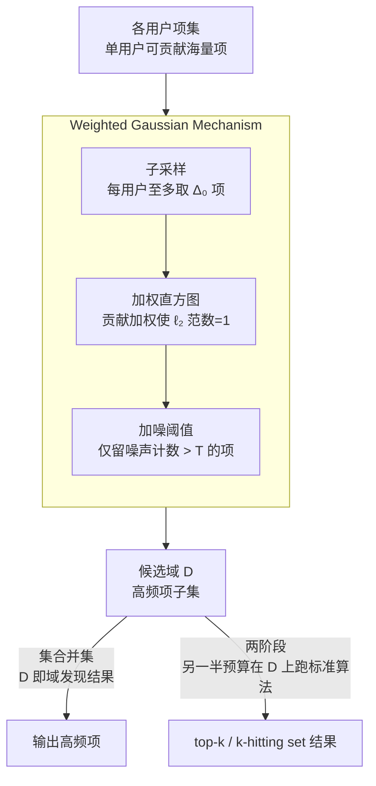

# Missing Mass for Differentially Private Domain Discovery

**会议**: ICLR 2026  
**arXiv**: [2603.14016](https://arxiv.org/abs/2603.14016)  
**代码**: 有（附录提供）  
**领域**: 其他  
**关键词**: differential privacy, domain discovery, missing mass, Weighted Gaussian Mechanism, Zipfian data, top-k selection

## 一句话总结
从 missing mass（缺失质量）角度重新审视差分隐私域发现问题，首次为简单且可扩展的 Weighted Gaussian Mechanism (WGM) 在 Zipfian 数据上证明了近最优的 $\ell_1$ 缺失质量上界和无分布假设的 $\ell_\infty$ 缺失质量保证，并将 WGM 作为域发现前置步骤应用于未知域的 private top-$k$ 和 $k$-hitting set 问题，在六个真实数据集上验证了理论结果。

## 研究背景与动机

**领域现状**：在现代数据分析中，许多应用场景涉及先验未知或不切实际大的数据域（如查询记录、用户评论、购买历史），域发现（domain discovery）是高效下游分析的关键前置步骤。差分隐私（DP）为敏感数据的隐私保护分析提供了形式化保证，但同时增加了域发现的难度。DP 集合并集（set union，又称 key selection 或 partition selection）已是多个工业级 DP 框架（如 Google Plume、Apple、OpenDP）的核心组件。

**现有痛点**：尽管已有大量 DP 集合并集算法，但几乎没有可证明的实用性保证（utility guarantees）。现有工作（如 Desfontaines et al. 2022、Chen et al. 2025）的实用性结果是相对于其他算法而言的，而非绝对性能保证。这使得我们难以理解现有算法的实际表现如何，以及它们还能改进多少。此外，对于未知域设置下的 top-$k$ 选择和 $k$-hitting set 问题，现有算法更加匮乏。

**核心矛盾**：传统上，DP 集合并集的实用性以基数（cardinality，恢复了多少唯一项）来衡量，但这忽略了项的频率信息。一个恢复了许多低频项但遗漏关键高频项的算法，在基数指标上可能表现很好，但实际效用很差。缺失质量（missing mass）——即未被恢复的项所占总频率比例——是一个更有意义的指标，但此前没有人为 DP 域发现建立过缺失质量的理论保证。

**本文目标** (1) 为 WGM 建立可证明的缺失质量上界，解决"DP 域发现算法的绝对性能到底如何"这一开放问题；(2) 将 WGM 的缺失质量保证推广到下游问题（top-$k$、$k$-hitting set）；(3) 通过实验验证理论结果的实际表现。

**切入角度**：作者通过将实用性度量从基数重新定义为缺失质量（即恢复的项所占总频率比例），发现可以为简单的 WGM 建立优雅的理论保证。Zipfian（幂律）分布假设提供了一个自然的数据复杂度度量，使得在实际数据上常见的场景中获得有意义的保证成为可能。

**核心 idea**：用缺失质量代替基数作为 DP 域发现的实用性度量，为 WGM 在 Zipfian 数据上建立近最优保证，并将其作为域发现前置步骤推广到 top-$k$ 和 $k$-hitting set。

## 方法详解

### 整体框架
这篇论文要解决的是：在差分隐私约束下，怎么从一堆用户数据里发现"哪些项值得保留"，并且能给出可证明的实用性保证。整个方法围绕一个简单到几乎朴素的机制——Weighted Gaussian Mechanism (WGM)——展开。对于最基础的 DP 集合并集问题，WGM 直接读入所有用户的项集，输出一个高频项的子集；这一步本身就是"域发现"。而对于 top-$k$、$k$-hitting set 这类需要在未知域上做选择的下游问题，作者把 WGM 当成一个前置步骤接成两阶段流水线（Algorithm 2）：先用一半隐私预算跑 WGM 拿到一个候选域 $D$，再用另一半预算在这个小得多的 $D$ 上跑已知域的标准算法，两段的隐私损失通过基本组合定理相加。论文的理论主线则是给这套流程的"漏掉了多少质量"——即缺失质量——配上严格的上界和近匹配的下界。

### 关键设计

**1. Weighted Gaussian Mechanism：用 $\ell_2$ 归一化代替硬截断来保留信息**

WGM 要在隐私约束下挑出高频项，难点在于单个用户可能贡献海量项，直接计数会让敏感度爆炸。它分三步走。第一步**子采样**：从每个用户的项集里无放回地采至多 $\Delta_0$ 个项，把单用户贡献的上界压下来。第二步**加权直方图**：在采样后的数据上建直方图，但每个用户对项 $x$ 的贡献不是简单加一，而是加权重 $1/\sqrt{|\tilde{W}_i|}$，这个归一化让每个用户的贡献向量 $\ell_2$ 范数恰好为 1。第三步**加噪阈值**：给每个加权计数加上零均值、标准差为 $\sigma$ 的高斯噪声，只输出噪声计数超过阈值 $T$ 的项，其中 $\sigma = \Theta(\frac{1}{\epsilon}\sqrt{\log(1/\delta)})$、$T = \tilde{\Theta}(\max\{\sigma, 1\})$。关键就在第二步的加权方案：相比把超额贡献直接砍掉的硬截断，$\ell_2$ 归一化在控制敏感度的同时保留了更多有用的频率信息，这也是 WGM 虽然简单、可并行、可扩展，却能在效用上逼近复杂顺序/策略机制的根本原因。

**2. Zipfian 数据上的 $\ell_1$ 缺失质量上界（Theorem 3.3）：把"漏了多少质量"和数据集中度挂钩**

光有机制还不够，要回答"WGM 到底好不好"就得量化它漏掉的质量。作者假设数据满足 $(C,s)$-Zipfian 条件——即第 $r$ 大的频率满足 $N_{(r)}/N \leq C/r^s$（$s>1$），这正是查询记录、评论这类真实数据常见的幂律形态。在此假设下他们证明 WGM 的缺失质量满足

$$\text{MM}(W,S) = \tilde{O}\left(\frac{C^{1/s}}{s-1} \left(\frac{\max_i|W_i|}{\epsilon N \sqrt{q^*}}\right)^{(s-1)/s}\right),$$

其中 $q^* = \min\{|\max_i W_i|, \Delta_0\}$。证明拆成三个辅助引理：子采样本身引入的缺失质量上界、高频项在子采样后依然保持高频的保证、以及被加噪阈值步骤误删的项所占频率的上界。这个界的形态符合直觉——缺失质量随用户数 $N$ 增大而衰减，随 $s$ 增大（分布越往头部集中）而减小；而配套的下界 Theorem 3.5 进一步证明了它对 $\epsilon$ 和 $N$ 的依赖关系已经近乎最优。

**3. 无分布假设的 $\ell_\infty$ 保证与下游推广：让两阶段流水线"缩小搜索空间反而更好"**

$\ell_1$ 界虽强，但要靠 Zipfian 假设撑着。作者再补一个不依赖任何分布假设的 $\ell_\infty$ 版本（Theorem 3.6）：

$$\text{MM}_\infty(W,S) \leq \tilde{O}\left(\frac{\max_i|W_i|}{\epsilon N \sqrt{q^*}}\right).$$

这个保证虽然弱于 $\ell_1$，却足以撑起下游问题。对 top-$k$（Theorem 4.3），把 WGM 接上 Peeling Exponential Mechanism，可得

$$\text{MM}^k(W,S) \leq \tilde{O}\left(\frac{k}{N}\left(\frac{\max_i|W_i|}{\epsilon\sqrt{q^*}} + \frac{\sqrt{k}\log M}{\epsilon}\right)\right);$$

对 $k$-hitting set（Theorem 4.5），把 WGM 接上 User Peeling Mechanism，可得 $(1-1/e)$ 近似比加上一个可控的附加误差。两阶段方法看似多绕了一步，妙处恰恰在于：WGM 产出的候选域虽然比全集 $\bigcup_i W_i$ 小得多，但保留下来的都是高质量项，下游算法因此面对一个更小、更干净的搜索空间，问题反而变简单了。

### 损失函数 / 训练策略
本文为纯理论工作，不涉及机器学习训练。核心贡献是证明了严格的数学保证（上界 + 近匹配的下界）。

## 实验关键数据

### 主实验

在六个真实数据集上评估 DP 集合并集的缺失质量，隐私预算 $(1, 10^{-5})$-DP：

| 数据集 | 类型 | WGM 表现 |
|--------|------|---------|
| Reddit | 大型 | MM 与策略机制差距 <5% |
| Amazon Games | 大型 | MM 与策略机制差距 <5% |
| Movie Reviews | 大型 | MM 与策略机制差距 <5% |
| Steam Games | 小型 | MM 与策略机制差距 <5% |
| Amazon Magazine | 小型 | MM 与策略机制差距 <5% |
| Amazon Pantry | 小型 | MM 与策略机制差距 <5% |

注：WGM 在所有数据集上的缺失质量与计算密集度更高的 Policy Gaussian/Policy Greedy 机制的差距均在 5% 以内，而之前基于基数（cardinality）度量的实验中，顺序方法通常输出约 2 倍以上的唯一项。

### 下游任务实验

Top-$k$ 缺失质量（小数据集，$\Delta_0 = 100$）：

| 方法 | Steam Games | Amazon Magazine | Amazon Pantry |
|------|------------|-----------------|---------------|
| Limited-Domain ($\bar{k}=k$) | 较高 MM | 较高 MM | 较高 MM |
| Limited-Domain ($\bar{k}=5k$) | 中等 MM | 中等 MM | 中等 MM |
| Limited-Domain ($\bar{k}=\infty$) | 中等 MM | 中等 MM | 中等 MM |
| **WGM-then-top-$k$ (Ours)** | **最低 MM** | **最低 MM** | **最低 MM** |

WGM-then-top-$k$ 在所有数据集和所有 $k$ 值上一致优于 Limited-Domain 基线，且优势随 $k$ 增大而增大。

$k$-Hitting Set（小数据集）：WGM-then-hitting-set 与非隐私贪心和假设公开域的隐私贪心表现相当，在 Steam Games 和 Amazon Magazine 上甚至超过了后者——因为 WGM 产出的更小候选域反而降低了下游算法的搜索难度。

### 关键发现
- **缺失质量 vs 基数的视角转变至关重要**：以基数衡量，WGM 远逊于顺序方法（输出项数相差约2倍）；但以缺失质量衡量，两者差距不到5%。这是因为基数指标忽略了项的频率，WGM 虽然输出更少的项，但更好地覆盖了高频项
- **WGM 的简单性不等于弱性**：作为一个简单、可并行、可扩展的方法，WGM 在缺失质量指标上几乎匹敌计算密集度更高的策略/顺序方法
- **两阶段方法的反直觉优势**：在 $k$-hitting set 中，WGM 作为域发现步骤反而能通过缩小候选域来帮助下游算法取得更好结果
- **理论保证的实践价值**：Theorem 3.5 提供了近匹配的下界，说明 WGM 的缺失质量性能确实接近任何满足 soundness 假设的DP算法的最优水平

## 亮点与洞察
- **度量选择的深刻影响**：从基数切换到缺失质量，不仅改变了对算法性能的认知（WGM 从"远逊"变为"接近最优"），还使得首次建立绝对实用性保证成为可能。这提醒我们选择正确的度量在理论研究中至关重要
- **简单方法的理论辩护**：在工业界已广泛使用 WGM 的背景下，本文为其提供了严格的理论支撑，这种"为实践中已验证的方法建立理论保证"的研究范式具有重要意义
- **两阶段组合的通用性**："先用 WGM 做域发现，再用已知域算法"的范式可推广到任何需要未知域处理的 DP 问题

## 局限与展望
- **$\ell_1$ 保证需要 Zipfian 假设**：虽然 Zipfian 在实践中常见，但这一假设限制了理论保证的普适性。对 $s \leq 1$ 的情况无法提供有意义的保证
- **Top-$k$ 和 $k$-hitting set 的上下界未匹配**：存在 gap，封闭这些 gap 是自然的后续问题
- **子采样策略可改进**：所有方法使用均匀无放回子采样，Chen et al. (2025) 的自适应加权子采样可能进一步降低缺失质量
- **实验规模有限**：大数据集上 top-$k$ 和 $k$-hitting set 几乎达到零缺失质量，未能充分测试算法的极限
- 可考虑将缺失质量框架推广到其他 DP 问题（如频率矩估计、直方图发布）

## 相关工作与启发
- **vs Policy Gaussian/Greedy (Gopi et al. 2020, Carvalho et al. 2022)**: 这些顺序/策略方法在基数度量上表现更好，但计算成本高且不可并行。本文表明在更实际的缺失质量度量下，简单的 WGM 几乎同样好
- **vs Limited-Domain Top-$k$ (Durfee & Rogers 2019)**: 需要额外的超参数 $\bar{k}$ 且保证较弱（$k$-relative error），本文的 WGM-then-top-$k$ 在更严格的 missing mass 指标上一致更优
- **vs Desfontaines et al. 2022, Chen et al. 2025**: 他们的实用性结果是相对性的（相对于其他算法），本文首次证明了绝对实用性保证

## 评分
- 新颖性: ⭐⭐⭐⭐ 缺失质量视角转变虽然概念上不复杂，但产生了深刻的理论洞察和实践价值
- 实验充分度: ⭐⭐⭐⭐ 六个真实数据集覆盖多种规模和领域，三个问题均有实验验证
- 写作质量: ⭐⭐⭐⭐⭐ 理论部分逻辑严密，动机阐述清晰，定理叙述规范
- 价值: ⭐⭐⭐⭐ 首次为工业界广泛使用的 WGM 提供绝对理论保证，实践意义重大

<!-- RELATED:START -->

## 相关论文

- [\[AAAI 2026\] Improved Differentially Private Algorithms for Rank Aggregation](../../AAAI2026/others/improved_differentially_private_algorithms_for_rank_aggregation.md)
- [\[ICLR 2026\] Noise-Aware Generalization: Robustness to In-Domain Noise and Out-of-Domain Generalization](noise-aware_generalization_robustness_to_in-domain_noise_and_out-of-domain_gener.md)
- [\[ICLR 2026\] Learning Structure-Semantic Evolution Trajectories for Graph Domain Adaptation](learning_structure-semantic_evolution_trajectories_for_graph_domain_adaptation.md)
- [\[ICLR 2026\] Distributionally Robust Classification for Multi-Source Unsupervised Domain Adaptation](distributionally_robust_classification_for_multi-source_unsupervised_domain_adap.md)
- [\[ICML 2026\] Private and Stable Test-Time Adaptation with Differential Privacy](../../ICML2026/others/private_and_stable_test-time_adaptation_with_differential_privacy.md)

<!-- RELATED:END -->
