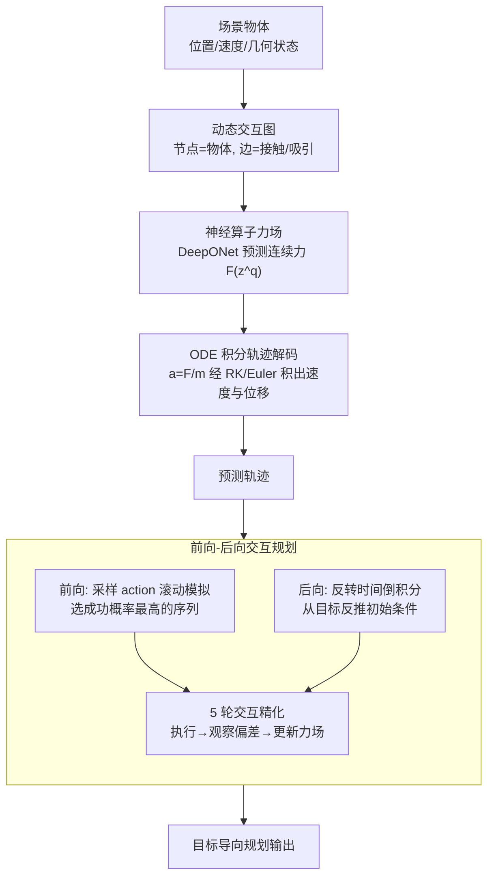

# Neural Force Field: Few-shot Learning of Generalized Physical Reasoning

**会议**: ICLR 2026  
**arXiv**: [2502.08987](https://arxiv.org/abs/2502.08987)  
**代码**: [项目页面](https://neuralforcefield.github.io/)  
**领域**: 其他  
**关键词**: neural force field, Neural ODE, few-shot physical reasoning, ODE solver, interactive planning

## 一句话总结

提出Neural Force Field（NFF），将物体交互建模为连续力场，通过神经算子学习力场函数并用ODE积分器解码轨迹，在I-PHYRE（100条轨迹）、N-body（200条轨迹）、PHYRE（0.012M数据,比SOTA少267倍）三个基准上实现少样本SOTA，跨场景RMSE降低32-64%,规划任务接近人类水平。

## 研究背景与动机

**领域现状**：物理推理是AI核心能力之一。人类能从少量物理现象中快速抽象核心原理并泛化到新环境，但现有AI模型即使在海量数据上训练仍在OOD场景中挣扎。

**现有痛点**：

- 现有 GNN/Transformer 方法（IN、SlotFormer）用隐式向量表示物体交互，倾向于过拟合观测轨迹而非捕获物理原理，OOD 泛化差
- 离散隐空间解码无法解释物体如何穿越障碍物（如绿球穿过黑墙），物理不一致
- 少样本设置下过拟合风险更大，需要强物理归纳偏置
- 交互式推理需要主动实验和反馈适应，现有方法缺乏反向规划能力

**核心矛盾**：需要一种既能从极少样本学习、又能在OOD场景泛化的物理表示——这要求表示本身编码物理原理而非统计模式。

**本文目标** 开发具有人类式少样本物理学习能力的agent，在多样化环境中实现鲁棒泛化。

**切入角度**：力场是物理学的自然抽象——力是运动变化的因果原因。将交互表示为力场而非状态转换，天然可组合、可泛化。

**核心 idea**：用神经算子学习连续力场函数，通过ODE积分保证物理一致性，力场的低维性使少样本学习成为可能。

## 方法详解

### 整体框架

NFF 想解决的是「从极少样本学到能在 OOD 场景泛化的物理动力学」。它的做法是把整条预测链锚在物理上：先把场景里的每个物体当作节点、接触/吸引关系当作边，组成一张随时间变化的动态交互图；再让一个神经算子从图上的物体交互读出每个物体此刻受到的连续力场 $\mathbf{F}(\mathbf{z}^q(t))$；最后不直接预测下一帧坐标，而是把牛顿第二定律 $\mathbf{a}=\mathbf{F}/m$ 接进 ODE 积分器（Runge-Kutta/Euler），一步步积出速度和位移，得到物理一致的轨迹。因为整条链是可微、可逆的，同一套力场既能正着模拟未来（前向规划），也能倒着反推初始条件（后向规划），再配合多轮交互精化逼近目标。训练时把长轨迹切成小段做自回归预测、最小化 MSE。

### 关键设计

**1. 神经算子力场：把"物体之间的作用"建模成一个低维力函数**

前面的痛点是隐向量表示太高维、容易过拟合观测轨迹。NFF 换一个抽象层次——不学"状态怎么变"，而是学"物体之间施加多大的力"。具体借用 DeepONet 的算子学习框架，查询物体 $q$ 受到的力被写成它与邻居交互的累加：

$$\mathbf{F}(\mathbf{z}^q(t)) = \sum_{i \in \mathcal{G}(q)} \mathbf{W}\big(f_\theta(\mathbf{z}^i(t)) \odot f_\phi(\mathbf{z}^q(t))\big) + \mathbf{b}$$

其中 $\mathcal{G}(q)$ 是查询物体的邻居集合，$f_\theta$ 编码施力物体、$f_\phi$ 编码受力物体，两路特征逐元素相乘 $\odot$ 后由 $\mathbf{W} \in \mathbb{R}^{d_\text{hidden} \times d_\text{force}}$ 映射到 2D/3D 的力空间。这样做之所以能少样本学习，关键就在力本身是低维的——比起拟合高维隐向量，从几十条轨迹里恢复一个二维力向量要容易得多；而算子学习的函数空间泛化能力，让学到的力场模式能迁移到训练时没见过的交互图结构上。

**2. ODE 积分轨迹解码：用物理积分代替离散预测，从根上杜绝"穿墙"**

有了力场还不够，怎么把力变成轨迹决定了泛化是否物理一致。NFF 不让网络直接吐下一帧坐标，而是把牛顿第二定律的二阶 ODE 显式接进解码——加速度由力和质量决定：

$$\mathbf{a}^q(t) = \frac{d^2 x^q(t)}{dt^2} = \frac{\mathbf{F}(\mathbf{z}^q(t))}{m^q}$$

再用 Runge-Kutta / Euler 积分器把它积成速度和位移：$\mathbf{v}(t) = \mathbf{v}(0) + \int_0^t \frac{\mathbf{F}(\mathbf{z}^q(t))}{m^q}\,dt$，$\mathbf{x}(t) = \mathbf{x}(0) + \int_0^t \mathbf{v}(t)\,dt$。因为轨迹是连续积分出来的，物体不可能像离散解码那样凭空跳过一堵墙；而把积分步长压到 $1e\text{-}3$ 这样的高精度，能更细地刻画碰撞瞬间的受力变化（消融里精度从 $1e\text{-}3$ 退到自适应积分，Cross RMSE 就从 1.226 涨到 1.788）。

**3. 前向-后向交互规划：同一套 ODE 既能正着模拟未来，也能倒着反推初始条件**

物理推理不只要预测，还要能做目标导向的规划，而 ODE 的可逆性恰好让这件事变便宜。前向规划时，NFF 充当一个"心理模拟器"：采样 500 个 action 候选，用力场各自滚动出未来轨迹评估，挑成功概率最高的序列去执行。后向规划则直接把 ODE 的时间方向反过来，从目标状态沿时间倒积分反推出需要的初始条件：

$$\mathbf{x}(0) = \mathbf{x}(t) + \int_t^0 \mathbf{v}(t)\,dt$$

相比基于梯度反复迭代优化初值，这种倒积分一步到位、效率高出数量级（表 A3）。在此之上还套了一个 5 轮交互学习协议——执行动作、观察轨迹偏差、用偏差更新力场、再重新规划——模拟人类 trial-and-error 的试错过程，让模型在反馈中逐步逼近正确解。

### 损失函数 / 训练策略

训练用 MSE 损失最小化预测轨迹与真实轨迹的差异。一个关键技巧是把长轨迹切成小段分别做自回归训练，避免 teacher forcing 下误差沿时间不断累积；而评估时只喂初始状态，让模型一口气预测全部未来动态。

## 实验关键数据

### 主实验：轨迹预测（RMSE↓为主指标）

| 基准 | 设置 | IN | SlotFormer | SEGNO | **NFF** | 提升 |
|------|------|-----|-----------|-------|---------|------|
| I-PHYRE | Within | 0.124 | 0.067 | 0.203 | **0.048** | 28%↓ vs SlotFormer |
| I-PHYRE | Cross | 0.194 | 0.206 | 0.314 | **0.131** | 32%↓ vs IN |
| N-body | Within [0,T] | 0.200 | 0.214 | 0.079 | **0.097** | — |
| N-body | Cross [0,3T] | 6.942 | 2.533 | 2.759 | **1.226** | 52%↓ vs SlotFormer |
| PHYRE | Cross AUCCESS↑ | — | 21.04 | — | **49.22** | +134% vs SlotFormer |

### 消融实验（N-body Cross RMSE↓）

| 配置 | Cross RMSE | 说明 |
|------|-----------|------|
| NFF (1e-3精度) | 1.226 | 完整模型 |
| NFF (5e-3精度) | 1.251 | 精度降低→性能下降 |
| NFF (自适应) | 1.788 | 自适应积分不如固定高精度 |
| w/o ODE (退化为IN) | 3.518 | ODE grounding至关重要 |
| w/o NOL (用MLP替代DeepONet) | 1.347 | 神经算子提升泛化 |

### 关键发现

- **数据效率惊人**：I-PHYRE仅100条轨迹（10个游戏×10个样本），N-body仅200条，PHYRE仅12K条（比RPIN的3.2M少267倍）
- **力场可视化验证**：学习到的重力场与真实引力场高度吻合（图5b），碰撞/滑动/摩擦力场也被正确捕获（图5a）
- **ODE grounding是泛化关键**：去掉ODE后Cross RMSE从1.226暴增到3.518（2.87×）
- **规划接近人类**：在I-PHYRE交互规划中，NFF经5轮精化后的累积成功概率接近人类水平，而IN和SlotFormer甚至低于随机采样
- **物体一致性**：PHYRE视觉任务中，RPIN会错误地将灰色杯子变形为灰色球，SlotFormer出现物体消失，NFF保持物体一致性

## 亮点与洞察

- **"力场 = 物理的正确抽象层次"**：不是学"状态如何转换"而是学"为什么转换"——力是运动变化的因果原因，因果表示天然可泛化
- **连续 vs 离散的本质差异**：离散解码无法解释物体穿墙（图2），连续ODE积分自然避免物理不一致
- **少样本的物理直觉对应**：人类也是从少量经验抽取物理规律（如婴儿的直觉物理），NFF的低维力场表示模拟了这一认知过程
- **后向规划的优雅**：反转ODE时间方向即可从目标反演初始条件，比基于梯度的迭代优化效率高数量级（表A3）

## 局限与展望

- 仅在合成/抽象推理数据集上测试，未验证真实物理场景
- 假设确定性刚体环境，未探索随机环境或软体/流体
- 训练单一模型时变化摩擦力和弹性可能带来额外挑战
- 视觉输入版本依赖物体掩码，未实现端到端从像素到力场的学习

## 相关工作与启发

- **vs IN (Battaglia et al., 2016)**：IN用隐向量+离散转换，Cross RMSE比NFF高2.87×，规划低于随机采样
- **vs SlotFormer (Wu et al., 2023)**：SlotFormer用Transformer+slot attention，在PHYRE Cross中AUCCESS仅21.04（NFF=49.22），且有物体消失问题
- **vs SEGNO (Liu et al., 2024b)**：SEGNO也用ODE但无力场表示，Within性能有时优于NFF但Cross泛化差（2.759 vs 1.226）
- **vs Kofinas et al. (2023)**：也使用"场"概念但学latent field而非显式力场，NFF更物理grounded

## 评分

- 新颖性: ⭐⭐⭐⭐⭐ 将物理学的力场概念引入学习系统，ODE积分保证物理一致性，是物理推理表示学习的范式创新
- 实验充分度: ⭐⭐⭐⭐ 3个基准（I-PHYRE/N-body/PHYRE）+ 预测/规划多设置 + 详尽消融 + 力场可视化
- 写作质量: ⭐⭐⭐⭐⭐ 物理直觉和方法设计完美结合，图示清晰（尤其图2的连续vs离散对比），motivation有力
- 价值: ⭐⭐⭐⭐ 对物理推理、认知AI和few-shot learning有基础贡献，力场表示可能启发更广泛的物理世界模型研究

<!-- RELATED:START -->

## 相关论文

- [\[CVPR 2026\] Data-Centric Meta-Learning for Robust Few-Shot Generalization](../../CVPR2026/others/data-centric_meta-learning_for_robust_few-shot_generalization.md)
- [\[CVPR 2026\] DDSF: Robust Few-Shot Learning via Disentangled Subspaces with Determinantal Point Process](../../CVPR2026/others/ddsf_robust_few-shot_learning_via_disentangled_subspaces_with_determinantal_poin.md)
- [\[CVPR 2026\] Hyperbolic Defect Feature Synthesis for Few-Shot Defect Classification](../../CVPR2026/others/hyperbolic_defect_feature_synthesis_for_few-shot_defect_classification.md)
- [\[ICML 2026\] Amortized Simulation-Based Inference in Generalized Bayes via Neural Posterior Estimation](../../ICML2026/others/amortized_simulation-based_inference_in_generalized_bayes_via_neural_posterior_e.md)
- [\[ICML 2025\] Feedforward Few-shot Species Range Estimation](../../ICML2025/others/feedforward_few-shot_species_range_estimation.md)

<!-- RELATED:END -->
