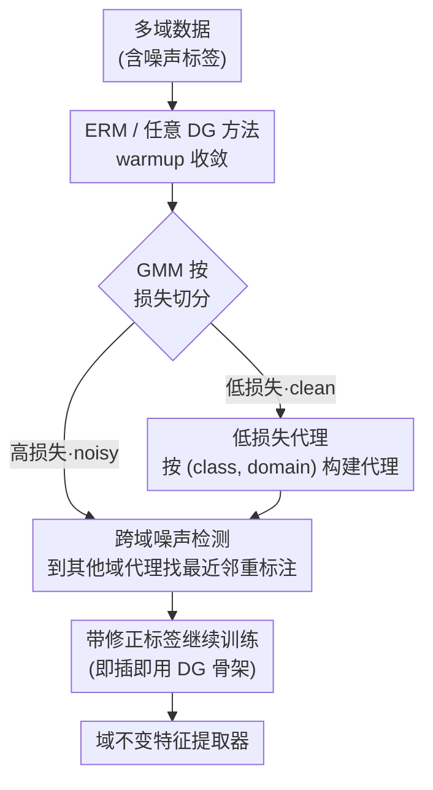

# Noise-Aware Generalization: Robustness to In-Domain Noise and Out-of-Domain Generalization

**会议**: ICLR 2026  
**arXiv**: [2504.02996](https://arxiv.org/abs/2504.02996)  
**代码**: [GitHub](https://github.com/SunnySiqi/Noise-Aware-Generalization)  
**领域**: 鲁棒学习 / 域泛化  
**关键词**: Noise-Aware Generalization, Domain Generalization, Learning with Noisy Labels, Cross-Domain Noise Detection, DL4ND

## 一句话总结

首次形式化了 Noise-Aware Generalization (NAG) 问题——在标签噪声下同时追求域内鲁棒性和域外泛化能力，并提出 DL4ND 方法通过跨域比较检测噪声标签，在 7 个数据集上最高提升 12.5%。

## 研究背景与动机

**领域现状**：域泛化（DG）方法训练模型从多个源域泛化到未见目标域，学习域不变特征；噪声标签学习（LNL）方法通过检测和处理噪声标签提升模型性能。这两个领域各自取得了显著进展，但通常被独立研究。

**现有痛点**：
1. **DG 方法忽略标签噪声**：标签噪声在真实数据集中普遍存在（包括 DG benchmark 本身），但 DG 方法在有噪声时性能严重下降
2. **LNL 方法不考虑域偏移**：LNL 方法在单域内检测噪声，但面对多域数据时，会将域偏移误判为标签噪声，导致过拟合到"容易学习"的域
3. **域偏移与噪声偏移难以区分**：当使用特征距离或损失值分析时，来自域偏移和标签噪声的分布偏移在特征空间中高度重叠（如 Figure 1 所示）

**核心矛盾**：LNL 噪声检测方法的核心假设——"噪声样本远离类别中心"——在多域场景下失效，因为域偏移使得分布偏移的来源（噪声 vs. 域）无法通过简单的特征距离区分。朴素地将 DG 和 LNL 方法组合也无法解决，因为 20%+ 的支持向量落在两种偏移的重叠区域，这些样本对决策边界至关重要。

**本文方案**：提出 NAG（Noise-Aware Generalization）问题定义，并设计 DL4ND（Domain Labels for Noise Detection）方法。核心洞察：**单域内相似的噪声样本在跨域比较时会暴露差异**——因为域内的虚假相关特征（如颜色）在其他域中不存在，跨域比较迫使模型依赖内在特征。DL4ND 通过高置信度低损失样本构建 (class, domain) 代理表示，然后用跨域比较重新标注高损失样本。

## 方法详解

### 整体框架

DL4ND 把"噪声检测"嵌进多域训练里：给定多域数据集 $\mathcal{D} = \{\mathcal{D}_1, \ldots, \mathcal{D}_m\}$、每域 $\mathcal{D}_i = \{(x_{i,j}, \tilde{y}_{i,j})\}$（标签 $\tilde{y}$ 可能含噪声），先用 ERM 或任意域泛化（DG）方法 warmup 让模型在干净样本上收敛，再用高斯混合模型（GMM）把损失分布切成低损失（clean）和高损失（noisy）两簇。低损失样本按 $(class, domain)$ 分组，构建低损失代理表示 $\bar{g}_{c,i}$；高损失样本则被送去跨域噪声检测、重新打标签；最后带着修正后的标签继续训练。这套清洗-重标注模块不绑定具体骨架，可以即插即用地挂在任意 DG 方法上。整套流程的目标始终是学一个特征提取器 $f_\theta(\cdot)$，让它在所有源域和未见目标域上都站得住。

### 关键设计

**1. 低损失代理：让域偏移和噪声偏移在距离上可分**

NAG 的核心困境是域偏移和标签噪声在特征空间高度重叠，单纯靠特征距离分不开。论文先从理论上给出一个可分的充分条件——同类跨域的距离应当小于同域异类的距离：

$$d(f_\theta(G_{c,\hat{i}}), \bar{g}_{c,i}) < d(f_\theta(G_{\hat{c},i}), \bar{g}_{c,i}), \quad i \neq \hat{i}, \; c \neq \hat{c}$$

能不能满足这个条件，关键在代理 $\bar{g}_{c,i}$ 怎么算——它定义为某个 $(class, domain)$ 组里所有样本特征的均值。在 RotatedMNIST 上，如果用**全部样本**构建类别代理，两种偏移的距离分布严重重叠、根本分不开；而只用 **GMM 切出来的低损失样本**构建代理，两种偏移就能清晰分离。原因是训练早期低损失样本几乎都是干净的（prior work 已证明），它们组成的代理更纯净，能代表类别的本征特征。这一步也解释了为什么不能简单丢掉重叠区域的样本：分析发现重叠区超过 20% 的样本是支持向量机（SVM）的支持向量，对最终决策边界至关重要，必须重标注而非剔除。

**2. 跨域比较重标注：用域间差异逼出内在特征**

域内的虚假相关（比如 photo 域里狮子总是暖黄色调）只在该域成立、不会跨域保持，所以拿一个疑似噪声样本去和**其他域**的代理比，模型就只能依赖类别的本征特征、而非颜色背景这类捷径，更能反映它真实的类别。对每个高损失疑似噪声样本 $x_i$（设它来自域 $\hat{i}$），DL4ND 在**其他所有域**的代理里找最近邻类别作为新标签：

$$\hat{y_i} = \arg\min_{\forall g_{c,\hat{i}}} d(f_\theta(x_i), \bar{g}_{c,\hat{i}}), \quad i \neq \hat{i}$$

约束 $i \neq \hat{i}$ 就是禁止样本和自己所在域的代理比，强制跨域。论文验证了若退化成域内比较（同一域内找最近邻，相当于把任务降回传统单域 LNL），相似的虚假特征会让噪声样本误判为干净；改成跨域后，重标注的精度在 OfficeHome / TerraIncognita 上最高提升约 10%（Table 6）。整个重标注只在训练中跑一次即可——RotatedMNIST 上标签准确率从 75% 提到 98%，不引入额外数据或学习开销。

**3. 即插即用：作为噪声清洗模块挂在任意 DG 方法上**

上面两步合起来只是一个标签检测与修正模块，不绑定具体骨架，可以和 ERM、ERM++、SAGM、SWAD 等任意域泛化（DG）方法无缝组合——只需在它们原有的训练循环里插入「GMM 切分 → 建代理 → 跨域重标注」这几步，整个过程中 DG 方法照常学习域不变特征。正因为 DG 负责学域不变特征、DL4ND 负责清洗标签，二者职责互补，实验中这种组合在大多数设置下都优于单独使用 DG 或噪声标签学习（LNL）方法。

## 实验结果

### 主实验

在 7 个数据集上评估，涵盖真实世界噪声和控制噪声实验。

**RotatedMNIST (30% 非对称噪声)**：

| 方法 | 标签准确率 | ID Acc | OOD Acc |
|------|:---:|:---:|:---:|
| Baseline（域内比较） | 75.7 | 87.7 | 87.9 |
| **DL4ND (Ours)** | **98.1** | **98.1** | **97.8** |

**OfficeHome (60% 对称噪声)**：

| 方法 | ID Acc | OOD Acc | AVG |
|------|:---:|:---:|:---:|
| ERM | 45.8 | 40.5 | 43.2 |
| ERM + DL4ND | 47.9 | 49.9 | 48.9 |
| SAGM | 48.6 | 40.3 | 44.4 |
| SAGM + DL4ND | 52.0 | 52.6 | 52.2 |
| ERM++ | 56.7 | 48.7 | 52.7 |
| **ERM++ + DL4ND** | **60.3** | **59.4** | **59.8** |

最大增益达 **12.5%**（ERM++ 的 OOD 从 48.7% 到 59.4%，对称噪声设置）。

**PACS（真实世界噪声）**：

| 方法 | ID Acc | OOD Acc | AVG |
|------|:---:|:---:|:---:|
| SAGM | 96.3 | 85.3 | 90.8 |
| SAGM + DL4ND | 97.3 | 88.8 | 93.1 |
| ERM++ | 96.7 | 89.2 | 92.9 |
| **ERM++ + DL4ND** | **96.5** | **90.1** | **93.3** |

### 消融实验

在多个数据集上消融 DL4ND 各组件的贡献：

| 消融配置 | VLCS ID/OOD | CHAMMI-CP ID/OOD | OfficeHome (40% asym) AVG |
|----------|:---:|:---:|:---:|
| w/o relabel（删除替代重标注） | 下降 2-3% | 下降 1-2% | 低于完整模型 |
| w/o cross-domain（域内比较） | 下降 2-4% | 下降 2-4% | 精度显著降低 |
| w/o small-loss proxy（全样本代理） | 下降 2-4% | 下降 2-3% | 代理质量下降 |
| **DL4ND (完整)** | **最佳** | **最佳** | **最佳** |

每个组件贡献 2-4% 的性能提升。跨域比较的消融显示其带来的精度提升（Table 6）能直接解释最终性能提升。

## 论文评价

### 优点

1. **问题定义有价值**：NAG 将 DG 和 LNL 两个独立领域自然统一，更贴近真实应用场景
2. **理论分析扎实**：通过可分离性条件的数学建模和 SVM 支持向量分析，清晰阐述了 NAG 的独特挑战
3. **跨域比较思路新颖**：利用域间差异消除虚假相关的观察简单但有效
4. **大规模实验验证**：12 个 SOTA 方法 + 20 个组合方法 + 7 个数据集，覆盖充分

### 不足

1. 依赖 GMM 分割低损失/高损失样本，当噪声比例极高时 GMM 两簇假设可能不成立
2. 跨域比较假设不同域的虚假特征不同，但如果所有域共享相同偏置（如都有颜色偏置），该方法可能失效
3. 仅做一次重标注即有效，但缺乏对多次迭代重标注效果的深入分析

## 评分

⭐⭐⭐⭐ — 问题定义实用且重要，方法简洁有效，实验充分覆盖多种噪声类型和数据集，对 DG+LNL 交叉领域的推进有重要意义。

<!-- RELATED:START -->

## 相关论文

- [\[CVPR 2026\] Bridging Domain Expertise and Generalization for Performance Estimation](../../CVPR2026/others/bridging_domain_expertise_and_generalization_for_performance_estimation.md)
- [\[CVPR 2025\] Gradient-Guided Annealing for Domain Generalization](../../CVPR2025/others/gradient-guided_annealing_for_domain_generalization.md)
- [\[ICML 2025\] Set-Valued Predictions for Robust Domain Generalization](../../ICML2025/others/set_valued_predictions_for_robust_domain_generalization.md)
- [\[ICML 2025\] FEDTAIL: Federated Long-Tailed Domain Generalization with Sharpness-Guided Gradient Matching](../../ICML2025/others/fedtail_federated_long-tailed_domain_generalization_with_sharpness-guided_gradie.md)
- [\[ICLR 2026\] Missing Mass for Differentially Private Domain Discovery](missing_mass_for_differentially_private_domain_discovery.md)

<!-- RELATED:END -->
