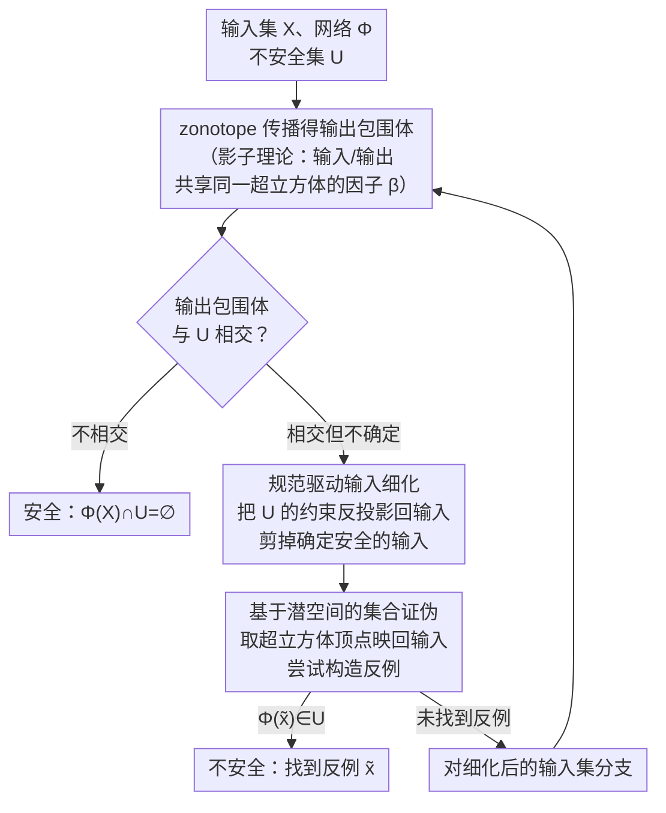

# Out of the Shadows: Exploring a Latent Space for Neural Network Verification

**会议**: ICLR 2026  
**arXiv**: [2505.17854](https://arxiv.org/abs/2505.17854)  
**代码**: [CORA toolbox](https://cora.in.tum.de/)（MATLAB 实现）  
**领域**: 神经网络验证 / 形式化方法  
**关键词**: 神经网络验证, 潜空间, zonotope, 分支定界, 可达性分析

## 一句话总结

将 zonotope 视为高维超立方体的"投影（影子）"，发现输入集和输出包围体共享同一潜空间，据此提出规范驱动的输入细化方法，将输出端的不安全约束反向传递到输入空间来剪枝，使分支定界子问题数减少 60-65%，且所有运算均为矩阵操作从而实现高效 GPU 加速，在 VNN-COMP'24 八个基准上与 α-β-CROWN 等顶级工具取得可比性能。

## 研究背景与动机

**领域现状**：神经网络在自动驾驶、空中防撞系统等安全关键领域广泛部署，但对微小输入扰动敏感（对抗样本），因此部署前需要形式化验证——证明给定输入集合内所有输出均满足安全规范。主流验证方法分两类：（1）将验证问题编码为 SMT/MIP 求解器问题（如 Reluplex、Marabou）；（2）使用可达性分析/抽象解释保守地包围神经网络输出集合（如 DeepPoly/CROWN、zonotope 传播）。

**现有痛点**：可达性分析方法的核心瓶颈是**保守性**——由于对非线性激活函数（如 ReLU）的过度近似，输出包围体往往过大，导致安全性验证结果 "inconclusive"。为提高精度，需要使用分支定界（branch-and-bound）将问题递归拆分成更小的子问题，但子问题数量随分支次数**指数增长**。此外，很多 SOTA 方法（如 α-β-CROWN）依赖的操作（线性规划、优化求解）难以在 GPU 上高效批处理。

**核心矛盾**：精度与效率的根本 trade-off——要减少包围保守性就需要更多分支，但分支数量爆炸导致计算不可行。现有方法主要在"如何更聪明地分支"上下功夫，却忽略了一个问题：**大部分输入本就是安全的，把它们也纳入分支是浪费**。

**本文目标** 如何在分支之前就预先排除安全输入区域，从源头减少需要处理的子问题数量？

**切入角度**：作者观察到一个优雅的几何事实——zonotope $Z = c + G\beta$（$\beta \in [-1,1]^q$）本质上是 $q$ 维超立方体通过矩阵 $G$ 投影到低维空间的"影子"。当 zonotope 通过神经网络仿射层传播时，改变的只是投影矩阵 $G$，而超立方体（即因子 $\beta$ 的值域）保持不变。这意味着**输入 zonotope 和输出 zonotope 是同一个高维超立方体的不同投影**，它们通过共享的潜空间天然关联。

**核心 idea**：利用输入-输出 zonotope 共享潜空间的性质，将输出端的不安全约束反向映射为输入端的约束，迭代裁剪输入集合，使其只包围可能不安全的输入。

## 方法详解

### 整体框架

给定神经网络 $\Phi$、输入集合 $X$ 和不安全输出集合 $U$，验证要么证明 $\Phi(X) \cap U = \emptyset$（所有输入都安全），要么找到反例 $x \in X$ 使 $\Phi(x) \in U$（存在不安全输入）。整篇方法套在一个分支定界（branch-and-bound）循环里：先用 zonotope 把网络输出保守地包围起来，再看这个包围体和不安全集 $U$ 有没有交集——不相交就直接判安全，确定相交就找到了反例。真正的难点是"既排不掉、也证不实"的不确定情形：以往做法只能在输入空间里盲目均匀分支，子问题数指数膨胀。

本文的两件武器都建立在同一个被以往忽视的几何洞察上（关键设计 1 的"影子"理论：输入集和输出包围体是同一个高维超立方体的两个投影）。**规范驱动输入细化**先把不安全约束从输出端反投影回输入端，剪掉那些根本到不了危险区的安全输入，再在收缩后的集合上分支；**基于潜空间的集合证伪**则直接在共享超立方体的顶点上尝试构造反例。两者交替嵌进 B&B 循环，使需要处理的子问题数大幅下降。

### 关键设计

**1. 潜空间与"影子"理论：把输入集和输出包围体绑到同一个超立方体上**

输入细化能成立，全靠一个被以往忽视的几何事实。一个 zonotope $Z = \langle c, G \rangle_Z$ 本质上是高维超立方体 $B^q = [-1,1]^q$ 经仿射变换 $c + G\beta$ 投影出来的"影子"。当它经过神经网络的仿射层 $W_k h + b_k$ 传播时，新的 zonotope 变成 $\langle W_k c + b_k, W_k G \rangle_Z$——只有生成元矩阵 $G$ 被改写，因子 $\beta$ 的值域 $[-1,1]^q$ 始终没变。非线性层（ReLU）通过线性近似引入额外的误差生成元，把 $\beta$ 的维度从 $q_0$ 撑到 $q_\kappa$，但前 $q_0$ 个因子仍和输入共享。于是对任意输入 $x$ 及其输出 $y$，存在同一组 $\beta$ 同时满足 $x = c_x + G_x \beta_{[q_0]}$ 和 $y = c_y + G_y \beta_{[q_\kappa]}$。换句话说，输入集和输出包围体并不是两个独立的几何体，而是同一个超立方体在输入空间和输出空间的两个投影——这条共享潜空间正是后面让约束双向流动的桥梁。

**2. 规范驱动输入细化（Proposition 2）：把输出端的危险约束反向投影回输入**

传统 B&B 在输入空间里"盲目"均匀分支，可大部分输入其实根本到不了不安全区域，分它们纯属浪费。有了共享潜空间，就能反过来做：先看输出端不希望发生什么，再倒推哪些输入才可能闯祸。具体地，不安全集写成 $U = \{y \mid Ay \leq b\}$，代入 $y = c_y + G_y\beta$ 后，$Ay \leq b$ 就变成对 $\beta$ 的一组线性约束。难点是 $\beta$ 的维度 $q_\kappa > q_0$（ReLU 近似撑出来的那部分），需要把多出来的维度按最坏情况取上界消掉，最终只留下关于前 $q_0$ 个因子的约束：

$$C = A\,G_{y(\cdot,[q_0])}, \qquad d = b - A c_y + \big|A\,G_{y(\cdot,[q_\kappa]\setminus[q_0])}\big|\,\mathbf{1}.$$

由此构造约束 zonotope $X|_{C\beta \leq d} \subseteq X$，它严格包住所有可能导致不安全输出的输入，把确定安全的输入直接排除在外。这一步还能迭代：细化后重新传播一遍，输出包围更紧，再细化、再传播，循环到验证通过或没法继续收紧为止——分支数因此被大幅压下来。

**3. 基于潜空间的集合证伪：不用梯度，直接在超立方体顶点上找反例**

当包围结果 inconclusive、既证不了安全也排不掉危险时，就该试着主动构造一个反例。这里同样吃潜空间的红利：对不安全集的每个半空间法向量 $A_{(i,\cdot)}$，取边界因子 $\tilde{\beta}_i = \text{sign}(A_{(i,\cdot)} G_y)$——这相当于在超立方体上挑出最"贴向"该半空间的那个顶点——再用共享因子映回输入 $\tilde{x} = c_x + G_x \tilde{\beta}_{[q_0]}$。只要 $\Phi(\tilde{x}) \in U$，反例就到手了。整个过程是纯集合论的对抗攻击，不需要任何梯度，因此天然绕开了 FGSM 那类方法的梯度消失问题，实验里也比 FGSM 找到的反例多得多。

### 损失函数 / 训练策略

本文是确定性形式化验证方法，不涉及训练。所有操作——zonotope 的仿射映射、Minkowski 和、约束投影、分支——均可用矩阵乘法和元素级运算实现，无需求解优化问题或线性规划。这使得整个算法可以用 batch 方式同时处理多个子问题，充分利用 GPU 并行计算。工具实现在 TUM 的 CORA toolbox（MATLAB）中。

## 实验关键数据

### 主实验

在 VNN-COMP'24（国际神经网络验证竞赛）的 8 个标准化基准上与 top-5 工具对比。指标为解决率（%Solved = 验证 + 证伪的实例占比）。

| 基准 | CORA (本文) | α-β-CROWN | NeuralSAT | PyRAT | Marabou | nnenum |
|------|------------|-----------|-----------|-------|---------|--------|
| acasxu | **99.5%** (138/47) | 100.0% (139/47) | 98.9% (138/46) | 98.9% (137/47) | 96.2% (134/45) | 99.5% (139/46) |
| collins-rul-cnn | **100.0%** (30/32) | 100.0% (30/32) | 100.0% (30/32) | 93.5% (30/28) | 100.0% (30/32) | 100.0% (30/32) |
| cora | 81.1% (18/128) | **87.8%** (24/134) | 87.2% (23/134) | 83.3% (22/128) | 86.7% (22/134) | 14.4% (20/6) |
| dist-shift | **98.6%** (63/8) | 98.6% (63/8) | 98.6% (63/8) | 98.6% (63/8) | 95.8% (62/7) | – |
| linearizenn | **100.0%** (59/1) | 100.0% (59/1) | 100.0% (59/1) | 100.0% (59/1) | 100.0% (59/1) | 98.3% (59/0) |
| meta-room | 97.0% (90/7) | **98.0%** (91/7) | 98.0% (91/7) | 97.0% (91/6) | 53.0% (46/7) | 46.0% (44/2) |
| safenlp | 89.2% (311/652) | **100.0%** (421/659) | 90.5% (327/650) | 79.9% (277/586) | 62.5% (300/375) | 89.2% (321/642) |
| tllverify-bench | **100.0%** (15/17) | 100.0% (15/17) | 100.0% (15/17) | 100.0% (15/17) | 93.8% (13/17) | 56.2% (2/16) |

CORA 在 4/8 基准上匹配最佳性能，整体与 α-β-CROWN 差距很小（主要在 safenlp 上落后）。

### 消融实验

**输入细化效果**（核心贡献消融）：

| 配置 | acasxu 平均子问题数↓ | acasxu 最大耗时↓ | safenlp 平均子问题数↓ | safenlp 最大耗时↓ | safenlp 解决率↑ |
|------|-------------------|----------------|---------------------|-----------------|---------------|
| 无输入细化 | 1611.2 (max 133438) | 32.5s | 4401.8 (max 293304) | 19.9s | 80.8% |
| **有输入细化** | **651.5** (max 36134) | **15.1s** | **1529.2** (max 114065) | **12.4s** | **89.2%** |
| 子问题减少 | **59.6%** | **53.5%** | **65.3%** | **37.7%** | +8.4pp |

**GPU 加速效果**：

| 计算方式 | acasxu 最大耗时 | acasxu 解决率 | safenlp 最大耗时 | safenlp 解决率 |
|---------|---------------|-------------|----------------|--------------|
| CPU (batch=1) | 40.1s | 95.7% | 14.7s | 83.1% |
| GPU (batch=128) | 7.3s | 99.5% | 2.0s | 86.8% |
| GPU (batch=1024) | **6.9s** | **99.5%** | **1.5s** | **89.2%** |

GPU 加速幅度：acasxu 82.8%、safenlp 89.8%。

**证伪方法对比**（safenlp，前50次迭代内）：

| 方法 | 证伪实例数 | 占比 |
|------|----------|------|
| FGSM | 257 | 23.8% |
| 本文集合证伪 | **647** | **59.9%** |

集合证伪比 FGSM 多找到 **60.3%** 的反例，且无需梯度计算。

### 关键发现

- **输入细化是最大贡献源**：在 safenlp 上子问题数从 4402 降到 1529（-65.3%），直接带来 8.4 个百分点的解决率提升
- **GPU 加速效果显著但依赖纯矩阵实现**：传统方法因包含 LP 求解无法充分利用 GPU，本文的纯矩阵设计使 batch=1024 时加速近 10 倍
- **集合证伪 >> FGSM**：利用潜空间几何直接定位边界点，比梯度方法更稳定高效
- **在小规模网络（acasxu）上几乎完美**，与 α-β-CROWN 仅差 0.5%；在大规模基准（safenlp）上差 10.8%，主要受限于 zonotope 保守性在深层网络上的累积

## 亮点与洞察

- **"影子"洞察的优雅性**：将 zonotope 传播重新理解为"同一超立方体在不同空间的投影"这一视角极其简洁，整个输入细化方法从这个观察自然导出，没有额外的ad-hoc设计。这种从已有数学结构中发现新性质的方式值得学习。
- **"规范驱动"替代"盲目分支"**：传统 B&B 在整个输入空间均匀分支，本文先用规范约束剪掉安全区域再分支，是一种"先做减法再做加法"的策略。这种思路可推广到其他搜索/优化问题中。
- **纯矩阵化设计的工程价值**：有意识地限制所有操作为矩阵运算，牺牲了一定灵活性但换来了开箱即用的 GPU 加速和 batch 处理能力。在验证工具普遍缺乏 GPU 支持的背景下，这是一个重要的实用贡献。

## 局限与展望

- **zonotope 在深层网络上保守性累积**：每经过一个 ReLU 层都会引入额外的近似误差生成元，导致潜空间维度和保守性同步增长。论文在 safenlp（较深网络）上与 α-β-CROWN 差距较大即源于此。可考虑结合 DeepPoly 等更紧的边界技术
- **仅支持元素级激活函数**：虽然论文声称支持任意元素级激活函数（sigmoid、tanh），但实验仅在 ReLU 网络上验证，对其他激活函数的实际效果未知
- **MATLAB 实现限制**：CORA 是 MATLAB 工具箱，与主流的 Python 生态（PyTorch）集成不便。竞赛中 α-β-CROWN 等 Python 工具在工程优化上有天然优势
- **输入细化的收敛性**：论文未讨论迭代细化的收敛速度和终止条件，在某些病态情况下可能出现细化效果递减
- **未处理多输出联合约束**：当前方法对不安全集的每个半空间独立处理，未考虑半空间之间的联合关系

## 相关工作与启发

- **vs α-β-CROWN**：α-β-CROWN 使用 DeepPoly/CROWN 的线性松弛 + 梯度优化边界参数 + neuron splitting。本文使用 zonotope 传播 + 潜空间输入细化 + input splitting。α-β-CROWN 在大规模问题上更强（safenlp 100% vs 89.2%），但本文在 acasxu 等小网络上几乎持平且方法更简洁
- **vs Marabou/NeuralSAT**：它们基于 SMT 求解器，精确但慢。本文通过可达性分析+潜空间技巧避免了昂贵的符号推理，特别是在 GPU 上速度优势明显（meta-room 上 97% vs Marabou 53%）
- **vs nnenum**：同属可达性分析阵营（使用 star sets），但 nnenum 在多个基准上表现不稳定。本文的入细化+GPU加速使得 zonotope 方法竞争力大幅提升
- 潜空间思路可迁移到**预像计算**（preimage）和**可达集传播**等相关问题——论文已在 Prop. 2 中给出了预像包围的封闭形式，未来可用于安全区域标注、控制器验证等

## 评分

- 新颖性: ⭐⭐⭐⭐ — "影子"视角的输入细化是全新贡献，但核心构件（zonotope、B&B）均为已有技术
- 实验充分度: ⭐⭐⭐⭐⭐ — VNN-COMP'24 全 8 基准 + 3 组消融实验，对比工具全面
- 写作质量: ⭐⭐⭐⭐⭐ — "影子"隐喻贯穿全文，图示直观，数学推导清晰规范
- 价值: ⭐⭐⭐⭐ — 为形式化验证社区提供了新方向，但对 ML 主流社区的直接影响有限

<!-- RELATED:START -->

## 相关论文

- [\[CVPR 2026\] HypeVPR: Exploring Hyperbolic Space for Perspective to Equirectangular Visual Place Recognition](../../CVPR2026/others/hypevpr_exploring_hyperbolic_space_for_perspective_to_equirectangular_visual_pla.md)
- [\[AAAI 2026\] Learning Compact Latent Space for Representing Neural Signed Distance Functions with High-fidelity Geometry Details](../../AAAI2026/others/learning_compact_latent_space_for_representing_neural_signed_distance_functions_.md)
- [\[ICLR 2026\] Latent Equivariant Operators for Robust Object Recognition: Promises and Challenges](latent_equivariant_operators_for_robust_object_recognition_promises_and_challeng.md)
- [\[ICLR 2026\] Latent Fourier Transform](latent_fourier_transform.md)
- [\[ICLR 2026\] Noise-Aware Generalization: Robustness to In-Domain Noise and Out-of-Domain Generalization](noise-aware_generalization_robustness_to_in-domain_noise_and_out-of-domain_gener.md)

<!-- RELATED:END -->
