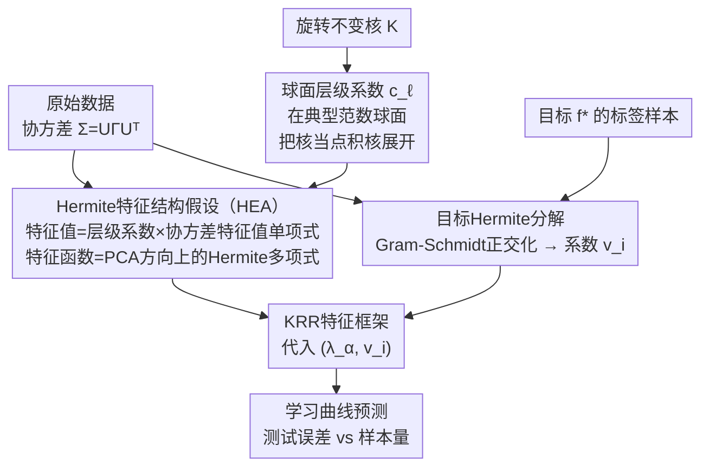

# Predicting Kernel Regression Learning Curves from Only Raw Data Statistics

**会议**: ICLR 2026  
**arXiv**: [2510.14878](https://arxiv.org/abs/2510.14878)  
**代码**: [https://github.com/JoeyTurn/hermite-eigenstructure-ansatz](https://github.com/JoeyTurn/hermite-eigenstructure-ansatz)  
**领域**: 其他 / 学习理论 / 核方法  
**关键词**: 核回归学习曲线, Hermite特征结构, 各向异性数据, 核岭回归, 特征学习

## 一句话总结
提出 Hermite 特征结构假设（HEA），仅用数据协方差矩阵和目标函数的 Hermite 分解两个统计量，就能解析预测旋转不变核在真实图像数据集（CIFAR-5m、SVHN、ImageNet）上的学习曲线（测试误差 vs 样本量），并证明该假设在高斯数据下成立，且 MLP 在特征学习 regime 下也按 HEA 预测的顺序学习 Hermite 多项式。

## 研究背景与动机

**领域现状**：核岭回归（KRR）作为理解神经网络的重要代理模型（通过 NTK 等价性），已有完善的特征框架（eigenframework）可从核特征系统预测测试误差。这一框架依赖核关于数据分布的特征值和特征函数。

**现有痛点**：虽然特征框架理论完备，但实际应用时必须先构造并对角化核矩阵以获得特征系统，这对高维真实数据既计算昂贵，也无法提供解析性理解。更根本的问题是——现有理论几乎都依赖简化的数据假设（如各向同性球面分布），无法直接应用于真实各向异性数据集。

**核心矛盾**：真实数据分布极其复杂，无法完整解析描述；但学习行为又受数据结构深刻影响。对实际数据做预测需要在"数据的简洁描述"和"预测精度"之间取得平衡。

**本文目标** (a) 能否找到一个关于数据分布的"简约描述"，既足够简单又能预测核回归的学习行为？(b) 能否不构造核矩阵，直接从数据统计量预测学习曲线？

**切入角度**：作者观察到，对于高斯数据，旋转不变核的特征函数自然就是多维 Hermite 多项式，而真实图像数据"足够高斯"（coordinatewise marginals 近似高斯），因此可以大胆假设这一结构对真实数据也近似成立。

**核心 idea**：旋转不变核在各向异性数据上的特征系统近似等于 Hermite 特征系统——特征函数是数据 PCA 方向上的 Hermite 多项式，特征值是协方差特征值的单项式乘以核的层级系数。

## 方法详解

### 整体框架

要理解核回归在某个数据集上的学习行为，已有的 KRR 特征框架（eigenframework）能从「核的特征值 + 特征函数 + 目标在这组基下的系数」算出测试误差随样本量的曲线，但前提是先把核矩阵构造出来、对角化，对高维真实数据既昂贵又给不出解析理解。本文把这缺的一环补上：直接从两个原始统计量——数据协方差矩阵 $\Sigma = U \Gamma U^\top$ 和目标函数 $f_*$ 的 Hermite 分解——加上核函数本身的形式，解析地写出整套特征系统，全程不碰核矩阵。具体地，先在数据典型范数的球面上把旋转不变核展成点积核、读出各阶层级系数 $c_\ell$；再用 HEA 把 $(\Gamma, c_\ell)$ 直接写成 Hermite 特征系统 $(\lambda_\alpha, \phi_\alpha)$；同时从标签里用 Gram-Schmidt 估出目标系数 $v_i$；最后把 $(\lambda_\alpha, v_i)$ 喂进 KRR 特征框架，输出学习曲线。

### 关键设计

**1. Hermite 特征结构假设（HEA）：把核的整套特征系统压成一个不依赖核矩阵的解析公式**

框架里最关键的一步是绕开「构造并对角化核矩阵」这道高维瓶颈。HEA 直接断言：旋转不变核在各向异性数据上的特征系统有一个闭式形式——对任意多指标 $\alpha \in \mathbb{N}_0^d$，特征值是协方差特征值的单项式乘以核的层级系数 $\lambda_\alpha = c_{|\alpha|} \cdot \prod_{i=1}^d \gamma_i^{\alpha_i}$，特征函数则是数据 PCA 方向上的多维 Hermite 多项式 $\phi_\alpha = h_\alpha^{(\Sigma)}$，其中 $c_\ell$ 是核在数据典型范数球面上的层级系数、$\gamma_i$ 是协方差特征值。换句话说，特征系统只依赖 $\mu$ 的二阶统计量、与具体选哪个旋转不变核无关。这个形式的直觉来自高斯核的宽核极限：当 $\sigma^2 \gg \gamma$ 时，核特征映射各分量的方差按 $\sigma^{-2\ell} \gamma^\ell$ 指数衰减，对它做 PCA 自然触发 Gram-Schmidt 正交化，结果恰好就是 Hermite 多项式。

这一外推并非凭空：在高斯数据下作者给出两个定理把它坐实。定理 1（宽高斯核）说当 $\mu = \mathcal{N}(0, \Sigma)$、高斯核宽度 $\sigma \to \infty$ 时真实特征系统收敛到 Hermite 特征系统，证明取 Mehler 公式的极限；定理 2（快衰减点积核）说当层级系数满足 $c_{\ell+1} \leq \epsilon \cdot c_\ell$、$\epsilon \to 0$ 时特征系统线性收敛到 HEA，证明用微扰理论把核特征结构拆成指数分离的层级。把这两个极限合起来看，HEA 在三类条件下成立得最好：层级系数快速衰减（$c_\ell \gg \gamma_1 c_{\ell+1}$）、有效数据维度高（$d_\text{eff} = \text{Tr}[\Sigma]^2 / \text{Tr}[\Sigma^2] \gg 1$，对 Laplace 这类非光滑核尤其重要）、数据"足够高斯"——有趣的是复杂高维图像反而比 MNIST、表格这类简单数据更满足，因为中心极限效应让坐标边缘分布更趋高斯。HEA 应被当作一个可证伪的断言而非定理，但 Figure 2 在四组核/数据组合上都验证了它对特征值和特征函数的预测。

**2. 球面层级系数：把任意旋转不变核当点积核处理，提取各阶系数 $c_\ell$**

要套用上面的公式，先得拿到 $c_\ell$，这正是框架图里喂进 HEA 的那条核侧输入。做法是在数据典型范数 $r = \text{Tr}[\Sigma]^{1/2}$ 的球面上把旋转不变核展开成点积核 $K(x,x') = \sum_\ell \frac{c_\ell}{\ell!}(x^\top x')^\ell$，读出各阶系数。文中据此推导了几类常见核的层级系数：Gaussian 核为 $c_\ell = e^{-r^2/\sigma^2} \cdot \sigma^{-2\ell}$，Laplace 核涉及 Bessel 多项式，还有 ReLU NNGP / NTK。并非所有旋转不变核天然是点积核（如 Laplace 核在零点不解析），但高维数据的范数高度集中在 $r$ 附近，于是在这个典型范数球面上做点积核近似是安全的。

**3. 目标函数的 Hermite 分解：从有限标签里估出目标在 Hermite 基下的系数**

有了特征系统，还得知道目标 $f_*$ 在这组基下的展开系数 $v_i$ 才能代进 KRR 框架——这是框架图里与核侧并行的那条目标侧分支。直接做内积估计会出问题：真实数据存在轻微非高斯性，使 Hermite 基并不完美正交，重叠模式的功率会被高估。解决办法是先对样本化的 Hermite 多项式做 Gram-Schmidt 正交化 $h_i^{(\text{GS})} = \text{unitnorm}(h_i - \sum_{j<i} \langle h_j^{(\text{GS})}, h_i \rangle h_j^{(\text{GS})})$，再投影出 $\hat{v}_i = \langle h_i^{(\text{GS})}, y \rangle$。这一步只跟数据和目标有关、与核的选择无关（不依赖 $c_\ell$），所以一次分解就能复用到所有核的学习曲线预测上，大幅降低计算成本。实验中用了 $P = 30000$ 个模式、$N = 80000$ 个样本。

## 实验关键数据

### 主实验：学习曲线预测

| 数据集 | 核函数 | 目标类型 | HEA 预测 | 说明 |
|--------|--------|---------|----------|------|
| CIFAR-5m | Gaussian (σ=6) | 合成 Hermite 多项式 $h_1(z_1)$ | 精确匹配 | 线性 → 二次 → 三次目标的样本复杂度均准确预测 |
| CIFAR-5m | Gaussian (σ=6) | vehicles vs. animals | 良好匹配 | 二值化真实标签，学习曲线形状和绝对值均准确 |
| CIFAR-5m | Laplace (σ=8√2) | domesticated vs. wild | 良好匹配 | 非光滑核也能预测，需 ZCA 预处理提高 $d_\text{eff}$ |
| SVHN | Gaussian (σ=6) | even vs. odd | 良好匹配 | 不同数据集的泛化验证 |
| SVHN | Laplace | prime vs. composite | 良好匹配 | 语义更复杂的二值分类 |
| ImageNet-32 | ReLU NTK | 合成多项式 | 精确匹配 | NTK 核 + 真实高分辨率数据 |
| ImageNet-32 | ReLU NTK | 合成 power-law 目标 | 精确匹配 | 不同 source exponent $\beta$ 均准确 |

### 特征结构验证（Figure 2）

| 核/数据组合 | $d_\text{eff}$ | 特征值匹配 | 特征函数子空间重叠 | 说明 |
|------------|----------|-----------|---------------------|------|
| Gaussian核 + 高斯数据 ($d=200$) | ~7 | 精确 | 对角线集中 | 理论保证的 setting |
| Gaussian核 + CIFAR-5m | ~9 | 良好 | 对角线集中 | 自然图像也满足 |
| Laplace核 + SVHN (ZCA) | ~21 | 良好 | 对角线集中 | 需要 $d_\text{eff} \geq 20$ |
| ReLU NTK + ImageNet-32 (ZCA) | ~40 | 良好 | 对角线集中 | 高偏置方差比替代宽核条件 |

### MLP 特征学习验证

| 数据集 | 网络 | 目标 | 发现 |
|--------|------|------|------|
| 高斯数据 | 3层 ReLU MLP | 各阶 Hermite 多项式 | 优化时间 $\eta \cdot n_\text{iter}$ 与 $\lambda_\alpha^{-1/2}$ 成正比 |
| CIFAR-5m | 3层 ReLU MLP | 多维 Hermite 多项式 | 学习顺序与 HEA 特征值排序一致 |

### 关键发现
- HEA 在复杂图像数据集上反而比简单数据集（MNIST、表格数据）效果更好——"维数的祝福"使高维数据的坐标分量更接近高斯分布。
- 对 Laplace 核，层级系数 $c_\ell$ 随 $\ell$ 超指数增长，导致理论特征值在高阶发散。实际操作中截断到 $\ell \in [5,10]$ 即可得到良好近似——这更像渐近展开而非收敛级数。
- 目标函数分解中的 Gram-Schmidt 正交化是预测精度的关键步骤。直接线性回归因模型误设和非正交性导致估计失真。
- 一次目标函数分解可用于所有核的学习曲线预测（核无关性），这大幅降低了计算成本。

## 亮点与洞察

- **端到端解析理论的概念验证**：这可能是第一个在真实数据集上实现"数据结构 → 模型性能"全链路解析预测的工作。仅靠协方差矩阵 $\Sigma$ 和 Hermite 分解，无需构造核矩阵就能预测学习曲线——这一方法的计算复杂度远低于传统的核矩阵对角化。

- **数据的"简约描述"思想**：用协方差矩阵 + Hermite 系数作为数据的"reduced description"，恰好捕捉了核学习器关心的信息。这一思路可迁移到设计更好的数据特征化方法或数据选择策略。

- **HEA 对 MLP 的适用性**：虽然理论针对核回归，但实验发现 feature-learning regime 下的 MLP 也按 HEA 预测的顺序学习 Hermite 多项式。这暗示 HEA 可能是更一般的学习规律，有潜力拓展到深度学习理论。

- **"维数的祝福"**：通常高维被视为诅咒，但这里复杂高维图像数据反而比低维简单数据更好地满足 HEA——因为中心极限定理效应使各坐标更趋高斯。这一见解可指导理论与实验的设计。

## 局限与展望

- **仅限旋转不变核**：HEA 假设核的旋转不变性，不直接适用于非旋转不变核（如学习后的 NTK、注意力核等）。拓展到更一般的核函数类是重要方向。
- **"足够高斯"的条件难以精确量化**：文中仅用 coordinatewise 高斯性做粗略判断，缺乏关于"高斯程度"的定量阈值。MNIST 和表格数据的失败案例说明这一条件非平凡。
- **高阶层级系数发散**（Laplace/ReLU 核）：对非光滑核，$c_\ell$ 超指数增长导致理论特征值发散，必须人工截断。更优雅的处理方式（如渐近展开理论）还有待探索。
- **未涉及正则化参数选择**：学习曲线预测假设已知 ridge 参数 $\delta$，但实际 $\delta$ 通常需要交叉验证。如何用 HEA 同时预测最优 $\delta$ 未被讨论。
- **MLP 联系仅为经验性**：虽然 MLP 实验令人兴奋，但没有理论解释为什么 feature-learning MLP 也遵循 HEA 顺序。建立正式的 MLP-HEA 联系是自然的后续工作。

## 相关工作与启发

- **vs KRR eigenframework (Simon et al. 2021)**：他们提供从特征结构到测试风险的映射，但需要先数值求解特征系统。本文补上了缺失的一环——从原始数据统计量解析构造特征系统。
- **vs Wortsman & Loureiro (2025)**：同期工作研究相同的数学问题（点积核在各向异性高斯数据上的特征结构），但仅证明了特征值的上下界，且在研究 KRR 泛化时切换到 Hermite 多项式核。本文的 HEA 为这一替换提供了理论依据。
- **vs Ghorbani et al. (2020)**：他们在"球面之积"（各向同性多球面）上给出了精确特征结构。HEA 可统一这些结果并拓展到连续各向异性设置。
- **vs 单/多指标模型文献**：现有工作关注 Hermite 多项式学习的渐近标度律，本文追求包含常数前因子的精确值预测，且处理各向异性数据使结果可应用于真实数据集。

## 评分
- 新颖性: ⭐⭐⭐⭐⭐ 首次实现从原始数据统计量端到端预测真实数据集上的核回归学习曲线，HEA 是优雅且强大的统一框架
- 实验充分度: ⭐⭐⭐⭐ 覆盖多种核、多种数据集、合成和真实目标，有理论证明+经验验证；但缺少大规模/高分辨率数据实验
- 写作质量: ⭐⭐⭐⭐⭐ 叙述流畅，直觉解释和形式化证明并重，Figure 1 的端到端 pipeline 可视化极为清晰
- 价值: ⭐⭐⭐⭐ 对学习理论社区有重要启发，证明了在真实数据上发展端到端理论的可行性；MLP 联系增加了实际影响力

<!-- RELATED:START -->

## 相关论文

- [\[ICLR 2026\] When to Retrain after Drift: A Data-Only Test of Post-Drift Data Size Sufficiency](when_to_retrain_after_drift_a_data-only_test_of_post-drift_data_size_sufficiency.md)
- [\[ICML 2025\] Curvature Enhanced Data Augmentation for Regression](../../ICML2025/others/curvature_enhanced_data_augmentation_for_regression.md)
- [\[ICLR 2026\] Probabilistic Kernel Function for Fast Angle Testing](probabilistic_kernel_function_for_fast_angle_testing.md)
- [\[ICML 2025\] Improved Learning via k-DTW: A Novel Dissimilarity Measure for Curves](../../ICML2025/others/improved_learning_via_k-dtw_a_novel_dissimilarity_measure_for_curves.md)
- [\[AAAI 2026\] Life, Machine Learning, and the Search for Habitability: Predicting Biosignature Fluxes for the Habitable Worlds Observatory](../../AAAI2026/others/life_machine_learning_and_the_search_for_habitability_predicting_biosignature_fl.md)

<!-- RELATED:END -->
