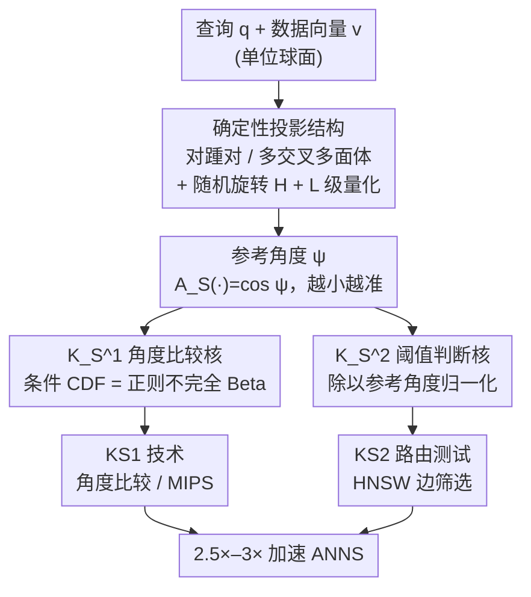

# Probabilistic Kernel Function for Fast Angle Testing

**会议**: ICLR 2026 Oral  
**arXiv**: [2505.20274](https://arxiv.org/abs/2505.20274)  
**代码**: [GitHub](https://github.com/KejingLu-810/KS)  
**领域**: 其他  
**关键词**: 近似最近邻搜索, 概率核函数, 角度测试, 随机投影, 相似性搜索

## 一句话总结

本文研究高维欧氏空间中的角度测试问题，提出两个基于参考角度的确定性概率核函数 $K_S^1$ 和 $K_S^2$，分别用于角度比较和角度阈值判断，无需高斯分布的渐近假设即可获得理论保证，并将其应用于近似最近邻搜索（ANNS），在 HNSW 图上实现 2.5×–3× 的 QPS 加速。

## 研究背景与动机

向量相似性搜索是机器学习、数据挖掘和信息检索中的核心问题。在高维空间中，$\ell_2$ 范数、余弦相似度和内积是最常用的相似性度量，这些度量通常可以归结为归一化向量之间角度的计算。在许多实际场景中，我们并不关心角度的精确值，而是关注角度的大小关系（角度比较）或是否超过阈值（角度阈值判断），这被称为**角度测试**。

现有工作（如 CEOs, PEOs）使用高斯分布生成投影向量，并依赖于 Lemma 1.3（Pham, 2021）建立角度与投影值之间的关系。然而该引理有一个重大理论缺陷：关系式依赖于投影向量数量 $m \to \infty$ 的渐近假设，在 $m$ 有限时无法给出精确保证。本文的出发点正是克服这一限制。

作者的两个关键观察：(1) 高斯分布并非本质需要，决定估计精度的关键因素是**参考角度**，即查询向量与最近投影向量之间的角度；(2) 通过引入随机旋转矩阵，参考角度变得可预测。

## 方法详解

### 整体框架

全文围绕一个核心量——**参考角度**（reference angle）$\psi$，即查询向量与离它最近的那条投影向量之间的夹角——重新组织角度测试。现有的 CEOs/PEOs 用高斯随机投影建立角度与投影值的关系，但精度只在投影数 $m\to\infty$ 的渐近极限下才有保证。本文的两个观察是：(1) 高斯分布不是必需的，真正决定估计精度的是参考角度；(2) 引入随机旋转矩阵后，参考角度只取决于投影向量的结构，因而可预测、可主动压小。

据此，方法把整条 pipeline 串成「先把参考角度做小，再用核函数解角度测试」：先用一组带结构的确定性投影向量加随机旋转 $H$，让查询/数据向量到最近投影向量的参考角度 $\psi$ 尽量小；再用参考角度构造两个确定性核函数——$K_S^1$ 解决「哪个数据向量与查询更近」的角度比较问题（Problem 1.1），$K_S^2$ 解决「角度是否小于阈值」的角度阈值判断（Problem 1.2）；最后把 $K_S^1$ 落成可替换 CEOs 的 KS1 投影技术、把 $K_S^2$ 落成相似性图（如 HNSW）上的 KS2 路由测试，从而加速近似最近邻搜索（ANNS）。

### 关键设计

**1. 确定性投影结构：用更小的参考角度取代随机高斯**

既然参考角度决定核函数精度（Lemma 4.2/4.3：参考角度越小、概率保证越强），就该主动把它做小，而高斯随机投影做不到——它选出的最大内积参考向量并不保证有最小的参考角度（这正是「高斯次优」的根因）。作者给出两种确定性配置：对踵对结构（antipodal，Algorithm 1）在子空间里生成 $m/2$ 个随机点并补上各自的对踵点；多交叉多面体结构（multiple cross-polytope，Algorithm 2）利用交叉多面体在 $m=2d$ 时覆盖半径最小（即最坏情况参考角度最小）的性质，通过随机旋转把固定交叉多面体转到不同方向、凑够 $m$ 条。两种结构都让投影向量成对踵对，因而投影评估时间减半，并保证 $A_S(\mathbf{v})>0$（恰好满足 Lemma 4.3 的前提）。在此之上再叠加乘积量化（product quantization）式的多层级：把空间切成 $L$ 个子空间、每个放 $m$ 条投影向量，拼接后虚拟生成 $m^L$ 条投影向量，用极低存储把参考角度指数级压小，$L$ 同时充当精度与效率的权衡旋钮。

**2. $K_S^1$ 角度比较核：把角度比较变成一个确定性的 CDF**

角度比较只需判断哪条数据向量与查询更近，但 CEOs 给出的角度-投影关系只在 $m\to\infty$ 时成立，$m$ 有限时无从估计误差。本文把核函数定义为 $K_S^1(\mathbf{q}, \mathbf{v}) = \langle \mathbf{v}, Z_{HS}(\mathbf{q}) \rangle$，其中 $H$ 是随机旋转矩阵，$Z_{HS}(\mathbf{q})$ 取查询 $\mathbf{q}$ 在旋转后投影集合 $HS$ 中内积最大的那条向量（参考向量）。Lemma 4.2 证明，在给定参考角度 $A_S(\mathbf{q})=\cos\psi$ 的条件下，$K_S^1$ 的条件 CDF 可被正则化不完全 Beta 函数（regularized incomplete Beta function）精确写出：

$$F_{K_S^1}\!\left(x \mid A_S(\mathbf{q}) = \cos\psi\right) = I_t\!\left(\tfrac{d-2}{2}, \tfrac{d-2}{2}\right)$$

这条关系不含任何渐近项，是确定性的；且参考角度 $\psi$ 越小、概率保证越强——这正是把「靠高斯」换成「靠可控参考角度」之后换来的好处。若把 $S$ 取成高斯点集，$K_S^1$ 退化为 CEOs 用的指标 $\mathbf{v}^\top \mathbf{u}_{\max}$，因此 $K_S^1$ 可看作 CEOs 的推广。

**3. $K_S^2$ 阈值判断核：用参考角度做归一化得到角度敏感判据**

阈值判断要回答角度是否越过某个界 $\theta$，PEOs 虽能做却没用上参考角度信息，判据偏松。本文定义 $K_S^2(\mathbf{q}, \mathbf{v}) = \langle H\mathbf{q}, Z_S(H\mathbf{v}) \rangle / A_S(H\mathbf{v})$，关键是除以参考向量内积 $A_S(H\mathbf{v})=\cos\psi$ 做归一化。Lemma 4.3 证明这样得到的 $K_S^2$ 是**角度敏感函数**（angle-sensitive，类比 LSH 的局部敏感性，但因阈值 $\theta$ 显式给定而不引入近似比 $c$），满足 Problem 1.2 要求的概率保证（$\epsilon_1=0.5$，$\epsilon_2<0.5$）。归一化把参考角度信息显式注入判据，让同样置信度下的阈值判断更紧。

**4. KS2 路由测试：把核函数落到图搜索的边筛选上**

把 $K_S^2$ 接到相似性图（如 HNSW）的路由判断里，得到一条简明的测试不等式

$$\sum_{i=1}^L \mathbf{q}_i^\top \mathbf{u}_{e[i]}^i \geq A_S(\mathbf{e}) \cdot \dfrac{\|\mathbf{w}\|^2/2 - \tau - \mathbf{v}^\top\mathbf{q}}{\|\mathbf{e}\|}$$

用它在扩展某个邻居之前先判断这条边是否值得走（对应 PEOs 的 $(\delta,1-\epsilon)$ 路由测试，本文给出的是 $(\delta,0.5)$ 路由测试）。相比 PEOs 的对应测试，这条不等式形式更简单、单次评估更快，需要存储的标量更少，因而索引也更小（实验里比 HNSW+PEOs 约小 5%），并且天然适合 SIMD 一次并行筛 16 条边。

### 损失函数 / 训练策略

本文不涉及神经网络训练，唯一要优化的是投影向量配置 $S$ 本身。优化目标是最大化覆盖效果 $J(S) = \mathbb{E}_{\mathbf{v} \in U(\mathbb{S}^{d-1})}\!\left[A_S(\mathbf{v})\right]$，即配置 $S$ 对单位球面上随机方向的平均参考角度余弦（越大表示参考角度越小、精度越高）。由于最优配置（与最优覆盖问题相关）一般难解，实际中用均匀采样的 $N$ 个点计算近似值 $\tilde{J}(S,N)$ 来评估和挑选配置。

## 实验关键数据

### 主实验（ANNS 性能对比）

| 数据集 | 指标 (QPS@Recall=90%) | HNSW+KS2 | HNSW+PEOs | HNSW | 本方法加速比 |
|--------|----------------------|----------|-----------|------|-----------|
| SIFT | QPS | 最优 | 次优 | 基线 | **2.5×–3× vs HNSW** |
| GloVe1M | QPS | 最优 | 次优 | 基线 | **10%–30% vs PEOs** |
| GloVe2M | QPS | 最优 | 次优 | 基线 | 1.1–1.3× vs PEOs |
| Tiny | QPS | 最优 | 次优 | 基线 | 显著优于 HNSW 和 ScaNN |
| GIST | QPS | 最优 | 次优 | 基线 | 显著优于 HNSW |

### 消融实验（KS1 vs CEOs, $k$-MIPS, $k=10$, $m=2048$）

| 配置 | Word Probe@1K | GloVe1M Probe@1K | 说明 |
|------|-------------|-----------------|------|
| CEOs(2048) | 90.203% | 24.166% | 高斯随机投影基线 |
| KS1($S_{sym}$) | 90.265% | 24.456% | 对踵对结构，小幅提升 |
| KS1($S_{pol}$) | 90.678% | 24.556% | 多交叉多面体，最优 |

### 关键发现

- 参考角度越小，核函数精度越高——这是贯穿全文的核心洞察
- 高斯分布不是投影向量的最优选择，确定性结构（尤其是交叉多面体）能提供更小的参考角度
- 当子空间维度 $d' = d/L \approx 16$ 时，HNSW+KS2 达到最佳搜索性能
- KS2 的索引尺寸比 PEOs 小约 5%，且测试不等式更简单，评估更快
- KS1 对 CEOs 的改进较小（约 0.8%），因为差异仅在投影向量分布上

## 亮点与洞察

- **理论贡献**: 建立了不依赖渐近假设的确定性概率关系（Eq. 4），是对现有理论（Lemma 1.3）的根本性改进
- **实践影响大**: HNSW+KS2 在 ANNS 上实现了 2.5×–3× 的加速，具有直接的实际应用价值
- **高斯分布次优性**: 理论和实验均表明高斯投影不是角度测试的最优选择，这挑战了随机投影领域的常见假设
- **SIMD 友好**: KS2 测试可通过 SIMD 并行处理 16 条边，实现高效的硬件级优化

## 局限与展望

- KS1 对 CEOs 的改进较为有限，实际增益主要体现在 KS2 的图搜索加速上
- 最优覆盖问题（best covering problem）在一般情况下仍然开放，$m > d+3$ 时无已知最优解
- 仅在 CPU 上进行实验，GPU 加速场景下的性能有待验证
- 理论分析主要针对欧氏空间和余弦相似度，对其他度量空间的推广尚未讨论

## 相关工作与启发

- CEOs（Pham, 2021）：本文 $K_S^1$ 可视为 CEOs 的推广，用确定性参考角度取代高斯渐近关系
- PEOs（Lu et al., 2024）：$K_S^2$ 在 PEOs 基础上增加了参考角度归一化，简化了测试不等式
- Falconn（Andoni et al., 2015）：使用交叉多面体进行 LSH，本文借鉴了其结构思想但用于不同目的
- 启发：参考角度作为控制精度的关键因素，可能在其他随机投影应用中（如维度约减、草图算法）也有类似作用

## 评分

- 新颖性: ⭐⭐⭐⭐ 参考角度视角新颖，确定性关系取代渐近关系是重要理论进步
- 实验充分度: ⭐⭐⭐⭐ 6 个数据集全面覆盖，与 SOTA 对比充分，消融实验完整
- 写作质量: ⭐⭐⭐⭐ 理论推导严谨，但符号较多，部分符号定义分散在正文和附录中
- 价值: ⭐⭐⭐⭐ 对 ANNS 领域有实质贡献，2.5×–3× 加速具有直接应用价值

<!-- RELATED:START -->

## 相关论文

- [\[ICML 2026\] New Bounds for Kernel Sums via Fast Spherical Embeddings](../../ICML2026/others/new_bounds_for_kernel_sums_via_fast_spherical_embeddings.md)
- [\[ICLR 2026\] Characterizing and Optimizing the Spatial Kernel of Multi Resolution Hash Encodings](characterizing_and_optimizing_the_spatial_kernel_of_multi_resolution_hash_encodi.md)
- [\[ICLR 2026\] An Information-Theoretic Framework For Optimizing Experimental Design To Distinguish Probabilistic Neural Codes](an_information-theoretic_framework_for_optimizing_experimental_design_to_disting.md)
- [\[ICLR 2026\] Improving Set Function Approximation with Quasi-Arithmetic Neural Networks](improving_set_function_approximation_with_quasi-arithmetic_neural_networks.md)
- [\[ICLR 2026\] Predicting Kernel Regression Learning Curves from Only Raw Data Statistics](predicting_kernel_regression_learning_curves_from_only_raw_data_statistics.md)

<!-- RELATED:END -->
