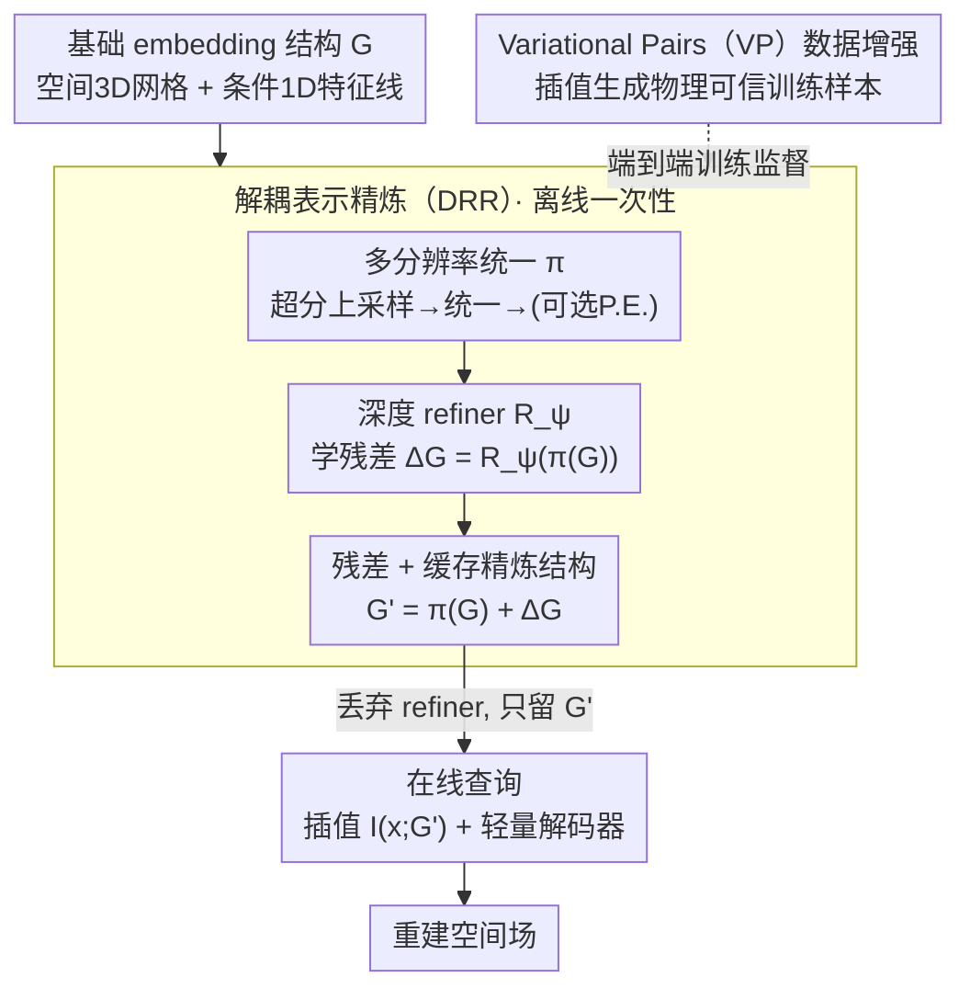

# Refine Now, Query Fast: A Decoupled Refinement Paradigm for Implicit Neural Fields

**会议**: ICLR 2026  
**arXiv**: [2602.15155](https://arxiv.org/abs/2602.15155)  
**代码**: [GitHub](https://github.com/xtyinzz/DRR-INR)  
**领域**: 神经场 / 代理建模  
**关键词**: Implicit Neural Representation, Decoupled Refinement, Ensemble Surrogate, Variational Pairs, Feature Grid

## 一句话总结

本文提出解耦表示精炼（DRR）范式，通过深度 refiner 网络在离线阶段精炼 embedding 结构并缓存结果，使推理阶段仅需快速插值和轻量解码器，在集成仿真代理建模任务上以不到 1/27 的推理成本达到 SOTA 重建精度。

## 研究背景与动机

**领域现状**：隐式神经表示（INR）已成为大规模 3D 科学仿真代理建模的有力工具，能以连续函数表示空间场和条件场。当前 INR 架构分为两大阵营：**embedding-based 方法**（如特征网格、哈希网格）通过快速插值实现高效推理但表达力受限；**MLP-based 方法**（如 FA-INR 的 MoE 架构）具有强大的非线性建模能力但推理延迟极高。

**现有痛点**：embedding-based 模型（如 K-Planes、Explorable-INR）在集成仿真中面临两个困境——天真地将特征结构扩展到高维条件空间会导致内存爆炸；低秩分解虽然节省内存但形成表示瓶颈，无法捕捉数据中的复杂非线性交互。MLP-based 模型（如 FA-INR）在 Nyx 数据集上推理需要 287 秒，实际应用中不可接受。

**核心矛盾**：精度与速度之间存在根本性的架构限制——深层网络有足够的表达力但推理慢，浅层 embedding 查询推理快但欠表达。这两者看似不可调和，因为推理时要么执行大量网络前向传播，要么仅做简单的插值查表。

**本文目标** (1) 如何在不牺牲推理速度的前提下获得深层网络的表达力？(2) 如何有效融合多尺度、多条件参数的特征？(3) 如何在稀疏集成训练数据下提升模型泛化能力？

**切入角度**：核心洞察是"构建高质量表示所需的昂贵计算不必在每次查询时重复"。如果一个深度网络的作用是精炼 embedding 结构，那么这种精炼可以预计算并缓存——推理时直接查询缓存后的精炼 embedding，成本退化为纯 embedding-based 模型。

**核心 idea**：用深层 refiner 网络离线精炼 embedding 结构并缓存结果，让推理路径仅包含快速插值和轻量解码，解耦了表达力与推理效率。

## 方法详解

### 整体框架

DRR 想解开隐式神经表示（INR）里"精度高就慢、查询快就欠表达"的死结，办法是把"构建表示"和"查询表示"两件事彻底拆开。整体只有一条主线：**离线阶段**先对基础 embedding 结构 $\mathcal{G}$（空间 3D 特征网格 + 条件 1D 特征线）做非参数变换 $\pi$（多分辨率统一、结构超分辨率、可选位置编码上采样），再让深度 refiner 网络 $R_\psi$ 学一个残差偏移 $\Delta\mathcal{G}=R_\psi(\pi(\mathcal{G}))$，残差相加得到精炼结构 $\mathcal{G}'=\pi(\mathcal{G})+\Delta\mathcal{G}$ 并**缓存**下来；训练时基础结构、refiner、解码器端到端联合优化，并用 Variational Pairs（VP）增强稀疏的集成仿真数据。**在线阶段**直接丢弃 refiner，每次查询只在缓存的 $\mathcal{G}'$ 上做一次插值 + 轻量解码，于是把深层网络的表达力"预付"进了缓存、查询成本退回纯 embedding 级别。

### 关键设计

**1. 解耦表示精炼（DRR）：把昂贵的深层计算从查询路径搬到离线**

INR 精度与速度不可调和的症结，在于深层网络的前向传播被绑在了每一次查询上。DRR 的破局点是观察到 refiner 网络 $R_\psi$ 精炼的对象是 embedding 结构本身，而不是动态的查询输入——既然如此，这份计算只需做一次。具体精炼公式为 $\mathcal{G}' = \pi(\mathcal{G}) + R_\psi(\pi(\mathcal{G}))$，其中 $\pi$ 是非参数变换、$R_\psi$ 学习残差偏移。残差连接让 refiner 只学"增量精炼"而非从头重建结构，训练更稳。

训练时所有参数端到端联合优化；推理时 refiner 被丢弃，仅对空间特征网格和条件特征线各跑一次前向、把精炼后的 $\mathcal{G}'$ 缓存下来。此后每次查询都退化为 $z_{DRR} = I(x; \mathcal{G}')$，计算量与标准 embedding-based 模型完全相同。这就是它能拿到深层网络表达力、却付 embedding 查询成本（比 FA-INR 快 27×）的根本原因。

**2. 多分辨率统一：先统一、再精炼、后拆分**

Instant-NGP 这类高性能结构靠多分辨率特征取胜，但 refiner 需要一个统一输入才能在全局视角下做跨尺度融合，于是 DRR-Net 用"统一→精炼→拆分"的三步把它们对齐。**空间编码器**先对 $L_{sp}$ 个不同分辨率的 3D 特征网格各做结构超分辨率、上采样到相同高分辨率，再沿通道维拼成统一网格 $\hat{\mathcal{G}}_{unified}$；可选的位置编码特征上采样会把 embedding 维度从 $L_{sp} \times d_{fs}$ 抬到 $L_{sp} \times d_{fs} \times 2K_{pe}$。

**条件编码器**则对 $d_c$ 个条件参数各维护 $L_{cond}$ 条多分辨率 1D 特征线，先在每个参数内部局部统一、再跨参数全局统一，合成单一 1D 表示 $\hat{\mathcal{G}}_{cond}$。refiner 处理完后再拆回 $d_c$ 条特征线——此时每条线已携带跨分辨率、跨参数的融合特征。正是这个先合后分的安排，让单个 refiner 能一次性学到多尺度交互，而不必为每种分辨率单独建模。

**3. Variational Pairs（VP）：在稀疏集成数据下造物理可信的增强样本**

集成仿真数据天然稀疏（每跑一次模拟都很贵），泛化全靠数据增强撑，但增强必须尊重底层场的物理性质——这正是前作 Variational Coordinates（VC）翻车的地方：VC 扰动坐标却保持值不变，隐含了分段常数假设，和仿真场的连续光滑性直接冲突。**VP-S（空间增强）**改成扰动坐标 $\tilde{x} = x + \epsilon_x$（截断高斯噪声）的同时，用插值同步生成新值 $\tilde{v} = I(\Phi_c, \tilde{x})$，以局部光滑假设取代分段常数，造出来的样本才落在真实分布里。

**VP-SC（时空条件联合增强）**进一步同时扰动坐标和条件参数，用二阶段插值估值——先在 $K$ 个最近邻条件的场里做空间插值得到 $v_k'$，再用逆距离加权跨条件聚合：

$$\tilde{v} = \sum_{k=1}^{K} w_k(\tilde{c}) v_k'$$

实验里 VP-S 是最稳健的一档，几乎对所有模型-数据集组合都正收益，而 VC 时好时坏甚至有害——印证了"增强值必须由插值生成、与真实分布一致"这条原则。

### 损失函数 / 训练策略

训练使用 L2 损失最小化预测值与真值之间的均方误差。所有参数（基础 embedding 结构 $\mathcal{G}$、refiner $R_\psi$、解码器）端到端联合优化。VP 增强样本与原始样本一起参与训练。推理前先执行一次 refiner 前向传递缓存精炼结构。

## 实验关键数据

### 主实验：条件泛化性能

| 数据集 | 模型 | Rel L2↓ | PSNR↑ | SSIM↑ | 推理 TFLOPs ↓ | 推理时间 (s) | 参数量 |
|--------|------|---------|-------|-------|-------------|-------------|--------|
| Nyx | K-Planes | 1.96e-1 | 28.86 | 0.797 | 57.0 | 21.6 | 12.1M |
| Nyx | FA-INR | 3.95e-2 | 42.79 | 0.975 | 2569.2 | 287.2 | 9.5M |
| Nyx | Explorable-INR | 4.64e-2 | 41.39 | 0.972 | 39.6 | 9.6 | 14.7M |
| Nyx | **DRR-Net** | **3.18e-2** | **44.69** | **0.986** | 57.2 | 10.7 | **8.9M** |
| Cloverleaf3D | FA-INR | 1.11e-1 | 47.60 | 0.991 | 422.1 | 56.2 | 1.0M |
| Cloverleaf3D | **DRR-Net** | **9.81e-2** | **48.69** | **0.994** | 52.6 | 5.5 | **0.9M** |

DRR-Net 在 Nyx 上 PSNR 最高（44.69 vs FA-INR 42.79），推理速度比 FA-INR 快 **27×**。

### 数据增强消融实验

| 模型 | 增强方法 | Nyx PSNR↑ | Cloverleaf3D PSNR↑ |
|------|---------|-----------|---------------------|
| DRR-Net | None | baseline | baseline |
| DRR-Net | VC | 下降 | 下降 |
| DRR-Net | **VP-S** | **42.04** | **+1.79 dB** |
| DRR-Net | VP-SC | 42.79 → best for FA-INR | 47.60 |
| FA-INR | VP-SC | **42.79** (最佳) | 47.60 |
| Explorable-INR | VC | 39.59 | 42.41 (下降) |
| Explorable-INR | VP-S | **41.30** | **44.07** |

关键发现：VC 对 DRR-Net 有害，VP-S 是最稳健的增强策略。

### 关键发现

- **DRR 范式有效解决了精度-速度困境**：在 Nyx 和 Cloverleaf3D 上同时实现最高精度和接近最快的推理速度，参数量甚至最少
- **非结构化网格是短板**：MPAS-Ocean（非结构化 Voronoi 网格）上 FA-INR（MLP-based）更优，因为网格假设与数据几何不匹配，但 DRR-Net 仍比同类 embedding 方法好 3dB
- **VP 增强通用性强**：VP-S 在所有模型-数据集组合中几乎都带来正收益，而 VC 效果不稳定甚至有害
- **零样本时空泛化**：在 2× 降分辨率训练 → 全分辨率推理的超分辨率测试中，DRR-Net 保持最优性能

## 亮点与洞察

- **"训练时精炼，推理时查表"的哲学**：DRR 的核心洞察极其朴素但威力巨大——既然精炼计算不依赖查询输入，那就预计算它。这个思路可以迁移到任何"结构化存储 + 查询"的模型中，如知识图谱嵌入、推荐系统的 embedding table
- **多分辨率统一原则的通用性**：将不同分辨率的特征结构统一为 refiner 的单一输入并在精炼后拆分回去的做法，解决了多尺度特征融合的一般性问题。这种"统一-处理-拆分"的 pattern 可以应用于任何需要跨尺度交互的场景
- **VP 增强的物理合理性**：从 VC 的分段常数假设到 VP 的局部光滑假设的改进虽小但关键——数据增强策略必须尊重底层数据的物理性质，否则引入的噪声反而有害

## 局限与展望

- **非结构化网格适配不足**：DRR 建立在特征网格（Cartesian grid）之上，对非结构化网格（如 MPAS-Ocean 的球面 Voronoi 网格）存在几何失配
- **训练时间偏长**：Cloverleaf3D 上 DRR-Net 训练 44 小时，高于 K-Planes 的 26.7 小时和 FA-INR 的 29.4 小时，说明 refiner 的端到端训练增加了优化难度
- **refiner 架构探索有限**：当前 refiner 是简单的深层 MLP，更先进的架构（如图网络、Transformer）可能进一步提升精炼质量
- **VP-SC 的超参数敏感性**：论文提到 VP-SC 的效果受超参数调优影响较大，需要更自适应的扰动策略

## 相关工作与启发

- **vs FA-INR (Li et al., 2025)**: FA-INR 用 MoE MLP 获得高精度但推理慢 27×。DRR-Net 精度更高且推理速度接近 embedding 方法，代价是增加一次性离线精炼
- **vs Explorable-INR (Chen et al., 2025)**: 同为 embedding-based 方法，Explorable-INR 用分解表示应对高维条件，但低秩瓶颈限制了精度。DRR 通过 refiner 突破了这一瓶颈
- **vs Instant-NGP (Müller et al., 2022)**: Instant-NGP 的多分辨率哈希网格是 DRR 可以使用的基础结构之一，DRR 在其之上添加了精炼能力
- **vs Knowledge Distillation**: 知识蒸馏将大模型知识迁移到小模型，DRR 将深层网络的知识"蒸馏"到 embedding 结构中，两者思路互补且可叠加使用

## 评分

- 新颖性: ⭐⭐⭐⭐ DRR 范式将离线精炼与在线查询解耦的思路清晰优雅，VP 增强有实验验证的创新性
- 实验充分度: ⭐⭐⭐⭐⭐ 三个数据集、四种基线、条件泛化/时空泛化/数据增强消融全面覆盖，定量分析充分
- 写作质量: ⭐⭐⭐⭐ 结构清晰，方法描述详细，图表信息量大
- 价值: ⭐⭐⭐⭐ 对 INR 代理建模领域贡献显著，DRR 范式具有广泛的架构指导意义

<!-- RELATED:START -->

## 相关论文

- [\[CVPR 2025\] EVOS: Efficient Implicit Neural Training via EVOlutionary Selector](../../CVPR2025/others/evos_efficient_implicit_neural_training_via_evolutionary_selector.md)
- [\[CVPR 2026\] Content-Aware Frequency Encoding for Implicit Neural Representations with Fourier-Chebyshev Features](../../CVPR2026/others/content-aware_frequency_encoding_for_implicit_neural_representations_with_fourie.md)
- [\[ICLR 2026\] Fast and Stable Riemannian Metrics on SPD Manifolds via Cholesky Product Geometry](fast_and_stable_riemannian_metrics_on_spd_manifolds_via_cholesky_product_geometr.md)
- [\[ECCV 2024\] Superpixel-Informed Implicit Neural Representation for Multi-Dimensional Data](../../ECCV2024/others/superpixel-informed_implicit_neural_representation_for_multi-dimensional_data.md)
- [\[ICLR 2026\] Probabilistic Kernel Function for Fast Angle Testing](probabilistic_kernel_function_for_fast_angle_testing.md)

<!-- RELATED:END -->
