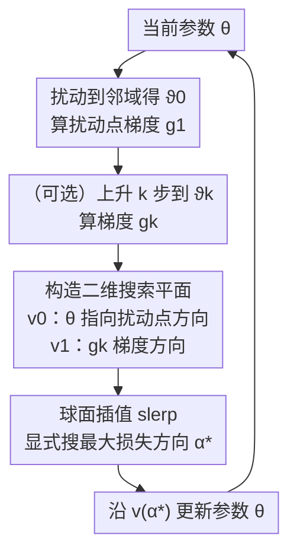

# Revisiting Sharpness-Aware Minimization: A More Faithful and Effective Implementation

## 元信息
- **会议**: ICLR 2026
- **arXiv**: [2603.10048](https://arxiv.org/abs/2603.10048)
- **代码**: [https://github.com/Cccjl219/XSAM](https://github.com/Cccjl219/XSAM)
- **领域**: 其他
- **关键词**: sharpness-aware minimization, SAM, optimization, generalization, flat minima

## 一句话总结
对 SAM 的底层机制提出新的直觉解释——扰动点梯度近似局部最大值方向，并揭示其不精确性及多步退化问题，进而提出 XSAM 通过显式估计最大值方向实现更忠实更有效的锐度感知最小化。

## 研究背景与动机
- **SAM** 通过最小化 $\rho$-邻域内的最大损失来促进平坦极小值和更好泛化，但其实际实现是在扰动点的梯度应用于当前参数——这个"错位梯度"为什么有效，一直缺乏直觉理解。
- **常见误解**：在估计最大值点计算的梯度并不直接最小化邻域内最大损失——关键在于梯度计算位置和应用位置不同。
- **多步 SAM 的困惑**：理论上更多步应该更好逼近最大值，但实际多步 SAM 性能却不升反降。

## 方法详解

### 整体框架
作者先回到 SAM 的"错位梯度"现象本身：它在扰动点 $\vartheta_0$ 处算梯度 $g_1$，却把这个梯度应用到当前参数 $\theta$ 上。通过可视化与二阶近似分析，他们把这个梯度重新理解为"从当前参数指向邻域最大值的方向估计"，并发现这个估计既不精确、又会随上升步数增加而退化。XSAM 顺着这个理解，不再盲信单个梯度，而是在 $v_0$ 与 $v_1$ 张成的二维平面上显式搜出真正指向最大损失的方向再做下降。

### 关键设计

**1. 重新解释 SAM 梯度：扰动点梯度是"通向最大值"的方向，而非最大值处的梯度**

社区长期把 SAM 理解成"在估计出的最大值点取梯度去最小化邻域最大损失"，但关键在于梯度计算的位置（扰动点 $\vartheta_0$）和应用的位置（当前参数 $\theta$）并不相同。作者用可视化（图 1a）说明：单步扰动点梯度 $g_1@\vartheta_0$ 相比当前参数处的局部梯度 $g_0$，更好地近似了"从当前参数走向邻域最大值"的方向。这一点在二阶近似下被命题 1 形式化确认：当 $\rho_m$ 足够大时 $L(\vartheta_0 + \rho_m \frac{g_1}{\|g_1\|}) > L(\vartheta_0 + \rho_m \frac{g_0}{\|g_0\|})$，即沿 $g_1$ 方向能爬到更高的损失。这把 SAM 为何有效从"巧合"变成了可解释的方向估计问题，也为后面的改进留出了空间。

**2. 揭示多步退化的根源：远离 $\vartheta_0$ 后梯度方向信息失真**

按直觉，多走几步上升应当更接近真实最大值，但实践中多步 SAM 反而掉点。作者指出（图 1b）：第 $k$ 步的梯度 $g_k@\vartheta_0$ 可能比单步的 $g_1@\vartheta_0$ 更差地指向最大值方向——上升步走得越远，梯度携带的"通向最大值"的方向信息越失真。同时命题 1 的第二部分给出另一个缺口：总存在某个线性组合 $g_\alpha = \alpha g_1 + (1-\alpha) g_0$ 比 $g_1$ 本身更好，说明即便在单步设置下，SAM 直接用 $g_1$ 也不是最优。两点合起来构成 XSAM 的动机：既然单个梯度不可靠，就应该在一个方向集合里显式地挑。

**3. XSAM：在二维平面上球面插值搜索最大值方向**

XSAM 把搜索约束在两个有意义的方向张成的平面内——$v_0$ 是从当前参数指向扰动点的方向、$v_1$ 是扰动点梯度方向：

$$v_0 = \frac{\vartheta_k - \vartheta_0}{\|\vartheta_k - \vartheta_0\|}, \quad v_1 = \frac{g_k}{\|g_k\|}$$

在这两个单位向量之间用球面线性插值（slerp）生成连续的候选方向，$\psi$ 为二者夹角：

$$v(\alpha) = \frac{\sin((1-\alpha)\psi)}{\sin(\psi)} v_0 + \frac{\sin(\alpha\psi)}{\sin(\psi)} v_1$$

然后显式地在区间内找出使邻域损失最大的 $\alpha^*$，并沿该方向更新参数：

$$\alpha^* = \arg\max_{\alpha \in [0, a]} L(\vartheta_0 + \rho_m \cdot v(\alpha)), \qquad \theta_{t+1} = \theta_t - \eta_t \cdot v(\alpha^*) \cdot \|g_k\|$$

这个设计天然把已知的高损失点（$v_1$ 指向）纳入搜索空间，因此结果至少不劣于 SAM；同时它对单步和多步一视同仁——无论 $g_k$ 取自第几步，都只是平面里的一个端点，从而把多步退化问题统一收编进同一个搜索框架。

**4. epoch 级搜索：把额外开销压到可忽略**

显式搜 $\alpha^*$ 需要沿 $v(\alpha)$ 做多次前向传播评估损失，若每步都搜代价过高。作者观察到 $\alpha^*$ 在训练过程中变化非常缓慢（图 2），因此只需每个 epoch 的首个迭代更新一次、其余迭代复用。一次更新约需 20–40 次前向传播，平摊到整个 epoch 后额外计算量低于 3%，使 XSAM 成为可即插即用替换 SAM 的方案。

## 实验关键数据

### 主实验：单步设置分类任务

| 数据集/模型 | SGD | SAM | GSAM | WSAM | **XSAM** |
|-----------|-----|-----|------|------|---------|
| CIFAR-10/ResNet-18 | 95.3 | 96.0 | 96.0 | 96.1 | **96.3** |
| CIFAR-100/ResNet-18 | 78.0 | 79.5 | 79.8 | 79.8 | **80.3** |
| CIFAR-100/DenseNet-121 | 79.5 | 81.0 | 81.2 | 81.2 | **81.6** |
| Tiny-ImageNet/ResNet-18 | 64.5 | 66.0 | 66.2 | 66.3 | **66.8** |

> XSAM 在所有模型-数据集组合上一致优于 SAM 及其变体。

### 消融实验：多步设置

| 方法 | 1步 | 2步 | 5步 | 10步 |
|-----|-----|-----|-----|------|
| SAM | 79.5 | 79.2 | 78.8 | 78.3 |
| **XSAM** | **80.3** | **80.5** | **80.6** | **80.7** |

> SAM 性能随步数增加而下降，XSAM 则持续改善——验证了多步退化现象及 XSAM 的修复。

### 训练时间对比（小时/200epochs）

| 模型/数据集 | SAM | XSAM | 额外开销 |
|-----------|-----|------|---------|
| VGG-11/CIFAR-10 | 0.93 | 0.96 | +3.2% |
| ResNet-18/CIFAR-100 | 2.40 | 2.43 | +1.3% |
| DenseNet-121/CIFAR-100 | 8.05 | 8.07 | +0.2% |

> XSAM 几乎不增加额外计算时间。

### 关键发现
1. SAM 梯度确实比 SGD 梯度更好近似最大值方向，但仍不准确
2. 多步 SAM 退化是因为 $g_k$ 的方向信息在远离 $\vartheta_0$ 后失真
3. $\alpha^*$ 训练中稳定，epoch-wise 更新即可
4. XSAM 与 ASAM 组合可进一步提升性能

## 亮点与洞察
- **直觉解释填空白**：首次给出 SAM "错位梯度" 为什么有效的直觉和视觉解释
- **多步退化难题**：优雅解释了困惑社区的现象——为什么更多上升步数不等于更好
- **极小开销的改进**：每 epoch 20-40 个前向传播，开销 < 3%
- **统一框架**：单步和多步 SAM 的统一改进方案

## 局限性
- 搜索限制在 2D 超平面内，可能遗漏高维空间中的真正最大值方向
- 假设最大值在邻域边界上，对复杂损失面可能不成立
- $\rho_m$ 超参引入，与 SAM 的 $\rho$ 含义不同
- 对超大规模模型（如 LLM）的效果未验证

## 相关工作
- **SAM 变体**: ASAM (Kwon et al., 2021) 自适应扰动；GSAM (Zhuang et al., 2022) 局部梯度正交分量
- **WSAM** (Yue et al., 2023) 和 Zhao et al. (2022a) 也用 $g_0, g_1$ 线性组合，但权重固定
- **SAM 理论**: Wen et al. (2023), Bartlett et al. (2023) 研究隐式偏差
- **多步 SAM**: Foret et al. (2020) 原始论文已提出但效果不佳

## 评分
- 新颖性: ⭐⭐⭐⭐ — 新的直觉解释 + 多步退化解释 + 统一方法
- 理论深度: ⭐⭐⭐⭐ — 二阶近似下的理论确认,直觉与形式分析结合
- 实验充分性: ⭐⭐⭐⭐ — 多模型多数据集、多步消融、计算开销分析
- 实用价值: ⭐⭐⭐⭐ — 即插即用替换 SAM，几乎无额外开销

<!-- RELATED:START -->

## 相关论文

- [\[NeurIPS 2025\] Sharpness-Aware Minimization with Z-Score Gradient Filtering](../../NeurIPS2025/others/sharpness-aware_minimization_with_z-score_gradient_filtering.md)
- [\[CVPR 2025\] ZO-SAM: Zero-Order Sharpness-Aware Minimization for Efficient Sparse Training](../../CVPR2025/others/zo-sam_zero-order_sharpness-aware_minimization_for_efficient_sparse_training.md)
- [\[ICLR 2026\] A Representer Theorem for Hawkes Processes via Penalized Least Squares Minimization](a_representer_theorem_for_hawkes_processes_via_penalized_least_squares_minimizat.md)
- [\[ACL 2025\] Verbosity-Aware Rationale Reduction: Effective Reduction of Redundant Rationale](../../ACL2025/others/verbosity-aware_rationale_reduction_effective_reduction_of_redundant_rationale_v.md)
- [\[ICLR 2026\] Oversmoothing, Oversquashing, Heterophily, Long-Range, and More: Demystifying Common Beliefs in Graph Machine Learning](oversmoothing_oversquashing_heterophily_long-range_and_more_demystifying_common_.md)

<!-- RELATED:END -->
