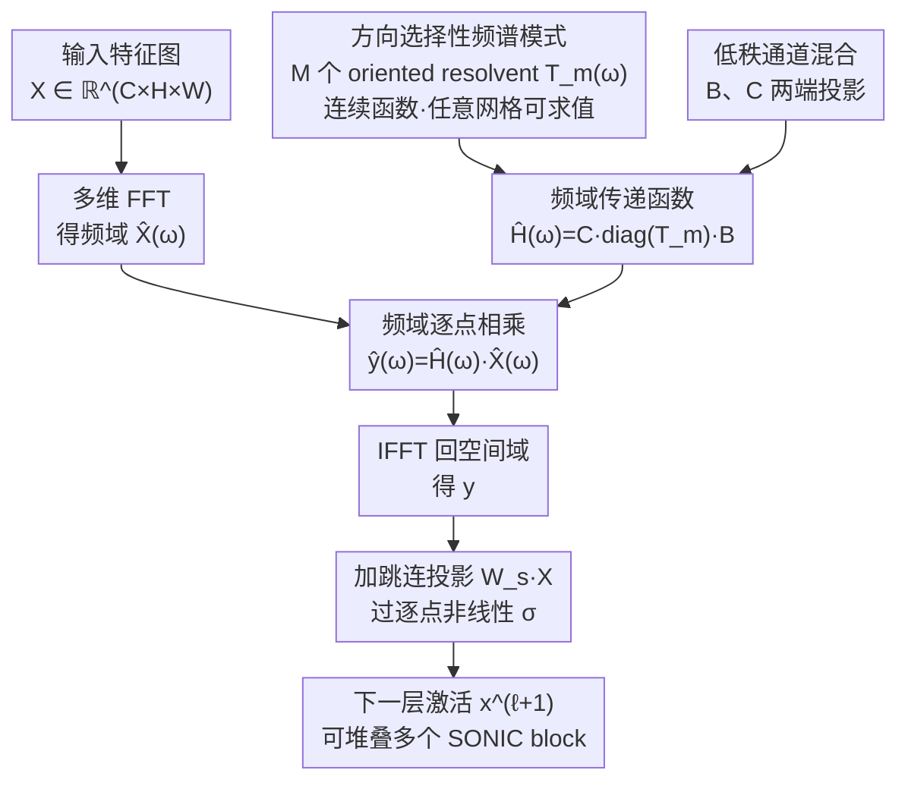

# SONIC: Spectral Oriented Neural Invariant Convolutions

**会议**: ICLR 2026  
**arXiv**: [2601.19884](https://arxiv.org/abs/2601.19884)  
**代码**: 无  
**领域**: 其他 / 计算机视觉  
**关键词**: 频谱卷积, 方向不变性, 连续参数化, 全局感受野, 分辨率自适应

## 一句话总结

SONIC 将状态空间模型的思想迁移到多维频域，用 6 个连续参数（幅度、方向、阻尼、振荡等）定义一组方向选择性的频谱传递函数，再通过低秩矩阵 $B$、$C$ 跨通道混合，实现天然具备全局感受野和分辨率不变性的卷积替代算子，在 3D 医学分割上匹配 nnU-Net 且参数少近两个数量级，在 ImageNet 上也具有竞争力。

## 研究背景与动机

**领域现状**：图像特征提取的两大主流范式是 CNN 和 ViT。CNN 用固定尺寸卷积核扫描局部 patch，需要极深的网络才能间接获取全局上下文；ViT 通过自注意力机制提供全局连接，但缺乏结构化空间归纳偏置，依赖显式位置编码，且计算复杂度随分辨率二次增长。此外，以 GFNet 和 FNO 为代表的频谱方法尝试在傅里叶域直接操作，但仍存在明显不足。

**现有痛点**：GFNet 的频域滤波器参数与离散 FFT 网格绑定——滤波器大小等于输入空间分辨率，换分辨率就需要重新训练或插值；FNO 虽然能处理连续函数，但缺乏方向感知能力，所有频率方向被同等对待，难以高效捕获自然图像中的边缘和纹理。已有频谱方法的参数量也通常与频域维度直接相关，在高分辨率 3D 医学影像场景下尤其不可接受。

**核心矛盾**：全局感受野与分辨率无关性之间存在天然张力——传统空间卷积局部但分辨率友好，频域全局但受限于离散网格。此外，方向选择性在视觉任务中至关重要（类似 V1 皮层的方向选择性神经元），但现有频谱方法普遍忽视了这一点。

**本文目标** （1）如何在频域设计真正连续的、不依赖离散网格的卷积参数化？（2）如何在频域引入方向感知先验，同时保持极低的参数量？（3）如何让单一架构在 2D / 3D、不同分辨率之间无缝切换？

**切入角度**：作者观察到状态空间模型（如 S4、Mamba）的核心——通过少量连续参数生成全局卷积核——可以从 1D 序列推广到多维频域。每个 "模式" 用带方向的解析函数（resolvent）在频率空间中定义一个方向选择性的传递函数，少量模式通过低秩矩阵组合就能覆盖丰富的频域响应。

**核心 idea**：用 SSM 式的连续解析函数在频域中参数化方向选择性的全局卷积核，以低秩分解实现极端参数高效的全局感受野。

## 方法详解

### 整体框架

SONIC 想解决的问题是：怎样用一个"单层就具备全局感受野、且与输入分辨率无关"的算子替掉传统空间卷积。它的整体思路是把卷积搬到频域去做——一个特征图 $X \in \mathbb{R}^{C \times H \times W}$（或 3D 体积）先经多维 FFT 变到频域 $\hat{X}(\omega)$，在频域里和一个传递函数 $\hat{H}(\omega)$ 逐点相乘（频域逐点乘等价于空间域的全局卷积），再经 IFFT 变回空间域。整个算子的灵魂在 $\hat{H}(\omega)$ 怎么参数化：它不是一张和 FFT 网格等大、随分辨率改变维度的可学习张量，而是由一小组带方向的解析函数（借鉴状态空间模型的 resolvent 形式）在任意频率坐标上现求现得的连续函数，再通过一对低秩矩阵 $B$、$C$ 跨通道混合。频域乘法本身是线性的，所以每个 SONIC block 在 IFFT 之后还要加上一个可学习跳连投影 $W_s X$ 并过一次逐点非线性 $\sigma$，这样多个 block 才能像普通卷积层一样堆叠出深度。

### 关键设计

**1. 方向选择性频谱模式：让频域滤波器"认得出"边缘的朝向**

现有频谱方法的通病是各向同性——FNO 这类算子的响应只看频率大小 $\|\omega\|$，所有方向被一视同仁；而自然图像的能量在频域里本就沿方向分布不均，一条边缘对应的是某个特定朝向上的高频。SONIC 的做法是把频域算子写成 $M$ 个带方向的"模式"的叠加，每个模式 $m$ 是一个 resolvent 形式的连续传递函数

$$T_m(\omega) = \frac{1}{i\,s_m(\omega \cdot v_m) - a_m + \gamma_m \,\lVert (I - v_m v_m^\top)\,\omega \rVert_2^2}$$

它只由少量连续参数刻画：方向单位向量 $v_m$（频域里的"指南针"）、尺度 $s_m>0$（控制频率选择性）、复数 $a_m$（实部 $\mathrm{Re}(a_m)$ 做阻尼、虚部 $\mathrm{Im}(a_m)$ 控制振荡）以及横向惩罚 $\gamma_m \ge 0$。分母里 $\omega \cdot v_m$ 把频率投影到该模式的方向上，$(I - v_m v_m^\top)\omega$ 则是与方向垂直的分量——于是只有沿 $v_m$ 对齐的频率成分被放大，偏离方向的成分被 $\gamma_m$ 项快速压掉，天然得到各向异性的方向选择滤波（正对应 V1 皮层方向选择性神经元的直觉）。这套参数化是替换 LTI 系统 Laplace 变量 $s \to i\,s_m(\omega \cdot v_m)$ 推广到多维频域得到的，把它的方向放在坐标轴上就退化成已有的多维 SSM（如 S4ND）；SONIC 的进步是方向可以是任意角度，不再被坐标轴绑死。

**2. 低秩通道混合矩阵 $B$、$C$：让极少的模式覆盖很多通道**

只有 $M$ 个共享模式还不够，得把它们铺到 $C$ 个输入通道、$K$ 个输出通道上去。SONIC 不为每对通道单学一条响应，而是用一对矩阵在两头做投影：输入端 $B \in \mathbb{C}^{M \times C}$ 把通道压进 $M$ 维模式空间，输出端 $C \in \mathbb{C}^{K \times M}$ 再映射回去，整体每个 $(c \to k)$ 通道的频域响应写成

$$\hat{H}_{k,c}(\omega) = \sum_{m=1}^{M} C_{km}\, T_m(\omega)\, B_{mc}$$

由于通常 $M \ll C, K$，这本质是一次低秩分解，参数量量级是 $O(M(C+K))$ 外加每个模式那几个连续参数，相比传统卷积 $O(C_{in} \cdot C_{out} \cdot k^d)$ 少一两个数量级。能这么省的前提是一个观察：同一种频谱响应（比如"检测水平边缘"）在很多通道里被反复复用，低秩结构正好把这种跨通道共享抽出来，不必给每个通道单存一套滤波器。

**3. 连续分辨率不变性：同一组参数直接换分辨率用**

医学影像里同一扫描协议在不同机器上分辨率常常差很多（MRI 层厚从 1mm 到 5mm 都有），换分辨率就得重训或插值，部署很痛。SONIC 把分辨率从参数里彻底解耦：因为每个模式 $T_m(\omega)$ 是频率坐标的连续解析函数，换分辨率只是让 FFT 网格点变密或变疏，模型只需把同一组 $T_m$ 在新网格的频率坐标上重新求值一遍，参数一个都不用改。这和 GFNet/FNO 形成鲜明对比：GFNet 学一张和网格等大的复数掩码、FNO 学固定数量的低频系数，两者的参数都和具体频率索引绑定，分辨率一变算子本身就变了，必须插值或重训。换句话说，正是设计 1 的连续参数化让"一次训练、跨 2D/3D 与各种分辨率无缝迁移"成为可能。

### 损失函数 / 训练策略

- 分类任务使用标准交叉熵损失；3D 医学分割使用 Dice + CE 联合损失
- SONIC block 可以直接替换 ResNet / U-Net 中的卷积层，训练策略与原架构兼容，无需特殊初始化或学习率调度
- 医学分割实验中遵循 nnU-Net 的标准训练协议以保证公平比较
- ImageNet 实验中由于计算资源限制，作者仅训练了 200k 步（而非完整的 300 epoch），但已能展示方法的竞争力

## 实验关键数据

### 主实验——3D 医学影像分割

SONIC 以 SonicNet 架构（用 SONIC block 替换 nnU-Net 中的空间卷积）在多个 3D 医学分割基准上与标准方法对比：

| 方法 | 数据集 | Dice Score | 参数量 | 说明 |
|------|--------|-----------|--------|------|
| nnU-Net (3×3×3 conv) | PROMIS / Prostate158 | 基准线 | ~31M | 医学分割事实标准 |
| SonicNet | PROMIS / Prostate158 | 匹配或略超 nnU-Net | **~0.4M** | 参数少近 **80 倍** |
| ViT baseline | PROMIS / Prostate158 | 低于 nnU-Net | ~25M | 缺乏空间先验 |
| SonicNet | 新增基准 1 (高变异性) | 与 SOTA 竞争 | ~0.4M | nnU-Net Revisited 推荐数据集 |
| SonicNet | 新增基准 2 (高变异性) | 与 SOTA 竞争 | ~0.4M | 多中心高变异场景 |

### 合成基准与 ImageNet

| 实验 | 方法 | 关键结果 | 说明 |
|------|------|---------|------|
| SynthShape（几何鲁棒性） | CNN / ViT / SONIC | SONIC 在旋转、噪声扰动下性能衰减最小 | 确定性可复现数据集 |
| HalliGalli（全局感受野验证） | CNN / ViT / GFNet / SONIC | **仅 SONIC 能正确完成任务**，且在加噪声后仍鲁棒 | 需同时感知四角远距形状 |
| ImageNet (200k steps) | ResNet / ViT / GFNet / FNO / SONIC | SONIC 竞争力强，参数量少 1 个数量级 | 有限训练预算下对比 |
| ImageNet 分辨率降采样 | 各方法从 224→低分辨率 | SONIC 性能衰减最小，验证分辨率不变性 | 同一模型直接切分辨率 |

### 消融实验

| 配置 | 关键变化 | 说明 |
|------|---------|------|
| Full SonicNet | 基准 | 完整模型 |
| 去掉方向选择性（各向同性模式） | 性能明显下降 | 方向感知是核心贡献 |
| 用离散可学习频谱替代连续参数化 (≈GFNet) | 分辨率泛化能力丧失 | 连续参数化是分辨率不变性的根基 |
| 不同模式数 $K$ | $K$ 过小丢表达力，$K$ 过大边际收益递减 | 存在最优 $K$ 的平衡点 |
| 不同模型规模（参数量缩放） | SONIC 在极小参数量下就保持强性能 | 参数效率始终优于空间卷积 |

### 关键发现

- **方向选择性至关重要**：去掉方向参数后性能显著下降，说明各向异性的频域先验比各向同性的全局滤波更有效
- **HalliGalli 实验最有说服力**：CNN 的局部感受野根本无法完成需要全局感知的任务，ViT 和 GFNet 理论上有全局感受野但在加噪后性能崩塌，唯独 SONIC 保持鲁棒——说明其全局感受野是"有效的"而非"理论上的"
- **参数效率惊人**：在 3D 医学场景中以约 0.4M 参数匹配 31M 参数的 nnU-Net，这意味着传统 3D 卷积核中存在极大冗余
- **分辨率不变性可验证**：ImageNet 降采样实验中 SONIC 的性能衰减曲线明显平坦于所有对比方法

## 亮点与洞察

- **SSM 到多维频域的桥梁**：SONIC 本质上是把 S4/Mamba 中"用少量连续参数生成全局卷积核"的思想从 1D 序列推广到了多维信号的频域。这个跨领域迁移非常自然——SSM 的核心公式本身就是 Laplace 变换/resolvent 形式，直接对应频域传递函数。这为后续将序列建模的进展引入视觉任务开辟了新通道
- **用 HalliGalli 证明"有效全局感受野"**：很多方法声称有全局感受野，但实际上深层叠加后有效感受野远小于理论值。作者设计的 HalliGalli 任务是一个巧妙的 litmus test——只有真正能有效利用远距离信息的模型才能通过。这个实验设计思路可以复用到其他声称有全局能力的架构评估中
- **连续参数化的部署优势**：一个模型训练后可以直接部署到不同分辨率的输入上，这在医学影像中极为实用——不同设备、不同扫描协议产生的数据分辨率差异大，通常需要重新训练或微调

## 局限与展望

- **SONIC block 纯线性**：频域乘法本质是线性操作，相邻两个 SONIC block 之间必须经过 IFFT → 非线性激活 → FFT，双重 FFT/IFFT 的开销在浅层网络中可以接受，但在极深架构中可能成为瓶颈。频域非线性至今仍是开放问题
- **ImageNet 实验不够充分**：由于计算资源限制，作者仅训练了 200k steps（远低于标准的 300 epoch），因此 ImageNet 上的结果只能说明"竞争力"而非"优势"。需要完整训练预算下的对比才能定论
- **未探索混合架构**：论文刻意保持 SONIC 的"纯粹性"，未将其与空间卷积混合使用。而实践中，低层用空间卷积捕获局部纹理 + 高层用 SONIC 捕获全局结构，可能是更优的设计
- **缺乏检测/密集预测验证**：仅在分类和分割上验证，未涉及目标检测、实例分割等需要精确定位的任务
- **模式数 $K$ 的选择**：目前依赖手动调参，未提供自动确定最优 $K$ 的方法

## 相关工作与启发

- **vs GFNet**：GFNet 同样在频域操作，但用的是与 FFT 网格等大的可学习张量，分辨率一变就需要插值或微调。SONIC 用连续参数化彻底解决了这个问题，且参数量从 $O(HW)$ 降到 $O(K)$
- **vs FNO (Fourier Neural Operator)**：FNO 保留固定数量的低频分量来近似频域滤波，但完全不具有方向选择性。SONIC 的 resolvent 模式提供了各向异性的频率响应，在需要方向感知的视觉任务中明显更有效
- **vs nnU-Net**：nnU-Net 是 3D 医学分割的事实标准，但依赖 3×3×3 空间卷积堆叠。SONIC 以约 1/80 的参数量匹配其性能，暗示 3D 空间卷积中存在大量可压缩的冗余
- **vs S4ND / Mamba**：SONIC 的理论基础直接源自 SSM 家族，但进一步引入了方向分解和低秩分解，使同一框架适用于 2D/3D 视觉而非仅限于 1D 序列
- **启发**：SONIC 的方向选择性 resolvent 思路可以推广到视频（时频联合方向）、点云（球谐函数方向分解）和天气预测（球面频域滤波）等领域

## 评分

- 新颖性: ⭐⭐⭐⭐ SSM→多维频域方向选择性的迁移有创意，但本质仍是频域乘法的一种参数化变体
- 实验充分度: ⭐⭐⭐ 医学分割验证扎实，但 ImageNet 训练不完整、缺少检测任务、消融不够系统
- 写作质量: ⭐⭐⭐ 核心 idea 清晰，但初始版本被多个 reviewer 批评可读性差，经过大幅改写后有所改善
- 价值: ⭐⭐⭐⭐ 对医学影像多分辨率部署有直接实用价值，参数效率优势在资源受限的 3D 场景中非常有吸引力

<!-- RELATED:START -->

## 相关论文

- [\[ICML 2026\] Continual Learning of Domain-Invariant Representations](../../ICML2026/others/continual_learning_of_domain-invariant_representations.md)
- [\[ICML 2026\] Learning Permutation-Invariant Macroscopic Dynamics](../../ICML2026/others/learning_permutation-invariant_macroscopic_dynamics.md)
- [\[CVPR 2026\] Spectral Mixture-of-Experts for Continual Learning](../../CVPR2026/others/spectral_mixture-of-experts_for_continual_learning.md)
- [\[CVPR 2025\] Sufficient Invariant Learning for Distribution Shift](../../CVPR2025/others/sufficient_invariant_learning_for_distribution_shift.md)
- [\[CVPR 2026\] Confusion-Aware Spectral Regularizer for Long-Tailed Recognition](../../CVPR2026/others/confusion-aware_spectral_regularizer_for_long-tailed_recognition.md)

<!-- RELATED:END -->
