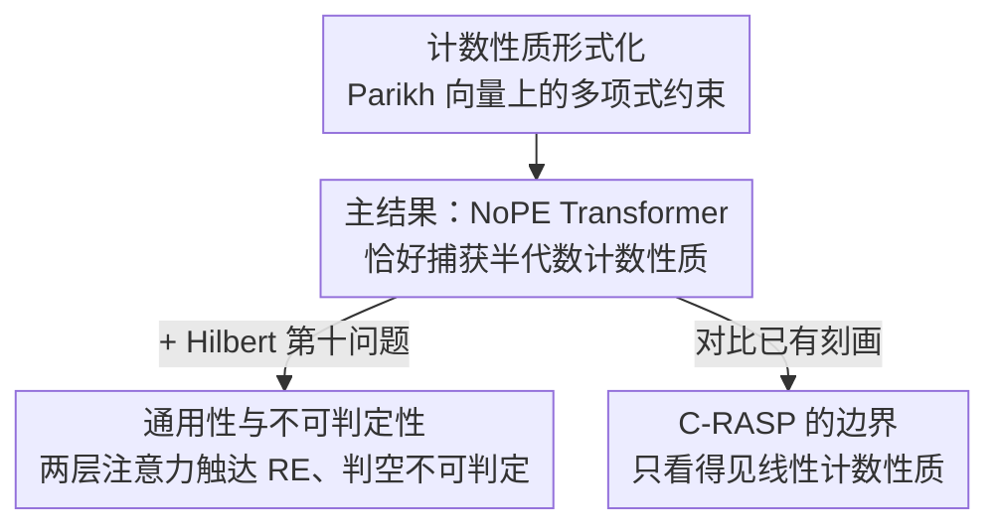

# The Counting Power of Transformers

**会议**: ICLR 2026  
**arXiv**: [2505.11199](https://arxiv.org/abs/2505.11199)  
**代码**: 无  
**领域**: Transformer 理论 / 形式语言  
**关键词**: Transformer 表达力, 计数性质, 半代数性质, 不可判定性, 形式语言

## 一句话总结

证明 Transformer 不仅能捕获（半）线性计数性质，还能表达所有**半代数计数性质**（即多元多项式不等式的布尔组合），从而推广了先前关于 Transformer 计数能力的所有结果，并由此推导出新的不可判定性结论。

## 研究背景与动机

- **计数性质在 Transformer 研究中的核心地位**：判断某些 token 出现次数是否多于其他 token（如 MAJORITY: $|w|_a > |w|_b$）是研究 Transformer 表达力的标准测试
- **先前结果仅覆盖线性性质**：已有工作（C-RASP、逻辑语言等）仅能处理线性表达式如 $|w|_a + |w|_b > 2 \cdot |w|_c$
- **实际需要非线性计数**：在信息检索中，共现特征如 $\#(\text{nvidia}) \cdot \#(\text{intel}) \cdot \#(\text{deal})$ 需要多项式表达
- **核心研究问题**：Transformer 能表达哪些计数性质？能否超越线性？

## 方法详解

### 整体框架

本文是一篇纯理论工作，主线是把"Transformer 能表达哪些计数性质"这一问题的答案从线性推到任意多项式。论文先把计数性质**形式化**为 Parikh 向量上的多项式约束，再证一条**主结果**：无位置编码的 Transformer 不仅能表达、而且恰好等于全部半代数计数性质。有了这把"表达力标尺"后，再向两侧延伸——一侧借 Hilbert 第十问题把表达力推到**通用性与不可判定性**，另一侧回头划出近期流行的 **C-RASP** 只到线性的边界。下图按这条逻辑依赖把四块结果串起来：

### 关键设计

**1. 计数性质的形式化：把"数 token"翻译成 Parikh 向量上的多项式约束**

研究 Transformer 的计数能力，首先要给"计数性质"一个不依赖具体网络的数学定义。对字母表 $\Sigma = \{a_1, \ldots, a_m\}$，Parikh 映射 $\Psi(w) = (|w|_{a_1}, \ldots, |w|_{a_m}) \in \mathbb{N}^m$ 把任意字符串 $w$ 压缩成"每个字母出现多少次"的向量，丢掉顺序只留计数。在这个向量空间上，**半线性计数性质**由线性不等式的布尔组合定义，典型例子是 MAJORITY 的 $|w|_a > |w|_b$；本文关心的**半代数计数性质**则放开到任意多元多项式不等式的布尔组合，例如 $7|w|_a \cdot |w|_b \cdot |w|_c + 2|w|_d - 8|w|_e > 10$。这一形式化是后续所有结果的共同基底：先前工作只覆盖前者，本文要证 Transformer 能覆盖后者。

**2. 主结果：无位置编码的 Transformer 恰好捕获半代数计数性质**

这是全文的核心，由两个定理把边界两头夹死。定理 1.1 给下界——带 Softmax 的 Transformer 能表达任意次数多项式不等式的布尔组合，即全部半代数计数性质，且既不需要位置编码也不需要掩码。构造的关键在注意力的均值机制：NoPE（无位置编码）下的 uniform attention 层对全序列做均匀加权，算出的正是各字母计数的平均值 $|w|_{a_i}/|w|$，也就是计数的归一化比例；把这一比例喂给前馈网络，就能利用其非线性逼近任意多项式函数（由 Weierstrass 定理保证），从而判别多项式不等式是否成立，多层堆叠再把这些判别用布尔运算组合起来。换句话说，"无位置信息的平均"恰好把绝对计数转成了相对比例，而前馈网络补上了线性方法缺的非线性那一步。定理 1.2 再补上界：无位置编码的平均硬注意力 Transformer NoPE-AHAT，及只用 uniform 层的变体 NoPE-AHAT[U]，所能表达的计数性质**恰好等于**半代数计数性质，即 $\text{NoPE-AHAT} = \text{NoPE-AHAT[U]} = \text{半代数计数性质}$。两条合起来是一个完整刻画而非单向包含——它给出了一个表达力被精确钉死的自然 Transformer 子类，尤其考虑到 AHAT 是否被 Softmax Transformer 完全捕获至今仍是开放问题，能对其计数片段给出闭式刻画相当难得。

**3. 通用性与不可判定性：两层注意力就够触达递归可枚举**

把表达力推到极限后，论文借数论结果完成"质变"。定理 1.3 指出，每个递归可枚举（recursively enumerable, r.e.）计数性质都是某个 NoPE-AHAT[U]（因而也是 SMAT）所识别语言的投影，而且**只需两个注意力层**。其杠杆是 Matiyasevich 对 Hilbert 第十问题的解：每个 r.e. 集都能写成整数多项式零点集的投影，再套上定理 1.1 的多项式表达力即可。通用性一旦成立，不可判定性便顺势而来——定理 1.4 证明，给定一个仅含两个注意力层的 NoPE-AHAT[U] 或 SMAT，判定其语言是否为空是不可判定的。相比先前需要精巧位置编码和复杂架构才能逼出不可判定性，这里用最朴素的两层无位置编码网络就达到了同样的强度，反差正是结论的冲击力所在。

**4. C-RASP 的边界：它只看得见线性那一层**

最后论文回头审视近期流行的 C-RASP 刻画，证明它只能捕获**线性**计数性质。这一点有实证支撑：非线性性质如 $L_k: |w|_a^k \geq |w|_b$ 在 $k \geq 2$ 时同样能被 Transformer 训练学会，但它们落在 C-RASP 表达范围之外。因此 C-RASP 至多是"高效可学习性质"的一个不完全刻画——它框住了线性可数的部分，却漏掉了本文证明同样可学的非线性计数。

## 实验验证

### 非线性计数性质的可训练性

| 语言 $L_k$ | 定义 | 准确率 | 长度泛化 |
|-----------|------|--------|----------|
| $L_1$ (线性) | $\|w\|_a \geq \|w\|_b$ | 100% | ✓ |
| $L_2$ (二次) | $\|w\|_a^2 \geq \|w\|_b$ | ~100% | ✓ |
| $L_3$ (三次) | $\|w\|_a^3 \geq \|w\|_b$ | ~100% | ✓ |

### 与 PARITY 的对比

| 性质 | 可训练性 | 长度泛化 |
|------|----------|----------|
| MAJORITY | ✓ 高效 | ✓ 可泛化 |
| 半代数（$L_k$, $k \geq 2$） | ✓ 高效 | ✓ 可泛化 |
| PARITY | ✗ 困难 | ✗ 不泛化 |

- 半代数性质（包括非线性）的可训练性与线性 MAJORITY 类似
- 与 PARITY 形成鲜明对比，进一步支持 PARITY 的困难性不在于非线性

## 亮点与洞察

1. **突破线性限制**：将 Transformer 计数能力从线性扩展到任意多项式次数
2. **NoPE 的惊人表达力**：无位置编码、无掩码就能实现半代数计数
3. **完整刻画**：NoPE-AHAT 精确对应半代数计数性质
4. **深刻的数学联系**：通过 Hilbert 第十问题将代数几何与 Transformer 理论连接
5. **C-RASP 的局限性**：严格证明 C-RASP 仅"看到"线性部分

## 局限性

- 理论构造可能需要大量参数/层数，与实际训练场景有差距
- 结果聚焦于计数性质，不涉及序列顺序相关的性质
- 实验规模较小，仅验证了可训练性
- 构造性证明可能产生不自然的网络权重

## 相关工作

- **Transformer 表达力**：Hahn 2020（通信复杂度下界）、Pérez et al. 2021（图灵完备性）
- **C-RASP**：Huang et al. 2025（形式化 RASP-L 猜想）
- **形式语言与 NN**：RASP、limit transformers
- **Hilbert 第十问题**：Matiyasevich 1993

## 评分

- **创新性**: ⭐⭐⭐⭐⭐ — 开创性地将 Transformer 计数能力推广到半代数
- **技术深度**: ⭐⭐⭐⭐⭐ — 理论证明深厚，连接代数几何与计算理论
- **实验充分性**: ⭐⭐⭐ — 实验主要用于验证可训练性，规模有限
- **实用价值**: ⭐⭐⭐ — 主要为理论贡献，但对理解 Transformer 能力边界有深远意义

<!-- RELATED:START -->

## 相关论文

- [\[AAAI 2026\] The Limitations and Power of NP-Oracle-Based Functional Synthesis Techniques](../../AAAI2026/others/the_limitations_and_power_of_np-oracle-based_functional_synthesis_techniques.md)
- [\[AAAI 2026\] Model Counting for Dependency Quantified Boolean Formulas](../../AAAI2026/others/model_counting_for_dependency_quantified_boolean_formulas.md)
- [\[CVPR 2026\] Temporal Interaction in Spiking Transformers with Multi-Delay Mixer](../../CVPR2026/others/temporal_interaction_in_spiking_transformers_with_multi-delay_mixer.md)
- [\[AAAI 2026\] Tab-PET: Graph-Based Positional Encodings for Tabular Transformers](../../AAAI2026/others/tab-pet_graph-based_positional_encodings_for_tabular_transformers.md)
- [\[AAAI 2026\] GDBA Revisited: Unleashing the Power of Guided Local Search for Distributed Constraint Optimization](../../AAAI2026/others/gdba_revisited_unleashing_the_power_of_guided_local_search_for_distributed_const.md)

<!-- RELATED:END -->
