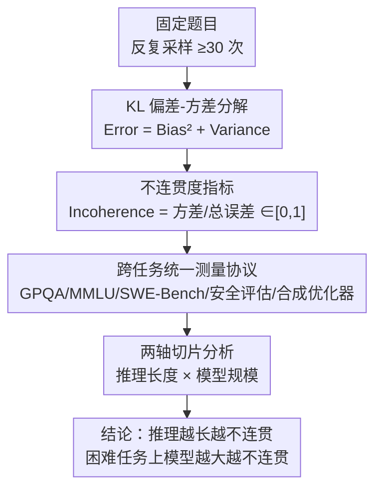

# The Hot Mess of AI: How Does Misalignment Scale With Model Intelligence and Task Complexity?

**会议**: ICLR 2026  
**arXiv**: [2601.23045](https://arxiv.org/abs/2601.23045)  
**代码**: 有  
**领域**: 其他 / AI安全  
**关键词**: 偏差-方差分解, AI不连贯性, 推理长度, 模型规模, AI对齐

## 一句话总结
将AI模型错误分解为偏差（systematic misalignment）和方差（incoherent behavior），发现：推理越长→越不连贯；更大模型在困难任务上更不连贯。这暗示未来超级AI更可能表现为"工业事故"式的不可预测失败，而非一致追求错误目标。

## 研究背景与动机
AI对齐的核心担忧是模型可能一致性地追求错误目标（misalignment）。但实践中AI失败经常是随机和不连贯的——像一个"hot mess"而非精明的对手。关键问题：随着AI能力和任务复杂度提升，失败将更像系统性追求错误目标（偏差主导），还是不可预测的混乱行为（方差主导）？

"Hot mess theory of intelligence"（Sohl-Dickstein, 2023）认为：随着实体变得更智能，其行为倾向于变得更不连贯，更难被单一目标描述。如果这对AI成立，将从根本上改变misalignment风险的可能性和关注重点。本文通过 Error = Bias² + Variance 分解量化这个问题，在多个任务和模型上系统验证。

## 方法详解

### 整体框架
本文不提出新模型，而是给"AI 会怎么失败"配一把量尺。做法是对每道固定的题目反复采样几十次，把模型这一堆答案的总交叉熵误差拆成两块：一块是"系统性偏离目标"（偏差，Bias），对应一致追求错误目标的 misalignment；另一块是"自己跟自己不一致"（方差，Variance），对应像 hot mess 一样的混乱失败。在分解之上，再定义一个把方差占比归一化的"不连贯度"（Incoherence）指标，让错误率不同的模型也能横向比"失败的形态"。最后把同一把尺子套到五类失败场景上，并沿推理长度和模型规模两个轴切片，看到底是偏差还是方差在主导。

### 关键设计

**1. KL 偏差-方差分解：把交叉熵误差劈成两半**

难点在于"系统性犯错"和"随机性犯错"在一个总错误率里混在一起，无法分别度量。对输入 $x$，把同一模型在不同随机性 $\varepsilon$（采样种子、few-shot 上下文）下的输出 $f_\varepsilon$ 看成一族预测，记其平均预测为 $\bar{f}$、one-hot 目标为 $y$，则期望交叉熵恰好分解为

$$\underbrace{\mathbb{E}_\varepsilon[\text{CE}(y, f_\varepsilon)]}_{\text{Error}} = \underbrace{D_{KL}(y \| \bar{f})}_{\text{Bias}^2} + \underbrace{\mathbb{E}_\varepsilon[D_{KL}(\bar{f} \| f_\varepsilon)]}_{\text{Variance}}$$

第一项 KL-Bias² 衡量"平均答案"离真值有多远，第二项 KL-Variance 衡量各次答案彼此有多散。和经典 bias-variance 不同的是，这里的期望取在 test-time 随机性上（同一固定模型多次采样），而非传统的训练随机性（重训不同种子）——因为研究对象是一个已经训好的 frontier 模型，而不是一个学习算法。每道题至少采样 30 次来估计这族分布，作者验证该次数已足以稳定估计。

**2. 不连贯度（Incoherence）指标：让不同能力的模型可比**

直接看方差大小会被总错误率拖累——强模型错得少，方差自然也小，无法判断它是"更连贯"还是"只是更对"。于是把一组题 $Q$ 上的方差占总误差的比例归一化：

$$\text{Incoherence}(Q, f_\varepsilon) = \frac{\sum_i \text{Variance}(q_i, f_\varepsilon)}{\sum_i \text{Error}(q_i, f_\varepsilon)} \in [0, 1]$$

取 0 表示纯偏差（对或错都一致，像个执着的优化器），取 1 表示纯方差（完全随机的 hot mess）。这个比值剥离了绝对错误率，即便总错误率随能力下降，仍能横向比较"失败的形态"是偏向系统性还是混乱——这正是后文跨规模比较能成立的关键。

**3. 跨任务的统一测量协议：把同一把尺子套到不同失败场景上**

为了说明结论不是某个任务的偶然，作者在五类设置上各自落实 bias/variance 估计。多选题用 GPQA（科学推理）和 MMLU（通用知识），每题用不同 seed 和 few-shot 上下文采样 ≥30 次；agent 编码用 SWE-Bench，以单元测试通过与否作为二值指标做分解；安全评估用 Model Written Evals，多选直接分解、开放式则改用 embedding 方差来近似"答案的不一致性"；合成设置训练 transformer 自回归模拟优化器在 condition number=50 的病态二次函数上下降（用 decoding-based regression 加 teacher forcing 训练），作为一个能完全控制混杂因素的对照；最后再做人类主观调查，让不相交的被试分别给 AI、人类、组织的 intelligence 和 coherence 排名。同一把分解尺子能套到这么多形态各异的任务上，正是结论可信的底气。

**4. 两条解释变量上的切片分析：把不连贯度对推理长度和模型规模展开**

单看一个全局数字看不出趋势，作者沿两个轴切片。推理长度轴上，按平均推理 token 数把样本分组观察 incoherence 随长度的变化，并做自然变异控制——在同一道题内部按推理长度中位数切成"短推理""长推理"两组，从而在难度完全相同的条件下隔离长度本身的影响。模型规模轴上用 Qwen3 系列（0.6B–32B），先按题目难度分组，再看 incoherence 随规模的走向；之所以要先按难度分组，是因为后文发现规模的效应方向恰恰取决于任务难度。

## 实验关键数据

### 发现1：推理越长→越不连贯

| 设置 | 趋势 | 说明 |
|------|------|------|
| GPQA (Sonnet 4/o3-mini/o4-mini) | 长推理→更不连贯 | 所有模型一致趋势 |
| SWE-Bench (o3-mini/o4-mini) | 更多actions→更不连贯 | agent任务也一致 |
| MWE安全问题 | embedding方差↑ with长度 | 开放式也成立 |
| 合成优化器 | 更多步→更高方差 | 可控验证 |

控制任务难度后效果仍然存在：对每个问题按推理长度中位数分组，自然更长推理的那组incoherence显著更高，但准确率差异很小。自然推理变异的影响远强于reasoning budget的影响。

### 发现2：模型规模的影响取决于任务难度

| 题目难度 | Qwen3 0.6B→32B incoherence变化 | 说明 |
|---------|-------------------------------|------|
| 简单 | ↓（更连贯） | 能力提升减少了随机错误 |
| 中等 | ≈（持平） | 过渡区 |
| **困难** | **↑（更不连贯）** | bias下降快于variance |

关键机制：bias和variance都随模型增大而下降，但bias下降的slope在各难度组间相似，而variance的slope在困难题目上更低（下降更慢）。在最难题目上variance slope低于bias slope，使得variance成为限制因素。

### 发现3：合成优化器验证
训练不同大小的transformer模拟优化器下降二次函数：
- 训练损失遵循清晰的power law
- 自回归rollout中，bias随模型增大的下降速度远快于variance
- 即：模型学会了正确目标（bias↓快），但维持长期连贯行为（variance↓慢）更难

### 发现4：Ensembling和Reasoning Budget
- **Ensembling**：E个样本集成使variance以1/E速率下降，有效降低incoherence
- **更大reasoning budget**：轻微降低incoherence，但效果远弱于自然推理长度的效应
- 推测：reasoning budget的改善可能来自更好的backtracking和error correction

## 讨论与洞察

### 为什么更capable的模型更不连贯？
1. **LLM是动力系统而非优化器**：在所有动力系统中，恰好是某个固定loss的优化器的集合是measure zero的。随着能力和状态空间扩大，约束其为优化器更难。
2. **方差在轨迹中累积**：除非有主动纠错机制（如ensembling），否则动作序列越长方差越大。真实世界中动作通常不可逆，无法像实验中那样reset和纠错。

### Bias的进一步分解
Bias = Bias_mesa + Bias_spec，其中前者是模型行为偏离训练目标，后者是训练目标偏离真实目标（reward misspecification）。本文任务中Bias_spec可忽略，但在实际部署中，Bias_spec可能随能力提升而主导错误。这强调了训练目标精确指定的重要性。

### 对AI安全的影响
- 如果incoherence随能力和任务复杂度增加而增长，未来advanced AI的失败更像"工业事故"而非"恶意对手"
- 这将AI安全的重点从防御coherent scheming转向防止unpredictable accidents
- 增加了reward hacking / goal misspecification研究的相对重要性
- 但并不意味着misalignment不重要——bias_spec可能仍然主导

## 亮点与洞察
- 提出了AI安全讨论的定量化新框架（bias-variance decomposition），将模糊的"AI会如何失败"转化为可测量的问题
- "Hot mess theory"视角新颖且有实验支撑——更聪明≠更连贯
- 合成优化器实验优雅地控制了混杂因素，直接验证"学对目标比维持连贯性更容易"
- 人类主观调查与LLM实验结论一致，增加了跨域可信度
- 对AI governance有实质影响：是准备应对工业事故还是对抗性攻击？

## 局限与展望
- Bias只相对于target有定义——开放式任务（如创作、对话）中target不明确，分解的适用性受限
- 30次采样虽被验证足够，但高维输出空间中的估计可能仍有噪声
- 从当前frontier model外推到未来超级AI有风险——未来模型可能通过新的训练方法改变bias-variance结构
- 方差在部署中可通过ensembling/多次采样缓解，限制了"工业事故"结论的实际严重性
- 未深入分析incoherence的具体机制（why），主要是描述性结果

## 相关工作与启发
- 与reasoning scaling law文献（Gema et al. 2025: inverse scaling）形成互补——不仅性能下降，且错误变得更不一致
- 与evaluation variance文献连接（Biderman et al. 2024: 评估的高方差性）
- 自洽性（self-consistency, Wang et al. 2023）可以被重新理解为降低incoherence的手段
- 与platonic representation hypothesis（Huh et al. 2024: 表征趋同）形成有趣对比——表征可以趋同但行为仍不连贯

## 评分
- 新颖性: ⭐⭐⭐⭐⭐ 问题提出和方法论都非常新颖，开创了一个新分析维度
- 实验充分度: ⭐⭐⭐⭐ 多任务+合成验证+人类调查，覆盖面广
- 写作质量: ⭐⭐⭐⭐⭐ 引人入胜，metaphor恰当，可视化优秀
- 价值: ⭐⭐⭐⭐⭐ 对AI安全研究方向有深远指导意义

<!-- RELATED:START -->

## 相关论文

- [\[ICLR 2026\] Non-Clashing Teaching in Graphs: Algorithms, Complexity, and Bounds](non-clashing_teaching_in_graphs_algorithms_complexity_and_bounds.md)
- [\[ICML 2026\] Comprehensive AI Governance Requires Addressing Non-Model Gains](../../ICML2026/others/comprehensive_ai_governance_requires_addressing_non-model_gains.md)
- [\[ICML 2025\] Cross-regularization: Adaptive Model Complexity through Validation Gradients](../../ICML2025/others/cross-regularization_adaptive_model_complexity_through_validation_gradients.md)
- [\[ICML 2025\] Position: AI Evaluation Should Learn from How We Test Humans](../../ICML2025/others/position_ai_evaluation_should_learn_from_how_we_test_humans.md)
- [\[ICML 2026\] Beyond Model Readiness: Institutional Readiness for AI Deployment in Public Systems](../../ICML2026/others/beyond_model_readiness_institutional_readiness_for_ai_deployment_in_public_syste.md)

<!-- RELATED:END -->
