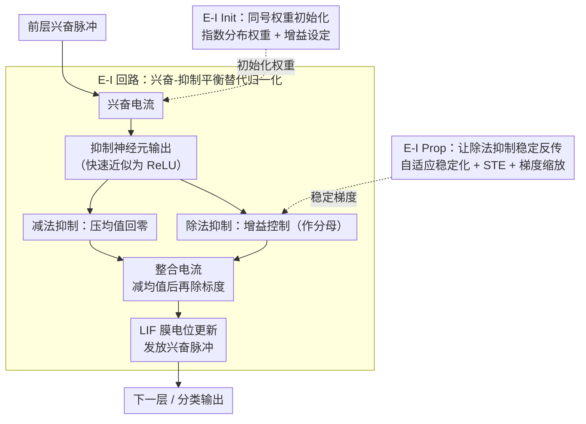

# Training Deep Normalization-Free Spiking Neural Networks with Lateral Inhibition

## 论文信息
- **会议**: ICLR 2026
- **arXiv**: [2509.23253](https://arxiv.org/abs/2509.23253)
- **代码**: [https://github.com/vwOvOwv/DeepEISNN](https://github.com/vwOvOwv/DeepEISNN)
- **领域**: 脉冲神经网络 / 神经形态计算 / 生物启发计算
- **关键词**: SNN, 侧向抑制, 兴奋-抑制回路, 无归一化训练, 生物合理性

## 一句话总结
提出基于皮层兴奋-抑制（E-I）回路的无归一化学习框架 DeepEISNN，通过 E-I Init 和 E-I Prop 两项技术实现深度 SNN 的稳定端到端训练，兼顾性能与生物合理性。

## 研究背景与动机

### 核心矛盾
SNN 训练面临**性能与生物合理性**的权衡：
- **高性能方法**（反向传播 + 批归一化）：将 SNN 当作普通深度学习构件，牺牲基本生物属性
- **高生物合理性方法**（STDP 等）：训练不稳定，仅适用于浅层网络

### 为什么需要去归一化？
BatchNorm 等归一化方案从整批输入收集统计量，**在生物系统中没有已知类比**。这使得使用归一化的 SNN 作为大规模皮层计算的计算平台变得不合理。

### E-I 回路的重要性
皮层中约 80% 为兴奋性神经元，20% 为抑制性神经元。E-I 交互在增益控制、神经振荡、选择性注意等方面起关键作用，但现有深度 SNN 通常忽略这一基本原理。

## 方法详解

### 整体框架

DeepEISNN 把每层网络重组成一个皮层式的兴奋-抑制（excitatory-inhibitory, E-I）回路：兴奋性神经元用标准 LIF 动力学传递信息，抑制性神经元则提供侧向抑制，用「减法」与「除法」两种方式去抵消和缩放兴奋电流，从而在不依赖任何批统计的情况下把激活幅度自动稳定下来。围绕这个回路再补两块工程：E-I Init 给出符合 E-I 约束的初始化、让初始激活落在合理范围，E-I Prop 处理除法抑制带来的数值与梯度问题、使深层网络能端到端训练。整体可看作「初始化 → 前向 E-I 回路稳幅 → 稳定反传」三件事环绕同一条主干。

### 关键设计

**1. E-I 回路：用兴奋-抑制平衡替代归一化**

归一化之所以在生物上不合理，是因为它要从整批输入收集统计量；本设计的思路是让稳幅这件事完全发生在单层内部、只用当前层自己的脉冲。每层包含 $n_E^{[l]}$ 个兴奋性与 $n_I^{[l]}$ 个抑制性神经元，比例固定为 4:1，呼应皮层中约 80% 兴奋、20% 抑制的统计。兴奋性神经元遵循 LIF 膜电位更新 $\mathbf{u}_E^{[l]}[t+1] = (1-\tfrac{1}{\tau_E})(\mathbf{u}_E^{[l]}[t] - \theta_E \mathbf{s}_E^{[l]}[t]) + \mathbf{I}_E^{[l]}[t]$；抑制性神经元由于时间常数 $\tau_I \ll \tau_E$ 近似瞬态稳态，其输出退化为 $\mathbf{s}_I^{[l]}[t] \approx \max(0, \mathbf{I}_I^{[l]}[t])$，相当于一个 ReLU。关键在于侧向抑制被拆成两条通路：减法抑制 $\mathbf{I}_{EI,\text{sub}}^{[l]}[t] = \boldsymbol{W}_{EI}^{[l]} \mathbf{s}_I^{[l]}[t]$ 负责把兴奋电流的均值压回零（E-I 平衡），除法抑制 $\mathbf{I}_{EI,\text{div}}^{[l]}[t] = \boldsymbol{W}_{EI}^{[l]}(\mathbf{g}_I^{[l]} \odot \mathbf{s}_I^{[l]}[t])$ 则作为分母实现增益控制。两者最终整合成输入电流：

$$\mathbf{I}_{\text{int}}^{[l]}[t] = \mathbf{g}_E^{[l]} \odot \frac{\mathbf{I}_{EE}^{[l]}[t] - \mathbf{I}_{EI,\text{sub}}^{[l]}[t]}{\mathbf{I}_{EI,\text{div}}^{[l]}[t]} + \mathbf{b}_E^{[l]}$$

这个「减均值、除标度」的结构在功能上正对应 BatchNorm 的中心化与缩放，但所有量都来自当前层自身的脉冲、不需要跨批统计，因而保留了生物可实现性。

**2. E-I Init：给同号权重约束量身定制的初始化**

E-I 约束要求兴奋权重恒正、抑制权重恒负，而标准 Xavier/Kaiming 假设权重零均值对称分布，在这里直接失效——若沿用，初始激活会立刻偏离合理范围、深层训练发散。论文按上面回路的两个功能分别设定初始化目标。一是让减法抑制在期望上抵消兴奋电流均值，即 $\mathbb{E}[\mathbf{I}_{EE,i}^{[l]}] \approx \mathbb{E}[\mathbf{I}_{EI,\text{sub},i}^{[l]}]$，做法是用指数分布初始化兴奋权重、把抑制权重设为 $1/n_I^{[l]}$。二是让除法抑制在期望上等于兴奋电流的标准差，即 $\mathbb{E}[\mathbf{I}_{EI,\text{div},i}^{[l]}] = \text{std}(\mathbf{I}_{EE,i}^{[l]})$，对应把增益 $\mathbf{g}_I^{[l]}$ 的每个元素设为 $\sqrt{\tfrac{2-p}{dp}}$，从而在初始时就复现归一化的标准化效果。式中平均发放概率 $p$ 不是写死的常数，而是用训练集第一批数据动态估计出来，让初始化贴合实际数据分布。

**3. E-I Prop：让除法抑制能稳定地反传梯度**

除法抑制把分母引入前向计算，分母接近零时会数值爆炸、梯度也会失真，是阻碍这套回路端到端训练的拦路虎。E-I Prop 用三招化解。其一是自适应稳定化：不再加一个固定的小常数 $\epsilon$，而是用同一样本内的最小正值动态替换为零的除数，避免常数 $\epsilon$ 在不同尺度下要么不够、要么过大。其二是直通估计器（straight-through estimator, STE）：前向照常执行这个替换操作，反向却把替换视为恒等映射，使梯度能绕过这个不可导的操作正常流回。其三是梯度缩放：把侧向权重 $\boldsymbol{W}_{EI}^{[l]}$ 的梯度乘以 $1/d$，平衡前向路径与侧向抑制路径的更新幅度，防止抑制路径梯度过大而压垮主干。消融显示这三招缺一不可——去掉自适应稳定化会数值爆炸，去掉 STE 会让梯度方向出错，去掉缩放则抑制路径梯度过大。

## 实验

### 分类任务性能

| 数据集 | 方法 | 架构 | E-I | BN-free | 准确率(%) |
|--------|------|------|-----|---------|----------|
| CIFAR-10 | Vanilla BN | ResNet-18 | ✗ | ✗ | 95.37 |
| CIFAR-10 | TEBN | ResNet-19 | ✗ | ✗ | 94.70 |
| CIFAR-10 | **DeepEISNN** | **ResNet-18** | **✓** | **✓** | **92.05** |
| CIFAR-10 | DANN (ANN) | VGG-16 | ✓ | ✓ | 88.54 |
| CIFAR-10 | BackEISNN | 5-layer CNN | ✓ | ✓ | 90.93 |
| DVS-Gesture | DeepEISNN | VGG-8 | ✓ | ✓ | **94.86** |
| CIFAR10-DVS | DeepEISNN | VGG-8 | ✓ | ✓ | **77.66** |

### 关键发现

1. DeepEISNN (ResNet-18) 在 CIFAR-10 上达 92.05%，**超越所有无归一化基线**
2. 在神经形态数据集上（DVS-Gesture, CIFAR10-DVS）**超越多个使用 BN 的方法**
3. 在 TinyImageNet 上达 50.29%，证明可扩展到更大数据集
4. E-I Init 和 E-I Prop 的每个组件都是必需的——缺少任何一个都导致训练崩溃

### 消融实验

- 无 E-I Init → 训练失败（发放率崩溃）
- 无自适应稳定化 → 数值爆炸
- 无 STE → 梯度方向错误
- 无梯度缩放 → 抑制路径梯度过大

## 亮点

1. **首次在深度 SNN 中实现无归一化训练**的同时保持竞争力性能
2. **生物合理性与工程性能的平衡**：E-I 回路不仅是正则化技巧，也是生物建模
3. **理论分析完善**：从指数分布推导到增益控制条件
4. **为大规模皮层计算模拟提供平台**

## 局限性

1. 与使用 BN 的 SNN 仍有 ~3% 精度差距
2. 固定 4:1 的 E-I 比例是否最优未探索
3. 快速脉冲近似将抑制性神经元简化为 ReLU，可能过度简化
4. 仅在分类任务上验证，未测试生成或序列建模任务

## 相关工作
- **SNN 归一化**: BNTT, tdBN, TEBN, TAB — BN 的 SNN 变体
- **E-I 网络**: Cornford et al. (2021) — ANN 中的 E-I 网络
- **SNN 训练**: STBP, TEBN — 代理梯度和归一化技术

## 评分
- **创新性**: ⭐⭐⭐⭐ — E-I 回路替代归一化的思路新颖且有生物依据
- **实验充分性**: ⭐⭐⭐⭐ — 多数据集多架构验证
- **写作质量**: ⭐⭐⭐⭐ — 从生物原理到工程实现的推导清晰
- **实用性**: ⭐⭐⭐ — 性能差距仍存在，但为 NeuroAI 提供重要基础

<!-- RELATED:START -->

## 相关论文

- [\[ICML 2026\] Bullet Trains: Parallelizing Training of Temporally Precise Spiking Neural Networks](../../ICML2026/others/bullet_trains_parallelizing_training_of_temporally_precise_spiking_neural_networ.md)
- [\[AAAI 2026\] TDSNNs: Competitive Topographic Deep Spiking Neural Networks for Visual Cortex Modeling](../../AAAI2026/others/tdsnns_competitive_topographic_deep_spiking_neural_networks_for_visual_cortex_mo.md)
- [\[CVPR 2026\] Robust Spiking Neural Networks by Temporal Mutual Information](../../CVPR2026/others/robust_spiking_neural_networks_by_temporal_mutual_information.md)
- [\[CVPR 2026\] On the Role of Temporal Granularity in the Robustness of Spiking Neural Networks](../../CVPR2026/others/on_the_role_of_temporal_granularity_in_the_robustness_of_spiking_neural_networks.md)
- [\[AAAI 2026\] ParaRevSNN: A Parallel Reversible Spiking Neural Network for Efficient Training and Inference](../../AAAI2026/others/pararevsnn_a_parallel_reversible_spiking_neural_network_for_efficient_training_a.md)

<!-- RELATED:END -->
