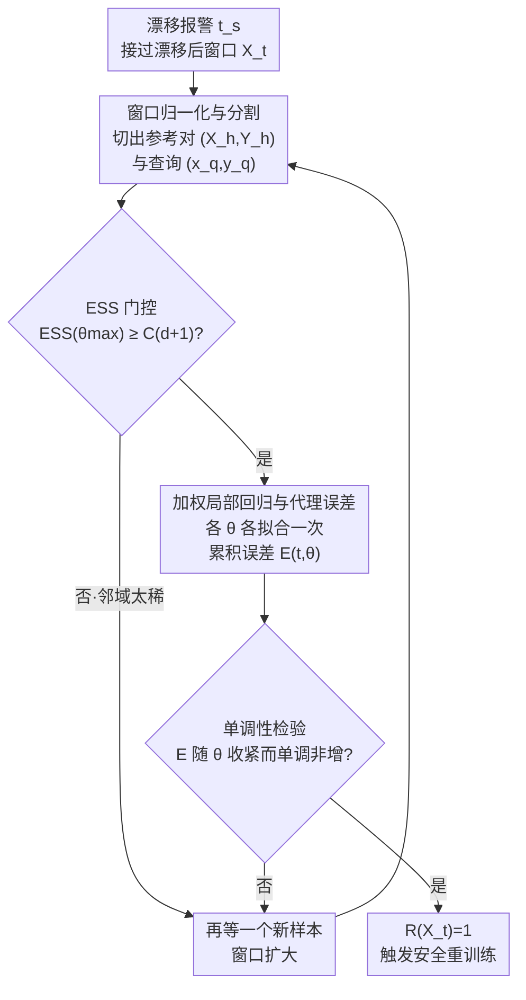

# When to Retrain after Drift: A Data-Only Test of Post-Drift Data Size Sufficiency

**会议**: ICLR 2026  
**arXiv**: [2603.09024](https://arxiv.org/abs/2603.09024)  
**代码**: 未提及  
**领域**: 其他 / 流数据学习  
**关键词**: 概念漂移, 重训练时机, 数据充分性, 流式学习, 加权局部回归, 状态依赖

## 一句话总结
CALIPER提出了一种检测器和模型无关的、仅依赖数据的检验方法，通过跟踪加权局部回归的代理误差随局部性参数$\theta$的单调性变化，来估计突发概念漂移后重训练所需的最小数据量，无需实际重训练下游模型。

## 研究背景与动机

**领域现状**：非平稳数据流中维持预测器性能需要快速适应概念漂移。ADWIN、KSWIN等窗口检测器能检测是否和何时发生漂移，但无法告知需要多少漂移后数据才足以安全重训练。

**现有痛点**：(1) 检测与重训练之间的gap——漂移检测器只告诉你"发生了变化"，不告诉你"收集够了数据"。(2) 过早重训练（数据不足）导致过拟合和震荡。(3) 过晚重训练（等太久）使旧模型在线太长时间，性能持续下降。(4) 反复尝试重训练深度网络来评估是否ready在流式场景中计算代价过高。

**核心矛盾**：如何在不接触模型内部状态、不进行实际重训练的条件下，从数据本身判断漂移后窗口是否足够大？

**本文目标**：设计一个模型无关的停止准则 $R(\mathbf{X}_t) \in \{0,1\}$，用纯数据侧信号决定最早的安全重训练时机。

**切入角度**：利用动力系统产生的数据流中的**状态依赖性**(state dependence)——附近状态表现出相似的一步转移——如果漂移后窗口展现出足够的局部一致性，则可以安全重训练。

**核心 idea**：通过单次遍历的加权局部回归追踪代理误差随局部性参数$\theta$增大时的单调非增趋势，结合有效样本量(ESS)门控，在不重训练模型的情况下确定数据充分性。

## 方法详解

### 整体框架
CALIPER 想解决的是一个被漂移检测器漏掉的环节：检测器只会喊"变了"，却不告诉你"攒够数据没有"。它的思路是把"数据是否充分"翻译成一个纯数据侧、可单次遍历计算的信号，全程不碰下游模型的内部状态、也不试探性地重训练。漂移报警后，它接过当前的漂移后窗口，先做归一化并切出"参考集 + 查询对"，再用有效样本量(ESS)把样本太稀的情况挡在门外，然后在一组由疏到密的局部性上各拟合一个轻量加权回归、记录代理误差，最后看这条误差曲线是否随局部性收紧而单调下降——若是，就输出 $R(\mathbf{X}_t)=1$，判定窗口已足够、可以安全重训练；否则再等一个新样本、窗口扩大后重来一遍。

### 关键设计

**1. 窗口归一化与分割：把漂移后窗口转成自监督的"状态→下一状态"预测任务**

数据来自动力系统 $\mathbf{x}(t+1) = f(\mathbf{x}(t)) + \xi_t$，相邻状态之间天然存在一步转移结构，CALIPER 正是借这个结构造出自监督标签，从而不依赖任何外部标注就能评估窗口质量。具体做法是把归一化后的漂移后窗口 $\mathbf{Z} \in \mathbb{R}^{n_t \times d}$ 拆成参考对 $(\mathbf{X}_h, \mathbf{Y}_h)$——即一连串连续的状态转移对——以及当前的查询 $(\mathbf{x}_q, \mathbf{y}_q)$。后续所有判断都建立在"用参考对预测查询的下一状态"这件事上。

**2. ESS 门控：先确认最紧的局部性下样本量还撑得住，再往下算**

加权回归在 $\theta$ 很大（邻域很窄）时只有少数近邻真正有权重，若有效样本太少，后面的误差曲线就会因噪声而失真、导致过早误触发。CALIPER 用核权重 $w_i(\theta) = \exp(-\theta r_i)$ 定义有效样本量 $\text{ESS}(\theta) = \frac{(\sum_i w_i)^2}{\sum_i w_i^2}$，并只在最紧的 $\theta_{\max}$ 处做一次检查：要求 $\text{ESS}(\theta_{\max}) \geq C(d+1)$ 才放行。之所以只查这一个点就够，是因为 ESS 关于 $\theta$ 单调非增——最窄邻域都过关，更宽的邻域自然也过关。

**3. 加权局部回归与代理误差：在一组由疏到密的局部性上各拟合一次，量出"看得越近、错得越少"**

对每个 $\theta \in \Theta$ 求解加权正规方程 $\boldsymbol{\beta}_\theta = \mathbf{A}_\theta^{-1}\mathbf{B}_\theta$ 得到回归系数，用它预测查询并算代理误差 $e_{(t,\theta)} = \|\mathbf{y}_q - \hat{\mathbf{y}}_\theta\|$，再跨时间累积成 $E_{(t,\theta)} = E_{(t-1,\theta)} + e_{(t,\theta)}$。这里 $\theta$ 扮演"看多近"的旋钮：$\theta$ 小是更全局的平均，$\theta$ 大则聚焦更近的邻居。关键直觉是——如果窗口真的具备状态依赖性（邻近状态转移相似），那么把邻域收紧、$\theta$ 增大时误差就应该随之下降。

**4. 单调性检验与触发：把"误差随局部性收紧而下降"当作数据充分的判据**

在有序网格 $\Theta = \{\theta_k\}$ 上逐对检查累积误差是否单调非增，即 $E_{(t,\theta_k)} \geq E_{(t,\theta_{k+1})}\ \forall k$；一旦全段成立就置 $R(\mathbf{X}_t) = 1$，触发重训练。这条单调性之所以能当充分性判据，是因为它恰恰说明窗口里"看得越近、预测越准"的规律已经稳定成立——也就是数据展现出了足够的状态依赖性与局部正则性，重训练此时不会过拟合到尚未定型的噪声上。

### 损失函数 / 训练策略
CALIPER本身不需要训练。理论分析表明：通过CALIPER单调性检验的窗口比未通过的窗口展现出更强的状态依赖性（Proposition 1），状态依赖性更强关联更好的泛化界（通过数据依赖泛化界解释）。算法时间复杂度 $O(d^2 K)$ per update（$K$ 为局部性网格大小），内存 $O(d^2)$。

## 实验关键数据

### 主实验（四个数据集 × 三种学习器 × 两种检测器）

| 方法 | MoCap | TEP | Automobile | Dysts |
|------|-------|-----|-----------|-------|
| Fixed-small | 较差 | 较差 | 较差 | 较差 |
| Fixed-large | 延迟大 | 延迟大 | 延迟大 | 延迟大 |
| Incremental | 有时好 | 不稳定 | 不稳定 | 不稳定 |
| **CALIPER** | **≈最优** | **≈最优** | **≈最优** | **≈最优** |

CALIPER在所有组合中一致匹配或超越最佳固定数据量的重训练效果。

### 消融实验

| 配置 | 效果 |
|------|------|
| 完整CALIPER | 最佳 |
| 无ESS门控 | 过早触发导致不稳定 |
| 固定小窗口 | 过拟合/震荡 |
| 固定大窗口 | 延迟过大 |
| 增量更新 | 无法处理突发漂移 |

### 关键发现
- CALIPER在不同学习器家族（KRR、MLP、Transformer）下均有效，证明了模型无关性
- 在ADWIN和KSWIN两种检测器下均有效，证明了检测器无关性
- 在过大数据量处性能反而下降（因为延迟使用了过时模型），证明了不是"数据越多越好"
- CALIPER选择的数据量通常接近后验最优点（即误差最低的点）
- 计算开销可忽略不计（每步微秒级）

## 亮点与洞察
- **问题定义的价值**：将"漂移后何时重训练"形式化为一个独立问题，填补了漂移检测和模型适应之间的gap。这个问题在实际部署中极其重要但几乎未被研究
- **状态依赖性的洞察**：将数据充分性问题转化为检测局部回归的单调性，这一自监督指标既优雅又实用
- **理论-实践的对齐**：Proposition 1提供了单调性检验与状态依赖性之间的形式化联系，和数据依赖泛化界的解释为算法提供了理论支撑
- **极低开销**：CALIPER只做小规模加权回归，没有模型重训练的开销

## 局限与展望
- 假设数据来自动力系统 $\mathbf{x}(t+1) = f(\mathbf{x}(t)) + \xi_t$，对非时序或非状态依赖数据可能不适用
- 局部性网格 $\Theta$ 的选择（虽然文中声称不需要调参）可能影响不同类型漂移的检测灵敏度
- 仅处理突发漂移，渐进漂移场景需要其他方法
- ESS门控常数 $C$ 的选择可能需要根据问题维度调整
- 理论分析在mixing条件和噪声假设上有一定限制

## 相关工作与启发
- **vs ADWIN/KSWIN**: 这些只检测是否发生漂移，CALIPER判断何时数据充分。两者互补——先用检测器发警报，再用CALIPER决定重训练时机
- **vs 增量学习(FSNet/OneNet等)**: 增量方法试图持续适应，但在突发漂移下不如全重训练。CALIPER提供了何时全重训练的信号
- **vs D-Tracker/RegimeCast**: 这些处理机制转换，但也不解决重训练数据量问题

## 评分
- 新颖性: ⭐⭐⭐⭐⭐ 提出了一个重要且几乎未被研究的问题，解法简洁优雅
- 实验充分度: ⭐⭐⭐⭐ 四数据集三模型两检测器的全面评估
- 写作质量: ⭐⭐⭐⭐ 问题动机清晰，理论分析完整
- 价值: ⭐⭐⭐⭐ 对流式ML系统的实际部署有直接价值

<!-- RELATED:START -->

## 相关论文

- [\[AAAI 2026\] Autonomous Concept Drift Threshold Determination](../../AAAI2026/others/autonomous_concept_drift_threshold_determination.md)
- [\[ICLR 2026\] Predicting Kernel Regression Learning Curves from Only Raw Data Statistics](predicting_kernel_regression_learning_curves_from_only_raw_data_statistics.md)
- [\[ICLR 2026\] On the Impact of the Utility in Semivalue-based Data Valuation](on_the_impact_of_the_utility_in_semivalue-based_data_valuation.md)
- [\[ICLR 2026\] Bayesian Influence Functions for Hessian-Free Data Attribution](bayesian_influence_functions_for_hessian-free_data_attribution.md)
- [\[CVPR 2026\] MV-Fashion: Towards Enabling Virtual Try-On and Size Estimation with Multi-View Paired Data](../../CVPR2026/others/mv-fashion_towards_enabling_virtual_try-on_and_size_estimation_with_multi-view_p.md)

<!-- RELATED:END -->
