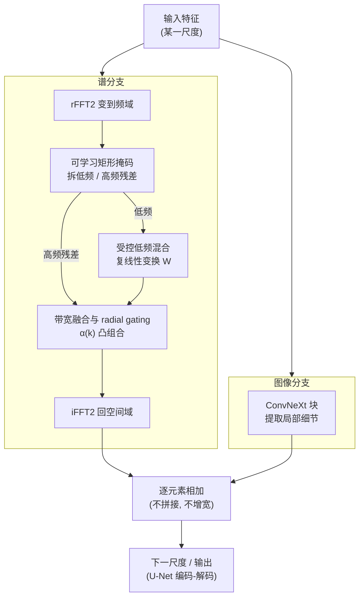

# DRIFT-Net: A Spectral--Coupled Neural Operator for PDEs Learning

**会议**: ICLR2026  
**arXiv**: [2509.24868](https://arxiv.org/abs/2509.24868)  
**代码**: 无  
**领域**: 科学计算  
**关键词**: neural operator, PDE, spectral coupling, dual-branch, Navier-Stokes

## 一句话总结
提出 DRIFT-Net 双分支神经算子，通过受控低频混合（谱分支）和局部细节保真（图像分支）的带宽融合（radial gating），解决窗口注意力中全局谱耦合不足导致的自回归漂移问题，在 Navier-Stokes 基准上误差降低 7%-54%。

## 研究背景与动机

**领域现状**：PDE 基础模型大多采用多尺度窗口自注意力（windowed self-attention），计算高效但全局依赖只能通过深层堆叠和窗口移位逐步传播。

**现有痛点**：窗口注意力的局部性削弱全局谱耦合（spectral coupling），导致闭环自回归 rollout 时误差累积、漂移；而纯谱算子（如 FNO）虽然全局却过度强调低频、欠拟合非平稳的局部细节；朴素的跨分支拼接又会膨胀通道宽度、训练不稳。

**核心矛盾**：全局耦合与局部细节保真之间的权衡——既要单层就能跨整张图传播大尺度信息，又不能把高频细节抹平或让训练失稳。

**本文目标**：在保持高频细节的同时增强全局谱耦合，且不增加特征宽度。

**核心 idea**：用一条谱分支对低频做可学线性混合补全全局耦合、一条图像分支保住局部细节，两条分支按频率半径做 radial gating 带宽融合后相加，再配一个频率加权损失抵消谱偏差。

## 方法详解

### 整体框架

DRIFT-Net 要解决的是：窗口注意力的全局谱耦合太弱，闭环 rollout 时会漂移。它的整体结构是一个 U-Net 形状的多尺度编码-解码器，每个尺度上并排放着两条互补的分支——**谱分支**在频域里补全全局耦合，**图像分支**在空间域里保住局部细节，两者逐元素相加后再进入下一尺度。

具体一个尺度内怎么转：输入特征同时进两条分支。谱分支先用 rFFT2 把特征变到频域，再用一个可学习的矩形掩码把谱拆成低频和高频残差两段；低频段送进**受控低频混合**做一次跨整张图的可学线性变换，高频段原样保留；接着**带宽融合与 radial gating** 把改写过的低频和保留的高频按频率半径软拼回去，最后 iFFT2 变回空间域。图像分支则是一个标准的 ConvNeXt 块，负责局部、非平稳结构。两条分支的输出相加（非拼接，不增宽），逐尺度往下传，并在训练时用一个**频率加权损失**抵消神经网络偏向低频的谱偏差。

### 关键设计

**1. 受控低频混合：让全局耦合不靠堆深度也能传播**

窗口注意力的全局依赖只能靠层层堆叠和窗口移位慢慢扩散，闭环 rollout 时这种"慢传播"会累积成漂移。DRIFT-Net 的做法是在每个 DRIFT block 里把特征经 rFFT2 变到频域后，用一个可学习的矩形低频掩码 $M_{low}$ 把谱拆成低频 $\hat{X}_{low}$ 与高频残差 $\hat{X}_{high}=\hat{X}-\hat{X}_{low}$，只对低频系数施加一个**逐频率、按通道**的可学复线性变换 $W$（不跨频率耦合），高频原样保留。低频对应的正是 PDE 解里那些大尺度、长程关联、决定全局动力学的结构，对它们做一次全局线性混合，等价于在单层内就完成了跨整张图的信息交换；而把高频（局部纹理、锐利边界、小涡）排除在外，避免全局混合放大高频噪声、抹平细节导致失稳。这样既拿到了纯谱算子（如 FNO）的全局视野，又不像 FNO 那样对全频段一视同仁而过度偏向低频。

**2. 带宽融合与 radial gating：用凸组合保证融合不过冲**

低频被改写、高频保持原样之后，需要把两段频谱重新缝合。直接硬替换或直接相加会在频带边界产生不连续、或在某些频带引入幅度过冲。DRIFT-Net 因此按频率半径 $k$ 做软融合：

$$\hat{Y}(k) = \alpha(k)\,\hat{V}_{low}(k) + \big(1-\alpha(k)\big)\,\hat{X}_{high}(k)$$

其中门控 $\alpha(k)\in[0,1]$ 由频率幅度（radial frequency）经轻量的逐带处理算出，在低频段 $\alpha(k)\approx 1$（偏向混合后的全局分量）、高频段 $\alpha(k)\approx 0$（保留局部细节），中间平滑过渡。由于这是系数恒非负且和为 1 的凸组合，融合后任意频率的能量都被夹在两个输入之间，不会出现某频段被放大到溢出的过冲；融合又是逐元素相加（非拼接），不增加特征宽度。消融里换成硬掩码切割就会失稳，印证了软融合对训练稳定性的作用。

**3. 频率加权损失：抵消神经网络天生的谱偏差**

神经网络在回归任务里有偏向低频的谱偏差（spectral bias），直接用均匀 MSE 会让高频细节欠拟合，而高频误差恰是长程 rollout 漂移的来源之一。DRIFT-Net 在损失里按频率半径给误差加权，权重随频率单调增大，把优化压力更多压到高频上，强迫模型把锐利结构也拟合好——和前两个设计在架构上"保留高频"形成呼应，从优化端再补一刀。

### 损失函数 / 训练策略

模型学的是单步算子 $F_\theta: u_t \mapsto u_{t+1}$，训练用单步 teacher forcing（每步都喂真实状态），目标是相对 $L_p$ 误差（$p\in\{1,2\}$）叠加上面的频率加权项。测试时换成自回归闭环 rollout，把模型自己的预测反馈回输入连续推演（实验中可达 100 步）。训练-测试的这种差异正是漂移问题的考验场景，上面三个设计共同保证闭环推演下误差不快速累积。

## 实验关键数据

### 主实验：7 个 PDE 基准

| 任务 | scOT | FNO | **DRIFT-Net** |
|------|------|-----|------|
| NS-SL | 3.96% | 3.69% | **3.40%** |
| NS-PwC | 2.35% | 4.57% | **最佳** |
| Poisson-Gauss | - | - | **最佳** |
| Allen-Cahn | - | - | **最佳** |
| Wave-Gauss | - | - | **最佳** |

### 效率对比
参数量比 scOT 少约 15%，吞吐量更高，NS 误差降低 7%-54%。

### 消融实验

| 配置 | 效果 |
|------|------|
| 无低频混合 | 误差显著增加 |
| 硬掩码替代 radial gating | 不稳定 |
| 无频率加权损失 | 高频拟合不足 |
| 完整 DRIFT-Net | 最佳 |

### 关键发现
- 受控低频混合是关键——去掉后误差显著增加
- 100 步长程 rollout 中保持低漂移
- 对椭圆、抛物、双曲 PDE 均有效

## 亮点与洞察
- 谱-空间双分支巧妙解耦全局结构和局部细节——物理直觉强
- 非扩展融合的凸组合保证确保训练稳定
- 模块化——DRIFT block 可替换现有注意力块

## 局限与展望
- 低频掩码大小需手动设定
- 主要在 2D PDE 上验证，3D 扩展待测
- 与 DPOT 等其他 PDE 基础模型对比不足

## 相关工作与启发
- **vs scOT/POSEIDON**: 用谱分支实现全局耦合，无需深层堆叠
- **vs FNO**: FNO 全频操作但缺局部能力，DRIFT-Net 双分支互补
- **vs PDE-Refiner**: Refiner 靠迭代细化，DRIFT-Net 靠架构设计

## 评分
- 新颖性: ⭐⭐⭐⭐ 受控低频混合+带宽融合+频率损失的精巧组合
- 实验充分度: ⭐⭐⭐⭐⭐ 7 个 PDE 基准+消融+长程 rollout
- 写作质量: ⭐⭐⭐⭐ 物理直觉解释好
- 价值: ⭐⭐⭐⭐ 为 PDE 基础模型提供更好骨干

<!-- RELATED:START -->

## 相关论文

- [\[ICML 2026\] Topology-Preserving Neural Operator Learning via Hodge Decomposition](../../ICML2026/physics/topology-preserving_neural_operator_learning_via_hodge_decomposition.md)
- [\[AAAI 2026\] SAOT: An Enhanced Locality-Aware Spectral Transformer for Solving PDEs](../../AAAI2026/physics/saot_an_enhanced_locality-aware_spectral_transformer_for_solving_pdes.md)
- [\[ICLR 2026\] One Operator to Rule Them All? On Boundary-Indexed Operator Families in Neural PDE Solvers](one_operator_to_rule_them_all_on_boundary-indexed_operator_families_in_neural_pd.md)
- [\[ICLR 2026\] DGNet: Discrete Green Networks for Data-Efficient Learning of Spatiotemporal PDEs](dgnet_discrete_green_networks_for_data-efficient_learning_of_spatiotemporal_pdes.md)
- [\[ICML 2026\] EqGINO: Equivariant Geometry-Informed Fourier Neural Operators for 3D PDEs](../../ICML2026/physics/eqgino_equivariant_geometry-informed_fourier_neural_operators_for_3d_pdes.md)

<!-- RELATED:END -->
