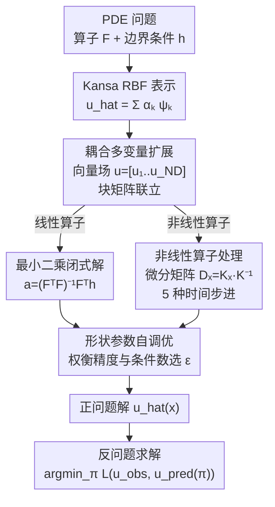

# Learning-guided Kansa Collocation for Forward and Inverse PDE Problems

**会议**: ICLR 2026  
**arXiv**: [2602.07970](https://arxiv.org/abs/2602.07970)  
**代码**: 无  
**领域**: 科学计算 / PDE求解  
**关键词**: Kansa method, radial basis functions, nonlinear PDEs, inverse problems, neural PDE solvers

## 一句话总结

将基于径向基函数(RBF)的无网格Kansa方法从单变量线性PDE扩展到耦合多变量和非线性PDE场景，结合自调参技术和多种时间步进方案，并系统对比了与PINN、FNO等神经PDE求解器在正问题和反问题上的表现。

## 研究背景与动机

**PDE求解的挑战**：偏微分方程广泛用于物理、图形学和生物学建模，但传统数值方法（FDM/FEM）面临维度灾难、高计算成本和领域特定离散化的问题。

**神经PDE求解器的兴起**：PINN (Raissi et al. 2019) 和 FNO (Li et al. 2020) 展示了泛化能力和高维处理能力，但它们各自有训练成本高、需大量数据等局限。

**Kansa方法的优势**：Kansa方法是一种无网格(mesh-free)的RBF求解器，不需要网格离散化，天然适合复杂几何域。Zhong et al. (2023) 的Constrained Neural Fields (CNF)框架引入了形状参数自调优。

**现有Kansa方法的局限**：Zhong et al. (2023)仅处理单变量线性PDE，无法应对实际中常见的耦合方程组和非线性算子。

**缺乏系统对比**：不清楚扩展的Kansa方法与其他经典和神经PDE求解器在不同质量指标（L1/L2误差、效率、收敛速度等）上的比较。

**反问题的重要性**：从观测数据推断未知PDE参数（如扩散系数、流速等）对科学模拟至关重要，但现有Kansa框架尚未涉及反问题求解。

## 方法详解

### 整体框架

整个框架建立在 Kansa 配置点法（Kansa collocation）之上：把待求场写成径向基函数（radial basis function, RBF）的线性组合 $\hat{u}(\mathbf{x}) = \sum_k \alpha_k \psi_k(\|\mathbf{x} - \mathbf{x}_k\|)$，让它在一批配置点上同时满足 PDE 算子约束 $\mathcal{F}$ 和边界条件 $h$，于是求解就归结为确定系数 $\alpha_k$——若算子是线性的，整组配置点方程组成线性系统 $\mathbf{Fa}=\mathbf{h}$，直接用最小二乘闭式求解。本文沿这条主线做了四处扩展，使原本只能处理单变量线性 PDE 的 Kansa 方法覆盖到耦合方程组与非线性场景：先把单场推广为多物理量耦合（耦合多变量扩展），再用微分矩阵把非线性算子拆开（非线性算子处理），同时自动选取决定精度与稳定性的核形状参数（形状参数自调优），最后把训好的可微正向求解器接到下游做参数反演（反问题求解）。

### 关键设计

**1. 耦合多变量扩展：让一套RBF同时求解多个物理量**

Navier-Stokes、Maxwell 这类方程本质上是若干物理量相互牵制的耦合方程组，单场表示无法描述，这正是基础 Kansa 框架卡住的第一道坎。本文把单一未知场 $u$ 推广为多维向量 $\mathbf{u} = [u_1, u_2, \ldots, u_{N_D}]$，每个分量 $u_d$ 各自拥有独立的 RBF 展开和系数 $\alpha_k^{(d)}$，再通过一个对各分量线性的耦合算子 $\mathcal{G}(\hat{v}_1,\ldots,\hat{v}_{N_D}) = \sum_d \beta_d \hat{v}_d$ 把它们联立起来。实现上是把各维度的算子矩阵 $\mathbf{F}^{(d)}$ 水平堆叠、配上权重块 $\boldsymbol{\beta}$ 组成一个块矩阵系统一次性求解。这样既保留了无网格表示的灵活性，又让分量间的耦合在同一个线性系统里得到一致处理；实验中耦合维度 $N_D$ 增长时，计算成本近似线性上升而精度基本维持。

**2. 非线性算子处理：用微分矩阵把非线性项拆成已知场的微分组合**

非线性算子（如 Burgers 方程里的 $u\,\partial u/\partial x$ 项）无法像线性情形那样把系数 $\alpha_k$ 直接提到算子外、分离出可解的线性系统。本文的关键工具是微分矩阵（differentiable matrix）$\mathbf{D}_x = \mathbf{K}_x \cdot \mathbf{K}^{-1}$：由 $\mathbf{u}' = \mathbf{K}_x \mathbf{a}$ 与 $\mathbf{a} = \mathbf{K}^{-1}\mathbf{u}$ 联立得到，它把"对场求导"这一操作直接表达成作用在场值 $\mathbf{u}$ 上的矩阵，于是非线性项可以写成已知场的微分组合（如 $u\cdot(\mathbf{D}_x\mathbf{u})$），再交给时间离散或迭代优化处理。围绕这一点本文给出五种求解策略：显式的前向 Euler、半隐式的 IMEX、配合 Newton-Raphson 的隐式后向 Euler、二阶的 Crank-Nicolson，以及不做时间分裂、直接对残差做全局优化的全非线性方案，覆盖了从快速但易失稳到稳定且高精度的不同需求。

**3. 形状参数自调优：自动权衡精度与条件数**

RBF 核的形状参数 $\epsilon$ 对结果影响极大——取得太尖（$\epsilon$ 大）会损失精度，取得太平（$\epsilon$ 小）则让算子矩阵条件数恶化、求解失稳，二者之间存在精度-条件数的内在权衡，手工调参既费力又不可靠。对线性 PDE，本文联合最小化算子矩阵的条件数与解场的变分来选 $\epsilon$；对非线性 PDE，则换成一个组合目标，同时压低 PDE 残差、解场变分以及训练数据上的 L2 损失。把 $\epsilon$ 的选取从人工试错变成可优化的目标后，实验显示自调优相比手动设值能显著降低误差。

**4. 反问题求解：把参数反演变成标准优化**

从观测数据反推未知 PDE 参数（扩散系数、流速等）对科学模拟很重要，但此前的 Kansa 框架并未涉及。由于前三步搭出的正向求解器本身对参数可微，本文把反问题直接写成 $\boldsymbol{\pi}^* = \arg\min_{\boldsymbol{\pi}} \mathcal{L}(u^{\text{obs}}, u^{\text{pred}}(\boldsymbol{\pi}))$，即调整未知参数 $\boldsymbol{\pi}$ 使预测解逼近观测 $u^{\text{obs}}$，再用 SciPy 的最小二乘与求根算法求解。因为求解器可微，参数推断自然落入标准优化框架，无需额外推导伴随方程（adjoint）。

### 损失函数 / 训练策略

线性 PDE 直接走最小二乘闭式解 $\mathbf{a}^{\text{opt}} = (\mathbf{F}^T\mathbf{F})^{-1}\mathbf{F}^T\mathbf{h}$；非线性 PDE 改为最小化配置点上的残差 $\min_\alpha \sum_i (\mathcal{F}[\hat{u}](\mathbf{x}_i) - h(\mathbf{x}_i))^2$；形状参数 $\epsilon$ 通过网格搜索按上述自调优目标选取。作为对照基线，PINN 用 Adam 优化器、学习率 $10^{-3}$、训练 3000 epochs，FNO 则需要 100 个 PDE 实例、训练 100 epochs。

## 实验关键数据

### 主实验

1D Advection方程正向求解的相对L2误差对比：

| 方法 | 类型 | 相对L2误差 | 特点 |
|------|------|-----------|------|
| Kansa (线性求解) | 无网格RBF | 低 | 无需训练，直接求解 |
| Kansa (IMEX) | 无网格RBF | 低，稳定 | 半隐式，适合刚性问题 |
| Kansa (Crank-Nicolson) | 无网格RBF | 最低 | 二阶精度 |
| PINN | 神经网络 | 中等 | 需要较多训练迭代 |
| FNO | 算子学习 | 中等 | 需要多实例训练数据 |

Burgers方程（非线性）对比：

| 方法 | 扩展 | 精度 | 稳定性 |
|------|------|------|--------|
| 前向Euler Kansa | 显式 | $O(\Delta t)$ | 不稳定 |
| IMEX Kansa | 半隐式 | $O(\Delta t)$ | 稳定 |
| 后向Euler Kansa | 隐式+Newton | $O(\Delta t)$ | 稳定 |
| Crank-Nicolson Kansa | 隐式 | $O(\Delta t^2)$ | 稳定 |
| 全非线性Kansa | 全局优化 | $O(1)$ | N/A |

### 消融实验

| 实验维度 | 变量 | 观察 |
|---------|------|------|
| 配置点数量 $N$ | 50→500 | 精度提升但条件数恶化 |
| 形状参数 $\epsilon$ | 手动 vs 自调优 | 自调优显著减少误差 |
| 时间步进方案 | 5种方案 | Crank-Nicolson精度最高，IMEX综合最佳 |
| 耦合维度 $N_D$ | 1→多 | 计算成本线性增长，精度基本保持 |

### 关键发现

- Kansa方法在低配置点数量时精度显著优于PINN，在不需要大量训练数据的场景下具有明显优势
- 自调参技术有效解决了RBF方法中shape-accuracy trade-off的痛点
- 非线性扩展中IMEX方案提供了最佳的精度-稳定性-效率平衡
- 反问题求解中Kansa方法的可微性使参数推断自然而高效
- FNO虽然泛化能力强，但训练数据需求是Kansa/PINN的100倍

## 亮点与洞察

1. **系统性扩展**：从单变量线性到耦合非线性的扩展逻辑清晰，5种非线性求解方案覆盖了不同需求场景
2. **微分矩阵的妙用**：$\mathbf{D}_x = \mathbf{K}_x \cdot \mathbf{K}^{-1}$ 将RBF的灵活性与微分算子的精确性结合，是将Kansa推向非线性领域的关键
3. **实用导向**：对不同求解器的系统对比为实际科学计算提供了选择指南
4. **无网格优势**：Kansa方法无需网格生成，对复杂几何域和高维问题天然友好
5. **反问题的自然集成**：RBF表示使得参数化反演问题变为标准优化问题

## 局限与展望

1. **条件数问题**：RBF矩阵在高配置点密度时条件数急剧恶化，限制了可扩展性
2. **高维扩展**：实验局限于1D和简单2D问题，3D和更高维的实验缺乏
3. **非线性收敛保证**：Newton-Raphson求解器的收敛依赖初值选择，缺乏理论保证
4. **与现代方法对比不足**：未与DeepONet、Operator Transformer等更新的方法对比
5. **反问题实验有限**：反问题仅涉及简单参数推断，未测试更复杂的场景（如未知源项、未知边界条件）
6. **缺乏误差理论分析**：非线性扩展的误差界和收敛阶分析不充分

## 相关工作与启发

- **Zhong et al. (2023)** 提出的CNF框架是本文的直接基础，本文是其在耦合和非线性方向的自然延伸
- **Kansa (1990)** 的原始无网格RBF方法提供了理论基础
- **Raissi et al. (2019)** PINN 和 **Li et al. (2020)** FNO 是神经PDE求解器的两大代表，作为主要对比方法
- **启发**：将Kansa方法与可微渲染管线(differentiable rendering)集成用于逆物理问题是有前景的方向；与神经算子方法的混合（如用神经网络学习最优配置点位置）也值得探索

## 评分

- **新颖性**: ⭐⭐⭐⭐ 扩展方向自然但增量性较强，核心思路（微分矩阵、时间离散化）是经典数值方法的组合
- **实验充分度**: ⭐⭐⭐⭐ 覆盖了正/反问题和多种PDE类型，但实验规模偏小（主要1D），缺乏大规模验证
- **写作质量**: ⭐⭐⭐⭐⭐ 方法论层层递进，矩阵公式推导详细清晰，但符号定义较密集
- **价值**: ⭐⭐⭐⭐ 对Kansa方法社区有实用贡献，系统对比有参考价值，但影响范围相对有限

<!-- RELATED:START -->

## 相关论文

- [\[AAAI 2026\] SVD-NO: Learning PDE Solution Operators with SVD Integral Kernels](../../AAAI2026/physics/svd-no_learning_pde_solution_operators_with_svd_integral_kernels.md)
- [\[AAAI 2026\] Scientific Knowledge-Guided Machine Learning for Vessel Power Prediction: A Comparative Study](../../AAAI2026/physics/scientific_knowledge-guided_machine_learning_for_vessel_power_prediction_a_compa.md)
- [\[NeurIPS 2025\] Physics-Guided Machine Learning for Uncertainty Quantification in Turbulence Models](../../NeurIPS2025/physics/physics-guided_machine_learning_for_uncertainty_quantification_in_turbulence_mod.md)
- [\[ICLR 2026\] One Operator to Rule Them All? On Boundary-Indexed Operator Families in Neural PDE Solvers](one_operator_to_rule_them_all_on_boundary-indexed_operator_families_in_neural_pd.md)
- [\[ICLR 2026\] DGNet: Discrete Green Networks for Data-Efficient Learning of Spatiotemporal PDEs](dgnet_discrete_green_networks_for_data-efficient_learning_of_spatiotemporal_pdes.md)

<!-- RELATED:END -->
