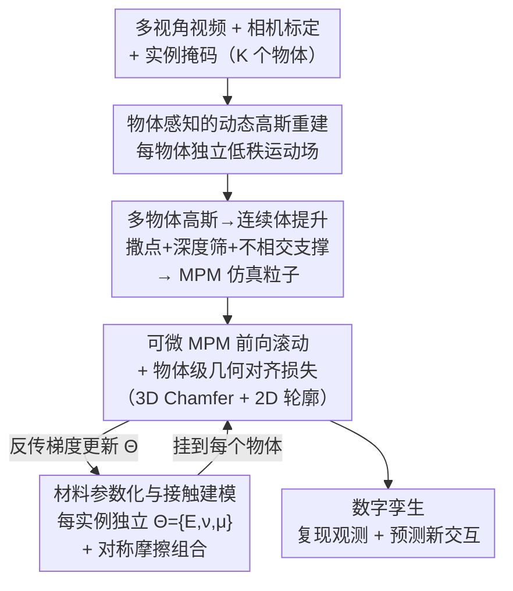

# MOSIV: Multi-Object System Identification from Videos

**会议**: ICLR 2026  
**arXiv**: [2603.06022](https://arxiv.org/abs/2603.06022)  
**领域**: 物理建模/系统辨识  
**关键词**: 多物体物理, 视频系统辨识, 可微MPM, 4D高斯, 连续参数优化, 接触摩擦建模

## 一句话总结

提出MOSIV——首个从多视角视频进行多物体系统辨识的完整框架：(1) 物体感知的4D动态高斯重建每个物体的几何与运动 → (2) 高斯到连续体提升构建MPM仿真粒子 → (3) 可微MPM模拟器前向滚动+几何对齐目标(3D Chamfer + 2D轮廓)反传优化每个物体的连续材料参数($E, \nu, \mu$) → 在包含弹性/塑性/流体/沙粒四种材料的接触丰富合成基准上，PSNR 达30.51 vs OmniPhysGS 25.93，Chamfer距离降低9.4倍，建立多物体长期物理仿真新基准。

## 研究背景与动机

**领域现状**：从视频中学习物体物理属性是构建"数字孪生"的核心问题。现有方法（GIC、PAC-NeRF等）大多仅限于单物体孤立运动场景，而真实世界充满多物体碰撞、滑动和遮挡。

**核心痛点**：
   - (1) 单物体方法无法处理多物体交互——碰撞时运动耦合、遮挡使跟踪困难
   - (2) OmniPhysGS 采用离散材料分类（从固定库中选择）→ 无法表达连续物理参数 → 精度受限
   - (3) CoupNeRF 使用 NeRF+MPM 混合方案 → 计算量大、时序一致性差、不适合接触剧烈场景
   - (4) 缺乏标准化的多物体系统辨识基准数据集 → 无法公平评估

**多物体交互的双刃剑**：物体间接触和碰撞既提供丰富信号（揭示摩擦、刚度等隐藏物理量），也带来关联歧义（场景级损失会跨物体匹配导致误导梯度）。

**切入点**：连续参数辨识（而非类别选择）+ 可微物理模拟器 + 物体级几何对齐监督，三者协同解决多物体系统辨识。

**应用前景**：准确的多物体物理参数 → 机器人杂乱场景操作、物理可信场景编辑、长时域行为预测。

**本文定位**：形式化多物体系统辨识任务 + 提出MOSIV框架 + 发布45个多视角视频的合成基准数据集。

## 方法详解

### 整体框架

MOSIV 把"从多视角视频里读出每个物体的物理参数"拆成一条可微管线：先用物体感知的 4D 高斯把 $K$ 个可变形物体的几何和运动重建出来，再把这些渲染用的高斯提升成 MPM 仿真用的连续体粒子，最后让可微 MPM 前向滚动、用物体级几何对齐损失把每个物体的材料参数 $\boldsymbol{\Theta}=\{\boldsymbol{\theta}_k\}_{k=1}^{K}$（杨氏模量 $E$、泊松比 $\nu$、摩擦 $\mu$ 等）反传优化出来。输入只需要视频、相机标定和实例掩码，输出是既能复现观测、又能预测未来交互的数字孪生。整条管线分三阶段串行（Stage I 重建 → Stage II 提升 → Stage III 优化），其中 Stage III 是一个"前向仿真→几何对齐损失→反传更新参数"的可微优化回环。

### 关键设计

**1. 物体感知的动态高斯重建：让每个物体拥有独立运动场**

多物体场景的第一个麻烦是碰撞时运动耦合、遮挡让跟踪混乱，如果用一个统一的场来表示整个场景，后续根本没法分物体优化参数。MOSIV 借实例掩码把高斯核按物体分区，每个物体单独拥有一套低秩运动分解的 3D 高斯：核中心和半径都通过时间基函数 $\boldsymbol{\psi}_b^\mu(t)$ 加空间门控 $\alpha_b(\boldsymbol{\mu})$ 来变形，$\boldsymbol{\mu}_t = \boldsymbol{\mu} + \sum_{b=1}^{B} \alpha_b(\boldsymbol{\mu}) \boldsymbol{\psi}_b^\mu(t)$、$r_t = r + \sum_{b=1}^{B} \alpha_b(\boldsymbol{\mu}) \psi_b^r(t)$，整套表示用光度一致性损失 $\min_{\mathcal{G}_0, \text{net}} \mathcal{L}_1(\hat{\mathbf{I}}_t, \mathbf{I}_t) + \lambda_\text{SSIM} \mathcal{L}_\text{SSIM}(\hat{\mathbf{I}}_t, \mathbf{I}_t) + \lambda_r \|r_t\|_1$ 训练。相比隐式 NeRF，显式高斯几何更稳、支持实时渲染，而且分区后每个物体有自己的运动轨迹，为后面独立辨识参数打好基础。

**2. 多物体高斯→连续体提升：把渲染用的点云变成可仿真的介质**

动态高斯是为渲染优化的，空间分布稀疏不均，直接塞进连续介质模拟器会得到物理上荒谬的初始状态。MOSIV 对每个物体 $k$ 在其高斯包围盒内随机撒点，只保留和多相机深度一致的粒子，再用逐步提分辨率的密度场加均值滤波平滑、阈值提取表面，把稀疏高斯填充成实心连续体。多物体共存时还额外加了两条约束：重叠体素按"最近物体表面"原则归属，消除初始互穿（不相交支撑）；各物体网格对齐到兼容分辨率，让接触界面能严丝合缝地匹配。这样得到的仿真初态既物理合理、又不会一开始就互相穿模。

**3. 可微 MPM 仿真与物体级几何对齐：用对的损失给出对的梯度**

有了连续体粒子，MPM 的时间步进 $\mathbf{z}_{n+1} = \mathcal{T}(\mathbf{z}_n; \boldsymbol{\Theta})$ 整条链路可微，于是可以前向滚动再反传优化参数。关键是用什么损失：MOSIV 把 3D 表面 Chamfer 距离和 2D 轮廓 L1 结合成几何对齐目标 $\mathcal{L}_\text{ID} = \frac{1}{m}\sum_{i=1}^{m}\big[\sum_{k=1}^{K}\mathcal{L}_\text{CD}(S_k(t_i), \tilde{S}_k(t_i)) + \frac{1}{n}\sum_{j=1}^{n}\sum_{k=1}^{K}\mathcal{L}_1(A_{j,k}(t_i), \tilde{A}_{j,k}(t_i))\big]$，而且每一项都是逐物体（object-wise）算的，而不是把整个场景合在一起算。这点非常要紧：接触区域天然有关联歧义，场景级 Chamfer 会在两个物体贴近时跨物体匹配，优化器就能靠"在 A 物体上故意牺牲精度"来压低全局损失，从而掩盖参数误差、给出误导梯度；物体级损失强制每个物体各自的几何独立对齐，堵死这种跨物体借用，梯度信号干净得多——消融里物体级把 CD 从 22.13 压到 0.696，正是这条的功劳。

**4. 材料参数化与接触建模：每个实例独立参数 + 对称摩擦组合**

最后一个设计回答"参数怎么挂、摩擦怎么算"。MOSIV 对每个物体实例独立参数化材料属性，哪怕两个物体真实材料相同也不强制共享参数——可辨识性本就该从各自的几何和轮廓约束里自然涌现，硬性共享反而引入错误先验。两种材料界面之间的 Coulomb 摩擦用对称组合 $\mu_{m,m'} = g(\mu_m, \mu_{m'}) = \frac{1}{2}(\mu_m + \mu_{m'})$ 建模，在减少自由度的同时保留灵活性。这样参数的一致性由数据驱动来验证，而不是靠人工假设钉死。

### 损失函数 / 训练策略

整体分三阶段串行：Stage I 做 4DGS 重建，Stage II 做高斯→连续体提升，Stage III 做参数优化。Stage III 里用视界课程学习——前向滚动长度随对齐质量改善逐步加长，避免一开始就长滚动导致漂移失控；同时参数优化与粒子状态重同步交替进行，进一步抑制累积漂移。实现上 MPM 时间步长 $\tau=1/4800$（每帧 200 子步）、网格分辨率 $4096^3$、用 Adam，先 80 次迭代估速度、再 200 次迭代精化物理参数。

## 实验关键数据

### 数据集

合成基准：45个多视角视频，10种几何形状 × 5种材料（弹性/弹塑性/流体/沙粒/雪），11个摄像机视角，30帧/序列，含ground-truth物理参数。

### 表1：可观测态仿真（Observable State Simulation）

| 方法 | PSNR↑ | SSIM↑ | CD↓ | EMD↓ |
|------|-------|-------|-----|------|
| OmniPhysGS-RGB | 25.93 | 0.945 | 11.79 | 0.095 |
| OmniPhysGS-RGB w/ Oracle | 24.39 | 0.930 | 43.50 | 0.168 |
| **MOSIV (Ours)** | **30.51** | **0.977** | **1.256** | **0.049** |

MOSIV在所有指标上大幅领先：PSNR提升4.58 dB，CD降低9.4倍，EMD降低48%。值得注意的是，给了Oracle（ground-truth材料模型）的OmniPhysGS甚至比标准版更差（CD 43.50 vs 11.79），说明离散选择架构本身就是瓶颈。

### 表2：未来态仿真（Future State Simulation）

| 方法 | PSNR↑ | SSIM↑ | CD↓ | EMD↓ |
|------|-------|-------|-----|------|
| OmniPhysGS-RGB | 19.00 | 0.888 | 51.92 | 0.199 |
| OmniPhysGS-RGB w/ Oracle | 17.97 | 0.869 | 215.83 | 0.408 |
| **MOSIV (Ours)** | **28.26** | **0.963** | **3.710** | **0.071** |

长期预测中差距更加显著：PSNR提升9.26 dB，CD降低14倍。基线方法在长时域滚动中急剧漂移，MOSIV保持稳定。

### 表3：监督粒度消融

| 监督方式 | $\mathcal{L}_\text{CD}$ | $\mathcal{L}_\alpha$ | PSNR↑ | CD↓ |
|---------|:-:|:-:|-------|-----|
| 场景级 | ✓ | ✓ | 27.89 | 22.13 |
| **物体级（Ours）** | **✓** | **✓** | **30.24** | **0.696** |

物体级监督将CD从22.13降低到0.696（31.8倍改善），验证了物体级细粒度监督的核心重要性。

## 关键发现

1. **连续参数远优于类别选择**：MOSIV直接优化连续物理参数，在所有材料组合上一致性超越离散选择方案，即使给Oracle的OmniPhysGS也不如MOSIV。

2. **物体级监督是多物体辨识的关键**：场景级损失在物体接触时产生跨物体匹配错误，导致CD暴增（22.13 vs 0.696）。物体级损失阻断这种"交叉借用"，提供正确梯度。

3. **双源监督缺一不可**：单独使用Chamfer或轮廓损失均不足以稳定训练，两者协同才能实现鲁棒的物理参数优化。

4. **长期仿真保真度**：MOSIV在未来态预测中PSNR仍达28.26，而基线从25.93/24.39骤降至19.00/17.97 → MOSIV的参数辨识准确性带来长期稳定性。

5. **新交互泛化能力**：通过保持几何和初始条件不变、仅交换材料参数 → 产生物理可信的不同动力学行为 → 验证了辨识出的参数确实捕获了真实物理。

## 亮点与洞察

- **"多物体 = 更丰富的信号"**：物体碰撞和接触不仅是挑战，更是揭示摩擦、刚度等隐藏物理量的唯一途径。单物体自由落体无法区分不同摩擦力 → 多物体交互提供独特的可辨识性条件。

- **连续 vs 离散的本质差距**：材料不是几个类别而是连续谱上的点。OmniPhysGS 的 Oracle 版本反而更差，说明离散材料库本身就引入了不可逾越的表达瓶颈。

- **几何对齐 > 像素对齐**：使用3D表面和2D轮廓而非像素级光度损失来驱动物理参数优化 → 对渲染噪声更鲁棒，更直接反映物理一致性。

- **"数字孪生"的完整闭环**：准确的物理参数 → 不只复现观察 → 还能预测新场景（改变初始条件、力场、材料赋值）→ 下游应用的关键能力。

## 局限性

1. **依赖预定义本构模型**：需要预先指定弹性/塑性/流体等本构模型类型 → 无法处理未知材料类型 → 可能受益于神经网络直接学习物理模型。

2. **计算开销大**：可微MPM仿真+高分辨率网格($4096^3$)+多次迭代优化 → 单场景需要较长训练时间。

3. **初始几何敏感**：对初始3D重建质量敏感 → 在遮挡严重的杂乱场景中可能降级。

4. **仅验证合成数据**：当前基准完全合成 → 真实视频面临复杂光照、噪声、sim-to-real差距等额外挑战。

5. **材料类型需已知**：每个物体的材料族（弹性/塑性/流体/颗粒）需通过掩码预定义 → 全自动材料类型推断未解决。

## 相关工作对比

### vs OmniPhysGS (Lin et al., 2025)

| 维度 | OmniPhysGS | MOSIV |
|------|-----------|-------|
| 材料表示 | 从固定专家库分类选择 | 连续参数直接优化 |
| 物理模拟 | 类别匹配→部分场景错误 | 可微MPM→精确接触/摩擦 |
| 监督信号 | SDS/光度 | 几何对齐(3D+2D) |
| 多物体支持 | 隐式场景级 | 显式物体级 |
| 可观测态PSNR | 25.93 | **30.51** |
| 未来态CD | 51.92 | **3.71** |

### vs CoupNeRF (Li et al., 2024a)

| 维度 | CoupNeRF | MOSIV |
|------|---------|-------|
| 3D表示 | 隐式NeRF | 显式3D高斯 |
| 计算效率 | 重（时间优化NeRF场） | 较轻（显式高斯） |
| 时序一致性 | 弱（接触剧烈场景） | 强（物体级跟踪） |
| 物理行为 | 材料间区分弱 | 材料特异性动力学保持好 |
| 适用场景 | 自由落体/简单交互 | 接触丰富/多材料混合 |

### vs GIC (Cai et al., 2024)

GIC是MOSIV的单物体前身——MOSIV继承了其高斯→连续体提升思路，但将其扩展到多物体：增加了不相交支撑约束、物体级监督、跨材料接触建模。

## 评分

- **新颖性**: ⭐⭐⭐⭐⭐ — 首次形式化多物体视频系统辨识任务 + 连续参数优化方案 + 物体级几何对齐监督 + 新合成基准
- **实验充分度**: ⭐⭐⭐⭐ — 45个多视角视频、10种几何×5种材料、多基线对比(含Oracle)、监督粒度消融、新交互泛化验证；略显不足在于缺乏真实数据验证
- **写作质量**: ⭐⭐⭐⭐ — 问题定义清晰、方法Pipeline逻辑流畅、消融设计有洞察（场景级vs物体级的分析尤佳）
- **价值**: ⭐⭐⭐⭐ — 对多物体物理场景理解有重要推动，连续参数辨识+物体级监督的组合为后续工作建立了强基线

<!-- RELATED:START -->

## 相关论文

- [\[CVPR 2026\] Δynamics: Language-Based Representation for Inferring Rigid-Body Dynamics From Videos](../../CVPR2026/physics/δynamics_language-based_representation_for_inferring_rigid-body_dynamics_from_vi.md)
- [\[ICLR 2026\] Supervised Metric Regularization Through Alternating Optimization for Multi-Regime PINNs](supervised_metric_regularization_through_alternating_optimization_for_multi-regi.md)
- [\[ICML 2026\] Unveiling Multi-Regime Patterns in SciML: 不同失败模式与域特异优化](../../ICML2026/physics/unveiling_multi-regime_patterns_in_sciml_distinct_failure_modes_and_regime-speci.md)
- [\[NeurIPS 2025\] Toward Complete Merger Identification at Cosmic Noon with Deep Learning](../../NeurIPS2025/physics/toward_complete_merger_identification_at_cosmic_noon_with_deep_learning.md)
- [\[AAAI 2026\] PIMRL: Physics-Informed Multi-Scale Recurrent Learning for Burst-Sampled Spatiotemporal Dynamics](../../AAAI2026/physics/pimrl_physics-informed_multi-scale_recurrent_learning_for_burst-sampled_spatiote.md)

<!-- RELATED:END -->
