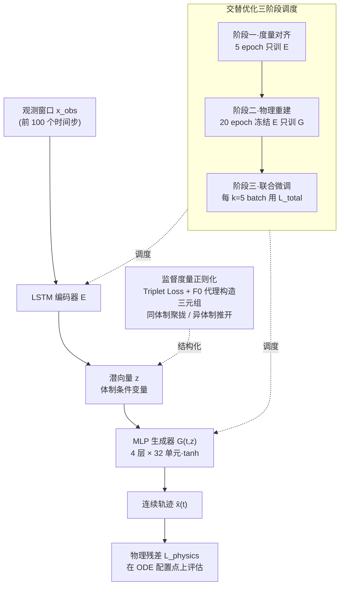

# Supervised Metric Regularization Through Alternating Optimization for Multi-Regime PINNs

## 元信息
- **会议**: ICLR 2026
- **arXiv**: [2602.09980](https://arxiv.org/abs/2602.09980)
- **代码**: 未公开
- **领域**: 科学计算 / 物理信息神经网络
- **关键词**: PINN, 度量学习, 交替优化, 分岔系统, Duffing 振荡器, 拓扑感知

## 一句话总结

提出拓扑感知 PINN (TAPINN)，通过监督度量正则化（Triplet Loss）结构化潜空间 + 交替优化调度稳定训练，在 Duffing 振荡器多域问题上物理残差降低约 49%（0.082 vs 0.160），梯度方差降低 2.18×。

## 研究背景与动机

物理信息神经网络 (PINNs) 在求解参数化动力系统方面展现了潜力，但在存在**尖锐体制转变**（如分岔）的系统中面临挑战：

**谱偏差 (Spectral Bias)**：标准 MLP 难以逼近解对系统参数的不连续/不光滑依赖

**模式坍缩**：网络倾向于平均不同物理行为而非区分它们

**分岔点处 Jacobian 奇异**：导致优化病态

现有解决方案的问题：
- **HyperPINNs**：超网络生成权重，参数量大（39,169 vs 8,003）
- **MoE**：路由不稳定
- 两者都引入了额外的架构复杂性

**核心思想**：通过度量学习**结构化潜空间**使其镜像物理体制的分离，而非使用更复杂的架构。

## 方法详解

### 整体框架

TAPINN 把求解器拆成两段：一个 LSTM 编码器 $E$ 先把观测窗口（前 100 个时间步，约占整段轨迹 10%）压成潜向量 $z = E(\mathbf{x}_{\text{obs}})$，再由一个 4 层、32 隐藏单元、tanh 激活的 MLP 生成器输出连续轨迹 $\hat{\mathbf{x}}(t) = G(t, z)$。与参数化基线和 HyperPINN 不同，TAPINN 并不需要把已知系统参数 $\lambda$（这里就是驱动幅度 $F_0$）喂给网络，而是仅从观测窗口自行推断体制信息——这对应着 $\lambda$ 未知的数据同化场景。于是整篇方法的关键就落在两件事上：怎么让这个潜向量 $z$ 真正区分开不同的物理体制，以及怎么让"组织潜空间"和"逼近物理方程"这两个互相打架的目标都训得稳。

### 关键设计

**1. 监督度量正则化：让潜空间镜像物理体制的分离，而非靠堆架构**

标准 PINN 的潜空间是隐式学出来的，网络往往把不同体制的解平均掉（模式坍缩），导致分岔附近的行为糊成一团。TAPINN 在总损失里加一项 Triplet Loss $\mathcal{L}_{\text{metric}} = \max(0, d(z_a, z_p) - d(z_a, z_n) + m)$（间隔 $m = 0.2$，欧氏距离），直接监督编码器：让同体制的嵌入互相靠拢、异体制的嵌入推开至少一个间隔。这样潜向量 $z$ 成为一个结构化的条件变量，生成器在它上面做插值时不会跨越体制边界去做无意义的平均，从而绕开了 HyperPINN 那种"为每个体制生成一套权重"的大参数量做法（8,003 vs 39,169）。

**2. 交替优化调度：化解度量目标与物理目标的梯度冲突**

度量损失想拉开潜空间结构，物理损失想压低 ODE 残差，两者直接联合优化时梯度方向会互相打架，训练不稳。TAPINN 用三阶段调度把它们错开：先做 5 个 epoch 的**度量对齐**，只更新编码器、只用 Triplet Loss 把潜流形组织好；再做 20 个 epoch 的**物理重建**，冻结编码器、只训练生成器去逼近 ODE；最后才进入**交替联合微调**，每 $k=5$ 个 batch（约 20% 的步骤）在完整的 $\mathcal{L}_{\text{total}}$ 上联合更新。直觉是先把条件变量 $z$ 稳定下来，再让求解器在一个固定、干净的流形上学物理——消融显示去掉这套调度、直接联合训练，物理残差退回 0.158，与普通基线无异，说明度量正则化必须配合 AO 才生效。

**3. 用驱动幅度构造 Triplet：以弱监督代理体制相似性**

度量学习需要"谁和谁同类"的标签，但体制本身是连续渐变的、没有现成离散标签。TAPINN 取已知的驱动幅度 $F_0$ 当作体制相似性的廉价代理：anchor 和 positive 共享相同 $F_0$，negative 取不同 $F_0$，全部在 batch 内即时构造，不做 hard/semi-hard mining。这个代理足够便宜又足够有效——线性探针从 $z$ 回归 $F_0$ 的 MSE 仅 $3.5\times10^{-4}$，说明潜空间确实编码了体制信息。

### 损失函数 / 训练策略

总损失是数据、物理、度量三项的加权和：

$$\mathcal{L}_{\text{total}} = \mathcal{L}_{\text{data}} + \alpha \mathcal{L}_{\text{physics}} + \beta \mathcal{L}_{\text{metric}}$$

其中 $\mathcal{L}_{\text{data}}$ 是观测窗口的重建误差，$\mathcal{L}_{\text{physics}} = \frac{1}{N_c}\sum\|\mathcal{N}[\hat{\mathbf{x}}(t_i);\lambda]\|^2_2$ 是在 $N_c = 10^4$ 个配置点上评估的 ODE 残差，$\mathcal{L}_{\text{metric}}$ 即上文的 Triplet Loss。权重 $\alpha, \beta$ 由网格搜索确定，整套训练按上一节的三阶段 AO 调度推进。

## 实验

### 测试问题：Duffing 振荡器

$$\ddot{x} + \delta\dot{x} + \alpha x + \beta x^3 = F_0 \cos(\omega t)$$

标准参数 $\delta=0.3, \alpha=-1, \beta=1, \omega=1$，变化 $F_0 \in [0.3, 0.8]$ 从周期态到混沌态。

### 主要结果

| 方法 | Physics Res. ↓ | 参数量 | Data MSE ↓ |
|------|---------------|--------|-----------|
| Parametric Baseline | 0.160 | 8,577 | 0.392 |
| Multi-Output (Sobolev) | 0.192 | 8,069 | 0.426 |
| HyperPINN | 0.158 | **39,169** | **0.281** |
| **TAPINN (Ours)** | **0.082** | 8,003 | 0.425 |

### 关键发现

1. **最低物理残差**：TAPINN 的物理残差 0.082，比参数化基线低 49%（0.160）
2. **参数高效**：仅 8,003 参数 vs HyperPINN 的 39,169（约 5×）
3. **HyperPINN 过拟合**：最低 Data MSE (0.281) 但高物理残差 (0.158)，说明记住了数据但违反了物理方程
4. **训练稳定性**：梯度范数均值低 2.14×，方差低 2.18×（vs Multi-Output 基线）
5. **潜空间结构**：t-SNE 可视化显示不同体制形成清晰簇；线性探针回归 $F_0$ 的 MSE 仅 $3.5 \times 10^{-4}$
6. **AO 的必要性**：去掉 AO 的联合训练物理残差 ≈ 0.158，与标准基线无异，证明度量正则化单独不够

## 亮点

- 思路优雅：用度量学习结构化潜空间来应对体制转换，而非堆参数
- AO 调度设计良好，有效解决了度量和物理目标的梯度冲突
- 在参数量仅为 HyperPINN 的 1/5 的情况下取得最优物理残差
- 揭示了 HyperPINN 的"记忆化病态"：拟合数据但违反物理

## 局限性

- 仅在 Duffing 振荡器（1D ODE）上验证，未在 PDE 系统或更高维度问题上测试
- 缺乏跨随机种子的统计验证
- 未分析观测窗口长度的敏感性
- 超参数 $\alpha, \beta$ 通过网格搜索确定，缺乏自适应策略
- 未与域分解方法（XPINN）或算子学习框架（Fourier Neural Operator）对比
- 物理残差虽低，但 Data MSE 高于 HyperPINN，轨迹重建精度有待验证

## 相关工作

- **参数化 PINN**：标准方法直接以 $\lambda$ 为输入，在分岔处失效
- **HyperPINNs**：Almeida et al. — 生成权重处理体制转换，高参数量
- **MoE-PINN**：Bischof & Kraus — 混合专家路由，路由不稳定
- **PINN 优化病态**：Krishnapriyan et al. — 刻画 PINN 失败模式
- **梯度病态缓解**：Wang et al. — PINN 中的梯度流病态

## 评分

- **新颖性**: ⭐⭐⭐⭐ — 度量学习 + PINN 的结合是新颖的
- **技术深度**: ⭐⭐⭐⭐ — 方法设计合理，消融证据充分
- **实验充分度**: ⭐⭐⭐ — 仅 Duffing 一个测试问题，规模偏小
- **实用价值**: ⭐⭐⭐⭐ — 为多体制 PINN 提供了轻量级解决方案

<!-- RELATED:START -->

## 相关论文

- [\[NeurIPS 2025\] Scaling Laws and Pathologies of Single-Layer PINNs: Network Width and PDE Nonlinearity](../../NeurIPS2025/physics/scaling_laws_and_pathologies_of_single-layer_pinns_network_width_and_pde_nonline.md)
- [\[ICML 2026\] Unveiling Multi-Regime Patterns in SciML: 不同失败模式与域特异优化](../../ICML2026/physics/unveiling_multi-regime_patterns_in_sciml_distinct_failure_modes_and_regime-speci.md)
- [\[ICML 2026\] PINNfluence: Interpreting PINNs Through Influence Functions](../../ICML2026/physics/pinnfluence_interpreting_pinns_through_influence_functions.md)
- [\[ICLR 2026\] MOSIV: Multi-Object System Identification from Videos](mosiv_multi-object_system_identification_from_videos.md)
- [\[ICLR 2026\] HyperKKL: Enabling Non-Autonomous State Estimation through Dynamic Weight Conditioning](hyperkkl_enabling_non-autonomous_state_estimation_through_dynamic_weight_conditi.md)

<!-- RELATED:END -->
