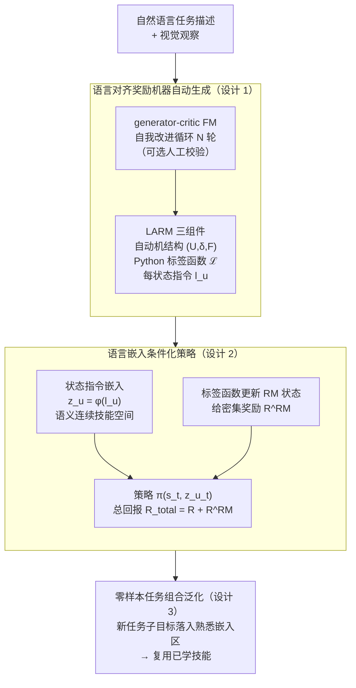

# ARM-FM: Automated Reward Machines via Foundation Models for Compositional Reinforcement Learning

**会议**: ICLR 2026  
**arXiv**: [2510.14176](https://arxiv.org/abs/2510.14176)  
**代码**: 见论文  
**领域**: 强化学习 / LLM Agent  
**关键词**: 奖励机器, 基础模型, 组合式RL, 语言对齐自动机, 零样本泛化  

## 一句话总结
提出ARM-FM框架，利用基础模型（GPT-4o等）从自然语言任务描述自动生成语言对齐奖励机器（LARM）——包括自动机结构、可执行标签函数和每个状态的自然语言描述——为RL agent提供组合式密集奖励信号，在MiniGrid/Craftium(3D Minecraft)/Meta-World等环境中解决标准RL完全无法学习的稀疏奖励长程任务，并实现零样本任务泛化。

## 研究背景与动机

### 领域现状

**领域现状**：RL的核心瓶颈是奖励函数设计——稀疏奖励信号不足，密集奖励需要专家手工设计且容易被exploit。Reward Machine（RM）用有限自动机将任务分解为子目标序列，理论上很优雅但实践中需要专家手动设计。

**现有痛点**：(a) RM的手动设计成本高，限制了其广泛应用；(b) 基础模型虽擅长任务分解但难以生成RL可用的结构化奖励信号；(c) 现有FM-RL集成（如Eureka/Motif）输出的是不透明的奖励模型，缺乏组合性和可解释性。

**核心矛盾**：FM有高层推理能力但缺乏对RL的低层控制理解，RL有低层控制能力但缺乏高层任务理解——需要一个结构化接口连接两者。

**本文目标**：用FM自动生成可解释的、组合式的奖励规范（RM），且支持跨任务技能共享和泛化。

**切入角度**：RM的自动机结构天然适合FM的代码生成能力（生成状态、转移函数、标签函数），而RM状态的自然语言描述可以用嵌入空间连接不同任务。

**核心 idea**：让FM生成"语言对齐的奖励机器"（LARM）——不仅自动化了RM的设计，还通过语言嵌入构建了可共享的技能空间。

## 方法详解

### 整体框架
ARM-FM要解决的是RL里"奖励该怎么来"这个老问题：稀疏奖励学不动，密集奖励又得靠专家手搓。它的思路是让基础模型（Foundation Model, FM）把任务翻译成一台奖励机器（Reward Machine, RM），再把这台机器接到RL训练里。整条流程分两段：前半段是**LARM生成**——FM读自然语言任务描述加视觉观察，吐出三样东西：RM的自动机结构、把环境观察翻成RM事件符号的Python标签函数、以及每个RM状态配的一句自然语言指令；这些产物经过一个generator-critic的FM自我改进循环（再加可选的人工校验）逐步精炼。后半段是**RL训练**——agent的策略不只看环境状态，还看当前RM状态那句话的语言嵌入，RM则在子目标达成时给出密集的中间奖励，总回报是 $R_t^{\text{total}} = R_t + R_t^{\text{RM}}$。一句话说，RM在FM和RL之间充当了一个"FM能写、人能读、RL能学"的结构化接口。

### 关键设计

**1. 语言对齐奖励机器（LARM）自动生成：把RM设计从专家手里交给FM**

RM理论上很优雅，但实践中卡在"得专家手动设计"这一步。这个设计点的做法是让FM一次性产出整台机器的三个组件：第一是自动机结构本身，包括状态集 $U$、转移函数 $\delta$ 和终止状态集 $F$；第二是可执行的Python标签函数 $\mathcal{L}: S \times A \to \Sigma$，负责把原始环境观察映射成RM能识别的事件符号 $\Sigma$；第三是给每个RM状态 $u$ 写的一句自然语言指令 $l_u$。为了保证质量，生成不是一锤子买卖，而是跑 $N$ 轮generator-critic的self-improvement迭代——一个FM生成、另一个FM挑错，反复精炼。之所以这套能行，是因为RM的形式化结构（离散状态加转移规则）恰好落在FM最擅长的代码生成能力上，而且产物是可验证的：自动机结构是否合法、标签函数能否跑通，都能直接检查，不像端到端奖励模型那样是个黑盒。

**2. 语言嵌入条件化策略：用语义连续的技能空间替代one-hot状态**

传统RM把不同状态编成独立的one-hot向量，结果是每个状态各管各的，技能没法跨任务搬。这里改成把每个RM状态的自然语言描述嵌入成向量喂给策略：策略写成 $\pi(a_t | s_t, z_{u_t})$，其中 $z_{u_t} = \phi(l_{u_t})$ 是当前状态那句指令经嵌入模型 $\phi$ 得到的向量。这样一来，语义相近的子任务在嵌入空间里天然挨得近——比如"pick up blue key"和"pick up red key"的嵌入几乎重合，策略在它们之间就能直接共享已学到的知识。换句话说，语言嵌入把离散、孤立的状态编号变成了一个语义连续的技能空间，这正是后面零样本泛化能成立的基础。

**3. 零样本任务组合泛化：新任务复用熟悉区域里的已学技能**

有了连续的技能空间，组合泛化几乎是水到渠成的副产品。设想agent已在任务A和任务B上训练过，现在来一个没见过的组合任务C：只要让FM为C新生成一台LARM-C，再看C的子目标嵌入 $z_{u'}$ 是否落在训练时已经覆盖过的嵌入空间熟悉区域内——如果落在，策略就能直接复用对应的已学技能，无需重新训练。所以"零样本解决新组合任务"并不是额外加的模块，而是"FM能现场生成新RM"加上"策略按语义嵌入复用技能"两件事叠在一起的直接结果。

## 实验关键数据

### MiniGrid（稀疏奖励）
- DQN+RM解决了3个所有基线（DQN/DQN+ICM/ReAct）都完全无法学习的长程任务（UnlockToUnlock, BlockedUnlockPickup, KeyCorridor）
- 在DoorKey任务中，随网格大小增加（8x8→16x16），优势更加明显

### Craftium（3D Minecraft资源采集）
- PPO+LARM完整完成"采集钻石"多步任务序列（伐木→采石→挖铁→挖钻石），基线PPO几乎零进展

### Meta-World（机器人操作）
- SAC+LARM在多数连续控制任务中取得高成功率，远超稀疏奖励基线

### 多任务泛化（XLand-MiniGrid）
- 单个agent同时训练10个任务：baseline完全失败，仅rewards帮助不大（不知道当前子目标），仅embeddings信号弱→完整方法（rewards+embeddings）保持高性能
- **零样本泛化**：在任务A+B上训练的agent直接解决未见的组合任务C

### FM规模效应
- 1000个LARM生成实验：模型越大→正确率越高（Qwen3-32B显著优于小模型）
- PCA可视化显示状态嵌入有清晰的语义聚类（开始/中间/结束状态分离）

## 亮点与洞察
- **RM作为FM-RL接口**的定位非常深刻——RM提供了FM可以生成、人类可以理解、RL可以学习的结构化中间表示
- **语言嵌入构建技能空间**的设计极其巧妙——"pick up blue key"和"pick up red key"自然共享策略→组合泛化水到渠成
- 实验覆盖面广（2D/3D/连续控制/多任务/零样本）→说明框架的通用性
- Self-improvement loop（generator+critic FM）提高了生成质量

## 局限与展望
- 标签函数的可执行Python代码依赖环境API——换环境需要不同的API规范
- 人工验证步骤虽然可选但对质量有帮助——完全自动化仍有gap
- 仅用GPT-4o（最强FM）生成主实验的LARM——更弱FM的实际可用性有限
- RM的表达力受限于有限自动机——无法表达需要计数或持续追踪的任务
- 零样本泛化仅限于训练任务子目标的重新组合——真正的新子目标仍需训练

## 相关工作与启发
- **vs Eureka（Ma et al.）**: Eureka用进化策略生成程序化奖励函数→不透明、非组合；ARM-FM生成RM→结构化、可组合
- **vs ReAct（LLM-as-agent）**: ReAct直接用LLM做决策需要文本接口→不适用于像素级控制；ARM-FM让LLM生成规范，RL做控制
- **vs 手动RM**: 自动化生成消除了专家设计的瓶颈，语言嵌入增加了泛化能力

## 评分
- 新颖性: ⭐⭐⭐⭐⭐ FM自动生成语言对齐RM+嵌入空间技能共享是全新范式
- 实验充分度: ⭐⭐⭐⭐⭐ 4类环境×多基线+多任务+零样本+FM缩放分析，极其全面
- 写作质量: ⭐⭐⭐⭐⭐ Figure 1的框架图极好，实验组织逻辑清晰
- 价值: ⭐⭐⭐⭐⭐ 为FM-RL集成提供了新的结构化范式，实用性和理论贡献兼具

<!-- RELATED:START -->

## 相关论文

- [\[ICLR 2026\] Optimistic Task Inference for Behavior Foundation Models](optimistic_task_inference_behavior_models.md)
- [\[NeurIPS 2025\] DISCOVER: Automated Curricula for Sparse-Reward Reinforcement Learning](../../NeurIPS2025/reinforcement_learning/discover_automated_curricula_for_sparse-reward_reinforcement_learning.md)
- [\[NeurIPS 2025\] Foundation Models as World Models: A Foundational Study in Text-Based GridWorlds](../../NeurIPS2025/reinforcement_learning/foundation_models_as_world_models_a_foundational_study_in_text-based_gridworlds.md)
- [\[ICLR 2026\] VerifyBench: Benchmarking Reference-based Reward Systems for Large Language Models](verifybench_benchmarking_reference-based_reward_systems_for_large_language_model.md)
- [\[ICLR 2026\] On the Generalization of SFT: A Reinforcement Learning Perspective with Reward Rectification](on_the_generalization_of_sft_a_reinforcement_learning_perspective_with_reward_re.md)

<!-- RELATED:END -->
